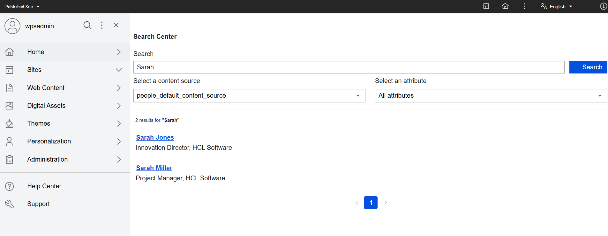

# People Service and Search V2 integration

## Overview

You can integrate People Service with [Search V2](../../../../build_sites/search_v2/index.md) to enhance user discoverability and search performance. This integration provides efficient access to user profile data with real-time update synchronization.

## Key features

- **User discovery**: Enables searching profiles using attributes such as name, email, role, and organization.
- **Real-time synchronization**: Updates in People Service are reflected immediately.

## Indexing capabilities

People Service provides indexing capabilities to ensure search results are up-to-date. Administrators can initiate a full index or retry indexing operations if needed. You can find API details for these operations in [API documentation](../api/index.md).

## Configuration

People Service now supports [Search V2](../../../../build_sites/search_v2/index.md). You can enable the Search V2 integration through the parameter `configuration.search.middleware.enabled` in the People Service Helm chart.
For configuration details, see [Search configuration](../deployment/configuration/index.md#search-configuration).

## Indexing process

People Service automatically indexes data when changes occur. However, it does not initialize index data at system startup.

### Regular indexing behavior

When creating and mutating users using the API or provisioning users through [User synchronization](../administration/user_provisioning/user_synchronization.md), the user data is indexed as needed as part of the creation or mutation process.

- [People Profile API endpoint](https://opensource.hcltechsw.com/experience-api-documentation/people-service-api/#tag/People-Profiles){target="_blank"}

    - To create new user profile and index, trigger the `POST` endpoint named `/dx/api/people/v1/people`.
    - To update existing user profile and indexing, trigger the `PUT` endpoint named `/dx/api/people/v1/people/{id}`.
    - To delete existing user profile and indexing, trigger the `DELETE` endpoint named `/dx/api/people/v1/people/{id}`.

- [User Synchronization API endpoint](https://opensource.hcltechsw.com/experience-api-documentation/people-service-api/#tag/Federation-User-directories){target="_blank"}

    - To start user synchronization and indexing, trigger the `POST` endpoint named `/dx/api/people/v1/user-directories/sync`.

### On-demand indexing

If immediate processing is required, People Service provides an indexing API that fully resynchronizes the index with the People Service user data.

- [Search Indexing API endpoint](https://opensource.hcltechsw.com/experience-api-documentation/people-service-api/#tag/Search-Re-Index){target="_blank"}

    - To get details of all pending and failed user index operations, trigger the `GET` endpoint named `/dx/api/people/v1/search/index/pending`.
    - To retry pending and failed user index operations, trigger the `POST` endpoint named `/dx/api/people/v1/search/index/pending`.
    - To start full indexing for all users available in the people database, trigger the `POST` endpoint named `/dx/api/people/v1/search/index`.

### Upgrading to CF226 or later

If the People Service already persisted user data, a manual triggering of the indexing API is required.

## Searching for a user in HCL DX

To search for a user via HCL Digital Experience (DX):

1. Click the search box located at the top of the DX interface.
2. In the **Search** field, enter the name, role, email address, or other relevant attributes of the user you are looking for.
3. In the **Select a content source** field, select the relevant content source.
4. In the **Select an attribute** field, select the relevant attribute.
5. Click **Search**. Review the search results and click the desired user to open their profile.

The following image shows the Search Center where you can search for a user:
    

For more information, refer to the [Search V2 End User Guide](../../../../build_sites/search_v2/usage.md).
