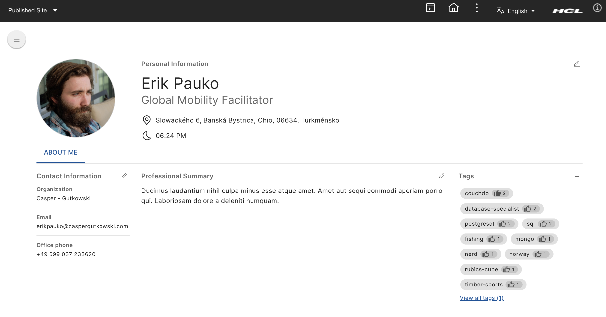

# Rendering business card using person tag

The Collaborative Service API offers a set of methods and JavaServer Page (JSP) tags that enable developers to integrate Lotus collaborative features into their portlets for HCL Portal or other application servers. These services can be utilized to create new custom portlets or to enhance existing portlets with collaborative functionalities, such as menus or person links.

## Using JSP tags for person link

When you incorporate a JSP tag library descriptor (TLD) for a person tag into your custom portlet, the person tag transforms people's names into hyperlinks. This integration provides an interactive experience for users, allowing them to access profile information seamlessly.

## Hovering over person link

Hovering over an active (underlined) name displays the business card with the user's profile information when using the semantic person tag. This business card provides a quick overview of the user's details without navigating away from the current page. For more information, refer to the [semantic person tag documentation](https://opensource.hcltechsw.com/digital-experience/CF223/extend_dx/portlets_development/collaborative_services_api_person_tag/).

If names are displayed elsewhere, practitioners need to leverage web components in their presentation templates to add this functionality, as it won't happen automatically in those cases.

## Clicking on person link

Clicking on the underlined name will navigate you to the user's profile in a new tab. This profile page contains more detailed information about the user, including their contact information, professional summary, and other relevant details.

## Important information

- **Customization:** The current business card component does not support any customization, such as adding or removing fields, unlike the **Person Card**. However, you can fully replace the existing system module or web component to your liking. This approach allows full flexibility with customizations.
For detailed instructions on how to replace and customize the business card component, please refer to the [Customizing Business Card Component](./customization/customizing_business_card_component.md) guide.

- **Unrecognized Names:** If HCL Portal cannot recognize the person's name, it will display the name as plain text, and the business card will not be available.

!!! Notes
    The unrecognized name issue relates to the user ID that is added to the web component. Please ensure you are using the correct values. In the case of person tags, this may not always be accurate. There are scenarios where the people service may not use the same user baseline as DX (e.g., DX may pull users from multiple LDAPs or search domains that the people service cannot access). In such cases, the unrecognized name issue will occur. It is important to ensure that the user baseline is configured consistently on both sides.
  