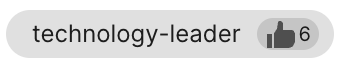

# Profile tags

Profile tags are used to label user profiles based on a person's traits, actions, or interests. These tags are designed to be user-friendly, efficient, and consistent, and can be added by users and administrators.  

Profile tagging enhances personalized experiences, improves search and recommendation systems, and organizes user profiles more effectively. It is a practical way of categorizing and managing information, ensuring better user interactions and efficient data handling.

In this page, you will learn about the profile tagging system and the rules that ensure tag consistency.

## Profile tag components

A profile tag is a single word or phrase that describes a trait, action, or interest of a user. Tags are used to categorize and organize profiles, making it easier to search, recommend, and interact with users. Each tag has the following components:

- **Name**: A single word or phrase used to name the tag.
- **Endorsement Count**: The number of users who have endorsed the tag.
- **Endorsers**: The users who have endorsed the tag.
- **Actions**: Actions that can be performed on the tag, such as endorsing, unendorsing, or removing the tag.

Profile tags are located on the **Tags** section at bottom-right corner of a user profile. Profile tags are automatically sorted by endorsement count first, then alphabetically.
    {class="list"}

See the following profile tag examples:

- This profile tag is endorsable and can be deleted.
    {class="list"}

- This profile tag is already endorsed by the current user and cannot be deleted.
    {class="list"}

## Profile tag rules

To maintain consistency and prevent errors, all tags must adhere to the following rules:

- **Lowercase only**: All tags must be in lowercase.
- **Spaces replaced by dashes**: Any spaces within a tag will be automatically replaced by dashes.
- **Latin characters only**: Tags can only include Latin characters.
- **Special characters**: The only special character allowed is the dash or hyphen `-`.

These rules are enforced by the user interface to ensure that all tags are standardized and easily searchable, enhancing the overall functionality of the profile tagging system.

## Adding profile tags
Authenticated users can add profile tags to their own profiles, or other user profiles. Refer to the following steps to add profile tags to your profile or other user profiles.

1. In the **Tags** section of a profile page, click **Add/Edit tags**.
    {class="list"}
2. In the dialog box that appears, enter the tag name you want to add. 

    1. If the tag already exists, select the tag from the dropdown list.
    {class="list"}
    2. If the tag does not exist, press **Enter** to create a new tag.

    After selecting or entering a tag, it will appear inside the tag field. You can add multiple tags to a profile.
    {class="list"}
    
3. Once you are done, click **Save**.  A notification will appear at the bottom of the page indicating that the tags were successfully updated. 
    {class="list"}

## Endorsing profile tags

Profile tags are emphasized by the number of endorsements they have. The more endorsements a tag has, the more relevant it is to the user. Users can only endorse tags on profiles that they can access.

- To endorse a profile tag, click the **Endorse** thumbs-up icon on the profile tag associated with the user. Profile tags added through the **Add/Edit tag** button are automatically endorsed.

- To unendorse a profile tag, click the **Unendorse** thumbs-up icon on an endorsed profile tag associated with the user. Profile tags removed through the **Add/Edit tag** button are automatically unendorsed.

## Removing profile tags

Profile tags can be directly removed by the profile owner or an administrator. To remove a profile tag, navigate to the **Tags** section of your profile then click the **Remove** button next to the tag you want to delete. A notification will appear at the bottom indicating that the tags were successfully removed.

!!!Notes
    - Alternatively, you remove the tags from the **Add/Edit tag** window.
    - If you are the last remaining endorser of a profile tag, you can **Unendorse** the tag to completely remove it. A popup will appear confirming whether you want to remove the tag.

## Viewing profile tag endorsers

You can hover over the **Endorsement count** to display the list of the users who endorsed the tag. Only the first five users who endorsed the tag are initially displayed. You can click **View all users** to display the full list.

From the list of users displayed from the **Endorsement count**, you can hover over a user's name to display their Business card.

You can also view a user's Business Card when you hover over their name from the **View all users** popup.

