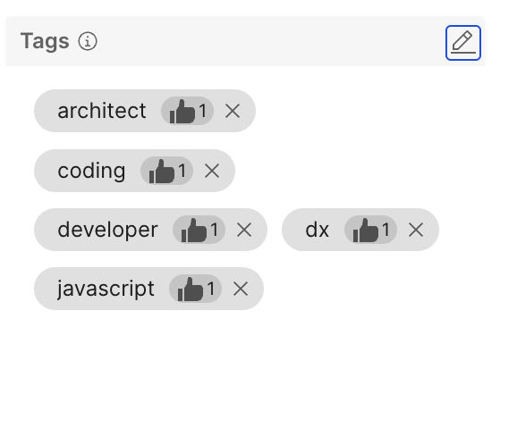
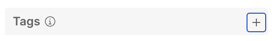
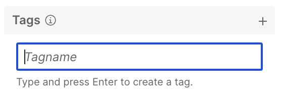
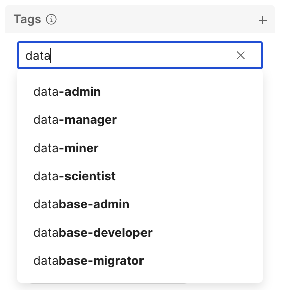
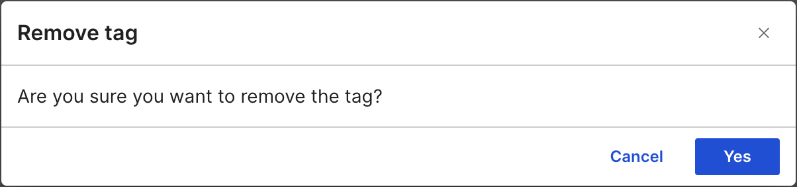

# Profile tags

Profile tags are used to label user profiles based on a person's traits, actions, or interests. These tags are designed to be user-friendly, efficient, and consistent, and can be added by users and administrators.  

Profile tagging enhances personalized experiences, improves search and recommendation systems, and organizes user profiles more effectively. It is a practical way of categorizing and managing information, ensuring better user interactions and efficient data handling.

In this page, you will learn about the profile tagging system and the rules that ensure tag consistency.

1. [Profile tag components](#profile-tag-components)
2. [Profile tag rules](#profile-tag-rules)
3. [Adding profile tags](#adding-profile-tags)
4. [Endorsing profile tags](#endorsing-profile-tags)
5. [Removing profile tags](#removing-profile-tags)
6. [Viewing profile tag endorsers](#viewing-profile-tag-endorsers)

## Profile tag components

A profile tag is a single word or phrase that describes a trait, action, or interest of a user. Tags are used to categorize and organize profiles, making it easier to search, recommend, and interact with users. Each tag has the following components:

- **Name**: A single word or phrase used to name the tag.
- **Endorsement Count**: The number of users who have endorsed the tag.
- **Endorsers**: The users who have endorsed the tag.
- **Actions**: Actions that can be performed on the tag, such as endorsing, unendorsing, or removing the tag.

Profile tags are located on the **Tags** section at bottom-right corner of a user profile. Profile tags are automatically sorted by endorsement count first, then alphabetically.
    {class="list"}

See the following profile tag examples:

- This profile tag is endorsable and can be deleted.
    {class="list"}

- This profile tag is already endorsed by the current user and cannot be deleted.
    {class="list"}

## Profile tag rules

To maintain consistency and prevent errors, all tags must adhere to the following rules:

- **Lowercase only**: All tags must be in lowercase.
- **Spaces replaced by dashes**: Any spaces within a tag will be automatically replaced by dashes.
- **Latin characters only**: Tags can only include Latin characters.
- **Special characters**: The only special character allowed is the dash or hyphen `-`.

These rules are enforced by the user interface to ensure that all tags are standardized and easily searchable, enhancing the overall functionality of the profile tagging system.

## Adding Tags to a Profile

### Overview

Adding tags to a profile is designed to be both efficient and user-friendly. This process ensures that users can easily manage tags while maintaining the necessary functionality for effective profile organization.

### Tag Management

Authenticated users have the ability to add tags to profiles. Tags are a powerful tool for categorizing and identifying key attributes of a profile. The system is built to simplify this process, allowing users to efficiently manage their profile information.

### Adding Tags

**Who Can Add Tags**: Any authenticated user can add tags to a profile.
**Process**: To add a tag, simply navigate to the profile, enter the desired tag, and save the changes. The system will automatically format the tag to meet the enforcement criteria.
Endorsing Existing Tags

**Who Can Endorse Tags**: Any authenticated user can endorse existing tags.
**Process**: To endorse a tag, locate the tag on the profile and select the endorsement option. This helps validate the relevance of the tag.
Removing Tags

**Who Can Remove Tags**: Users can remove tags from their own profiles. Additionally, administrators have the authority to remove tags from any profile.
**Process**: To remove a tag from your own profile, navigate to the profile, locate the tag, and select the remove option. Administrators can follow a similar process for any profile they manage.

#### Adding tags to other profiles

1. Go to the profile page of the user you want to tag.
2. Click on the **Add/Edit tags** button in the **Tags** section.
    {class="list"}
3. A textbox will appear and will be focused.
    {class="list"}
4. Start typing the tag name you want to add.

    1. If the tag already exists, it will appear in the dropdown list. You can select it from there.
    {class="list"}
    2. If the tag doesn't exist, you can create a new tag by pressing the `Enter` key.
    {class="list"}

5. Tags created or selected in *Step 4* will be automatically added to the Tags of that user.
6. A notification will appear at the bottom of the page indicating that the tags were successfully updated.
    {class="list"}

If a Tag already exists for the user you are tagging, it will be automatically endorsed by you.

#### Adding tags to your own profile

1. Go to your profile page.
2. Click on the **Add/Edit tags** button in the **Tags** section.
    {class="list"}
3. A dialog box will appear with a text field that is already focused.
    {class="list"}
4. Start typing the tag name you want to add.

    1. If the tag already exists, it will appear in the dropdown list. You can select it from there.
    {class="list"}
    2. If the tag doesn't exist, you can select a new tag by pressing the `Enter` key.

5. When the Tag was selected it will appear inside the the text box of the dialog.
    {class="list"}
6. Click on the **Save** button that is enabled only when you have made a change to the existing set of tags.
7. A notification will appear at the bottom of the page indicating that the tags were successfully updated.

You can add more than one Tag at once by repeating *Step 4* and *Step 5*.

#### Tag Enforcement Rules

To maintain consistency and prevent errors, all tags must adhere to the following rules:

- **Lower Case Only**: All tags must be in lower case letters.
- **Spaces Replaced by Dashes**: Any spaces within a tag will be automatically replaced by dashes.
- **Latin Characters Only**: Tags can only include Latin characters.
- **Special Characters**: The only special character allowed is the dash/hyphen `-`

These rules are enforced by the user interface to ensure that all tags are standardized and easily searchable, enhancing the overall functionality of the profile tagging system.

## Endorsing Tags

The meaning of Tags is emphasised by the number of endorsements they have. The more endorsements a tag has, the more relevant it is to the user it is associated with. Users can endorse tags on profiles they have access to.

### Managing tags on your profile

Users can manage tags on their own profile in various ways:

- you can add, remove, endorse and unendorse tags using the **Edit Tag** accessible by clicking on the **Add/Edit tags** button in the **Tags** section.
- you can endorse, unendorse, and remove tags directly from the **Tags** section of your profile.

## Viewing tags on a profile

Tags are shown in a Profiles bottom right Tags section.
    {class="list"}

The sort order of the tags in this section is by *endorsement count* first and then *alphabetically*.

## Removing tags from a profile

Tags can be removed from a profile in three ways:

1. By the user who owns the profile.
2. By an administrator.
3. By the user who added the tag, when he is the last remaining endorser of the tag and unendorses it.

### Removing tags from your own profile

1. Go to your profile page.
2. Search for the tag to be removed from the list of tags in the **Tags** section.
3. Click on the **Remove** button next to the tag you want to remove.
4. A notification will appear at the bottom of the page indicating that the tags were successfully updated.

Alternatively, you can remove tags by opening the **Edit Tag** window and clicking on the **Remove** button next to the tag you want to remove.

### Removing tags as an administrator

1. Go to your profile page.
2. Search for the tag to be removed from the list of tags in the **Tags** section.
3. Click on the **Remove** button next to the tag you want to remove.
4. A notification will appear at the bottom of the page indicating that the tags were successfully updated.

Alternatively, you can remove tags by opening the **Edit Tag** window and clicking on the **Remove** button next to the tag you want to remove.

### Removing tags as the last endorser

1. Go to the profile page you want to remove the tag from.
2. Search for the tag to be removed from the list of tags in the **Tags** section.
3. when the tag is endorsed only by you, you will see the Endorsement count as `1` and the *Unendorse* button in the Tag.
    {class="list"}
4. Click on the **Unendorse** button in the Tag you want to remove.
5. A confirmation dialog will appear requesting whether you want to remove the tag.
    {class="list"}

### User list who endorsed tag

1. Hover on count of the tag, to display the list of the user who endorsed that specific tag. Note that, only 5 users who endorsed the tag are initially displayed and a link is given for the complete list users.

2. On Hover of user, to display the business card for that user.

3. On click of link **View all users** to display all the users.

