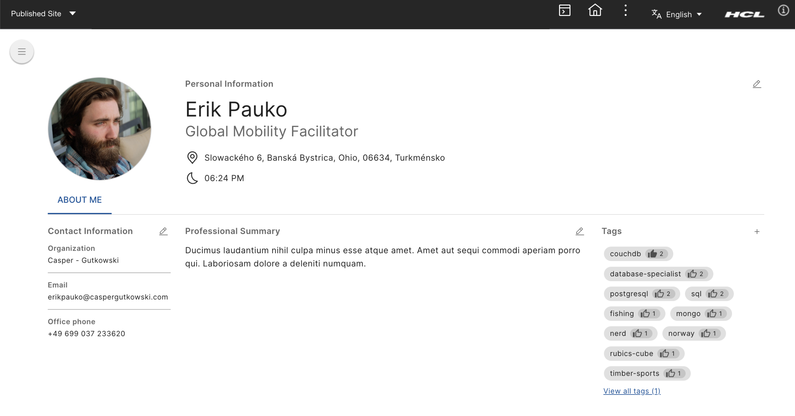
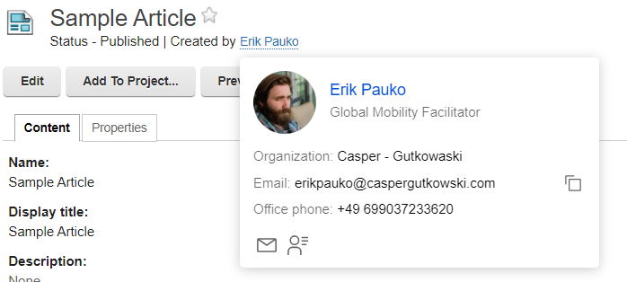
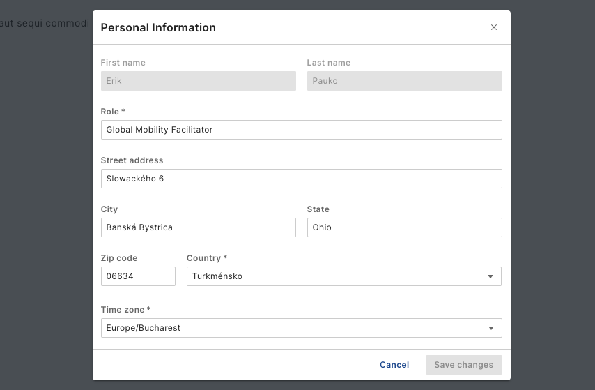

# Working with people profiles

User profiles provide a way to manage and access information about individuals, including their personal details, skills, and more. In this guide, you will learn how to find and edit your own profile and assign tags to user profiles.

## What the Profile Shows

A user profile typically includes the following sections:

  - Profile Image: A visual representation of the user.
  - Contact Information: Email, phone number, and other contact details.
  - Personal Information: Name, date of birth, and other personal details.
  - Professional Summary: Job title, organization, and a brief professional summary.
  - Tags: Keywords that describe the user's skills, interests, and other attributes.

## Accessing user profiles

User profiles can be accessed in different ways depending on the integration mode of HCL People Service. In a standalone mode, People Service provides a user interface that allows users to search for and view profiles. In an integrated mode, user profiles can be accessed through the integrated application, such as the Digital Experience (DX) platform.

For example, in DX, user profiles are referenced using portlets, components, or hooks that DX practitioners can use to integrate user profiles into their DX content and pages. User profiles can also be accessed through the People Service Business Card component which provides a quick overview of a user's profile information. Refer to the  [Rendering Business Cards using person tags](../integration/rendering_business_card_person_tag.md) page for more information.

## Managing your own profile

Users can manage their own profiles by adding or updating their information. To manage your profile, simply navigate to your profile page after logging into DX. Click the **My Profile** link in the DX navigation to access your profile. From there, you can view and edit your personal information.

The profile page is divided into different sections, such as contact information, personal information, and professional summary. You can update your profile image, contact details, and other information by clicking the **Edit** button in the respective section. Modify the information as needed and click **Save** to save your changes.

### Field validation

To ensure data accuracy and completeness, field validation is implemented in text fields. For example, email addresses are validated to ensure correct formatting. Error messages are displayed in the text field if there are issues with the information provided.

### Read-only fields

Some fields in your profile may be read-only and cannot be edited. These fields are typically populated from an external source, such as a user directory, and managed by an administrator. If you need to update information in a read-only field, contact your administrator.

### Profile image

Your profile image is an important part of your profile, as it helps other users identify you. To update your profile image, click on the "Edit profile image" button in the profile image section. You can upload a new image or remove the existing one. Make sure to select an image that is clear and professional to represent you appropriately.

!!! Notes
    You cannot update the profile image if that field is marked as read-only.

## Assigning tags to user profiles
Tags are a useful tool for categorizing and identifying key attributes of a profile. These tags can represent interests, hobbies, skills, or other categories that help a user stand out, making it easier for other users to search for their profile.

For more details on assigning tags, refer to the [Profile tags](./people_profile_tags.md) page.