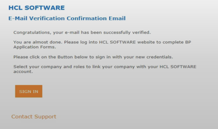

# How to Register for Access

This guide describes a comprehensive procedure to successfully Register and Access the HCL Software License & Delivery site, Locate and Download DX products and steps on how to open a support ticket in case you encounter any issue with getting the software.

Outlined in here are the steps that need to be taken if you are a HCL Customer or a Business Partner.

## Introduction to HCL License & Delivery Portal

The license portal provides both Software distribution and management of your Software entitlements purchased from [HCL Software](https://www.hcltechsw.com/). The portal provides you with control and flexibility on how to consume your licenses. Typically, an organization will have someone identified as a License Manager (also called Tech or Portal Admin) that has familiarity with the language of Licenses and you may wish to add them as a user. If not, you should find these instructions sufficient to begin using your HCL software.

## How to Register to HCL Software Portals
  
HCL Software has 3 main sites that require separate login. As we are working towards Single Sign On for the different sites, but have not yet implemented this, currently each site has a separate login.

* The [E-commerce site](https://buy.hcltechsw.com/) for Software Contract Renewals.
* The [License & Delivery site](https://hclsoftware.flexnetoperations.com/flexnet/operationsportal/logon.do) for managing Software Licenses and providing you with Software Downloads.
* The [Customer Support site](https://support.hcltechsw.com/csm) for working with HCL Support on Support Cases.

Indicated below are the steps on how to register as an HCL Customer or as an HCL Business Partner.

!!!tip
    If your company admin is already registered and has followed the steps below, you do not need to do this. Simply ask your admin to add you as a “Portal User” or “Portal User Admin” to be able to download product. Refer to [Adding Users](https://support.hcltechsw.com/csm?id=kb_article&sysparm_article=KB0077878#AddingUsers) for instructions.

=== "For HCL Customers"

    You can register to all three sites by going to the link below and clicking **Get Started**.
    
    <https://www.hcltechsw.com/wps/portal/about/welcome>

=== "For HCL Business Partners"

    Access the online form here: <https://registration.hclpartnerconnect.com/PartnerRegistration>

### Step by step

From the Welcome page, click **Create Account**.

  
Fill in the form by providing your details. Make sure you remember your password. You will need to this to **Sign in** later.

A **Registration confirmation email** will be sent to you from **HCL Software** to confirm your email address.

Find the email in your Inbox and click Confirm. A message is displayed “**Your Email Address has been verified successfully. You will shortly receive an email to finalize the account registration process.**”
Upon confirmation, you will receive an **E-Mail Verification Confirmation** Email mentioning that your email has been successfully verified.

Click **Sign in** button from the email.

Enter your email address and the password that you provided while registering.
Select the sites you want to be associated with along with the roles as per your preference:

* Customer Support System
* E-commerce system
* File Download and License Entitlements

Select your Company and roles.
If you do not see your company listed, please provide your Company details.
Click **Save**.

The HCL backend team will validate your details and you will receive separate welcome emails from each of the sites that you chose with instructions on how to login.

If you have are having difficulties registering to any of the above-mentioned sites, you can contact Support either by [HCL Support numbers](https://support.hcltechsw.com/csm?id=kb_article&sysparm_article=KB0010151) or through our on-line [Guest Form](https://support.hcltechsw.com/csm?id=guest_csm_creation).