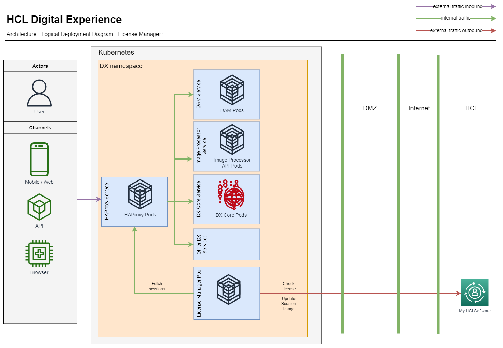

My HCLSoftware (MHS) provides access to various customer-facing systems such as Downloads, Software Entitlements, eCommerce, Support, Subscriptions, Account Management, Marketplace, and more. In MHS, you can find and download the latest HCLSoftware product releases and supported older releases. This topic provides information on how you can check your entitlements in the My HCLSoftware delivery portal. 

## Prerequisites

Make sure you have the following elements before configuring the HCL Digital Experience (DX) Cloud Native V9.5 entitlements to be deployed on supported Kubernetes platforms using My HCLSoftware delivery portal for entitlement checking:  

-   A My HCLSoftware account and access to the [My HCLSoftware](https://support.hcl-software.com/csm?id=kb_article&sysparm_article=KB0109011){target="_blank"} portal.
-   A valid [HCL DX Cloud Native 9.5 (Tier 1 – 7)](https://www.hcltechsw.com/wps/wcm/connect/61f40a7e-d2ca-42d4-b24c-d5adfd4fe54d/HCL+Digital+Experience+Cloud+Native+v9.5.pdf?MOD=AJPERES&CONVERT_TO=url&CACHEID=ROOTWORKSPACE-61f40a7e-d2ca-42d4-b24c-d5adfd4fe54d-n-MmIad){target="_blank"} offering part purchased and issued by the HCL Software licensing team.
-   Your DX Cloud Native 9.5 (Tier 1 – 7) entitlements are mapped to your My HCLSoftware portal instances.  
-   A plan to deploy or update to [HCL DX 9.5 Container Update CF226](../../../../whatsnew/cf20/newcf226.md) or to a later release, if currently using a prior version.
-   An instance deployment. To create an instance deployment, refer to the steps in [Creating a deployment](../../software_licensing_portal/configure_entitlement_checks/create_deployment_mhs_ui.md) in [My HCLSoftware Portal](https://my.hcltechsw.com/).

In addition to these elements, review the [architecture](#architecture) that presents the License Manager component of the HCL DX v9.5 Container Update software.

## Architecture

The License Manager component communicates with the My HCLSoftware entitlement service. This is to validate license entitlement at set periods for HCL DX Cloud Native V9.5 Tier 1 – 7 software after configuring the DX Cloud Native 9.5 deployment through the Helm chart. The License Manager component also transmits user session consumption from your production DX Cloud Native 9.5 deployments to the My HCLSoftware usage reporting services.

 

Follow the configuration steps in [Configuring the DX Cloud Native 9.5 entitlement](#configuring-the-dx-cloud-native-95-entitlement) before you deploy a new or update an existing DX 9.5 Container deployment. By completing these steps, you configure the DX Cloud Native 9.5 Tier 1 – 7 deployment using a Helm chart and enable the License Manager entitlement-checking functions.  

## Configuring the DX Cloud Native 9.5 entitlement

To validate the entitlement details for your software, configure the following properties in the Helm chart:

```yaml

# License Manager Configuration
  licenseManager:
    # Configures if this environment is a production environment.
    # For non production environments sessions are not counted but the license
    # is still validated.
    productionEnvironment: true
    # MHS License Server URI
    licenseServerUri: ""
    # Custom Deployment key secret for MHS deployment instance
    customMhsDeploymentKeySecret: ""
    # Deployment key for MHS deployment instance
    mhsDeploymentKey: ""

```

-   `productionEnvironment`: Set to `true` to send usage reports to MHS. For other environments (for example, test or UAT), set to `false`.
-   `licenseServerUri`: Set to the MHS License Server URI.
-   `customMhsDeploymentKeySecret`: Set to the deployment key that creates a custom secret name. Any method can use `customMhsDeploymentKeySecret` or `mhsDeploymentKey` for the deployment key.
-   `mhsDeploymentKey`: Set to the credentials for product deployments. Any method can use `customMhsDeploymentKeySecret` or `mhsDeploymentKey` for the deployment key. You can obtain the deployment key from [My HCLSoftware Portal](https://my.hcltechsw.com/).

To create a custom secret, run the following command:

```sh
#Example to create custom secret
kubectl create secret generic <secret-name> --from-literal=deploymentKey=<deploymentKey> --namespace=<namespace>
```

## Validating the DX Cloud Native 9.5 deployment entitlement

To validate your entitlement, you must check the logs generated by the License Manager component. The following sample command uses `kubectl` to fetch the logs from a specific pod within a Kubernetes namespace.

```sh
 #Example to get logs:
 kubectl logs pod/dx-deployment-license-manager-0 --namespace=<namespace>
``` 

### Expected logs

This section shows what a successful entitlement check should look like. The logs should indicate a successful connection to the entitlement server, as illustrated in the following example:

```log
INFO: The connection to the entitlement server is successful. You have a valid HCL Digital Experience Cloud Native 9.5 entitlement. HCL DX Cloud Native 9.5 server starts.
INFO: Starting session count of the license manager
INFO: License validity: true
```

## File-based export in a Kubernetes environment
The method of using a file-based export of user session data usage is only used in disconnected use cases within the Kubernetes environment where the Helm chart has not configured DX with My HCLSoftware Portal.

### Generating and uploading user session data usage in metrics format
To generate the user session data usage in metrics format, the report include session data that has been encrypted for each user session. The `deploymentId` can be found in the My HCLSoftware Portal after clicking the deployment card in the URL; for example, `https://my.hcltechsw.com/deployments/pzneck8m`. In this case, `pzneck8m` represents the `deploymentId` as illustrated in the example URL.

Use the following command to generate usage metrics from the user session data. Make sure to specify the appropriate `startDate`, `endDate` and `deploymentId` values.

```sh
kubectl exec -it <release name>-license-manager-0 -n <namespace> -- java -jar UserSessionReporting.jar GenerateMetricFile <YYYY-MM-DD> <YYYY-MM-DD> <deploymentId>
```

Where:

-   `startDate` is the start date of the user session in YYYY-MM-DD format.
-   `endDate` specifies the end date in YYYY-MM-DD format
-   `deploymentId` is the deployment identifier.
-   `productFeatureId` is the poduct name either HCL_DX_CloudNative or DX_Compose

To save the generated metrics to a file, use this command:

```sh
kubectl exec -it <release name>-license-manager-0 -n <namespace> -- java -jar UserSessionReporting.jar GenerateMetricFile <YYYY-MM-DD> <YYYY-MM-DD> <deploymentId> /tmp/{YYYY-MM-DDTHH-MM-SS UTC}_usage.metrics [-productFeatureIdName <productFeatureId>]
```
The timestamp in the usage metrics file should be earlier than the start date, formatted as {YYYY-MM-DDTHH-MM-SS UTC}_usage.metrics. For example:`2024-06-24T02-50-00_usage.metrics`

### Example

```sh
kubectl exec -it pod/dx-deployment-license-manager-0 -n dxns -- java -jar UserSessionReporting.jar GenerateMetricFile 2022-07-22 2025-07-28 pnkeq6pk > /tmp/2022-06-24T02-50-00_usage.metrics -productFeatureIdName HCL_DX_CloudNative
```

### Expected result

```
1,Alpha525634,HCL Digital Experience,v9.5,pnkeq6pk,ebb89d32f30abc4eed049f7afbb8a7299bdc8459fd235d0b8473ca22e9457c65
HCL_DX_CloudNative,2024-10-20T06:49:23.183Z,2024-10-20T06:59:23.183Z,0,7ddd259d3077bca6774a14c005250614b9dec4fc3ac7cd4954c2c4ca0212562d
HCL_DX_CloudNative,2024-10-20T07:00:54.836Z,2024-10-20T07:10:54.836Z,0,0c8210ba2bcb22c29d35df2aae2a7292f74385dc1125dbca634e9d2ba5affcd5
HCL_DX_CloudNative,2024-10-20T07:32:00.618Z,2024-10-20T07:42:00.618Z,1,470a75d9d6eb8553fdd54f873baa85c89935cd4710d7430542e8696c3eda20d8
HCL_DX_CloudNative,2024-10-20T08:00:37.267Z,2024-10-20T08:10:37.267Z,1,e946675c396d99f892c7099e772b776082b2a9a269a1d2670ea9063b61ac43e2
End,370d193fe0be35950d2707026d23ce595ae46054b77efcc944aa2484eab39399976854c58321ba5437b78896908a0b78de6b7ee6db989b0ccd28ce5c58bd9a09
```

### Upload usage metrics
The generated `{YYYY-MM-DDTHH-MM-SS UTC}_usage.metrics` file should then be uploaded to the [My HCLSoftware](../../software_licensing_portal/configure_entitlement_checks/mhs_upload_usage_metrics.md) portal for processing.

## My HCLSoftware vs FlexNet on Kubernetes
The use cases for My HCLSoftware in Kubernetes deployments are very similar to those for FlexNet. The HCL DX License Manager container has been extended to integrate with MyHCL Software in a similar way to the existing integration with FlexNet. This integration ensures proper entitlement validation and usage reporting.

**Entitlement Validation**: Periodically check whether the entitlement is still valid (typically valid for 12 months). The same grace period is also allowed, during which time reminders to renew the entitlelment before it expires will be posted in the container log.

**User Session Reporting**: Periodically send user session reports to My HCLSoftware, allowing customers and HCL to monitor consumption is aligned within the allocated entitlement tier. These reports help assess if a change to a different usage tier is required based on the number of user sessions consumed.