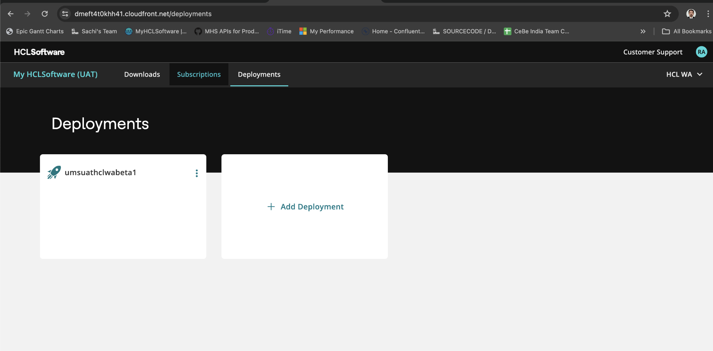
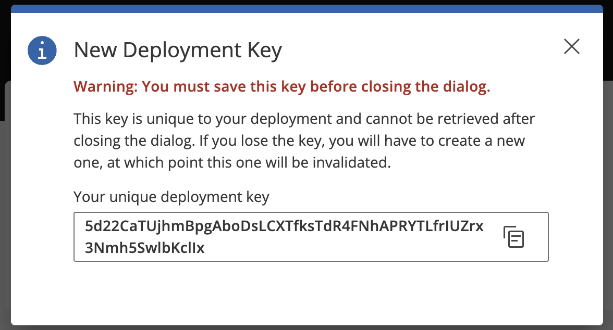

# Configuring My HCL Software API and File based export

My HCL Software provides seamless access to various customer-facing systems such as Downloads, Software Entitlements, eCommerce, Support, Subscriptions, Account Management, Marketplace, and more.


## MHS file based export

Retrieve the MHS format from either the sessionCount.log file or the .csv files, which are categorized by month based on the start and end date parameters, located in the /mnt/licenseData/manualReport/ directory. For more details, refer to the [User Session Reporting Tool](https://git.cwp.pnp-hcl.com/websphere-portal-incubator/UserSessionReporting/blob/develop/README.md)

```
# <fileName> Java class name to generate the metric
# <deploymentId> String deploymentID from MHS
# <KeyId> String KeyId from MHS
# <startDate> Specifies the start date in YYYY-MM-DD format
# <endDate> Specifies the end date in YYYY-MM-DD format
#<option> Specifies the "fileOutput" to write usage into the file. By default, it displays the usage metrics.

# By default
java -cp UserSessionReporting-VERSION-PLACEHOLDER.jar GenerateMetricFile <deploymentId> <KeyId> <startDate> <endDate> <option>
e.g by default
java -cp UserSessionReporting-VERSION-PLACEHOLDER.jar GenerateMetricFile pnkeq6pk Alpha525634 2022-07-22 2025-07-28
e.g with option
java -cp UserSessionReporting-VERSION-PLACEHOLDER.jar GenerateMetricFile pnkeq6pk Alpha525634 2022-07-22 2025-07-28 file
```

## Configuring MHS APIs

To begin testing with MHS APIs, you must first create a test account and deployment instances within the MHS UAT environment. Interacting with MHS APIs requires an initial refresh token, typically obtained after the initial deployment. This token is used to generate an access token, which grants temporary permissions for performing API calls.

**Prerequisites for using MHS APIs Beta**

- Contact Beta testing support (rajeshkumar_a@hcl.com) to create the test account in [MHS UAT portal](https://dmeft4t0khh41.cloudfront.net)
- Contact Beta testing support (rajeshkumar_a@hcl.com) to add the members (internal users with hcl.com domain) to the test account
- Create new deployment via MHS UI:
    - Log in to the MHS Portal UAT using your HCL ID (via Okta login) at [this URL](https://dmeft4t0khh41.cloudfront.net/)
    - Go to the Deployments tab and click Add Deployment. A new deployment will be created, labeled with a deployment prefix followed by an auto-generated name.



    - Click the three dots in the top-right corner of the panel to create a deployment key.
  


    - Use this unique deployment key (initial refresh token) to generate access tokens for calling MHS APIs. You can also replace the deployment key if needed.

**Accessing the MHS APIs**

You can find detailed API specifications and usage via the Global Protect VPN using the [Base URL(UAT)](https://d2kerxf8ujkcp4.cloudfront.net)

-  Obtain an Access Token using exchange API
   -  API Spec: https://github01.hclpnp.com/pages/hcl-software-bus-it/mhs-product-api/#tag/API-Keys/operation/apiKeyExchange
   -  Example (UAT): POST {Base URL}/v1/apikeys/exchange

- License Allocation API
  - API Spec: https://github01.hclpnp.com/pages/hcl-software-bus-it/mhs-product-api/#tag/License-Allocation/operation/readLicenseAllocation
  - Example (UAT): GET {Base URL}/v1/licenseallocation

- Report Usage Metering Data
  - API Spec: https://github01.hclpnp.com/pages/hcl-software-bus-it/mhs-product-api/#tag/Usage-Metering/operation/postUsageMeteringEvent
  - Example (UAT): POST {Base URL}/v1/ums
