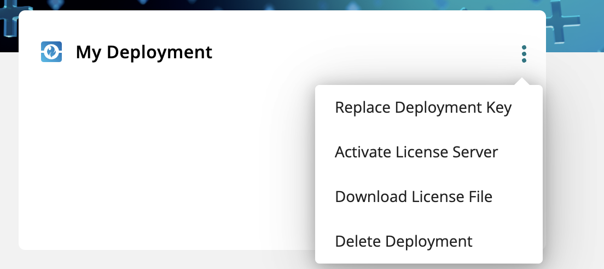
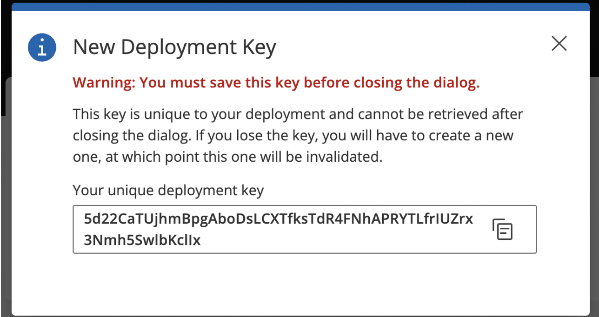

This document provides steps on how to set up and create deployment instances in the My HCLSoftware (MHS) environment and how to obtain the initial deployment key.

## Creating a new deployment

1. Log in to [My HCLSoftware portal](https://my.hcltechsw.com/).

2. Go to **Deployments** tab and click **Add Deployment**.

3. In the **Add Deployments** window, enter the **Deployment Name** and select the type of the deployment.
    
    { width="500" }

4. Click the **Add Deployment** button to create the deployment.

## Obtaining the deployment key

After creating a deployment, refer to the following steps to get the deployment key.

1. Go to Main menu and check the deployment card list. You can see the deployment card of the deployment you created (for example, **My Deployment**) under **Deployments**. 

2. In the deployment card of your deployment, click the three-dot menu to get the option to create a deployment key and create a new refresh token. Select **Replace Deployment Key**.

    { width="500" }

3. Copy the unique deployment key, also known as the initial refresh token.

    { width="500" }

4. (Optional) If you lose the old deployment key, you can replace it with a new deployment key by clicking the three-dot menu in the deployment card and clicking **Replace Deployment Key**.
