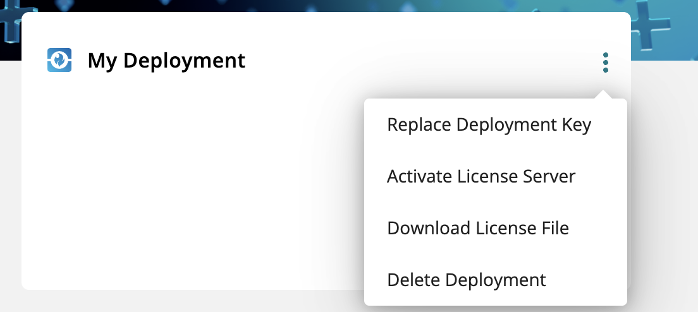

This document offers guidance on setting up and creating deployment instances in the  My HCLSoftware environment, as well as acquiring the initial deployment key.

Create new deployment via MHS UI:

1. Login below [My HCLSoftware PortalURL:](https://my.hcltechsw.com/)
2. Go to Deployments tab and click Add Deployment

3. You can see the Add deployment panel where you can enter the
Deployment Name(free text) and Select the type of the deployment.

4. Click Add Deployment to create deployment `deployment name`.
5. Go to Main menu and check the deployment card list. You can
see the Deployment card `deployment name` created under the
deployment menu. Click the 3 dots(top right side of the
deployment card) to get the option to create deployment key and
create new refresh token as follows.

6. You can use the unique deployment key, also known as the initial refresh token. If you lose the old one, you can replace it with a new deployment key.

