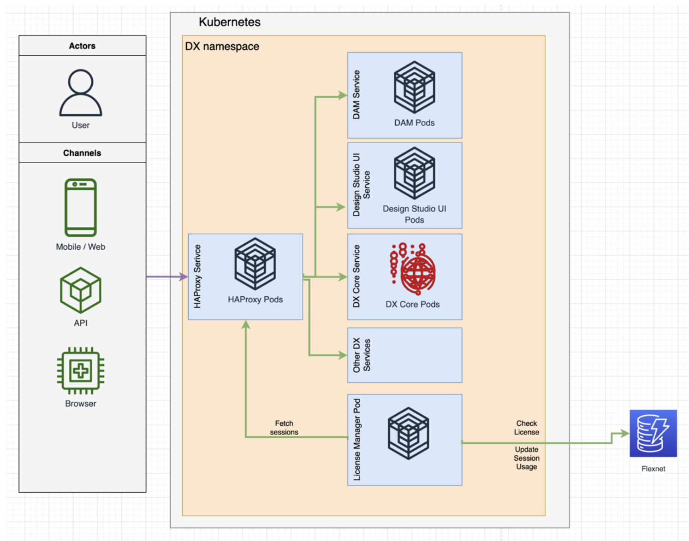

# HCL Digital Experience Cloud Native 9.5 entitlement checks

The [HCL Software License Portal](https://support.hcltechsw.com/csm?id=kb_article&sysparm_article=KB0073344) supports entitlement checking for several HCL Software solutions, including the [HCL Digital Experience Cloud Native 9.5 Tier 1 – 7 offerings](https://blog.hcltechsw.com/digital-experience/introducing-new-hcl-digital-experience-cloud-native-9-5-bundle-with-user-session-pricing/) within the HCL Digital Experience portfolio. This enables customers to track their purchased software entitlement periods, and usage levels. 

## Overview
-   Beginning with [HCL Digital Experience 9.5 Container Update CF207](../../../../whatsnew/cf20/newcf207.md), you must specify certain entitlement check parameters within your [HCL Digital Experience Cloud Native 9.5 Tier 1 – 7](../../../../get_started/product_overview/index.md#hcl-digital-experience-cloud-native) installations to accomplish entitlement checks. If you do not specify these entitlement check parameters, or fail to configure them correctly, then the entitlement check will not pass and will enter the grace period. To learn more about the various entitlement check scenarios, see [HCL Digital Experience Cloud Native 9.5 entitlement check scenarios](entitlement_checks_scenarios.md).

During the grace period, errors are displayed in your server logs. If you encounter these errors, contact HCL Support to resolve the issue. 
-   For more information on Flexnet user and device management, see [What is the HCL License & Delivery Portal (FlexNet Portal?)](https://support.hcltechsw.com/csm?id=kb_article&sysparm_article=KB0073344) knowledge article on the HCL Customer Support portal.

## Before you begin
The following are the prerequisites for configuring Digital Experience Cloud Native V9.5 entitlements to your HCL Flexnet License and Delivery Portal instance.  

-   HCL Software Account and access to the [HCL Software License & Delivery Portal](https://support.hcltechsw.com/csm?id=kb_article&sysparm_article=KB0073344). 
-   Valid [HCL Digital Experience Cloud Native 9.5 (Tier 1 – 7)](https://www.hcltechsw.com/wps/wcm/connect/61f40a7e-d2ca-42d4-b24c-d5adfd4fe54d/HCL+Digital+Experience+Cloud+Native+v9.5.pdf?MOD=AJPERES&CONVERT_TO=url&CACHEID=ROOTWORKSPACE-61f40a7e-d2ca-42d4-b24c-d5adfd4fe54d-n-MmIad) offering part(s) have been purchased and issued by the HCL Software licensing team.
-   Your Digital Experience Cloud Native 9.5 (Tier 1 – 7) entitlements are mapped to your HCL Software License portal instance(s). 
    
-   See the How to check your Entitlements and Map Entitlements sections in the instructions: [What is the HCL Software License & Download Portal?](https://support.hcltechsw.com/csm?id=kb_article&sysparm_article=KB0073344#a8) for guidance to locate and map your entitlements to your deployment servers.
-   You plan to deploy or update to an [HCL Digital Experience 9.5 Container Update CF207](../../../../whatsnew/cf20/newcf207.md) or higher release. 

Review the Architecture that presents the License Manager component of HCL Digital Experience v9.5 Container Update software below.

## Architecture
The License Manager component communicates with the HCL Flexnet server to validate license entitlement periods for HCL Digital Experience Cloud Native V9.5 Tier 1 – 7 software, once configured in the DX Cloud Native 9.5 deployment Helm chart. The License Manager component also transmits user session consumption from the customer’s production DX Cloud Native 9.5 deployments to their specific Flexnet entitlements dashboard.



Follow the configuration steps outlined in the Procedure section below before you deploy a new or update an existing DX 9.5 Container deployment. These steps allow you to configure the DX Cloud Native 9.5 Tier 1 – 7 deployment Helm chart and enable the License Manager entitlement checking functions.  

## Procedure
1. Obtain access to the [HCL License and Delivery Portal](https://hclsoftware.flexnetoperations.com/flexnet/operationsportal/startPage.do) for your organization. Here you can download the Flexnex entitlement server software, as well as manage your Flexnet entitlement usernames, passwords, and device IDs. Entitlement verification is performed against the HCL- hosted Flexnet entitlement server.
    !!!important
        For remote entitlement checks to succeed, ensure that your system and network firewalls allow for outbound connections to `hclsoftware.compliance.flexnetoperations.com`.

2. Configure your [HCL Digital Experience Cloud Native 9.5](../../../../get_started/product_overview/index.md#hcl-digital-experience-cloud-native) software for entitlement checks. This is done by making adjustments to your HCL Digital Experience 9.5 Container Update 207 or later [deployment Helm chart](../../../../get_started/plan_deployment/container_deployment/index.md).  These adjustments can be made to a new or existing deployment.

3. Look for the following information that you will configure in the DX 9.5 Container Update CF207 or later Helm chart to enable License Manager and Flexnet entitlement checking.

4. These properties need to be configured to your entitlements to the applicable **DX Cloud Native 9.5 Tier 1 – 7 offering parts** that you have previously mapped to your HCL Software server devices defined in the HCL Software License Portal.  See the [Pre-requisites](#before-you-begin) section above for instructions.

    ```
    # License Manager Configuration
    Controls which application is deployed and configured
    applications:
    # License Manager
    # If using the HCL DX 9.5 Cloud Native Tier 1 – 7 software and licensing you are required to set this to true.
    # The License Manager service manages the license requirements for your DX deployment.
    licenseManager: <boolean>
    # License Manager Configuration
    licenseManager:
        # Configures if this environment is a production environment. 
        # For non production environments user sessions are not counted but the license 
        # must still be validated.
        productionEnvironment: true
        # Flexnet License Server ID
        licenseServerId: "LICENSE_SERVER_ID"
        # Flexnet License Server URL
        licenseServerUri: "LICENSE_SERVER_URI"
        # Flexnet License Server's Configured Features
        licenseFeatureNameWithVersion: "LICENSE_SERVER_FEATURE_WITH_VERSION"
        # Flexnet License Username
        licenseManagerUser: "LICENSE_USERNAME"
        # Flexnet License Password
        licenseManagerPassword: "LICENSE_PASSWORD"

    ```

    Using entitlements and device properties you have defined via the mapping process,you will configure those properties to your Helm chart to validate the entitlement period for your software. Once completed, your DX 9.5 Container Update 207 and higher deployments will verify the entitlement period is valid for your [HCL Digital Experience Cloud Native 9.5 Tier 1 – 7](../../../../get_started/product_overview/index.md#hcl-digital-experience-cloud-native) subscription entitlement(s).

5. Configure the following items to your DX 9.5 Container Update CF207 or later Helm chart according to the DX Cloud Native 9.5 entitlement(s) (Tier 1 – 7) you are entitled to and have mapped to your HCL Flexnet Server instance:
    1.  `productionEnvironment:true` - Configure this variable to true if this deployment will be used to support a Production deployment. See the [HCL Digital Experience 9.5 license document](https://www.hcltechsw.com/wps/wcm/connect/61f40a7e-d2ca-42d4-b24c-d5adfd4fe54d/HCL+Digital+Experience+Cloud+Native+v9.5.pdf?MOD=AJPERES&CONVERT_TO=url&CACHEID=ROOTWORKSPACE-61f40a7e-d2ca-42d4-b24c-d5adfd4fe54d-n-MmIad) for the definitions of production and non-production deployments. 
    2. `licenseServer ID` – configure to your HCL Flexnet Software licenseServer ID.
    3. `licenseServer URL` – verify your connection to the HCL Flexnet Server URL. Ensure that your system and network firewalls allow for outbound connections to hclsoftware.compliance.flexnetoperations.com.
    4. `licenseFeatureNameWithVersion` – Configure this variable according to the [HCL DX Cloud Native 9.5 Tier 1 – 7](../../../../get_started/product_overview/index.md#hcl-digital-experience-cloud-native) offering  part your organization has acquired and is mapped to your HCL Flexnet server instance(s). See Table HCL Digital Experience Cloud Native 9.5 Tier 1 – 7 parts and Flexnet License Server Feature Name below.
    5. `licenseManagerUser` – Configure this variable with the user name of the administrator authenticated to manage your HCL Software License Portal entitlements. 
    6. `licenseManagerPassword` – Configure this variable with the password associated with the user name of the administrator to manage your HCL Software License Portal entitlements defined in Step 5 above.

**HCL Digital Experience Cloud Native 9.5 Tier 1 – 7 parts and HCL Flexnet License Server Feature Name**

| HCL Digital Experience Cloud Native 9.5 Part Description Part Number | Part Number | Feature Name |
| ----------- | ----------- | ----------- |
| HCL Digital Experience Cloud Native Tier 1, 12 Month Term License & S&S, 1-500K User Sessions|TN100928Y01|DXPN_CloudNative_Tier1_500K@9.5 |
| HCL Digital Experience Cloud Native Tier 2, 12 Month Term License & S&S, 500K-2M User Sessions|TN100929Y01|DXPN_CloudNative_Tier2_2M@9.5|
| HCL Digital Experience Cloud Native Tier 3, 12 Month Term License & S&S, 2M-6M User Sessions|TN100930Y01|DXPN_CloudNative_Tier3_6M@9.5|
| HCL Digital Experience Cloud Native Tier 4, 12 Month Term License & S&S, 6M-12M User Sessions|TN100931Y01|DXPN_CloudNative_Tier4_12M@9.5|
| HCL Digital Experience Cloud Native Tier 5, 12 Month Term License & S&S, 12M-24M User Sessions|TN100932Y01|DXPN_CloudNative_Tier5_24M@9.5|
| HCL Digital Experience Cloud Native Tier 6, 12 Month Term License & S&S, 24M-60M User Sessions|TN100933Y01|DXPN_CloudNative_Tier6_60M@9.5|
| HCL Digital Experience Cloud Native Tier 7, 12 Month Term License & S&S, 60M-120M User Sessions|TN100934Y01|DXPN_CloudNative_Tier7_120M@9.5|

Example values configured to an HCL DX Cloud Native 9.5 deployment Helm chart are provided below:  

```
# License Manager Configuration
  licenseManager:
    # Configures if flexnet license checking is enabled
    productionEnvironment: true
    # Flexnet License Server ID
    licenseServerId: "Q8A6YCZ3A4GH"
    # Flexnet License Server URL
    licenseServerUri: "https://hclsoftware.compliance.flexnetoperations.com"
    # Flexnet License Server's Configured Features
    licenseFeatureNameWithVersion: "DXPN_CloudNative_Tier1_500K@9.5"
    # Flexnet License Username
    licenseManagerUser: "admin"
    # Flexnet License Password
    licenseManagerPassword: "mypassword"
```

!!!reminder
    These properties should be configured to your Helm chart BEFORE installing the environment or if making changes to the environment, before executing the DX 9.5 ContainerUpdate 207 or later Helm upgrade to your HCL Digital Experience Cloud Native 9.5 production or non-production deployment. For more information on the Helm configuration steps to manage DX 9.5 Container Update upgrades, reference this Help Center topic: [Upgrade the Helm deployment to the latest version](../../../../deployment/install/container/helm_deployment/update_helm_deployment.md).

## Results
Your HCL Digital Experience Cloud Native 9.5 environments have been configured for entitlement checks that will validate your deployment software remains in the purchased timeframe. 

Ensure that your entitlement checks are succeeding by viewing your HCL DX 9.5 Container Update Server License Manager pod logs.

Use kubectl logs for the license manager pod. For example in a namespace dxns, execute the following command: 

```
kubectl logs pod/dx-deployment-license-manager-0 -n dxns
```

See the HCL Digital Experience Cloud Native 9.5 entitlement check scenarios for success and error messages and how to manage in the [HCL Digital Experience Cloud Native 9.5 entitlement check scenarios](entitlement_checks_scenarios.md) topic. 

Entitlement checking to ensure the entitlement period for the DX Cloud Native 9.5 part is valid for the purchased term will be initiated at deployment start, upgrade, or configuration change processes. Entitlement checking will also occur once per day for active deployments. 

