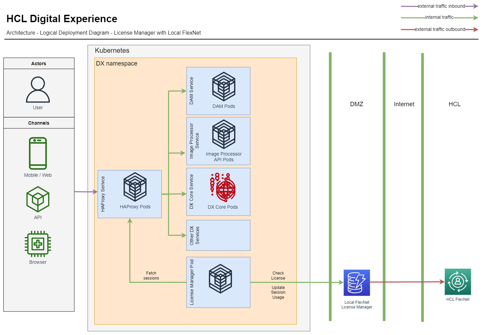

# HCL Digital Experience Cloud Native 9.5 Support for Local License Manager

## Overview

The license manager tracking code so far requires a network connection from the DX deployment on Kube to the internet to hcl.com where the flexnet server resides. The local license manager support adds the ability to use it as proxy in a DMZ where the DX deployment on Kube connects to the local license manager and the local license manager in turn connects to hcl.com.

## Before you begin

The following are the prerequisites for configuring Digital Experience Cloud Native V9.5 Support for Local License Manager to your DX License Manager instance.  

- Setup local license manager. Follow this documentations on how to setup local license server:
    - For Linux Server: [How to install HCL Local License Server on Linux Operating System](https://support.hcltechsw.com/csm?sys_kb_id=219670d1db01c9d8a45ad9fcd39619e0&id=kb_article_view&sysparm_rank=4&sysparm_tsqueryId=0ead29fb1b68b810a67e9759bc4bcb41&spa=1). 
    - For Windows Server: [How to install HCL Local License Server on Windows Operating System](https://support.hcltechsw.com/csm?sys_kb_id=3cb81a751b799950534c4159cc4bcb5a&id=kb_article_view&sysparm_rank=14&sysparm_tsqueryId=2a7531f71be8b810a67e9759bc4bcb9e&spa=1). 

- Once local license server is verified up and running, get the server details:
    - username (by default this is set to 'admin')
    - password
    - SSL certificate (This was the certificate generated in setup. This will be imported to dx license manager deployment to enable SSL connection)

## Architecture

The License Manager component communicates with the local license server to validate license entitlement periods for HCL Digital Experience Cloud Native V9.5 Tier 1 – 7 software. The local license server stores user session consumption from the customer’s production DX Cloud Native 9.5 deployments and synchronize data in flexnet server.



## Procedure

1. New property was added to helm configuration to map the local license server SSL certificate (which will be stored in kubernetes secret) to an environment variable. This property is optional and dx license manager instance will then automatically run an import to cacerts truststore script if the variable contains any value.

    ```
    # License Certificate secret used for Local license server
    licenseCertSecret: "license-secret"
    ```

    ```
      - name: "LOCAL_LICENSE_SERVER_CERT"
              valueFrom:
                secretKeyRef:
                  name: "{{ .Values.networking.licenseCertSecret }}"
                  key: "license-secret"
                  optional: true
    ```

2. As mentioned in [Configure entitlement checks](index.md) topic, you need to configure the following items to your DX 9.5 Container Update CF207 or later Helm chart according to the DX Cloud Native 9.5 entitlement(s) (Tier 1 – 7) you are entitled to and have mapped to your Local License Server instance:

    1.  `productionEnvironment:true` - Configure this variable to true if this deployment will be used to support a Production deployment. See the [HCL Digital Experience 9.5 license document](https://www.hcltechsw.com/wps/wcm/connect/61f40a7e-d2ca-42d4-b24c-d5adfd4fe54d/HCL+Digital+Experience+Cloud+Native+v9.5.pdf?MOD=AJPERES&CONVERT_TO=url&CACHEID=ROOTWORKSPACE-61f40a7e-d2ca-42d4-b24c-d5adfd4fe54d-n-MmIad) for the definitions of production and non-production deployments. 

    2. `licenseServer ID` – configure to your Local License Server ID. Note that Server ID is not Host ID that you have provided in Flexnet Portal but the Server ID of local license server. To check, just curl to the license server health and server details will be shown:
        ```
        curl -k https://yourhostname:port/api/1.0/health
        ```

        Sample server response:

        ```
        "LLS" : {
            "version" : "2021.05.0",
            "buildDate" : "2021-04-21T09:39:52Z",
            "buildVersion" : "266216",
            "branch" : "master",
            "gitHash" : "7967ed0b40e07ef5c28eda34da21f5a20b91f04e",
            "patch" : "0",
            "fneBuildVersion" : "266165",
            "serverInstanceID" : "V2YPFFXBK91E",
            "database" : {
            "connectionCheck" : "success"
            },
            "security" : "enabled",
            "httpAuth" : "disabled",
            "licensingSecurityJSON" : "enabled",
            "diskspace" : "ok"
        }
        ```
    
    3. `licenseServer URL` – verify your connection to the Local License Server URL.

    4. `licenseFeatureNameWithVersion` – Configure this variable according to the [HCL DX Cloud Native 9.5 Tier 1 – 7](../../../../get_started/product_overview/index.md#hcl-digital-experience-cloud-native) offering  part your organization has acquired and is mapped to your HCL Flexnet server instance(s). See Table HCL Digital Experience Cloud Native 9.5 Tier 1 – 7 parts and Flexnet License Server Feature Name below.
    
    5. `licenseManagerUser` – Configure this variable with the user name of the administrator authenticated to manage your Local License Server. (This is by default set to 'admin')
    
    6. `licenseManagerPassword` – Configure this variable with the password associated with the user name of the administrator to manage your Local License Server defined in Step 5 above.

3. Import the generated SSL certificate for local license manager to Kubernetes secret manually. As mentioned above, use 'license-secret' as secret name. Below is an example command in a namespace dxns and where hostname.certs is the filename:

    ```
    kubectl create secret generic license-secret --from-file=hostname.certs -n dxns
    ```

4. You may need to run helm upgrade and restart dx license manager pod

## Results

Ensure that your connection to local license manager is successful by viewing your HCL DX 9.5 Container Update Server License Manager pod logs.

Use kubectl logs for the license manager pod. For example in a namespace dxns, execute the following command: 

```
kubectl logs pod/dx-deployment-license-manager-0 -n dxns
```

You may also check on documentation on [How to check the license usage on flexnet using the flexnetadmin tool included with the local license server download](https://support.hcltechsw.com/csm?id=kb_article&sysparm_article=KB0084616).

