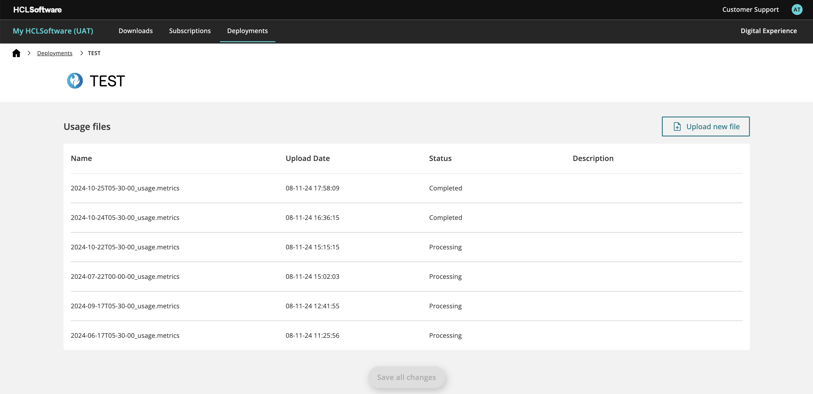

## Accessing MyHCL Software usage reporting dashboard
1. Go to the **Deployments** section of the My HCLSoftware portal to review entitlements and user session consumption reports.

 

2. Upload the usage metric file to My HCLSoftware.
3. Wait for the upload to finish. Refer to the following status messages and corresponding actions when uploading metrics files to My HCLSoftware:
  - If the status is `validating` or `processing`, you can wait on the page or go back to the previous page to see the status change to `completed`, `failed`, or `rejected`
  - If the status is `rejected` , reasons may include: hash chaining is tampered, invalid signature, or fields are not in the required format. Make sure to upload the valid metrics file. 
  - If the status is `failed`, reach out to My HCLSoftware Support through IT operations.
  - If status is `completed`, file is validated and the data is processed successfully.