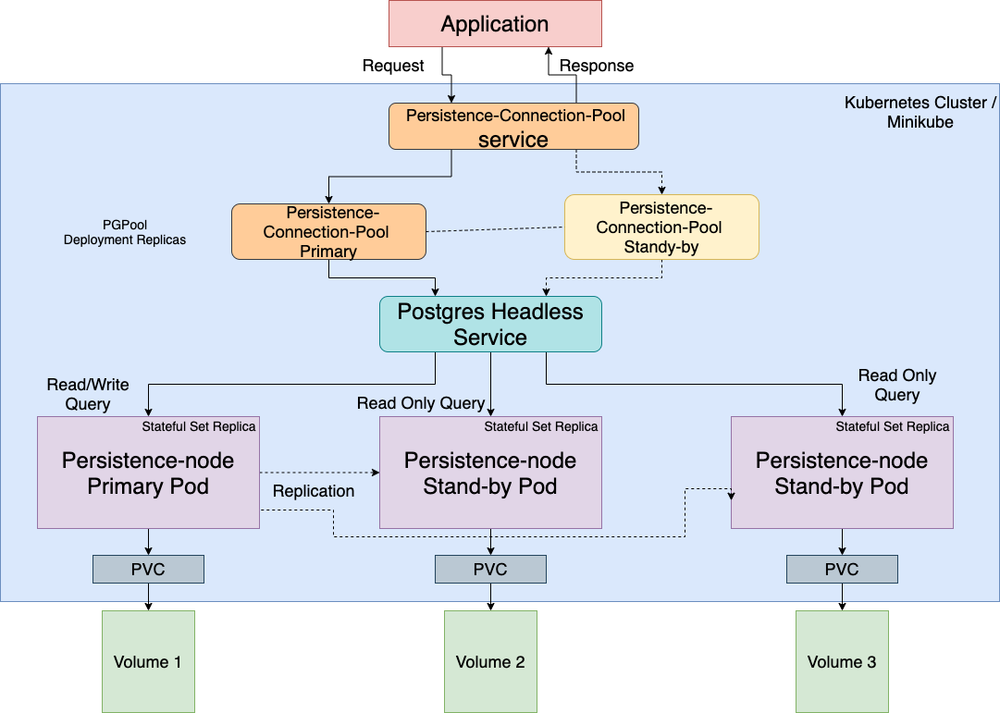
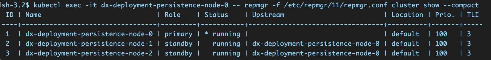

# Digital Asset Management persistence

This topic describes the components of the Digital Asset Management \(DAM\) persistence. The updated DAM persistence feature is available with HCL Digital Experience 9.5 Container Update CF198 and later.




## `persistence-node`

The `persistence-node` provides the database functions for HCL Digital Asset Management [HCL Digital Asset Management](../../../manage_content/digital_assets/index.md). The `persistence-node` is a DX [Red Hat Universal Base Image \(UBI\)](https://www.redhat.com/en/blog/introducing-red-hat-universal-base-image) container image installed with PostgreSQL and the Replication Manager Service. The [`repmgr`](https://repmgr.org/) is an open-source tool suite for managing replication and failover in a cluster of PostgreSQL servers. The `repmgr` enhances the built-in hot-standby capabilities of PostgreSQL with tools to set up standby servers, monitor replication, and perform administrative tasks, such as failover or manual switchover operations.

In case of PostgreSQL master server failure, the `repmgr` service switches the server role from primary to standby.

The `persistence-node` configurations are available in the Helm chart [values.yaml](../../../deployment/install/container/helm_deployment/preparation/mandatory_tasks/prepare_configuration.md) file as `persistenceNode`.

The administrator can configure the number of `persistence-nodes` under `scaling` configuration.

```yaml
# Scaling settings for deployed applications
scaling:
  # The default amount of replicas per application
  replicas:
    persistenceConnectionPool: 1
    persistenceNode: 3
```

!!! note

    Scaling affects only the read requests and ensures failover capabilities. Write requests are always directed only to the primary pod.

The `persistence-node` is a stateful application and it requires a volume. The configuration must have a dynamic volume class to start the container. You must update the `storageClassName` and `storage`  according to the cloud service provider and project requirements.

```yaml
volumes:
  # Persistent Volumes for Persistence Node
  persistenceNode:
    # Database PVC, one per Persistence Node
    database:
      storageClassName: "manual"
      requests:
        storage: "2Gi"
      # Optional volume name to specifically map to.
      volumeName:
```
## `persistence-connection-pool`

The `persistence-connection-pool` container runs the [Pg-pool](https://www.pgpool.net/mediawiki/index.php/Main_Page) service. Pg-pool is middleware that works between `persistence-node` and HCL Digital Asset Management [HCL Digital Asset Management](../../../manage_content/digital_assets/index.md).

The service provides the following services:

-   Connection pooling
-   Load balancing

For better performance, the administrator can scale the `persistence-connection-pool` to more than one pod. The `persistence-connection-pool` configurations are available in Helm chart [values.yaml](../../../deployment/install/container/helm_deployment/preparation/mandatory_tasks/probes_configuration.md) file as `persistenceConnectionPool`.

```yaml
# Scaling settings for deployed applications
scaling:
  # The default amount of replicas per application
  replicas:
    persistenceConnectionPool: 1
    persistenceNode: 3
```

The following example shows a persistence cluster in a successful deployment.



???+ info "Related information"
    - [HCL Digital Asset Management](../../../manage_content/digital_assets/index.md)