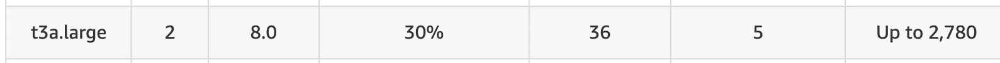

## DX Rendering Sizing Performance Tests overview

As part of DX performance tests one of our goals is DX Sizing. The aim of DX Sizing is to identify the K8s environment of DX small, medium and large configurations, where user can work reliably. We will also present the important KPIs in small, medium and large configurations like number of concurrent users, average response time, throughput etc. Finally, we will show how adjustments to the pod configuration can make dramatic improvements in the responsiveness of the system.

In this sizing work, we started with rendering scenarios of WCM, Portlets and DAM with a rendering setup enabled in AWS/Native-Kube. We are using Apache JMeter tool for our performance tests.

## Conclusion

The intention of this initial performance guidance was to understand how the ratios of key pod limits can dramatically improve the rendering response time in a simple single pod system. This is an important step before attempting to illustrate the impact of scaling of pods.

- Changes to the pod limits for below Pods **DRAMATICALLY** improve the responsiveness of the setup and as well led to the ability to handle more users.

| Pod Name | Minimum Number of Pods | Container | Container Image | Container CPU Request and Limit | Container Memory Request and Limit |
| -------- | ---------------------- | --------- | --------------- | ------------------------------- | ---------------------------------- |
| core     | 1                      | core      | core            | 3000m                           | 5000Mi                             |
| ringApi  | 1                      | ringApi   | ringApi         | 500m                            | 512Mi                              |
| haproxy  | 1                      | haproxy   | haproxy         | 700m                            | 1024Mi                             |

## Customer Rendering Scenario details

| Concurrent users     | Existing WCM pages | Existing DAM Content |
| -------------------- | ------------------ | -------------------- |
| Small – 1000 users   | 20                 | 2k                   |
| Medium – 10000 users | 200                | 10k                  |
| Large – 100000 users | 2000               | 50-100k              |

## Environment

### AWS/Native Kube
- In AWS/Native Kube we started with the minimal EC2 instance.
- We are using remote DB2 instance for our tests.

[Small Configuration]  - [c5.2xlarge] 

- Processor details

- Volume details

### DB2 instance

- Remote DB2 - [t3a.large]

- Processor details

- Volume details

### JMeter agents

- JMeter instance - [t2.xlarge]
- We use a distributed AWS/JMeter agents setup consisting of one master and two slaves to execute the tests.

- Processor details

- Network details

- Volume details

## Authoring Details for small config in rendering sizing

- As we have to do rendering tests, obviously we need to populate the setups first.  Below are the details of WCM, DAM and Portlets authoring.

## WCM Default Test Data - 20 pages

### WCM test data characteristics

- The default test data has a WCM design library called "PerformanceTestDesign" and five content libraries named "PerformanceTestContent01" to "PerformanceTestContent05".
- Each content library contains four levels of site areas, with four site areas per level. Only the 256 "leaf" site areas contain content.

- Each leaf site area contains ten content items, for a total of 12,800 content items across the libraries.

- Half of the content items are visible to "Anonymous" and "All Authenticated" users

- The other half are visible only to members of ten groups per content item. These ten groups are spread out among the 500 groups assumed to exist in the test LDAP (and assumed to be called "Group0000" through "Group0499").

- Half of the content items (spread evenly over each type described above) are profiled with the keyword "MENU".

- There are twenty test portal pages created under the label "PerformanceTest". Each has a friendly URL of the form "<context-root>/perf/page-xx".

- Each page contains six WCM Viewer portlets that show content below one of the twenty top level site areas. Pages 01 to 04 show content from site areas "SA01" through "SA04" in library "PerformanceTestContent01", and pages 05 to 08 show content from site areas "SA01" through "SA04" in library "PerformanceTestContent02" etc.

- Four of the portlets on each page show single content items. For page 01 these would be the first content items in site areas "SA01.01.01.01", "SA01.02.01.01", "SA01.03.01.01" and "SA01.04.01.01" respectively. Other pages follow the same pattern.

- Another portlet on each page shows a navigator of site areas and content items below the same top-level area.

- The final portlet on each page shows a menu of items and is both scoped to the top-level site area and also selects only those items profiled with the "MENU" keyword.

- A total of 99999 users added to openLDAP as authenticated users.

## DAM Default Test Data - 2.5k assets

- 2.5 K assets are uploaded which includes images(136kb, .jpg), documents(199kb, .docx), videos(1.1mb, .mp4) to preheat. After preheating with 2.5k assets, we then upload 15 assets and render those assets for 1 hour.

- Details of 15 assets uploaded for rendering 
- We have total of 19 urls of which three are custom urls, eight are uuid urls, eight are friendly urls combinations of original, tablet, smartphone and desktop renditions.

| Asset    | Type          | Size                                      |
| -------- | ------------- |-----------------------------------------  |
| Image    | .jpg/png/tif  | 155kb, 2mb,5mb, 500kb, 100 kb, 2 mb,300 kb|
| Video    | mp4/webm      | 5 mb, 199kb,200kb , 2 mb,199kb            |
| Document | docx/xlsx/pptx| mp4- 1mb, 15mb, 100mb, webm- 2 mb         |

- Note : For DAM we have only anonymous rendering. 

## Pages and Portlets Default Test Data - 8 pages

 There are a total of eight pages with portlets that are commonly used by customers, Authoring and Rendering was done by giving access to both Anonymous and Authenticated Users (same users added in openLDAP for WCM rendering). All authenticated users are of the role User.
 As part of Authoring we added pages and portlets manually. Below are the details of portlets authoring in every page.

- Page 1 - 2 Articles
- Page 2 - 2 Rich text
- Page 3 - Login portlet
- Page 4 - Information Portlet(JSR) - JSP file -  jsp/oob/welcome.jsp 
- Page 5 - Search Centre portlet
- Page 6 - Custom JSF portlet with simple form
- Page 7 - Script Application portlet --> Added JavaScript Functions, Date and Time object examples
- Page 8 - Added all above 7 portlets in this page

Once we complete authoring steps, then we have anonymous portal user and authenticated users (added to openLDAP) to render the pages. Every page request is /GET API call (Example - /wps/portal/portletsperf/page1) and we have response assertion in sampler to validate the content html in response body. 

### Combined DX rendering of WCM, DAM and Pages and Portlets

We combine all rendering JMeter scripts of WCM, DAM and Pages and Portlets for rendering sizing. As mentioned in our sizing approach below are details of load distribution.

## Load Distribution

- We are giving following Load Distribution 

    - WCM             - 40 %
    - DAM             - 30 %
    - Pages&Portlets  - 30 %

## Pods in native-kube deployment are 1:1 in small config
- 

### Result Summary

- The following stages were conducted starting with default kube configuration.

** Stage 1 **

- DX combined run executed with default minimal deployments as mentioned in below helm values. 
- There were no issues seen with up to a 500 user load. 
- Errors are seen at a 600 users load. This total Error is around ~5%.

## stage-1 Helm Values
                                 Requests                 Limits        
| Component                 | cpu(m) | memory(Mi) | cpu(m) | memory(Mi) |
| ------------------------- | ------ | ---------- | ------ | ---------- |
| contentComposer           | 100    | 128        | 100    | 128        |
| core                      | 2000   | 4096       | 4000   | 6144       |
| digitalAssetManagement    | 500    | 1536       | 500    | 1536       |
| imageProcessor            | 200    | 2048       | 200    | 2048       |
| openLdap                  | 200    | 768        | 200    | 768        |
| persistenceNode           | 500    | 1024       | 500    | 1024       |
| persistenceConnectionPool | 500    | 512        | 500    | 512        |
| ringApi                   | 100    | 256        | 100    | 256        |
| runtimeController         | 100    | 256        | 100    | 256        |
| haproxy                   | 200    | 300        | 200    | 300        |
| licenseManager            | 100    | 300        | 100    | 300        |
| Total                     | 4500   | 11224      | 6500   | 13272      |

- Results overview

| AWS/Native-Kube                            | Test-6                                                       | Test-7 (after tuning - core, ring api, haproxy)                     | % Change |
| ------------------------------------------ | ------------------------------------------------------------ | ------------------------------------------------------------------- | ------------ |
| Test Time                                  | July 21st IST 12:30 am - 1:30 am                             | July 27th IST 14:08 pm - 15:12 pm                                   |              |
| Total samples                              | 66959                                                        | 918415                                                              |              |
| Concurent Users                            | 600(WCM=240+DAM=180+PNP=180)                                 | 600(WCM=240+DAM=180+PNP=180)                                        |              |
| Total Throughput (transactions/sec)        | 110.3                                                        | 238.18                                                              | 115.94       |
|**Total Avg response time (milli seconds)** | **4671**                                                     | **994.89**                                                            | **78.70**    |
| CPU Usage                                  | 25%                                                          | 52.36%                                                              |              |
| Memory Usage                               | 56%                                                          | 62.23%                                                              |              |
| Disk Read IO                               |                                                              | 0 B/s                                                               |              |
| Disk Write IO                              |                                                              | 13.65 io/s                                                          |              |
| DAM EventLoop lag (in milli seconds)       |                                                              | 16.14                                                               |              |
| **Ring EventLoop lag (in milli seconds)**  | **450**                                                      | **5.19**                                                             | **98.85**        |
| **Error**                                  | **4.87%**                                                    | **0**                                                               |              |
| TimeDuration                               | 3600                                                         | 3850                                                                |              |
|                                            | Top 5 request samples (avg respone time in ms)               | Top 5 request samples (avg respone time in ms)                      |              |
|                                            | Get video - mp4 1.1 mb custom url - curlmp41.1mb.    (25044) | Get video - mp4 15mb - idmp415mb (6253.29)                          |              |
|                                            | Get image - jpeg 155 kb custom url - curljpg155kb   (23851)  | Get video - mp4 1.1 mb custom url - curlmp41.1mb (5512.89)          |              |
|                                            | Get video - mp4 15mb - idmp415mb -      (23620)              | Get doc - pdf - 5mb - friendly url - Desktop - furlpdf5mb (5296.89) |              |
|                                            | Get doc - pdf 171 kb custom url - curlpdf171kb.   (23011)    | Get image - jpeg 155 kb custom url - curljpg155kb (5128.01)         |              |
|                                            | Initial Page Request (21145)                                 | Get video - webm 2mb - friendly url - furlwebm2mb (4895.61)         |              |

*Observations:*

- For 600 users load observed http response code - 503 service unavailable errors in the test.

- All errors are from WCM and Pages&Portlets, not from DAM.

- Total Average response time increases exponentially with vload.

- Event loop lag for Ring API pod is also on the higher end (~400 ms for 500 user load).

- No pods restarts were observed.

** Stage 2 **

From stage-1 observations, we started the tuning of core, ring api and ha proxy pods limits one by one to see if no errors occurred during a 600 users load.

Below are the tuned helm values.

## stage-2 Helm Values
                                 Requests                 Limits        
| Component                 | cpu(m) | memory(Mi) | cpu(m) | memory(Mi) |
| ------------------------- | ------ | ---------- | ------ | ---------- |
| contentComposer           | 100    | 128        | 100    | 128        |
| **core**                  |**3000**| **5000**   |**3000**| **5000**   |
| digitalAssetManagement    | 500    | 1536       | 500    | 1536       |
| imageProcessor            | 200    | 2048       | 200    | 2048       |
| openLdap                  | 200    | 768        | 200    | 768        |
| persistenceNode           | 500    | 1024       | 500    | 1024       |
| persistenceConnectionPool | 500    | 512        | 500    | 512        |
| **ringApi**               | **500**| **512**    | **500**| **512**    |
| runtimeController         | 100    | 256        | 100    | 256        |
| **haproxy**               | **700**| **1024**   | **700**| **1024**   |
| licenseManager            | 100    | 300        | 100    | 300        |
| Total                     | 6400   | 13108      | 6400   | 13108      |

- Results overview

| AWS/Native-Kube                            | Test-6                                                       | Test-11 (after tuning - core, ring api, haproxy)            | % Change |
| ------------------------------------------ | ------------------------------------------------------------ | ----------------------------------------------------------- | ------------- |
| Test Time                                  | July 21st IST 12:30 am - 1:30 am                             | July 28th IST 12:12 pm to 13:17 pm                          |               |
| Total samples                              | 66959                                                        | 692505                                                      |               |
| Concurent Users                            | 600(WCM=240+DAM=180+PNP=180)                                 | 600(WCM=240+DAM=180+PNP=180)                                |               |
| Total Throughput (transactions/sec)        | 110.3                                                        | 179.63 ± 16.59                                              | 62.85         |
| Total Avg response time (in milli seconds) | 4671                                                         | 2063.32 ± 308.33                                            | 55.82         |
| CPU Usage                                  | 25%                                                          | 39.72%                                                      |               |
| Memory Usage                               | 56%                                                          | 61.70%                                                      |               |
| Disk Read IO                               |                                                              | 0 io/s                                                      |               |
| Disk Write IO                              |                                                              | 13.04 io/s                                                  |               |
| DAM EventLoop lag (in milli seconds)       |                                                              | 16.1                                                        |               |
| Ring EventLoop lag (in milli seconds)      | 450                                                          | 4.57                                                        | 98.98         |
| Error                                      | 4.87%                                                        | 0                                                           |               |
| TimeDuration                               | 3600                                                         | 3850                                                        |               |
|                                            | Top 5 request samples (avg respone time in ms)               | Top 5 request samples (avg respone time in ms)              |               |
|                                            | Get video - mp4 1.1 mb custom url - curlmp41.1mb.    (25044) | Initial Page Request (11235.13)                             |               |
|                                            | Get image - jpeg 155 kb custom url - curljpg155kb   (23851)  | Get video - mp4 1.1 mb custom url - curlmp41.1mb (6791.20)  |               |
|                                            | Get video - mp4 15mb - idmp415mb -      (23620)              | Get image - jpeg 155 kb custom url - curljpg155kb (6123.23) |               |
|                                            | Get doc - pdf 171 kb custom url - curlpdf171kb.   (23011)    | Get doc - pdf 171 kb custom url - curlpdf171kb (6037.59)    |               |
|                                            | Initial Page Request (21145)                                 | Get video - mp4 15mb - idmp415mb (5931.95)                  |               |

| AWS/Native-Kube                            | Test-10 (after tuning - core, ring api, haproxy)             |
| ------------------------------------------ | ------------------------------------------------------------ |
| Test Time                                  | July 27th IST 19:58 pm to 20:58 pm                           |
| Total samples                              | 610496                                                       |
| Concurent Users                            | 1000(WCM=400+DAM=300+PNP=300)                                |
| Total Throughput (transactions/sec)        | **169.19 ± 0.68**                                            |
| Total Avg response time (in milli seconds) | **5578.84 ± 32.01**                                          |
| CPU Usage                                  | 39%                                                          |
| Memory Usage                               | 64%                                                          |
| Disk Read IO                               | 0 io/s                                                       |
| Disk Write IO                              | 14.45 io/s                                                   |
| DAM EventLoop lag (in milli seconds)       | 20.4                                                         |
| Ring EventLoop lag (in milli seconds)      | 6.6                                                          |
| Error                                      | 0                                                            |
| TimeDuration                               | 3600                                                         |
|                                            | Top 5 request samples (avg respone time in ms)               |
|                                            | Initial Page Request (30396.43)                              |
|                                            | Get video - mp4 1.1 mb custom url - curlmp41.1mb (14561.34)  |
|                                            | Get image - jpeg 155 kb custom url - curljpg155kb (14448.63) |
|                                            | Get doc - pdf 171 kb custom url - curlpdf171kb (14370.48)    |
|                                            | Get video - mp4 15mb - idmp415mb (10716.05)                  |

*Observations:*

- No errors observed and no pods restarts during the test.

- Total average response time, total throughput and Event loop lag for Ring API pod improved significantly.

- Top 5 requests with higher response time are from DAM rendering and WCM inital page request.
