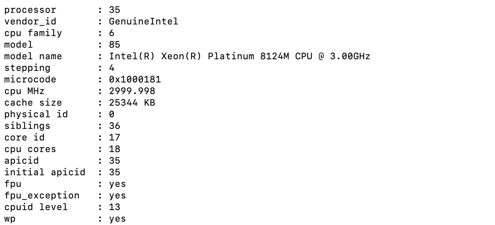
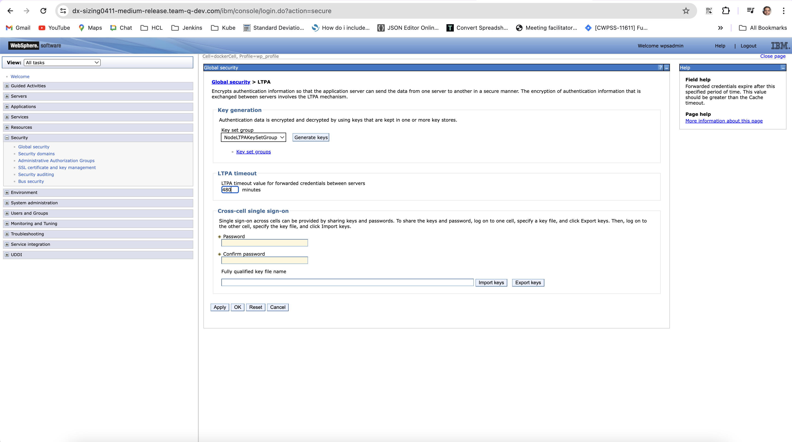
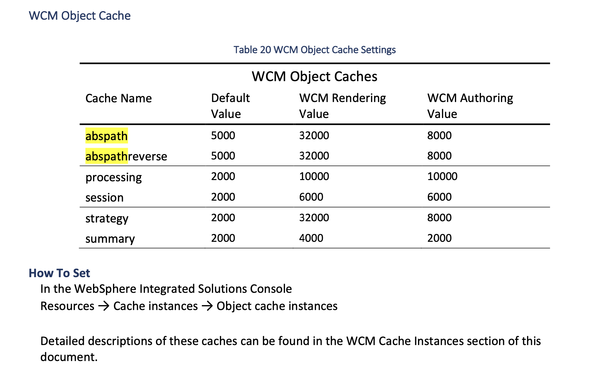
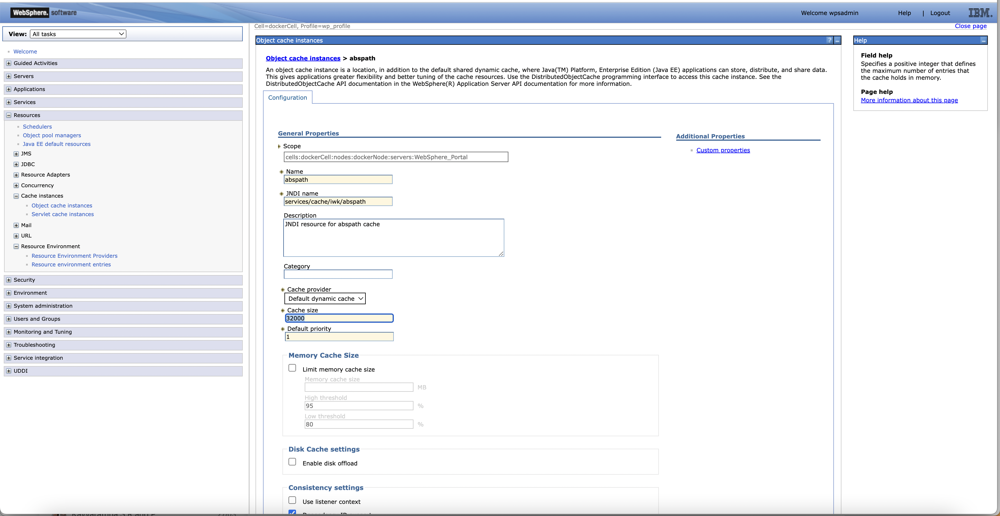
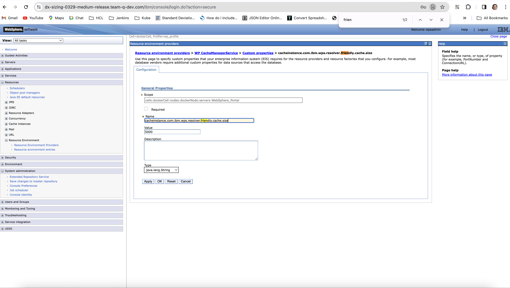
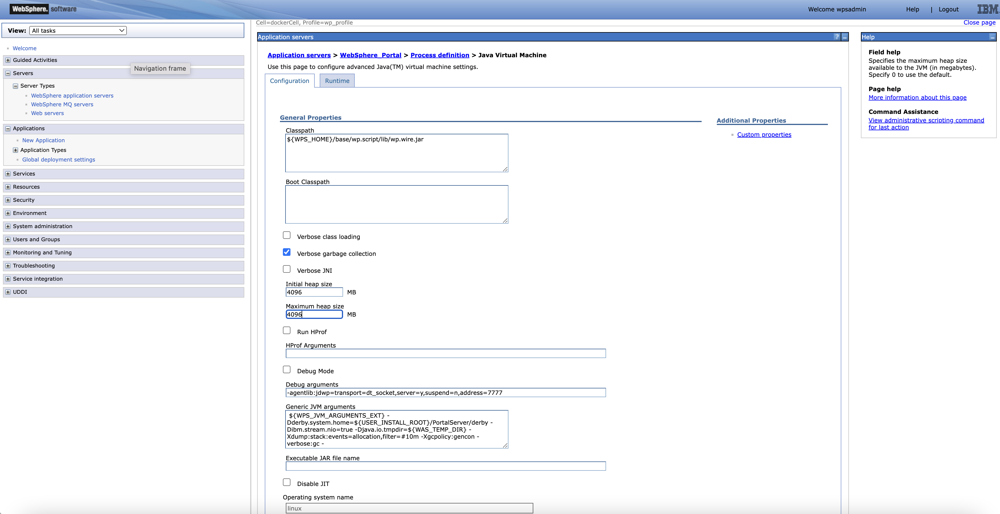
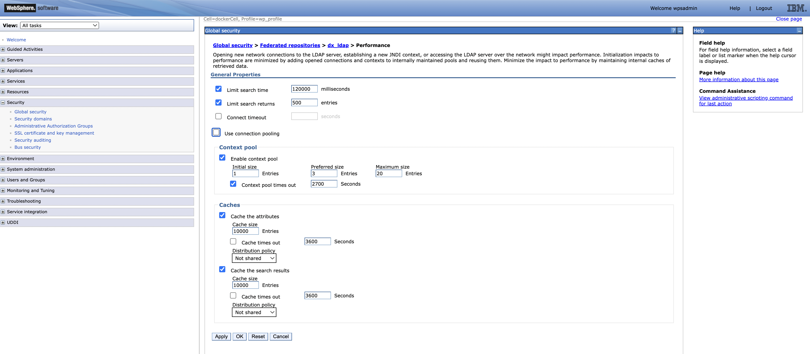
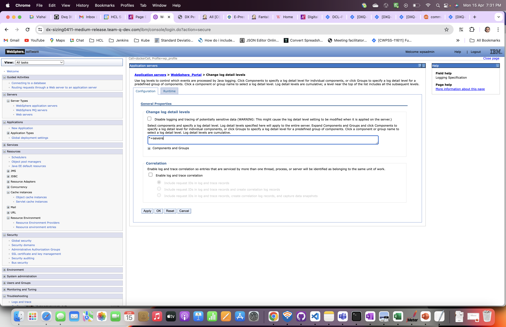

# Performance Sizing Guidance for Rendering with maximum throughput on single node

## DX rendering sizing-performance tests overview

DX sizing is one of the goals of DX performance tests. DX sizing aims to identify the reliable Kubernetes environment for small, medium, and large DX configurations. This topic presents the important KPIs (for example, number of concurrent users, average response time, and throughput) for upper limit in single node configuration. This topic also discusses how adjustments to the core tuning, scaling of pods and its configuration can make significant improvements in system responsiveness.

This sizing work started with rendering scenarios of Web Content Management (WCM), portlets, and Digital Asset Management (DAM) with a rendering setup enabled in AWS/Native-Kubernetes. The Apache JMeter tool was used for performance tests.

## Conclusion

This performance guidance aims to understand how adjustments to the core tuning, the scaling of pods and ratios of key pod limits can improve the rendering response time in a single-node cluster AWS instance (c5.9xlarge).

- Core tuning details are mentioned in this section [DX core tuning](#dx-core-tuning-and-enhancements-after-10k-concurrent-user-run)

- Changes to the number and limits for the following pods significantly improve the responsiveness of the setup and enable the system to handle 2500 concurrent users with comfortable average and 90th percentile(pct) response times in range of ~4 to 5 secs.

| Pod name                    | number of pods | Container                   | Container image             | Container CPU request and limit | Container memory request and limit |
| --------------------------- | -------------- | --------------------------- | --------------------------- | ------------------------------- | ---------------------------------- |
| core                        | 4              | core                        | core                        | 5000m                           | 8000Mi                             |
| ringApi                     | 4              | ringApi                     | ringApi                     | 800m                            | 512Mi                              |
| haproxy                     | 4              | haproxy                     | haproxy                     | 700m                            | 1024Mi                             |
| digitalAssetManagement      | 4              | digitalAssetManagement      | digitalAssetManagement      | 1000m                           | 2048Mi                             |
| persistence-connection-pool | 2              | persistence-connection-pool | persistence-connection-pool | 500m                            | 512Mi                              |
| persistence-node            | 2              | persistence-node            | persistence-node            | 1000m                           | 2048Mi                             |

## Customer rendering scenario details

| Concurrent users      | Existing WCM pages | Existing DAM content | Page&Portlets |
| --------------------  | ------------------ | -------------------- | ------------- |
| Small  – 1000 users   | 20                 | 2k                   | 80            |
| Medium – 10000 users  | 200                | 10k                  | 800           |
| Large  – 100000 users | 2000               | 50 - 100k            | 8000          | 

## Environment

### AWS/Native Kubernetes

- An AWS Elastic Compute Cloud (EC2) instance is running on a native Kubernetes platform with the DX images installed and configured.

- In AWS/Native Kubernetes, the tests are executed EC2 instance (c5.9xlarge)

- The tests used a remote DB2 instance.

[Single node Configuration]  - [c5.9xlarge] 

- We started tests with c5.2xlarge then to c5.4xlarge and then to c5.9xlarge instance by our analysis of test results and observations.

- Processor details

- Volume details

### DB2 instance

- Remote DB2 - [c5.2xlarge]

- Processor details

- Volume details

### JMeter agents

- JMeter instance - [c5.2xlarge]

- We have a distributed AWS/JMeter agents setup consisting of one primary and eight subordinate was used.

- Processor details

- Volume details

- Processor details

- Volume details

## Authoring details

- To perform rendering tests, the systems must be set up first. This section provides details of WCM, DAM, and portlets authoring.

## WCM Default Test Data - 200 pages

### WCM test data characteristics

- The default test data has a WCM design library called "PerformanceTestDesign" and five content libraries named "PerformanceTestContent01" to "PerformanceTestContent05".
- Each content library contains four levels of site areas, with four site areas per level. Only the 256 "leaf" site areas contain content.

- Each leaf site area contains ten content items, for a total of 12,800 content items across the libraries.

- Half of the content items are visible to "Anonymous" and "All Authenticated" users.

- The other half are visible only to members of ten groups per content item. These ten groups are spread out among the 500 groups assumed to exist in the test LDAP (and assumed to be called "Group0000" through "Group0499").

- Half of the content items (spread evenly over each type described previously) are profiled with the keyword "MENU."

- There are 20 test-portal pages created under the "PerformanceTest" label. Each has a URL in the form "<context-root>/perf/page-xx".

- Each page contains 6 WCM viewer portlets that show content below one of the 20 top-level site areas. For example, Pages 01 to 04 show content from site areas "SA01" through "SA04" in the "PerformanceTestContent01" library, and pages 05 to 08 show content from site areas "SA01" through "SA04" in the "PerformanceTestContent02"  library, and so on.

- Four of the portlets on each page show single-content items. For page 01, these are the first content items in site areas "SA01.01.01.01", "SA01.02.01.01", "SA01.03.01.01", and "SA01.04.01.01" respectively. Other pages follow the same pattern.

- Another portlet on each page shows a navigator of site areas and content items below the same top-level area.

- The final portlet on each page shows a menu of items and is scoped to the top-level site area. It also selects only those items profiled with the "MENU" keyword.

- A total of 99,999 users were added to openLDAP as authenticated users.

## DAM default test data: 25,000 assets

- Testers uploaded 2,500 assets. These assets include images (136kb, .jpg), documents (199kb, .docx), and videos (1.1mb, .mp4) to preheat. After preloading 2,500 assets, 15 assets were uploaded and rendered for 1 hour.

- Details of 15 assets were uploaded for rendering.
      
- There are 19 URLs in total, three of which are custom URLs, 8 are uuid URLs, and 8 are short URLs, which are combinations of original, tablet, smartphone, and desktop renditions.

| Asset    | Type          | Size                                      |
| -------- | ------------- |-----------------------------------------  |
| Image    | .jpg/png/tif  | 155kb, 2mb,5mb, 500kb, 100 kb, 2 mb,300 kb|
| Video    | mp4/webm      | 5 mb, 199kb,200kb , 2 mb,199kb            |
| Document | docx/xlsx/pptx| mp4- 1mb, 15mb, 100mb, webm- 2 mb         |

!!!note
      For DAM, only anonymous rendering is available.

## Pages and portlets default test data: 80 pages

Customers typically use a total of eight pages with portlets. To complete authoring and rendering both anonymous and authenticated users received access. The same users were added in openLDAP for WCM rendering. All authenticated users are assigned the User role.
 
As part of authoring, pages and portlets were added manually. The following list shows the details of portlets for authoring on every page:

- Page 1 - 2 Articles
- Page 2 - 2 Rich text
- Page 3 - Login portlet
- Page 4 - Information Portlet(JSR) - JSP file -  jsp/oob/welcome.jsp 
- Page 5 - Search Centre portlet
- Page 6 - Custom JSF portlet with simple form [disabled in JMeter script as there are few errors]
- Page 7 - Script Application portlet --> Added JavaScript Functions, Date and Time object examples
- Page 8 - Added all above portlets in this page except JSF portlet

After users completed the authoring steps, the anonymous portal user and authenticated users (added to openLDAP) must render the pages. Every page request uses a `/GET API` call (for example, `/wps/portal/portletsperf/page1`) and there is a response assertion in a sampler to validate the content html in the response body. 

## Combined DX rendering of WCM, DAM, and pages and portlets

For rendering sizing, all rendering JMeter scripts of WCM, DAM, and pages and portlets are combined. See the following section for details of load distribution.

**Load distribution**

- WCM - 40 %
- DAM - 30 %
- Pages and Portlets - 30 %

## Result Summary

- Following were stages in which the performance test has been conducted starting with config DX kube configuration on c5.4xlarge instance

** Stage 1 **

- DX combined run executed with config deployments as mentioned in below helm values. 

- For 1000 concurrent users tests are executed successfully with no erros.

- Errors were seen at 2000 users load. Total Error is around ~1%.

- Helm Values were modified for core, dam, persistenceNode and haproxy as below mentioned in table.

- With this set up we are able to run till 3000 concurrent users.

 
### stage-1 Helm Values of single node Configuration

                                        Requests                Limits 
| Component                  | No of pods | cpu(m)   | memory(Mi) | cpu(m)   | memory(Mi) |
|----------------------------|------------|----------|------------|----------|------------|
| contentComposer            | 1          | 100      | 128        | 100      | 128        |
| **core**                   | **1**      | **5000** | **8000**   | **5000** | **8000**   |
| **digitalAssetManagement** | **1**      | **1000** | **2048**   | **1000** | **2048**   |
| imageProcessor             | 1          | 200      | 2048       | 200      | 2048       |
| openLdap                   | 1          | 200      | 768        | 200      | 768        |
| **persistenceNode**        | **1**      | **1000** | **2048**   | **1000** | **2048**   |
| persistenceConnectionPool  | 1          | 500      | 512        | 500      | 512        |
| **ringApi**                | **1**      | **500**  | **512**    | 500      | **512**    |
| runtimeController          | 1          | 100      | 256        | 100      | 256        |
| **haproxy**                | **1**      | **1000** | **1024**   | **1000** | **1024**   |
| licenseManager             | 1          | 100      | 300        | 100      | 300        |
| **Total**                  |            | **9700** | **17644**  | **9700** | **17644**  |

- Results overview

| Medium Config Sizing                                           | Run1                                                           | Run2                                          |
| -------------------------------------------------------------- | -------------------------------------------------------------- | --------------------------------------------- |
| Environment                                                    | AWS/Native Kube                                                | AWS/Native Kube                               |
| Test Time(IST)                                                 | 2023-10-11T08:05:00 - 10:28:00                                 | 2023-10-11T17:15:00 - 20:25:00                |
| Total samples                                                  | 2611885                                                        | 3416582                                       |
| Concurent Users                                                | 2000(WCM - 800 DAM - 600 Page&Portlet - 600)                   | 3000(WCM - 1200 DAM - 900 Page&Portlet - 900) |
| Total Throughput (transactions/sec)                            | 303.33                                                         | 307.33                                        |
| Total Avg response time (in milli seconds)                     | 4656.72                                                        | 7138.92                                       |
| CPU Usage(%)                                                   | 42.42                                                          | 44.04                                         |
| Memory Usage(%)                                                | 35.52                                                          | 36.35                                         |
| Disk Read IO(io/sec)                                           | 0.08                                                           | 0.12                                          |
| Disk Write IO(io/sec)                                          | 15.33                                                          | 15.73                                         |
| DAM EventLoop lag(ms)                                          | 8.19                                                           | 10.6                                          |
| Ring EventLoop lag(ms)                                         | 16.8                                                           | 23.4                                          |
| Error(%)                                                       | 0                                                              | 0                                             |
| Test Duration(sec)                                             | 8600                                                           | 11100                                         |
|  | Top 5 Requests (Avg Response Time in ms)                       | Top 5 Requests (Avg Response Time in ms)                       |
|  | Initial Page Request - (26850.86)                              | Initial Page Request - (41396.12)                              |
|  | Get video - mp4 1.1 mb custom url - curlmp41.1mb - (13922.89)  | Get video - mp4 1.1 mb custom url - curlmp41.1mb - (21806.35)  |
|  | Get doc - pdf 171 kb  custom url - curlpdf171kb - (13752.72)   | Get doc - pdf 171 kb  custom url - curlpdf171kb - (21481.04)   |
|  | Get image - jpeg 155 kb custom url - curljpg155kb - (13744.08) | Get image - jpeg 155 kb custom url - curljpg155kb - (21449.53) |
|  | Get video - mp4 15mb - idmp415mb - (7650.36)                   | Get video - webm 2mb - friendly url - furlwebm2mb - (11830.96) |

### Observations

- For 3000 concurrent users observed total high response time and in particular for WCM APIs.

- For 6000 users load observed http response code - 503 service unavailable errors in the test.

- All errors were from WCM and Pages&Portlets not from DAM.

- Total Average response time increasing exponentially with load.

- No pod restarts observed.

- Our goal is to have our average and 90th pct response times in ~4 to 5 secs range, so we decided to move to next instance c5.9xlarge from c5.4xlarge.

### stage-2 Helm Values

                                        Requests                Limits 
| Component                  | No of pods | cpu(m)   | memory(Mi) | cpu(m)   | memory(Mi) |
|----------------------------|------------|----------|------------|----------|------------|
| contentComposer            | 1          | 100      | 128        | 100      | 128        |
| **core**                   | **4**      | **5000** | **8000**   | **5000** | **8000**   |
| **digitalAssetManagement** | **4**      | **1000** | **2048**   | **1000** | **2048**   |
| imageProcessor             | 1          | 200      | 2048       | 200      | 2048       |
| openLdap                   | 1          | 200      | 768        | 200      | 768        |
| **persistenceNode**        | **2**      | **1000** | **2048**   | **1000** | **2048**   |
| persistenceConnectionPool  | 1          | 500      | 512        | 500      | 512        |
| **ringApi**                | **4**      | **500**  | **512**    | 500      | **512**    |
| runtimeController          | 1          | 100      | 256        | 100      | 256        |
| **haproxy**                | **4**      | **1000** | **1024**   | **1000** | **1024**   |
| licenseManager             | 1          | 100      | 300        | 100      | 300        |
| **Total**                  |            | **33200**| **54444**  | **33200**| **54444**  |

## Pods in native-kube deployment in stage-2

- Results overview

| Medium Config Sizing                       | Run1                                                           | Run2                                                          |
| ------------------------------------------ | -------------------------------------------------------------- | -------------------------------------------------------------- |
| Environment                                | AWS/Native Kube                                                | AWS/Native Kube                                                |
| Test Time(IST)                             | 2023-10-17T12:10:00 - 15:40:00                                 | 2023-10-19T06:43:00 - 11:53:00                                 |
| Total samples                              | 10288912                                                       | 15602157                                                       |
| Concurent Users                            | 6000(WCM - 2400 DAM - 1800 Page&Portlet - 1800)                | 10000(WCM - 4000 DAM - 3000 Page&Portlet - 3000)               |
| Total Throughput (transactions/sec)        | 815.05                                                         | 837.06                                                         |
| Total Avg response time (in milli seconds) | 4813.22                                                        | 8130.75                                                        |
| CPU Usage(%)                               | 64.09                                                          | 65.63                                                          |
| Memory Usage(%)                            | 30.69                                                          | 45.9                                                           |
| Disk Read IO(io/sec)                       | 1.24                                                           | 1.5                                                            |
| Disk Write IO(io/sec)                      | 27.5                                                           | 24.73                                                          |
| DAM EventLoop lag(ms)                      | 8.36                                                           | 15.5                                                           |
| Ring EventLoop lag(ms)                     | 9.31                                                           | 17.6                                                           |
| Error(%)                                   | 0                                                              | 0                                                              |
| Test Duration(sec)                         | 12600                                                          | 18600                                                          |
|                                            | Top 5 Requests (Avg Response Time in ms)                       | Top 5 Requests (Avg Response Time in ms)                        |
|                                            | Get video - mp4 1.1 mb custom url - curlmp41.1mb - (26663.91)  | Get video - mp4 1.1 mb custom url - curlmp41.1mb - (43301.53)  |
|                                            | Get doc - pdf 171 kb  custom url - curlpdf171kb - (26463.77)   | Get doc - pdf 171 kb  custom url - curlpdf171kb - (42721.38)   |
|                                            | Get image - jpeg 155 kb custom url - curljpg155kb - (26244.08) | Initial Page Request - (42702.96)                              |
|                                            | Initial Page Request - (24795.62)                              | Get image - jpeg 155 kb custom url - curljpg155kb - (42464.43) |
|                                            | Get image - png - 500kb - Desktop - idpng500kbD -(16446.86)    | Get video - webm 2mb - friendly url - furlwebm2mb - (26543.91) |

### Observations 

- For 6000 concurrent users (WCM - 2400, DAM - 1800, P&P - 1800) and 6 JMeter subordinates, we scaled the core to 3 pods, DAM, Persistence Node, Ring API, and HAProxy to 2 each.

- Also Horizontal Pod Autoscaling (HPA) enabled for core, dam, haproxy and ringAPI Pods with thresholds of 50% for CPU utilization and 80% for memory utilization. HPA test run was executed successfully with no errors.

- Through Horizontal Pod Autoscaling (HPA) tests we understand that 4 pods of core, dam, haproxy and 3 pods of ringAPI need to get successful run for 6000 concurrent users.

- With this set up proceeded for 10000 Vusers Test. Test was executed successfully till 10000 concurrent ramp up. At steady state of 10000 concurrent users, we observed few failures due to ringAPI pod going down intermittently. Then we scaled ringAPI pods to 4.

- Finally the test run was successfull with 10000 concurrent users with 4 pods of core, dam, haproxy, ringAPI each.

## stage-3 - Improved response times of individual APIs and conclusion on load for comfortable rendering

As we observed very high response time for individual API requests, we started tuning core and code improvements in dam in CF219 release.

### DX core tuning and enhancements after 10k concurrent user run

- LTPA token timeout increased from 120 mins to 480 mins for rendering tests excution

 

- WCM object cache for rendering updated as per DX performance tuning guide

 

 

- We also updated the abspath, abspathreverse, processing, session, strategy, summary values WCM rendering values as per tuning guide.

- Add new custom property under Resource environment providers > WP CacheManagerService > Custom properties > cacheinstance.com.ibm.wps.resolver.friendly.cache.size

 

- JVM Heap size from 3584 -> 4096 ( path - application server -> websphere_portal -> process_definition -> Java Virtual Machine )

 

- LDAP user cache attributes and search to 10000

 

- jcr.text.search to disable here [As we are not having any search functionality]

 

- Also delete search collections in Portal -> Administration -> Search -> Search collections ( both JCRCollection1 and Default Search Collection )

 

- Log level changes from info to severe in WAS for in both configuration and run time

 

 - Also DB2 tuning performed by executing DB2 Reorg and Runstats.

### stage-3 Helm Values

                                        Requests                Limits 
| Component                     | No of pods | cpu(m)    | memory(Mi) | cpu(m)    | memory(Mi) |
|-------------------------------|------------|-----------|------------|-----------|------------|
| contentComposer               | 1          | 100       | 128        | 100       | 128        |
| **core**                      | **4**      | **5000**  | **8000**   | **5000**  | **8000**   |
| **digitalAssetManagement**    | **4**      | **1000**  | **2048**   | **1000**  | **2048**   |
| imageProcessor                | 1          | 200       | 2048       | 200       | 2048       |
| openLdap                      | 1          | 200       | 768        | 200       | 768        |
| **persistenceNode**           | **2**      | **1000**  | **2048**   | **1000**  | **2048**   |
| **persistenceConnectionPool** | **2**      | 500       | 512        | 500       | 512        |
| **ringApi**                   | **4**      | **800**   | **512**    | 500       | **512**    |
| runtimeController             | 1          | 100       | 256        | 100       | 256        |
| **haproxy**                   | **4**      | **700**   | **1024**   | **1000**  | **1024**   |
| licenseManager                | 1          | 100       | 300        | 100       | 300        |
| **Total**                     |            | **33700** | **54956**  | **33700** | **54956**  |

### Details of Pods in native-kube deployment

- Results overview

| DX Single node Config Sizing               | Run1                                                                   | Run2                                                                  | Run3                                                                  | Run4                                                            |
| ------------------------------------------ | ---------------------------------------------------------------------- | --------------------------------------------------------------------- | --------------------------------------------------------------------- | --------------------------------------------------------------- |
| Environment                                | AWS/Native Kube                                                        | AWS/Native Kube                                                       | AWS/Native Kube                                                       | AWS/Native Kube                                                 |
| Test Time(IST)                             | 2024-03-15T13:30:00 - 18:30:00                                         | 2024-04-17T22:49:00 - 2024-04-18T1:54:00                              | 2024-04-18T8:36:00 - 10:51:00                                         | 2024-04-18T12:32:00 - 14:35:00                                  |
| Total samples                              | 19715730                                                               | 10927343                                                              | 7596758                                                               | 4703545                                                         |
| Concurrent Users                           | 10000(WCM - 4000 DAM - 3000 Page&Portlet - 3000)                       | 5000(WCM - 2000 DAM - 1500 Page&Portlet - 1500)                       | 3016(WCM - 1200 DAM - 904 Page&Portlet - 912)                         | 2500(WCM - 1000 DAM - 750 Page&Portlet - 750)                   |
| Total Throughput (transactions/sec)        | 1058.66                                                                | 983.73                                                                | 937.44                                                                | 994.39                                                          |
| Total Avg response time (in milli seconds) | 5572.72                                                                | 2526.04                                                               | 1203.10                                                               | 1046.20                                                         |
| CPU Usage(%)                               | 80.2                                                                   | 70.90 ( max-80.9)                                                     | 69.46 (max -80.5)                                                     | 68.35 ( max 80% )                                               |
| Memory Usage(%)                            | 44.56                                                                  | 42.63                                                                 | 40.96                                                                 | 40.79                                                           |
| Disk Read IO(io/sec)                       | 0.5                                                                    | 16.17                                                                 | 15.41                                                                 | 15.39                                                           |
| Disk Write IO(io/sec)                      | 23.1                                                                   | 0.14                                                                  | 0.05                                                                  | 0.06                                                            |
| DAM EventLoop lag(ms)                      | 16.3                                                                   | 11.40                                                                 | 10.80                                                                 | 9.00                                                            |
| Ring EventLoop lag(ms)                     | 7.26                                                                   | 26.30                                                                 | 26.30                                                                 | 11.60                                                           |
| Error(%)                                   | 0                                                                      | 0.00                                                                  | 0.01                                                                  | 0.01                                                            |
| Test Duration(sec)                         | 18600                                                                  | 11100                                                                 | 8100.00                                                               | 7350.00                                                         |
|                                            | Top 5 Requests (Avg Respone Time in ms)                                | Top 5 Requests (Avg Respone Time in ms)                               | Top 5 Requests (Avg Respone Time in ms)                               | Top 5 Requests (Avg Respone Time in ms)                         |
|                                            | Get video - mp4 1.1 mb custom url - curlmp41.1mb - (24315.91)          | Get video - mp4 1.1 mb custom url - curlmp41.1mb - (10053.67)         | Get video - mp4 1.1 mb custom url - curlmp41.1mb - (4381.84)          | Get video - mp4 1.1 mb custom url - curlmp41.1mb - (3600.77)    |
|                                            | Get doc - pdf 171 kb  custom url - curlpdf171kb - (24228.67)           | Get doc - pdf 171 kb  custom url - curlpdf171kb - (10023.32)          | Get doc - pdf 171 kb  custom url - curlpdf171kb - (4340.01)           | Get doc - pdf 171 kb  custom url - curlpdf171kb - (3532.08)     |
|                                            | Get image - jpeg 155 kb custom url - curljpg155kb - (24194.05)         | Get image - jpeg 155 kb custom url - curljpg155kb - (9979.99)         | Get image - jpeg 155 kb custom url - curljpg155kb - (4331.49)         | Get image - jpeg 155 kb custom url - curljpg155kb  - (3515.22)  |
|                                            | Get video - mp4 15mb - idmp415mb - (13017.10)                          | Get video - mp4 15mb - idmp415mb - (5777.50)                          | Get video - mp4 15mb - idmp415mb - (3029.90)                          | Get video - mp4 15mb - idmp415mb - (2877.69)                    |
|                                            | Get doc - pdf - 5mb - friendly url - Desktop - furlpdf5mb - (12745.02) | Get doc - pdf - 5mb - friendly url - Desktop - furlpdf5mb - (5550.00) | Get doc - pdf - 5mb - friendly url - Desktop - furlpdf5mb - (2807.16) | Get video - mp4 100 mb - friendly url - furlmp4100mb- (2750.38) |

### Observations 

- Very few 400 bad requests observed only in DAM APIs, which is very negligible.

- We observed the CPU usage of node reached avg 80% in 10k concurrent users tests. We checked the saturation of this by reducing number of users to 5k, 3k, 2.5k users, interestingly node CPU usage avg is close to ~70% and max is 80% in all 5k, 3k, 2.5k users load test results.

- For 5k and 3k concurrent users results of avg and 90th pct response time of APIs are exceeding ~5 secs.

-  We suggest for single node (c5.9x arge) in rendering scenarios of DAM, WCM and pages&portlets the comfortable load is 2500 concurrent users with good average and 90th pct response times. The top five response time of rendering APIs are all in range of ~4 to 5 secs.

