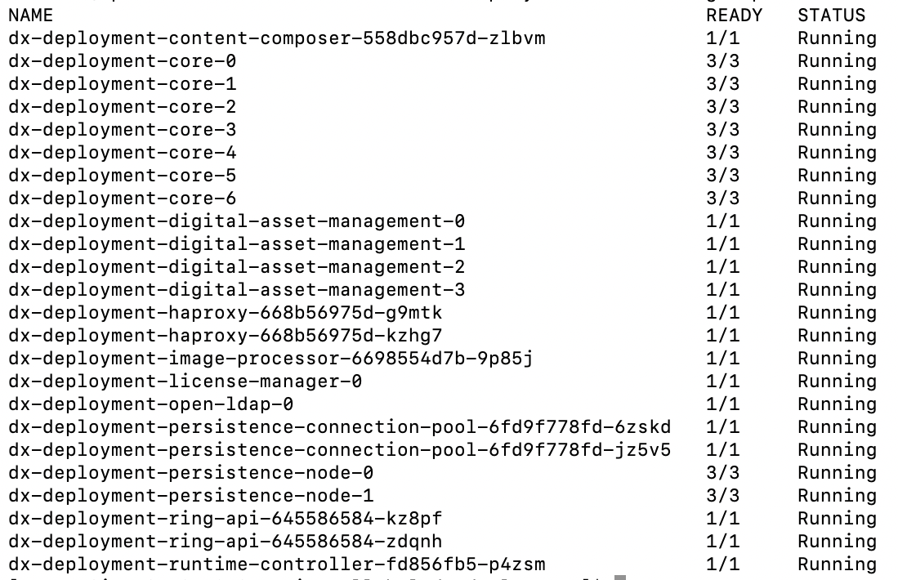

## Performance-sizing guidance for rendering in medium configuration

### Overview of DX rendering sizing-performance tests

DX sizing is one of the goals of DX performance tests. DX sizing aims to identify the reliable Kubernetes environment for small, medium, and large DX configurations. This topic presents the important KPIs (for example, number of concurrent users, average response time, and throughput) for the upper limit in a single-node configuration. This topic also discusses how adjustments to the core tuning, scaling of pods, and pod configuration can make significant improvements in system responsiveness.

This sizing work started with rendering scenarios of Web Content Management (WCM), portlets, and Digital Asset Management (DAM) with a rendering setup enabled in AWS/Native-Kubernetes. The Apache JMeter tool was used for performance tests.

For guidance when rendering with a small configuration, see [Performance-sizing guidance for rendering with a small configuration](../rm_container/dx_performance_small_cfg.md).

### Conclusion

This performance guidance shows the medium configuration on K8s cluster with AWS instances having one master (c5.xlarge) and four worker nodes (c5.4xlarge).

- It is suggested that for DX medium configuration rendering scenarios with 10000 concurrent user load, to have distributed K8s setup with  1 master of type (c5.large) and 4 worker nodes of type c5.4xlarge. With below mentioned tuned helm values the performance results in average response time ~720 ms, 95th pct response time less than ~4 secs. Top 5 APIs average response times are also less than ~4 secs.

- Core tuning details are available in this section [DX core tuning](#DX core tuning and enhancements for 10000 concurrent user run).

- The following table contains the number and limits for each pod. Using these values significantly improves the responsiveness of the setup and enables the system to handle 10000 concurrent users with overall average response time of ~1 second. Average 95th pct response times around ~4 secs.

| Pod name                    | number of pods | Container                   | Container CPU request and limit(m) | Container memory request and limit(Mi) |
| --------------------------- | -------------- | --------------------------- | ---------------------------------- | -------------------------------------- |
| core                        | 7              | core                        | 5600                               | 8192                                   |
| ring-api                    | 2              | ring-api                    | 2000                               | 512                                    |
| haproxy                     | 2              | haproxy                     | 2000                               | 1024                                   |
| digital-asset-management    | 4              | digital-asset-management    | 1000                               | 2048                                   |
| persistence-connection-pool | 2              | persistence-connection-pool | 700                                | 1024                                   |
| persistence-node            | 2              | persistence-node            | 1200                               | 2048                                   |
| open-ldap                   | 1              | open-ldap                   | 500                                | 2048                                   |
| Total                       |                |                             | 55500                              | 76800                                  |

### Customer rendering scenario details

| Concurrent users      | Existing WCM pages | Existing DAM content | Pages with portlets |
| --------------------  | ------------------ | -------------------- | ------------------- |
| Small  – 1000 users   | 20                 | 2k                   | 80                  |
| Medium – 10000 users  | 200                | 10k                  | 800                 |
| Large  – 100000 users | 2000               | 50 - 100k            | 8000                | 

### Environment

#### AWS/Native Kubernetes

- An AWS Elastic Compute Cloud (EC2) instance is running on a native Kubernetes platform with the DX images installed and configured.

- In AWS/Native Kubernetes, the tests are executed in EC2 instances with one master (c5.xlarge) and 4 worker nodes (c5.4xlarge).

- The tests used a remote DB2 instance.(c5.2xlarge)

- The tests started with worker node type c5.2xlarge, then we moved to c5.4xlarge after analyzing test results and observations.

- c5.4xlarge

      - Info

      

      

      - Processor details

      

      - Volume details

      

- c5.large

      - Info

      

      

      - Processor details

      

      - Volume details

      

#### DB2 instance

- Remote DB2 - [c5.2xlarge]

      

      

- Processor details

      

- Volume details

      

#### JMeter agents

- JMeter instance - [c5.2xlarge]

- To run the tests, a distributed AWS/JMeter agents setup consisting of one primary and eight subordinates was used.

      

      

- Processor details

      

- Volume details

      

- Processor details

      

- Volume details

      

!!!note
      Ramp up time is 1.5 sec per user. Test duration is addition of rampmup time and one hour with peak load of concurrent users.

### Authoring details

Set up the systems before performing the rendering tests. This section provides details for WCM, DAM, and portlets authoring.

### WCM Default Test Data - 200 pages

#### WCM test data characteristics

- The default test data has a WCM design library called "PerformanceTestDesign" and five content libraries named "PerformanceTestContent01" to "PerformanceTestContent05".
      
- Each content library contains four levels of site areas, with four site areas per level. Only the 256 "leaf" site areas contain content.

- Each leaf site area contains ten content items, for a total of 12,800 content items across the libraries.

- Half of the content items are visible to "Anonymous" and "All Authenticated" users. This portion of the content items is evenly distributed between these two types of users and is profiled with the keyword "MENU".

- The other half is visible only to members of ten groups per content item. These ten groups are spread out among the 500 groups assumed to exist in the test LDAP, and assumed to be called "Group0000" through "Group0499".

- There are 20 test-portal pages created under the "PerformanceTest" label. Each page has a URL in the form "<context-root>/perf/page-xx". 20 pages are duplicated to 200 pages.

- Each page contains 6 WCM viewer portlets that show content below one of the 20 top-level site areas. For example, Pages 01 to 04 show content from site areas "SA01" through "SA04" in the "PerformanceTestContent01" library, and pages 05 to 08 show content from site areas "SA01" through "SA04" in the "PerformanceTestContent02"  library, and so on.

- Four of the portlets on each page show single-content items. For page 01, these are the first content items in site areas: "SA01.01.01.01", "SA01.02.01.01", "SA01.03.01.01", and "SA01.04.01.01" respectively. Other pages follow the same pattern.

- Another portlet on each page shows a navigator of site areas and content items below the same top-level area.

- The final portlet on each page shows a menu of items and is scoped to the top-level site area. It also selects only those items profiled with the "MENU" keyword.

- A total of 99,999 users were added to openLDAP as authenticated users.

### DAM default test data: 25,000 assets

- Testers uploaded 2,500 assets. These assets include images (136kb, .jpg), documents (199kb, .docx), and videos (1.1mb, .mp4) to preheat. After preloading 2,500 assets, 15 assets were uploaded and rendered for 1 hour.

- Details of 15 assets were uploaded for rendering.
      
- There are 19 URLs in total, three of which are custom URLs, eight are uuid URLs, and eight are short URLs, which are combinations of original, tablet, smartphone, and desktop renditions.

      | Asset    | Type          | Size                                      |
      | -------- | ------------- |-----------------------------------------  |
      | Image    | .jpg/png/tif  | 155kb, 2mb,5mb, 500kb, 100 kb, 2 mb,300 kb|
      | Video    | mp4/webm      | 5 mb, 199kb,200kb , 2 mb,199kb            |
      | Document | docx/xlsx/pptx| mp4- 1mb, 15mb, 100mb, webm- 2 mb         |

- DAM asset rendeing APIs examples of UUID, Custom Url and Friendly are as below

- `https://<host-name>/dx/api/dam/v1/collections/f5764415-afd3-4b18-90ab-5c933e9965a8/items/b2204c8f-bd26-4f9b-865f-1fc1f8e26a13/renditions/09d278d6-1ae7-4a2a-950d-c1fa7f0bacde?binary=true`

-  `https://<host-name>/dx/api/dam/custom/customURL2-1715776542673?binary=true`

-  `https://<host-name>/dx/api/dam/v1/assets/Jmeter.11667/wcm-sample-content.png?rendition=Tablet?binary=true`

!!!note
      For DAM, only anonymous rendering is available.

### Pages and portlets default test data: 80 pages

Customers typically use a total of eight pages with portlets. To complete authoring and rendering, both anonymous and authenticated users received access. The same users were added in openLDAP for WCM rendering. All authenticated users are assigned the User role. The pages in the following list are duplicated 10 times with different page numbers, resulting to 80 pages.
 
As part of authoring, pages and portlets were added manually. The list shows the details of portlets for authoring on every page.

- Page 1 - 2 Articles
- Page 2 - 2 Rich text
- Page 3 - Login portlet
- Page 4 - Information Portlet(JSR) - JSP file -  jsp/oob/welcome.jsp 
- Page 5 - Search Centre portlet
- Page 6 - Custom JSF portlet with simple form (disabled in JMeter script because there are some errors)
- Page 7 - Script Application portlet (Added JavaScript Functions, Date and Time object examples)
- Page 8 - Added all mentioned portlets except JSF portlet

After completing the authoring steps, the anonymous portal user and authenticated users (added to openLDAP) must render the pages. Every page request uses a `/GET API` call (for example, `/wps/portal/portletsperf/page1`) and there is a response assertion in a sampler to validate the content html in the response body. 

### Combined DX rendering of WCM, DAM, and pages and portlets

For rendering sizing, all rendering JMeter scripts of WCM, DAM, and pages and portlets are combined. See the following section for details of load distribution.

**Load distribution**

- WCM - 40%
- DAM - 30%
- Pages and Portlets - 30%

### DX core tuning and enhancements for 10000 concurrent user run
      
The following list contains details of tuning and enhancements done to DX core during testing:

- LTPA token timeout increased from 120 minutes to 480 minutes for rendering tests execution.

 

- WCM object cache for rendering updated as per DX performance tuning guide.

 

 

- Updated abspath, abspathreverse, processing, session, strategy, summary values WCM rendering values as per tuning guide.

- Added new custom property under **Resource environment providers > WP CacheManagerService > Custom properties > cacheinstance.com.ibm.wps.resolver.friendly.cache.size**.

 

- Adjusted JVM Heap size from 3584 to 4096 under **Application servers > WebSphere_Portal > Process_definition > Java Virtual Machine**.

 

- Set LDAP user cache attributes and search to 10000.

 

- Disabled jcr.text.search under **Resource environment providers > JCR ConfigService Portal Content > Custom properties** because there is no search functionality in this tests currently.

 

- Deleted search collections in **Portal > Administration > Search > Search collections** (both JCRCollection1 and Default Search Collection).

 

- Logged level changes from info to severe in WAS for in both configuration and run time.

 

 !!!note
       Restart all core pods after performing all the tunings steps mentioned.

 - DB2 tuning performed by executing DB2 Reorg and Runstats.

### Results overview

- Goal to have K8s multi-node set up to support 10000 concurrent users load with very comfortable average and 95th percentile response times.

- With the goal in mind for DX rendering medium config, performance tests started with AWS distributed K8s set up having one master (c5.xlarge) and three worker nodes (c5.4xlarge).

- Load started with 1000 concurrent users and gradually increased 2500, 4000 and 5000. We could see the set up could suppport till 5000 concurrent users with average response time of ~27.61 ms with 0% errors, 11 out of 16908116 requests which was very negligible. 

- We also updated our JMeter script to have realistic API throughput. Also, we monitored the resource usage of pods and performed the tuning accordigly to improve the response time of rendering APIs.

- Three worker node set up with 8000 concurrent users resulted in very high response tine, observed many errors because all our core pods are fully utilized and no scope to increase resources for core pods. So we moved to four worker node set up and then started with 8000 concurrent users.

- In four worker node set up for 8000 concurrent user load with results on average response time ~455 ms and less errors around ~67 errors out of 28451772 requests, then further we started for 10000 concurrent user load.

- Final tuned helm values are below with which 10000 users concurrent load performance tests could achieve our goal of very comfortable average and 95th percentile response times with negligible errors around ~280 out of 35869608 requests

#### Helm values

                                        Requests                Limits 
| Component                     | No. of pods | cpu(m)    | memory(Mi) | cpu(m)    | memory(Mi) |
|-------------------------------|-------------|-----------|------------|-----------|------------|
| contentComposer               | 1           | 100       | 128        | 100       | 128        |
| **core**                      | **7**       | **5600**  | **8192**   | **5200**  | **8192**   |
| **digitalAssetManagement**    | **4**       | **1000**  | **2048**   | **1000**  | **2048**   |
| imageProcessor                | 1           | 200       | 2048       | 200       | 2048       |
| **openLdap**                  | **1**       | **500**   | **2048**   | **500**   | **2048**   |
| **persistenceNode**           | **2**       | **1200**  | **2048**   | **1000**  | **2048**   |
| **persistenceConnectionPool** | **2**       | **700**   | **1024**   | **700**   | **1024**   |
| **ringApi**                   | **2**       | **2000**  | **512**    | **2000**  | **512**    |
| runtimeController             | 1           | 100       | 256        | 100       | 256        |
| **haproxy**                   | **2**       | **2000**  | **1024**   | **2000**  | **1024**   |
| licenseManager                | 1           | 100       | 300        | 100       | 300        |
| **Total**                     |             | **60000** | **79532**  | **60000** | **79532**  |

#### Details of Pods in native-kube deployment

#### Summary of results

| Medium Config Sizing                       | Distributed-Run(1Master-4Worker Nodes)                                                                    | Distributed-Run(1Master-4Worker Nodes)                                                                                                                                                                              | Distributed-Run(Master-4Worker Nodes)                                                                                                                                                                                                                                                                                         |
| ------------------------------------------ | --------------------------------------------------------------------------------------------------------- | ------------------------------------------------------------------------------------------------------------------------------------------------------------------------------------------------------------------- | ----------------------------------------------------------------------------------------------------------------------------------------------------------------------------------------------------------------------------------------------------------------------------------------------------------------------------- |
| Environment                                | AWS/Native Kube                                                                                           | AWS/Native Kube                                                                                                                                                                                                     | AWS/Native Kube                                                                                                                                                                                                                                                                                                               |
| Test Time(IST)                             | "5/21/24, 1:07 PM" - "5/21/24, 4:12 PM" IST                                                               | "5/31/24, 01:11 PM-"5/31/24, 05:31 PM" IST                                                                                                                                                                          | 6/14/24, 9:12 AM" - "6/14/24, 2:22 PM" IST                                                                                                                                                                                                                                                                                    |
| Total samples                              | 16908116                                                                                                  | 28451772                                                                                                                                                                                                            | 37612181                                                                                                                                                                                                                                                                                                                      |
| Concurent Users                            | 5000(WCM - 1008 DAM - 744 Page&Portlet - 752)                                                             | 8000(WCM - 1008 DAM - 744 Page&Portlet - 752)                                                                                                                                                                       | 10000(WCM - 4000 DAM - 3000 Page&Portlet - 3000)                                                                                                                                                                                                                                                                              |
| Total Throughput (transactions/sec)        | 1523.02                                                                                                   | 1823.47                                                                                                                                                                                                             | 2021.37                                                                                                                                                                                                                                                                                                                       |
| Total Avg response time (in milli seconds) | 27.61                                                                                                     | 454.97                                                                                                                                                                                                              | 722.16                                                                                                                                                                                                                                                                                                                        |
| CPU Usage(%)                               | Master- 9.22, Worker1-57.49,Worker2-65.20,Worker3-71.64,Worker4-69.56,                                    | Master- 5.91, Worker1-73.54, Worker2-69.72, Worker3-80.23, Worker4-71.47                                                                                                                                            | M- 11.03, W1-89.82, W2-86.24, W3-81.51, W4-73.09                                                                                                                                                                                                                                                                              |
| Memory Usage(%)                            | Master-42.17, Worker1-22.59,Worker2-42.70,Worker3\-45.52, Worker4\-47.23                                  | Master-43.75, Worker1-37.30,Worker2-43.16,Worker3-41.56, Worker4-28.57                                                                                                                                              | M-44.14, W1-47.92,W2-40.96,W3-40.72, W4-29.71                                                                                                                                                                                                                                                                                 |
| Error(%)                                   | 0                                                                                                         | 0                                                                                                                                                                                                                   | 0                                                                                                                                                                                                                                                                                                                             |
| Test Duration(sec)                         | 11100                                                                                                     | 15600                                                                                                                                                                                                               | 18600                                                                                                                                                                                                                                                                                                                         |
|                                            | Top Requests (Avg Respone Time in ms)                                                                     | Top Requests (Avg Respone Time in ms)                                                                                                                                                                               | Top Requests (Avg Respone Time in ms)                                                                                                                                                                                                                                                                                         |
|                                            | Get video - mp4 100 mb - friendly url - furlmp4100mb - (1318.63)                                          | Get video - mp4 1.1 mb custom url - curlmp41.1mb - (1859.08)                                                                                                                                                        | Get video - mp4 1.1 mb custom url - curlmp41.1mb - 3388.46, 95th pct - 8104.00                                                                                                                                                                                                                                                |
|                                            | Get video - mp4 15mb - idmp415mb - (224.27)                                                               | Get doc - pdf 171 kb custom url - curlpdf171kb - (1849.21)                                                                                                                                                          | Get doc - pdf 171 kb custom url - curlpdf171kb - 3363.31, 95th pct - 8013.00                                                                                                                                                                                                                                                  |
| Top requests in ms                         | Get doc - pdf - 5mb - friendly url - Desktop - furlpdf5mb- (180.53)                                       | Get image - jpeg 155 kb custom url - curljpg155kb - (1834.95)                                                                                                                                                       | Get image - jpeg 155 kb custom url - curljpg155kb - 3343.60, 95th pct - 8011.95                                                                                                                                                                                                                                               |
|                                            | Get video - webm 2mb - friendly url - furlwebm2mb - (142.03)                                              | Get video - mp4 15mb - idmp415mb -(1246.14)                                                                                                                                                                         | Get video - mp4 15mb - idmp415mb - 2340.82, 95th pct - 7006.95                                                                                                                                                                                                                                                                |
|                                            | Get image - pptx - friendly url - 2.7mb - furlpptx2.7mb - (137.96)                                        | Get video - mp4 100 mb - friendly url - furlmp4100mb - (1242.38)                                                                                                                                                    | Get doc - pdf - 5mb - friendly url - Desktop - furlpdf5mb - 2169.33, 95th pct - 6468.00                                                                                                                                                                                                                                       |
|                                            | WCM Intial page request - 40.71, 95th pct - 102.00                                                        | WCM Intial page request - 630.20, 95th pct - 1781                                                                                                                                                                   | WCM Intial page request - 991.84, 95th pct - 2754.90                                                                                                                                                                                                                                                                          |
| Error Details                              | 0% (11 requests failed ) [error code:400 - 11]                                                            | 0% (67 requests failed ) [error code:400 -57,502-4]                                                                                                                                                                 | Total - 298 (400/Bad Request - 88, 504 -4,502 - 7, 503 -4 and error codes - java.net.SocketTimeoutExceptions - 44)                                                                                                                                                                                                            |
| Remarks                                    | Test done on distributed set up ( 1 master and 3 worker nodes of type C5.4x large) ,CF220 release images. | Test done on distributed set up ( 1 master and 4 worker nodes of type C5.4x large) ,CF220 release images.2 haproxy pods with 2000m each, 7 core pods 5200m,2 ring pods with 2000m and jcr.binarycache.enabled=false | Test done on distributed set up ( 1 master and 4 worker nodes of type C5.4x large) ,CF220 release images.ThinkTime of DAM increased to 1000ms and WCM nav requests to 1000ms and PNP unauthenticated to 1500ms, 2 haproxy pods with 2000m each, 7 core pods 5600m, 2 ring api pods 2000m and node - 1200m and enabled toplogy |

##### Observations 

- Erros ~270 out of 35892379 requests (contributing to 0% error rate) from JMeter results which was negligible.

- The CPU usage of a three worker nodes reached 80% during our tests with 10000 concurrent user but not exceeded more than 90%. Memory usage of all worker nodes less than 50%.

-  It is suggested that for DX medium configuration rendering scenarios with 10000 concurrent user load, to have distributed K8s setup with  1 master of type (c5.large) and 4 worker nodes of type c5.4xlarge. With below mentioned tuned helm values the performance results in average response time ~720 ms, 95th pct response time less than ~4 secs. Top 5 APIs average response times are also less than ~4 secs.

