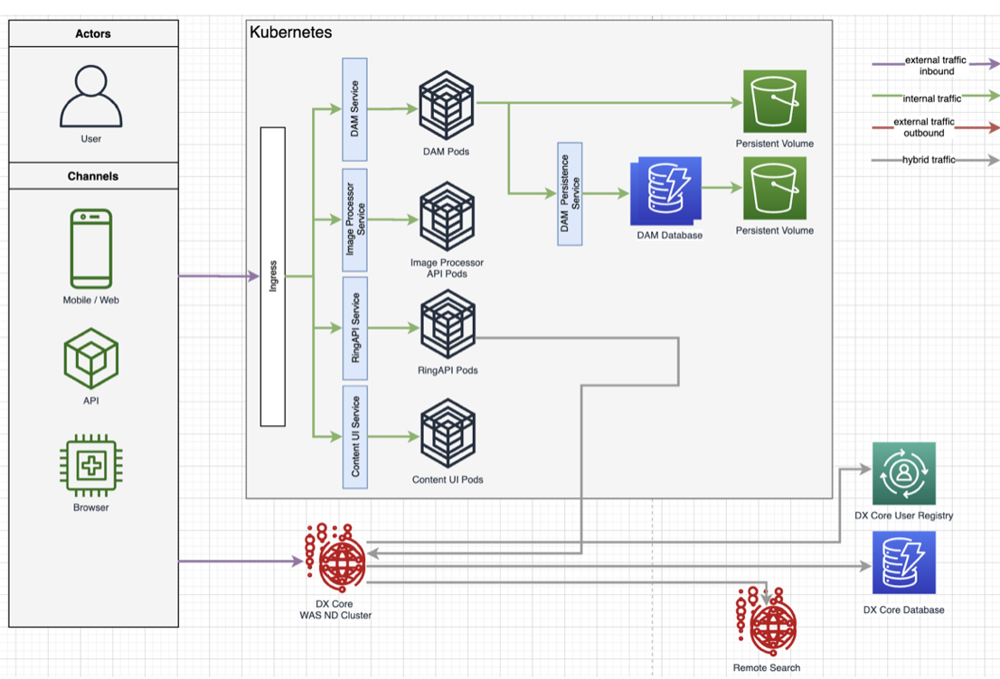

# Hybrid deployment with Helm

You can install HCL Digital Experience 9.5 Container Update CF198 and later. Additionally, you can install Portal Server and Web Content Manager services on on-premises platforms. These platforms should be operating with Digital Asset Management, Content Composer, and Experience API deployed to cloud-based Kubernetes and OpenShift platforms. All the installation processes involve using the Helm deployment method.

## Overview

The HCL Digital Experience 9.5 Hybrid deployment reference architecture and topics describe how to deploy and manage HCL Digital Experience 9.5 core Portal Server and Web Content Manager services on premises. The resources also explain how to connect to cloud native components, Digital Asset Management, Content Composer, Experience API and related services by using Helm in a production environment.

## Prerequisites

-   The on-premises platform and the container platform must be at the same CF level.
-   HCL Digital Experience V9.5 CF198 or a later release is deployed to supported on-premises platforms in a standalone, cluster, or farm topology. See [Roadmaps to deploy your Digital Experience 9.5 system](../traditional_deployment/roadmaps/index.md) for more information.
-   Practitioner Studio is enabled in the Digital Experience 9.5 CF198 or a later installation. See [How to enable Practitioner Studio](../../../build_sites/practitioner_studio/working_with_ps/enable_prac_studio.md) for instructions.
-   HCL DX 9.5 CF198 and later environments can connect securely to cloud deployments using a shared SSL domain. This domain covers both on-premises and cloud components like HCL DX Experience API, Digital Asset Management, and Content Composer. Supported cloud platforms include Red Hat OpenShift, Amazon EKS, Azure AKS, and Google GKE.

    For example, mytargetcloud.dx.com and myonprem.dx.com would have the same domain: dx.com.

-   Single sign-on must be enabled on HCL DX 9.5 CF198 or a later on-premises environment. On DMGR or WebSphere Application Server Admin console, click **Security > Global Security > Web & SIP Security > Single Sign-On**. Make sure the **Enabled** checkbox is selected and the **Domain name** is set to common domain, for example, dx.com.

-   A high-performance network connection is established between the HCL DX 9.5 CF19 and later on-premises environment and the target DX Red Hat OpenShift or Kubernetes platform deployment.

-   **Volume Requirement**: Requires an access mode of `ReadWriteMany`. Refer to [Sample Storage Class and Volume](../../../deployment/manage/container_configuration/sample_storage_class_volume.md) for more information.
-   Ensure you have a backup of the HCL DX 9.5 on-premises deployment. See [Backup and Restore](../../../deployment/manage/backup_restore/index.md) for additional information.

To install HCL Digital Experience 9.5 Container Update CF198 and later:

1. Configure the network for the on-premises DX 9.5 CF198 or later deployment so that the HCL DX 9.5 Container Update CF198 or later components are accessible externally from the Kubernetes or OpenShift platform cluster. See [Configure Networking](../../../deployment/install/container/helm_deployment/preparation/mandatory_tasks/prepare_configure_networking.md) in the Helm Planning sections of the Help Center.
2. Set the Core application deployment parameter in your ``custom-values.yaml`` file to `false`. See [Planning your container deployment using Helm](../../../deployment/install/container/helm_deployment/preparation/mandatory_tasks/prepare_configuration.md#custom-value-files) in the Help Center for more information.
3. Proceed by following configuration instructions listed in [Prepare configuration](../../../deployment/install/container/helm_deployment/preparation/mandatory_tasks/prepare_configuration.md).

