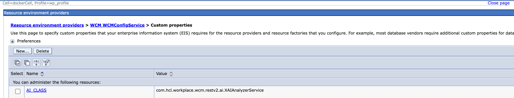
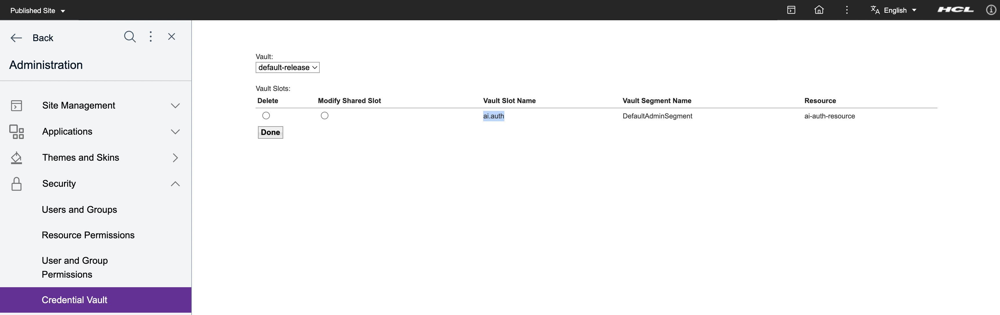

# WCM Content AI Analysis

Learn how to configure the AI analysis feature for WCM Content in a traditional, on-premise deployment, and how to set up a content AI provider. This feature is available from HCL Digital Experience (DX) 9.5 Container Update CF213 onward. The following table outlines AI capabilities by release:

| Release | Feature updates |
| :--- | :--- |
| **CF224** | AI Workflows and AI Translation are available. |
| **CF221** | The default AI model is updated to `gpt-4o`. |
| **CF214** | Custom AI implementations are supported. |
| **CF213** | OpenAI ChatGPT is the supported content AI provider. |

## Content AI provider - Open AI's ChatGPT

OpenAI is the AI research and deployment company that offers ChatGPT. When you sign up with ChatGPT, it provides API access through an API key. After signing up at [https://platform.openai.com/playground](https://platform.openai.com/playground){target="_blank"}, you can create a personal account with limited access or a corporate account. You can use the playground to experiment with the API also. A highlight of the API is that it accepts natural language commands similar to the ChatGPT chatbot. 

For privacy and API availability and other conditions, see the [OpenAI](https://openai.com){target="_blank"} website or contact the OpenAI team.

## Configure the engine task for enabling content AI analysis

To enable content AI analysis:

1. Connect to DX Core and run the following config engine task:

    ```/opt/HCL/wp_profile/ConfigEngine/ConfigEngine.sh action-configure-wcm-content-ai-service -DContentAIProvider=CUSTOM -DCustomAIClassName={CustomerAIClass} -DContentAIProviderAPIKey={APIKey} -DWasPassword=wpsadmin -DPortalAdminPwd=wpsadmin```

    !!!note
        - Possible values for the ```ContentAIProvider``` parameter are ```OPEN_AI``` or ```CUSTOM```.
        - If the ```ContentAIProvider``` value is set as ```OPEN_AI```, the value set for the parameter ```CustomAIClassName``` is ignored.
        - If ```ContentAIProvider``` value is set as ```CUSTOM```, set the custom content AI provider implementation class in the ```CustomAIClassName``` parameter . For example, enter ```com.ai.sample.CustomerAI```. Refer to [Configuring AI Class for Custom Content AI Provider](./wcm_ai_analysis.md#configuring-an-ai-class-for-a-custom-content-ai-provider) for more information about how to implement a custom content AI provider class.
        - Depending on the ```ContentAIProvider``` value, set the correct API key of the respective provider in the ```ContentAIProviderAPIKey``` parameter.

2. Validate that all the required configurations are added.

    1. Log in to the WebSphere Application Server console.
    2. Verify that the ```AI_CLASS``` configuration property is added in WCM Config Service by going to Custom Properties: click **Resource > Resource Environment > Resource Environment Providers > WCM_WCMConfigService > Custom Properties**. Possible values for ```AI_CLASS``` are:
        - ```com.hcl.workplace.wcm.restv2.ai.ChatGPTAnalyzerService``` (if ```ContentAIProvider``` value is set as ```OPEN_AI```)
        - Value set in parameter ```CustomAIClassName``` (if ```ContentAIProvider``` value is set as ```CUSTOM```)

        

    3. Log in to the DX Portal.
    4. Verify that the Credential Vault with the Vault slot Name  ```ai.auth``` is configured using the AI content provider's API key by clicking **Administration > Security > Credential Vault > Manage System Vault Slot**.

        

### Configuring an AI class for a custom content AI provider

Only administrators can configure an AI class to use a custom content AI provider.

!!!note
	If you wish to connect to an AI provider (such as LiteLLM) that is API-compatible with OpenAI models, you may be able to use the default provider class and just change its configuration parameters (see below).

1. Write the custom content AI provider class by implementing the ```com.hcl.workplace.wcm.restv2.ai.IAIGeneration```. Optionally, starting CF224, you can also implement the ```com.hcl.workplace.wcm.restv2.ai.IAITranslation``` interface.

	1. Create the JAR file.

	2. Put the JAR file either in a custom-shared library or in the ```/opt/HCL/wp_profile/PortalServer/sharedLibrary``` folder.

	3. Restart JVM.

	The following example of a custom content AI provider class can be used to call custom AI services for AI analysis.

	```
	package com.ai.sample;

	import java.util.ArrayList;
	import java.util.List;
	import com.hcl.workplace.wcm.restv2.ai.IAIGeneration;
	import com.hcl.workplace.wcm.restv2.ai.IAITranslation;
	import com.ibm.workplace.wcm.rest.exception.AIGenerationException;

	public class CustomerAI implements IAIGeneration, IAITranslation {

		@Override
		public String generateSummary(List<String> values) throws AIGenerationException {
			// Call the custom AI Service to get the custom AI generated summary
			return "AIAnalysisSummary";
		}

		@Override
		public List<String> generateKeywords(List<String> values) throws AIGenerationException {
			// Call the custom AI Service to get the custom AI generated keywords
			List<String> keyWordList = new ArrayList<String>();
			keyWordList.add("keyword1");
			return keyWordList;
		}

		@Override
		public Sentiment generateSentiment(List<String> values) throws AIGenerationException {
			// Call the custom AI Service to get the custom AI generated sentiment
			return Sentiment.POSITIVE;
		}

		public String translate(String value, Locale language) throws AIGenerationException
		{
			// Call the custom AI Service to translate the value
			return "translated";
		}

	}
	```

2. Run the following config engine task:

	```/opt/HCL/wp_profile/ConfigEngine/ConfigEngine.sh action-configure-wcm-content-ai-service -DContentAIProvider=CUSTOM -DCustomAIClassName={CustomerAIClass} -DContentAIProviderAPIKey={APIKey} -DWasPassword=wpsadmin -DPortalAdminPwd=wpsadmin```

## Config engine task for disabling content AI analysis

To disable content AI analysis:

1. Connect to DX Core and run the following config engine task:

    ```/opt/HCL/wp_profile/ConfigEngine/ConfigEngine.sh action-remove-wcm-content-ai-service -DWasPassword=wpsadmin -DPortalAdminPwd=wpsadmin```

2. Validate that all the required configurations are deleted.

    1. Log in to the WebSphere Application Server console.
    2. Verify that the ```AI_CLASS``` configuration property is deleted from WCM Config Service.
    3. Log in to the DX Portal.
    4. Verify that the Credential Vault with the Vault slot name  ```ai.auth``` is deleted.


## Custom configurations for AI analysis

If AI analysis-related configurations require customization, log in to the WebSphere Application Server console for customizing any of the custom properties in the WCM Config Service. Click **Resource > Resource Environment > Resource Environment Providers > WCM_WCMConfigService > Custom Properties**.

### OpenAI ChatGPT specific custom configurations

1. ```OPENAI_MODEL```: The currently supported AI model is ```gpt-4o```. However, AI model can be overriden by overriding this property.
2. ```OPENAI_MAX_TOKENS```: Set a positive integer value for GPT-3 models like ```text-davinci-003```. It specifies the maximum number of tokens that the model can output in its response and defaults to ```256```.
3. ```OPENAI_TEMPERATURE```: Set positive float values ranging from ```0.0``` to ```1.0```. This parameter in OpenAI's GPT-3 API controls the randomness and creativity of the generated text. Higher values produce more diverse and random output. Lower values produce more focused and deterministic output.
4. ```OPENAI_HOST```: The host to connect to for AI calls, defaults to ```api.openai.com```. Configuring this could allow you to connect to a different service that offers an OpenAI-compatible API, such as LiteLLM.
5. ```OPENAI_SCHEME```: The scheme which AI calls will use, defaults to ```https```.

After enabling the content AI analysis in DX deployment, use the [WCM REST V2 AI Analysis API](../../../../manage_content/wcm_development/wcm_rest_v2_ai_analysis/index.md) to call the AI analyzer APIs of the configured content AI provider.
