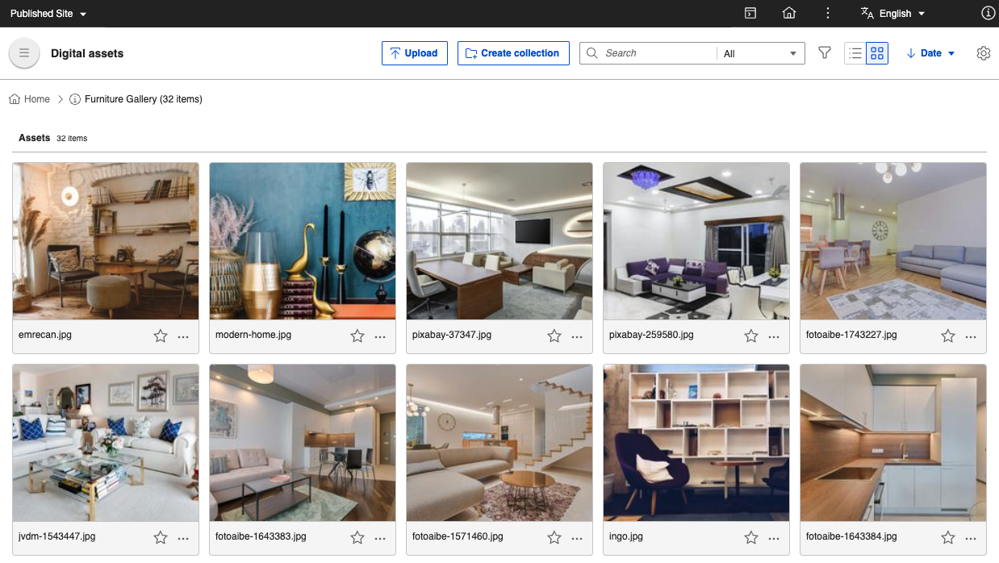
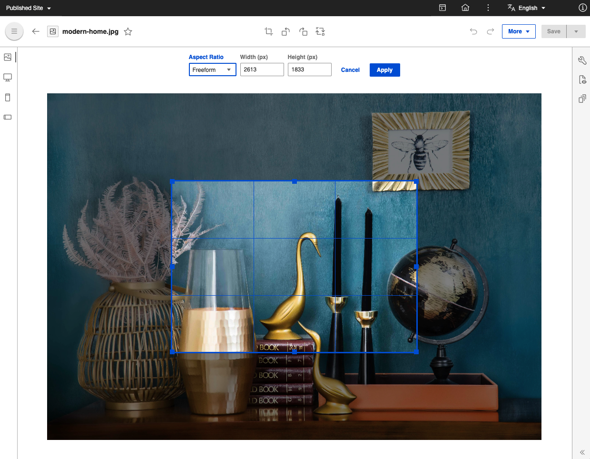

---
tags:
    - DAM
    - Asset Management
    - Digital Asset Management
hide: tags
---

# Digital asset management (DAM)

HCL DX provides integrated digital asset management services, which are targeted at managing web-ready digital assets such as images or videos for use in content and sites built with HCL DX.

## Content organization and access

Assets are organized into collections, and access can be controlled to the top-level set of collections. Within a collection, you can create sub-collections so you can keep your content organized. Each collection can store images, videos, and other files.

## Rendition generation

For images stored in the DAM, renditions are automatically generated for desktop, smartphone, and mobile devices. The sizes generated can be customized and additional renditions configured. (See information later in this topic.) Individual images can be cropped from in DAM without spending time in image editing software.

## Integrations

As delivered with HCL DX, DAM provides two integrations.

* Video file management can be delegated to the [Kaltura video content management system](https://corp.kaltura.com/video-content-management-system/). When this system is configured, videos are synchronized with Kaltura and can be delivered through that service. With this setup, you can deliver adaptive video in your web experiences.
* Image assets can be automatically tagged by using [Google Vision](https://cloud.google.com/vision/docs/detect-labels-image-api). With tagging, you can enrich the metadata available for images stored in DAM.

You can customize or replace both integreations with your preferred solutions.

## Extensibility

DAM supports user-defined custom renditions and transformations for images. This feature can be used to integrate with third-party plug-ins for custom asset processing. For example, custom renditions and transformations can be used for resizing, cropping, rotating, or custom operations, while supporting default and custom renditions.