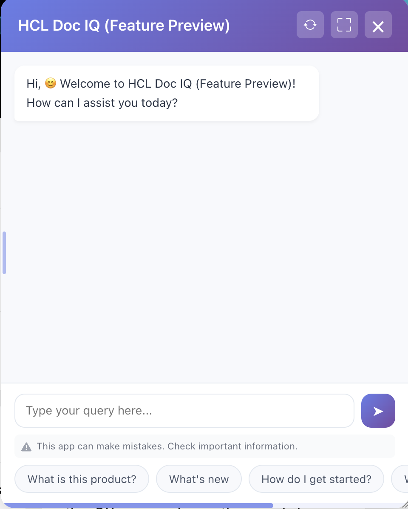

# HCL Doc IQ chatbot (Preview)

## Overview

The HCL Doc IQ chatbot lets you interact with Help Center documentation. Instead of manually searching documentation pages, you can ask questions in natural language and receive contextual answers.

Doc IQ improves the documentation experience by making information easier to find, reducing the time needed to locate relevant topics, and guiding you to the most relevant documentation resources.

The chatbot analyzes documentation and generates responses that reference relevant topics. This lets you quickly access the source material for more detailed information.  

It finds relevant information in documentation and knowledge base (KB) articles.

{ width=400 }

## Differences between IQ and Doc IQ

The [HCL IQ assistant](../../build_sites/iq/index.md) in HCL DX provides core backend AI capabilities and integration services across the entire deployment platform. For more information on the capabilities of HCL IQ, refer to [Using IQ](../../build_sites/iq/usage.md).

HCL Doc IQ functions specifically as a specialized frontend assistant focused on parsing, searching, and clarifying Help Center documentation and knowledge base articles. It provides the following capabilities:

- **Natural language queries**  
  You can ask questions in plain language rather than searching with keywords.

- **Context-aware answers**  
  The chatbot analyzes documentation and returns responses based on relevant topics.

- **Documentation navigation**  
  Responses include links or references to related documentation pages for more information.

- **Improved content discovery**  
  You can locate information quickly without knowing the exact location of a topic in the documentation structure.

- **Guided assistance**  
  The chatbot helps you locate procedures, configuration guidance, and conceptual documentation.

## How it works

The Doc IQ chatbot leverages documentation to provide answers to your questions.

When you submit a query, the chatbot:

1. Analyzes your question.  
2. Searches the available documentation for relevant information.  
3. Generates a summarized response.  
4. Includes references to the documentation topics used to generate the answer.

This process helps you quickly understand a topic while still giving access to the full documentation when needed.

## Using the chatbot

To use the HCL Doc IQ chatbot:

1. Open the chatbot interface on any DX Help Center page.  
2. Enter your question in the text field in plain language.  
3. Press **Enter** or click the **Send** button.  
4. Review the chatbot response, which may include:  
   - A concise answer  
   - Links to relevant documentation pages  
   - Step-by-step instructions or configuration guidance  
5. Click any included links to navigate to full documentation for detailed information.  
6. Refine your question or ask follow-up questions to get more context-specific answers.

### Tips for effective use

- Ask one question at a time for clearer answers.  
- Use keywords related to the feature or procedure you are interested in.  
- If the chatbot does not provide the needed information, check the linked documentation topics.  
- For complex tasks, always refer to the detailed documentation pages.

## When to use the chatbot

The HCL Doc IQ chatbot is useful in the following scenarios:

- Finding configuration steps or procedures  
- Locating specific documentation topics  
- Understanding product features and concepts  
- Discovering related documentation content

For detailed instructions or complex tasks, refer to the documentation topics linked in the chatbot responses.

## Providing feedback on chatbot responses

Your feedback helps improve the accuracy and usefulness of the HCL Doc IQ chatbot. By reviewing responses and submitting feedback, you help identify gaps in documentation, unclear answers, or areas where the chatbot can be improved.

Feedback is used to refine chatbot responses, improve documentation coverage, and enhance the overall Help Center experience.

### Why provide feedback

Providing feedback helps improve the chatbot in several ways:

- Improve answer accuracy by identifying responses that are incomplete or unclear.
- Highlight missing documentation when the chatbot cannot find relevant information.
- Improve documentation quality by identifying topics that require clearer explanations or additional details.
- Enhance future responses for other users who ask similar questions.

### How to provide feedback

If a chatbot response does not fully answer your question or contains incorrect information, you can provide feedback directly from the chatbot interface.

To provide feedback:

1. Review the chatbot response.
2. Select the feedback option associated with the response  **thumbs up**
   or **thumbs down**
  

3. If prompted, enter additional comments describing the issue or suggesting improvements.
4. Submit the feedback.

Providing specific comments—such as what information was missing or unclear—helps improve future responses.

### When to provide feedback

Consider providing feedback when:

- The chatbot response is incorrect or incomplete.
- The chatbot cannot find relevant documentation.
- The response links to unrelated topics.
- You find missing or outdated documentation.

Your feedback helps improve both the chatbot experience and the quality of the documentation.