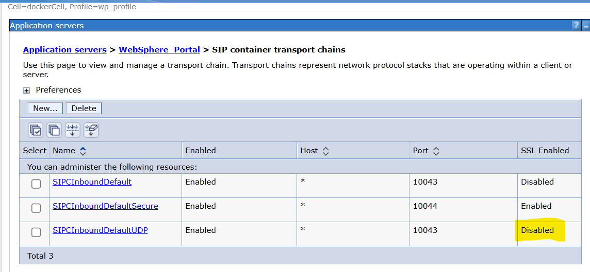

# HCL DX Usage of UDP and ICMP Protocols

On a default HCL DX installation, UDP transport chains are disabled. Some versions of HCL Sametime used UDP. However, on a running system, some UDP ports may appear as listening:

- `1506286/java`: WebSphere_Portal process  
- Port `10045`: configured, purpose unknown  
- Ports `5000` and `5001` used by WebSphere Application Server (WAS) for discovery between nodes

These ports support node discovery within WebSphere Application Server.

{ width="800" }

*Figure 1: UDP ports used for container transport chains in WAS.*


> Example: Multicast endpoints configured in WebSphere Application Server:

```xml
<specialEndpoints xmi:id="NamedEndPoint_1659472503768" endPointName="NODE_IPV6_MULTICAST_DISCOVERY_ADDRESS">
    <endPoint xmi:id="EndPoint_1659472503772" host="ff01::1" port="5001"/>
</specialEndpoints>
<specialEndpoints xmi:id="NamedEndPoint_1659472503769" endPointName="NODE_MULTICAST_DISCOVERY_ADDRESS">
    <endPoint xmi:id="EndPoint_1659472503773" host="232.133.104.73" port="5000"/>
</specialEndpoints>
```
## Notes for Security Reviewers

Default Behavior: HCL DX does not require UDP or ICMP for normal operation. TCP is used for all core communications.

- UDP Ports Observed: Ports `5000` and `5001` are used by WAS for internal node discovery. They are not required for HCL DX services outside the cluster.  
- WebSphere_Portal Process: The `1506286/java` process may open UDP ports for WAS internal operations.  
- Unknown Ports: Port `10045` is configured by WAS but does not affect HCL DX functionality; review in context of internal security policies.  
- Security Implication: Disabling these UDP ports externally does not affect HCL DX normal operations. These ports are relevant only for intra-cluster node discovery within the WAS environment.  
- ICMP: No HCL DX component requires ICMP for normal operation.