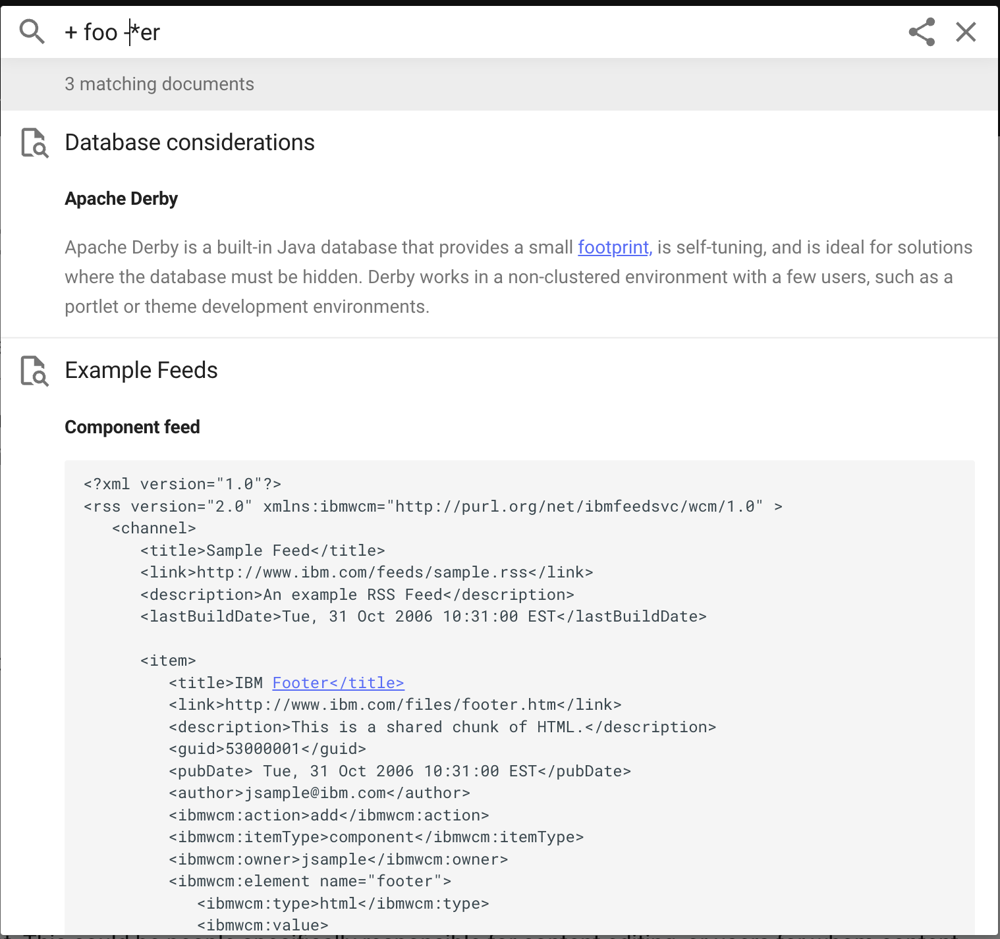

# Tips for searching in Mkdocs

Refer to the following tips to help you find better search results:                                                              

- **fo***: Use this to find all the keywords beginning with 'fo'.
- **f*o**: Use this to find all the keywords that start with 'f' and end with 'o'.
- ***oo**: Use this to find all the keywords ending with 'oo'.
- **fo bar**: Use this to find the keywords beginning with 'fo' or 'bar'.
- **+foo**: The search must contain 'foo'.
- **-bar**: The search cannot contain 'bar'.
- **title:markdown**: Use this to find pages with page titles that contain 'markdown'.

## When you combine the tips

Users can combine the tips to get the required search results. Refer to the following tips:

- **+foo +bar**: The search contains both 'foo' and 'bar'.
- **+foo -bar**: Use this to find every page with 'foo' but not 'bar'.
- **+foo -*er**: Use this to find every page with 'foo' that does not have words ending with 'er'.
- **title:Markdown -extension**: Use this to find all pages with the page title 'Markdown' that do not have the word 'extension'.

<!---
 --->