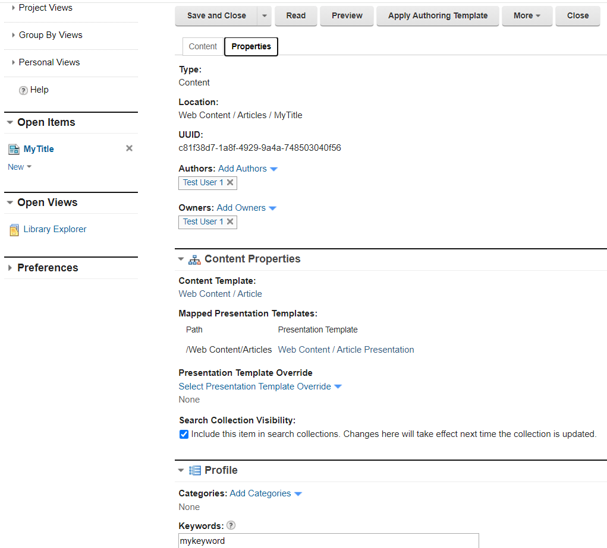
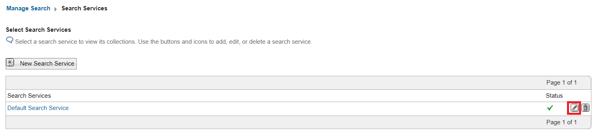
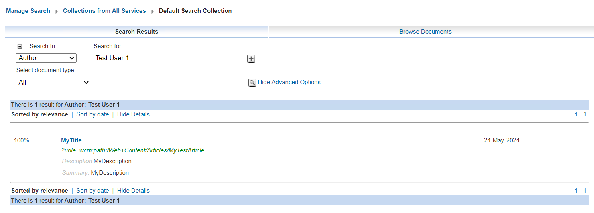

# How to use DX Search and the DX Search Center?

## Applies to

> HCL Digital Experience v9.5 and higher

## Introduction

HCL Digital Experience includes different kinds of search-features that can be used to find documents. One of these features is the Search Center.
This documentation is written to get a better understanding for using the DX Search and the Search Center when trying to find different kinds of documents used in the HCL Digital Experience. It also provides detailed steps that can be used to prepare Web Content Management (WCM) documents to find them more easily with the search service (by defining metadata).  

This How-to document is structured as a workflow sample that include different parts. First of all, a sample user will be created in HCL Digital Experience. Then a WCM document is created for which that user will be set as an author. Additional metadata will be added to that document (keywords, name, title etc.). Finally the Search Center will be used to find the created WCM document, using different search-filters (finding by title, author etc.)

[Part 1 - Create a sample user in HCL Digital Experience](#part1)  
[Part 2 - Create a sample document that contains metadata](#part2)  
[Part 3 - Check the configuration settings of the clasic search feature](#part3)  
[Part 4 - (Optional) Optimize the Search Service to use AND operator for searches](#part4)  
[Part 5 - (Optional) Optimize your search by applying the boost factors to specific metadata fields](#part5)  
[Part 6 - (Optional) Configuring search by metadata for the Search Center portlet](#part6)  
[Part 7 - Search for Documents using the Search-Center Portlet](#part7)  
[Part 8 - Use the Search Center to search for the newly created Document](#part8)  
[Additional Information](#additionalinformation)  

## Instructions

### Part 1 - Create a sample user in HCL Digital Experience {#part1}  

1. Login to the Portal using the portal admin user (wpsadmin)

2. Go to the Portal administration page

3. Click on ***Security*** > ***Users and Groups***

4. Click on ***New User***

5. Create a new user with the last name ***Test User 1*** and save it.

### Part 2 - Create a sample document that contains metadata {#part2}  

1. Go to ***Web Content***

2. In the Library Explorer go to ***Libraries > Web Content > Content > Articles***

3. Click the ***New*** button to create a new article content item and then select ***Content > Select from all Content Templates***

4. Select the ***Article*** content template and then click the ***OK*** button.

5. In the Edit Mode of the Article content item use the following:  

    **Name:** *MyTestArticle*  
    **Display title:** *MyTitle*  
    **Description:** *MyDescription*  

6. Click to the ***Properties*** tab and then click on ***Show Hidden Fields***

7. In the Authors section click to ***add Authors***. In the next window search for the ***Test User 1*** and then add it.

8. On the properties tab scroll down and expand the ***Profile*** section

9. In the Keyword section it is possible to include specific keywords that later can be used to find the page by filtering for keywords. In this sample workflow add the keyword ***mykeyword***.

10. Click to ***Save and Close***. The Test-page should look like the following:

  

**Properties Sections:**  

  

### Part 3 - Check the configuration settings of the clasic search feature {#part3}

1. Go back to the Portal Administration Page and click on ***Search***

2. On the ***Manage Search*** page there are three sections. (Search Services, Search Collections and Search Scopes).

    **Search Service:**  
    A search service is needed to create Collections. It can be a remote search service or a local one. The local one is already pre-configured, when the product is installed

    **Collections:**  
    The search service crawls and indexes documents and stores them in a collection. A search collection contains a number of content sources that the portal search service indexes. When creating a new collection, content sources will be specified in which it will be decided on which starting location documents should be fetched and when the fetching should be stopped.

    **Search Scopes:**  
    A search scope allows you to partition or organize your search collections. As a result your site visitors can limit their search to specific areas. Defined scopes are visible to visitors from the search dialog. For details, please check:  
    [Configure Search Collections and Scopes](https://opensource.hcltechsw.com/digital-experience/latest/build_sites/search/search_center/searchcenter/oob_search_scope/?h=configure+search+collections+scopes){:target=”_blank”}  & [Creating a Search Scope](https://opensource.hcltechsw.com/digital-experience/latest/build_sites/search/manage_search/searchscopes_customlinks/crt_nw_srch_scp/?h=search+scope){:target=”_blank”}  

    Click on ***Search Service*** and check the status of the service. You should see a green check mark icon. If you see a red X icon it indicates that your search service is not working.  You will need to review the configuration settings of your search service. For details, please check: [Search service configuration parameters](https://opensource.hcltechsw.com/digital-experience/latest/build_sites/search/cfg_dx_search/search_service_params/){:target=”_blank”}  
  
    

### Part 4 - (Optional) Optimize the Search Service to use AND operator for searches {#part4}

When a user enters more than one search term, the HCL Digital Experience (DX) search engine applies a logical 'OR' operator by default. For a document to qualify for the search result list, it is enough that only one of those terms is included in a document. However, including two or more words leads to better search results.

1. In the Search Service view, click to the ***Pencil icon*** to modify the search service.  

    

2. Check all parameters on all configuration pages to find out, if you have already set the parameter "DEFAULT_SEARCH_OPERATOR" to the value "AND". If it is not set yet, please add the parameter name and value under the "Service parameters" section and click the "Add Parameter" button. Then save the changes by clicking to the "OK" button. See sample screenshot:  

     

    For details, please check: [Changing the default query operator from 'OR' to 'AND'](https://opensource.hcltechsw.com/digital-experience/latest/build_sites/search/improving_search_quality/Optionsavailabletoimprovesearchquality/ChangedefaultqueryoperatorfromORtoAND/){:target=”_blank”}  

### Part 5 - (Optional) Optimize your search by applying the boost factors to specific metadata fields {#part5}

In the Search Service Configuration page it is also possible to do some tuning for the searches. In our sample we will configure some boost parameters as following:

1. Check, if the "boostingSettings" parameter is already set in the Default Search Service. If it is not set, please add the following:

    Parameter name: boostingSettings  
    value: {"phraseBoost": {"Enabled":"true"}, "fieldBoost": [{"field":"title", "boost": 3.0} , {"field":"description", "boost":3.0}, {"field":"keywords", "boost":2.0}]}

2. Save the changes by clicking to the ***"OK"*** button.  

With that change the title and the description become a better search weight then the keywords.
For details, please also check: [Applying boost factors to specific fields (metadata)](https://opensource.hcltechsw.com/digital-experience/latest/build_sites/search/improving_search_quality/Optionsavailabletoimprovesearchquality/Applyingboostfactorstospecificfieldsmetadata/){:target=”_blank”}  

### Part 6 - (Optional) Configuring search by metadata for the Search Center portlet {#part6}

By default, the meta elements title, keywords, and description of documents are provided as search filters. The actual set of available meta elements depends on the types of content sources that are indexed. It is possible to add own custom metadata search filters as described at page:  

[Configuring search by metadata for the Search Center portlet](https://opensource.hcltechsw.com/digital-experience/latest/build_sites/search/cfg_dx_search/cfg_searchcenter/srtcfg_sc_metadata/?h=configuring+search+metadata+center+portlet){:target=”_blank”}  

### Part 7 - Search for Documents using the Search-Center Portlet {#part7}

1. Login into the Portal using the Portal administrator user (wpsadmin)

2. Open the Portal Administration Page and then to ***Search***

3. Click on ***Search Collections*** and monitor the results. Do you see Documents already listed?

      
    *(In this sample you can see that the Default Search Collection has already 465 documents and the JCRCollection1 has 1689 documents indexed.)*  

4. Click on ***Default Search Collection***.  

    You will find two Content Sources with the name ***WCM Content Source*** and ***Portal Content Source***. For both, options exist to configure the content sources and to start/stop the crawler. Because you created a new WCM Document under the WCM Content Source, it is now required to update the index of that collection. This can be down by clicking on the ***Start Crawler WCM Content Source*** icon. After clicking to the button, check the status. Before you click on the icon, you will see the status ***idle***. Once the button is clicked the status will change to ***Running***. By clicking on the ***Refresh*** icon it can be verified, when the crawler finishes and the status returns to ***idle*** again. If metadata information of documents are changed, it might be required to regather all documents. There is a seperate button named ***regather all content from Content Source*** available that can be used to index all documents of that specified content source, again.  

      

    In the ***Documents*** column of the table, the new number, or number of changed documents can be found. It may still show 0 in the column, if the crawler has not run yet. With the start of the crawler you may see then that the number increases to 1 due to the WCM document that was created in [Part 2](#part2). Make sure that the new document is already crawled by clicking the ***start Crawler*** button at minimum once.  

### Part 8 - Use the Search Center to search for the newly created Document {#part8}

1. In the Portal Administration Page go back to ***Manage Search***.

2. Then click to ***Search Collections***.

3. In the collections overview click to the ***glasses icon*** of ***Default Search Collections***

      

4. In the Search Center page click on the ***Advanced Search*** button. Then under ***Search in:*** select ***Author*** and in the ***Search for:*** section, enter the text ***Test User 1***.
    (If you have created another user name or added any other user as Author in your newly created document, then please choose that user.). Hit enter to search for it. The following result should be shown:

      

    As you can see, based on the defined metadata and the search-filters that belong to them, the exact document can be found.  Please remember that the search operator has been changed to ***AND***.  As a result, search will only return results for which both metadata information match.

5. Run some further tests and check the result of the different filters (for example when searching for the title, keyword,author or when mixing some metadata as a filter-option)  
    It should be possible to find the document as soon as the metadata-filter value matches the value of the metadata mentioned in the article.  
    Further information about the Metadata (Entire document, Title, Author, Description, Keywords, Subject):  
    - When searching the "Entire document" for a keyword and the document is not be found, try to search for some keywords that are part of the BODY tag in your documents.
    - Beside the pre-defined metadata fields it is also possible to specify own/custom metadata fields. For details, please check:  

    [Configuring search by metadata for the Search Center Portlet](https://opensource.hcltechsw.com/digital-experience/latest/build_sites/search/cfg_dx_search/cfg_searchcenter/srtcfg_sc_metadata/?h=configuring+search+metadata+center+portlet){:target=”_blank”}  

### Additional Information {#additionalinformation}

Beside the Search Center Portlet there are also options available to use the DX search by using the [DX Search REST API](https://opensource.hcltechsw.com/experience-api-documentation/search-api/){:target=”_blank”}  & [Search REST API specification](https://opensource.hcltechsw.com/digital-experience/latest/build_sites/search/search-rest-api/){:target=”_blank”}  

Please also check: [Troubleshooting Remote Search, Collection and search issues](https://support.hcltechsw.com/csm?id=kb_article&sysparm_article=KB0105738){:target=”_blank”}  
