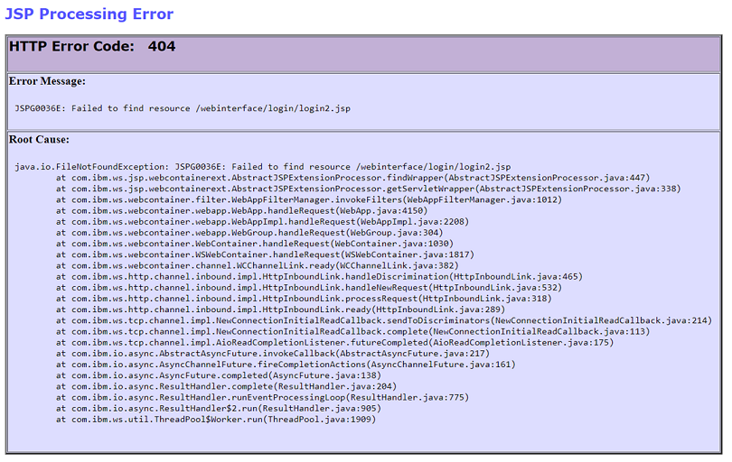

# How to customize the error behavior when accessing WCM resources

## Applies to

> HCL Digital Experience v9.5 or higher

## Introduction

This article describes the procedure to customize the default HTTP-404 and HTTP-403 error codes that might been noticed when using the WCM servlet.
Depending on the scenario, you will receive a different error message. This article applies to the following scenarios:

- **Non-existent WCM URLs**.

    For example: `http://hostname/wps/wcm/non-existent`.  

    Opening this URL will result in a a default 404 error message such as:  
    `Error 404: java.io.FileNotFoundException: CWSRV0190E: File not found: /non-existent`  

- **A WCM URL containing a non-existent JSP file.**

    For example: `http://hostname/wps/wcm/webinterface/login/login2.jsp`.  

    Opening this URL will result in a default 404 error page specific for JSPs such as:
      

- **The URL is valid, but the user does not have access to the item**.

    For example: `http://hostname/wps/wcm/myconnect/mylib/mysitearea/mycontent`.  

    Opening this URL will result in a default 403 error such as:
    `Message: Error 403: CWSRV0295E: Error reported: 403`  

## Instructions

1. Open a command prompt or terminal session to access the HCL DX binaries.

2. Create a temporary directory and ensure the current user has read and write permissions.

    !!!note
        The user can use an existing temporary directory (for example, `/tmp`) if they have the required permissions. Throughout this example, the `/tmp` and `/tmp/wcm_expanded` directories are used.

3. Navigate to the `<wp_profile_root>/bin` directory.  

4. Use the `wsadmin` command to export the `wcm.ear` file. For example:  

    ```shell
    wsadmin.sh(bat) -user <admin_user_id> -password <admin_password> -c '$AdminApp export wcm /tmp/wcm.ear'
    ```

5. Use the `EARExpander.(bat|sh)` utility to expand the `wcm.ear` file into the temporary directory.

    ```shell
    ./EARExpander.sh -ear /tmp/wcm.ear -operationDir /tmp/wcm_expanded/ -operation expand
    ```

6. Navigate to the expanded directory and locate the `web.xml` file under `/tmp/wcm_expanded/ilwwcm.war/WEB-INF/`.  

7. Backup the `web.xml` file.  

8. Open the `web.xml` file in a text editor and locate the following entry:

    ```html
    <mime-mapping id="MimeMapping_1088994409133">
    <extension>zip</extension>
    <mime-type>application/x-gzip</mime-type>
    </mime-mapping>
    ```

9. Add the following entries right below `</mime-mapping>` then save the `web.xml` file. For example:

     ```html
     <mime-mapping id="MimeMapping_1088994409133">
     <extension>zip</extension>
     <mime-type>application/x-gzip</mime-type>
     </mime-mapping>

     <error-page>
     <error-code>404</error-code>
     <location>/html/custom_errors/error404.html</location>
     </error-page>

     <error-page>
     <error-code>403</error-code>
     <location>/html/custom_errors/error403.html</location>
     </error-page>
     ```

10. In the `/tmp/wcm_expanded/ilwwcm.war/` directory, create the nested directory structure: `html/custom_errors/`.

11. Create a new file named `error404.html` in the `html/custom_errors/` directory with the following code:

     ```html
     <html>
       <p>This is a custom 404 error page!</p>
       <br>Sorry, I could not find this item for you!
     </html>
     ```

12. Create a new file named `error403.html` in the same directory with the following code:

     ```html
     <html>
     <p>This is a custom 403 error page!</p>
     <br>You have no access to this item!
     </html>
     ```

13. Rename the copy of the `wcm.ear` file in the `/tmp` directory that was previously exported to `wcm.bak`.

14. Use the `EARExpander.(bat|sh)` utility to collapse the changes made back into a new `wcm.ear` file:

     ```shell
     ./EARExpander.sh -ear /tmp/wcm.ear -operationDir /tmp/wcm_expanded/ -operation collapse
     ```

15. Use the following `wsadmin` command to update the `wcm.ear` file:

     ```shell
     ./wsadmin.sh -user <admin_user_id> -password <admin_password> -c '$AdminApp update wcm app {-operation update -contents /tmp/wcm.ear}'
     ```

16. If HCL DX runs on a cluster, open the IBM Integrated Solutions Console (WAS admin console) and perform a full resynchronization with all nodes.
