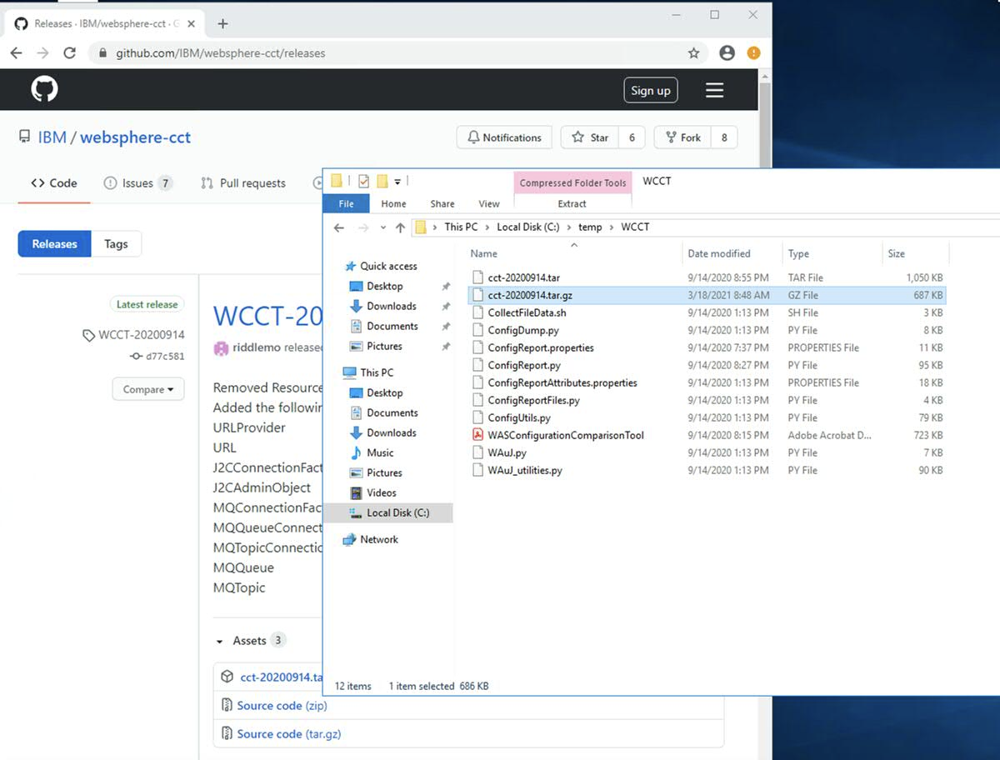
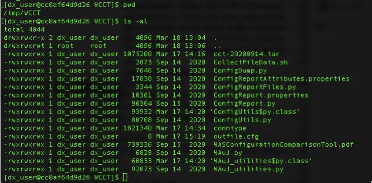
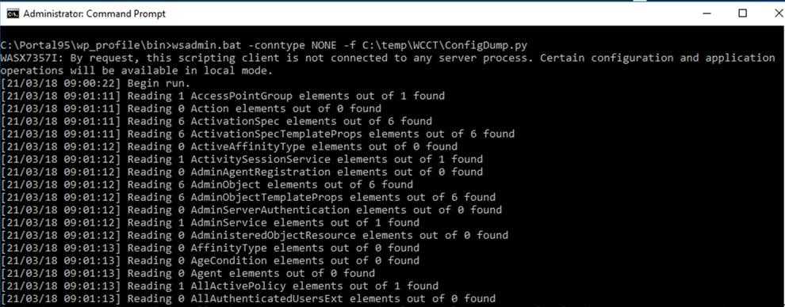
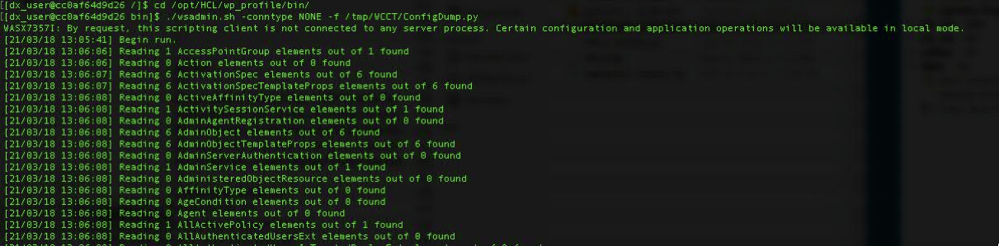
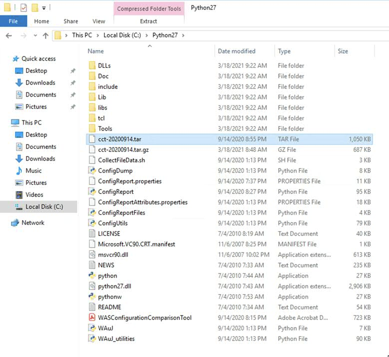
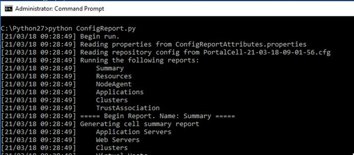
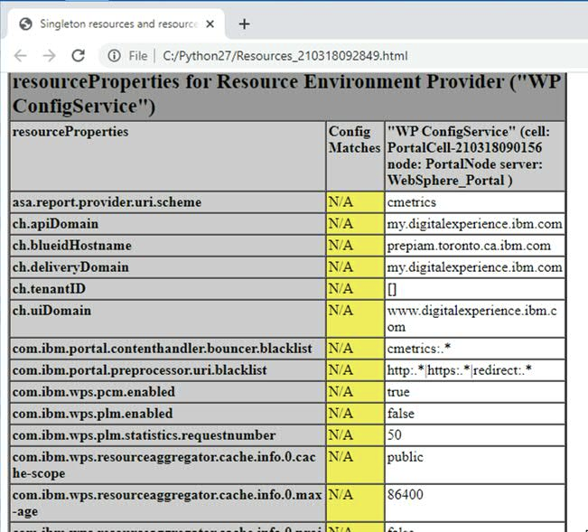
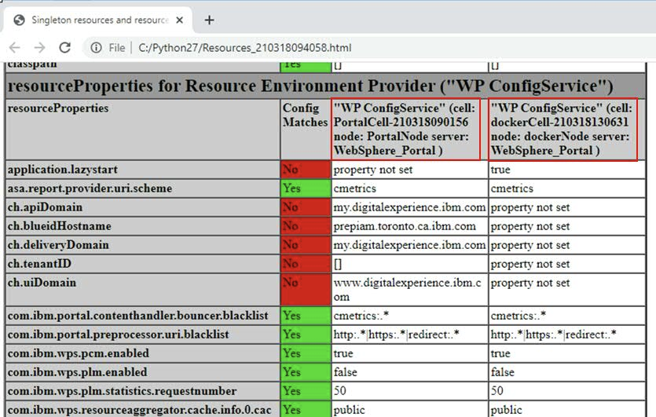

# How to generate a system report for comparison of different DX environments

## Applies to

> HCL Digital Experience 8.5 and higher

## Introduction

This article describes how to run an IBM utility that will non invasively create a .cfg dump. It can be used to generate reports of the IBM WebSphere Application server settings. This .cfg file can be consumed to render a report, that also can be sent to the support team to aid in their analysis. The IBM tool that will be referenced here is the [WebSphere Application Server Configuration Comparison Tool (WCCT).](https://www.ibm.com/support/pages/node/711615){target="_blank"}

## Instructions

The following instructions can be used to generate such a configuration report.

### Generating a .cfg file for WCCT reporting (server side instructions)

Follow the below steps to generate the .cfg file, that should be used as input in generating the IBM WebSphere Application Server report. On a clustered environment, this only needs to be done on the Deployment Manager (Dmgr).

1. Download latest release of the [WebSphere Application Server Configuration Comparison Tool](https://github.com/IBM/websphere-cct/releases) (cct-YYYYMMDD.tar.gz) to your system.

2. Unzip the package to your temp directory:

    **On Windows:**  
      

    **On Unix:**  
      

3. Navigate to your `<wp_profile_root>/bin` directory in a command prompt (Windows) or terminal window (Unix) and execute the following command:

    ```cmd
    wsadmin.(sh/bat) -conntype NONE -f <cct folder>/ConfigDump.py
    ```

    **On Windows:**  

      

    **On Unix:**  

      

4. This will create the .cfg file in the bin directory (i.e. PortalCell-21-03-18-09-01-56.cfg). Send this file to support or use this in the next section to create a report.

    ???+ info "Related information"
        Please review the following [YouTube video](https://www.youtube.com/watch?v=jeH9Lgh-Iak) that provides detailed instructions in how to generating a .cfg file for the WCCT reporting.

    !!!note
        Repeat the above steps on additional servers if you wish to compare these settings  

### Generating a WCCT report from a .cfg file (client side instructions)

1. Download the [Microsoft Windows Installer (MSI)](https://www.python.org/ftp/python/2.7/python-2.7.amd64.msi) for installing Python 2.7.  

2. Install Python 2.7 on the machine that will create the report (The IBM WCCT tool is specific on the version of Python).  

    !!!note
        Python **should not** be installed on any machines were HCL products are installed (i.e Digital Experience). Use a different machine to generate the report!  

3. Extract the WCCT zip file to the same directory on which Python is installed. If Python is installed in directory `C:\Python27` then also copy the WCCT zip that is acquired from section [Generating a .cfg file for WCCT reporting](#generating-a-cfg-file-for-wcct-reporting-server-side-instructions) into the same directory and extract it there:  

      

4. Copy the.cfg files from the DX server to the same directory where Python is installed.

5. Open a command prompt and navigate to the Python install directory and execute this command:

    ```cmd
    python ConfigReport.py
    ```  

      

    This will complete and generate a number of HTML files, that can be used to review the IBM WebSphere Application server settings. If multiple .cfg files will be added in the Python/WCCT directory, the report will generate comparison HTML files between the servers. That report then can be used to find fundamental differences between two or more servers. (i.e to compare a test- and development-environment). If an application is working on one environment, but not on another, it can be used for a first troubleshooting steps to find out the server differences.  

    **Single server report:**

      

    Comparison between two servers (boxed the two different servers in red):  

      

    ???+ info "Related information"  
        Review a [YouTube video](https://www.youtube.com/watch?v=IZMdP_cuK3c) that provides detailed steps for generating a WCCT report from a .cfg file.  
