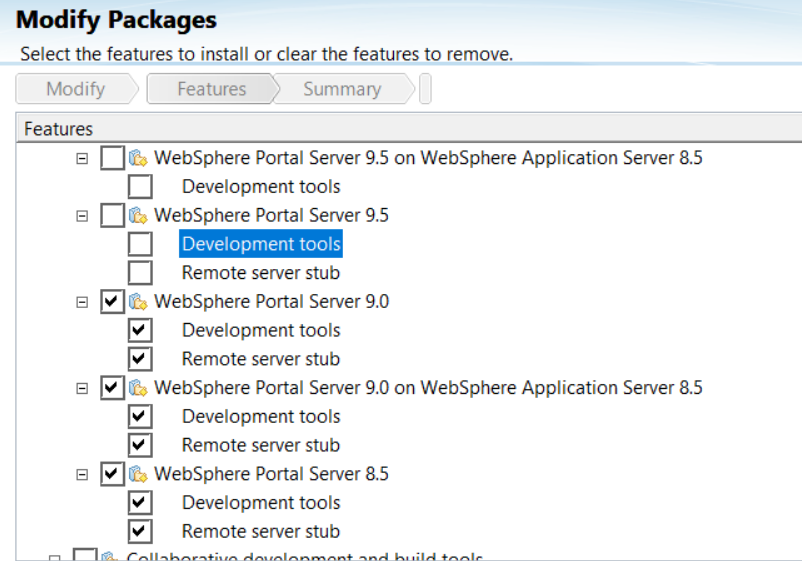
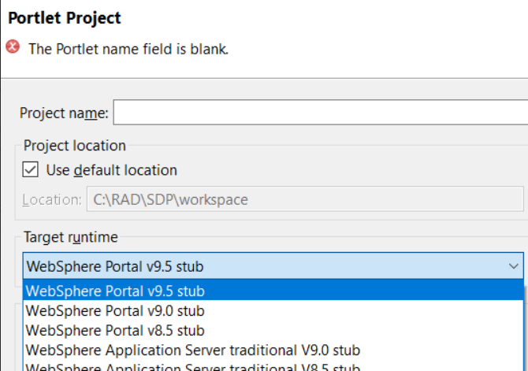

# How to configure IBM Rational Application Developer to use HCL Digital Experience Server?

## Applies to

> HCL Digital Experience 8.5 and higher

## Introduction

When using IBM Rational Developer(RAD) for developing Portlets and you want to configure RAD to use HCL Digital Experience (Portal Server), there are some steps required during installation to get both products connected correctly.

## Instructions

If Rational Application Developer is already installed and it is missed to select the Portal Development Tools during the installation then please follow the below steps to enable the different Portal development kits.

1. Launch Installation Manager.

2. Click on modify.

3. Select the WebSphere Portal development kit that match your installed Portal Server version.
     (If you want to use more than one version, then you can also select all of them)

  
4. click on next then finish to install it.  
5. start the IBM Rational Application Developer again. When creating a new Portlet Project you now should be able to see the different Portal Server stubs.

After selecting the right WebSphere Portal Server stub, it should be possible to connect to the preferred HCL Digital Experience Server.

When installing IBM Rational Application Developer new from scratch, the same options exist.
