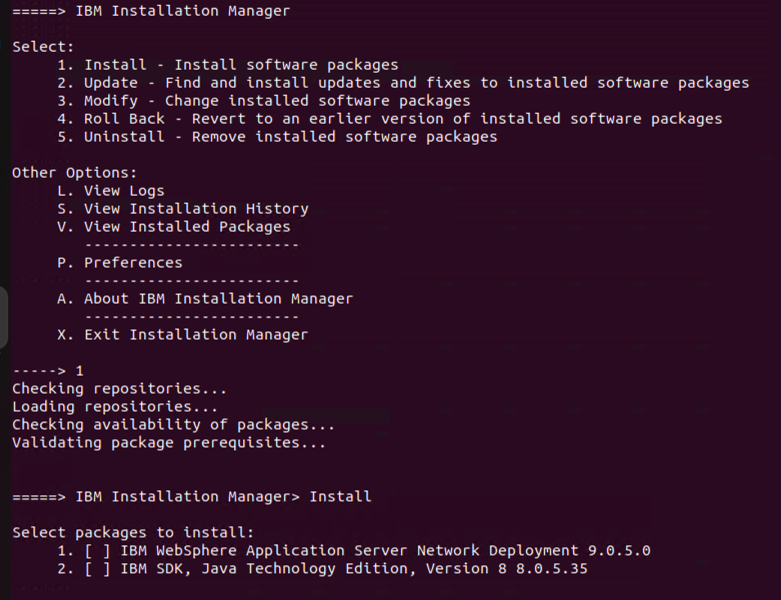
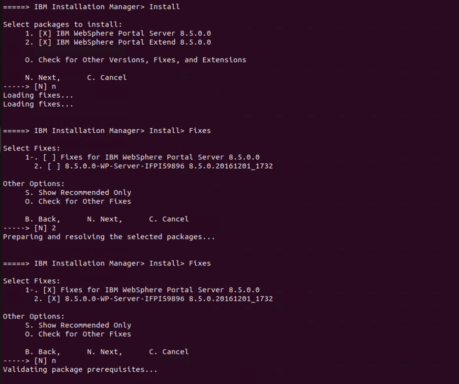
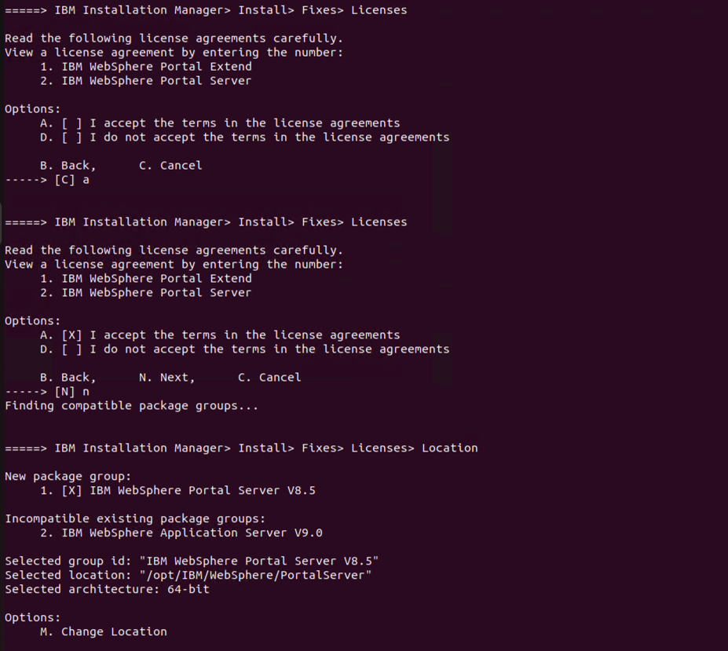
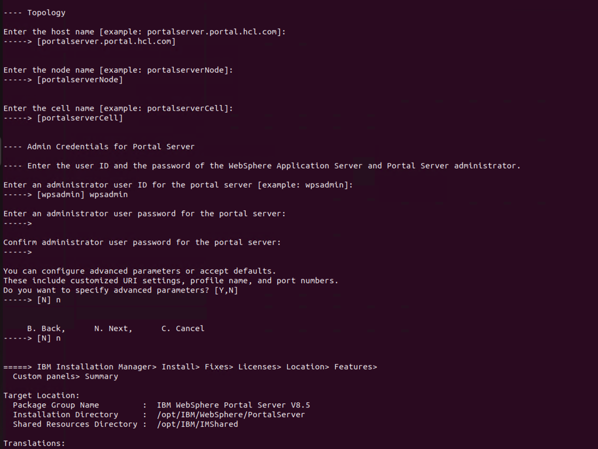
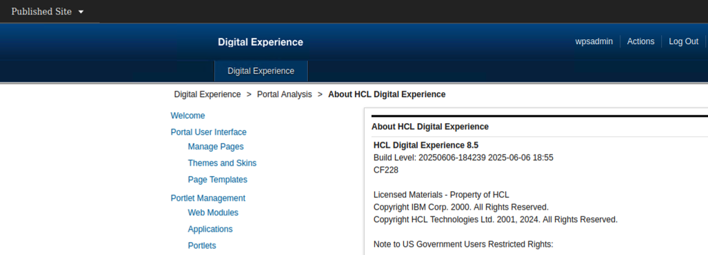
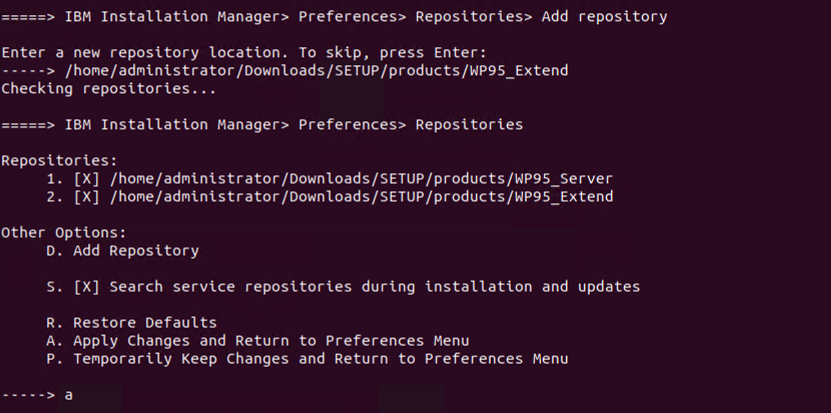
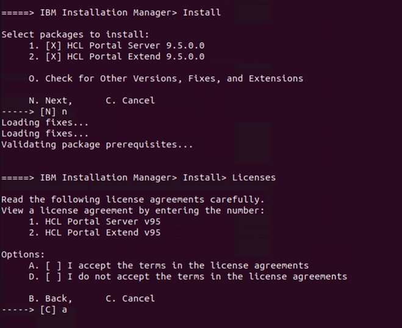
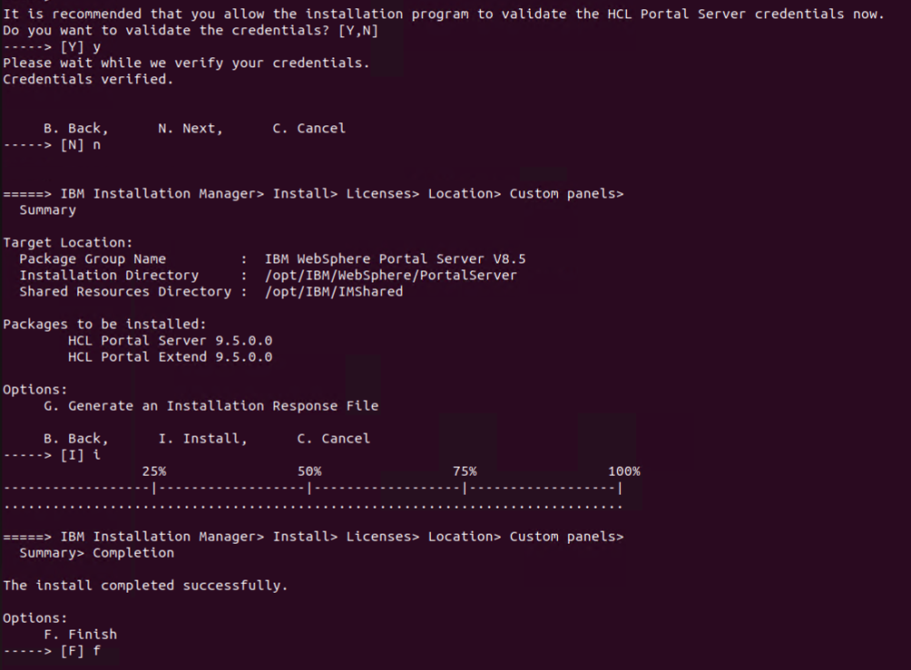
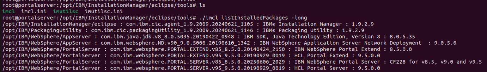

# AHow to install HCL DX 9.5 standalone on Linux

## Applies to

> HCL Digital Experience 9.5  

## Introduction

This iarticle provides step-by-step instructions for setting up and installing a standalone HCL® Digital Experience 9.5 environment on Linux using IBM® Installation Manager in console mode.

### Overview

[I. Preparing the Environment](#i-preparing-the-environment)  
[II. Getting the Software](#ii-getting-the-software)  
[III. Installing IBM® WebSphere Application Server ND v9.0.5 and JDK v8.0.3 or later using the IBM® Installation Manager in console mode](#iii-installing-ibm-websphere-application-server-nd-version-905-and-jdk-v803-or-later-using-the-ibm-installation-manager-in-console-mode)  
[IV. Installing HCL® Digital Experience (WebSphere Portal) v8.5 Binaries and the interim fix PI59896](#iv-installing-hcl-portal-websphere-portal-85-binaries-and-interim-fix-pi59896)  
[V. Upgrading HCL® Digital Experience (WebSphere Portal) v8.5 to the latest Cumulative Fix (CF)](#v-upgrading-hcl-portal-websphere-portal-v85-to-the-latest-cumulative-fix-cf)  
[VI. Install HCL Digital Experience v9.5](#vi-install-hcl-digital-experience-version-95)  

!!!note  
    A working installation of IBM® WebSphere® Application Server is required. Make sure it is not being used by another instance of HCL® Digital Experience. Before installing the HCL® Digital Experience package, install IBM® WebSphere SDK Java Technology Edition in the same directory as IBM® WebSphere Application Server. The SDK Java version must be 8.0.3 or later.  

**For a fresh full installation, follow this recommended installation path:**  

1. IBM® Installation Manager  
2. IBM® WebSphere Application Server and IBM® WebSphere SDK Java  
3. HCL® Portal 8.5  
4. Latest available HCL® Digital Experience Cumulative Fix (CF)  
5. HCL® Digital Experience 9.5  
6. Corresponding edition files according to your HCL® DX entitlements (HCL® Portal Enable, HCL® Portal Extend, HCL® Portal Server, and HCL® Portal Express)  

**Reference documentation:**  
[Installing HCL® Digital Experience in Linux using the console](../../../deployment/install/traditional/installing_dx/linux/running_install/inst_console-linux.md){target="_blank"}  

**Available installation options:**  

- Graphical user interface (Installation Manager GUI)  
- Console mode  (Installation via command line prompt)  
- Response file (For silent and automated installations)  

**Reference:**  
[Running the HCL Digital Experience installer in Linux](../../../deployment/install/traditional/installing_dx/linux/running_install/index.md){target="_blank"}

## Instructions

### I. Preparing the Environment

[System requirements | HCL® Digital Experience](../../../get_started/system_requirements/index.md){target="_blank"}  

Before you install HCL® Digital Experience, you must review the hardware and software requirements to ensure you have the supported versions of prerequisite and corequisite software, as well as the necessary hardware.  

#### Preparing your operating system for Installation  

[AIX: Preparing your operating system](../../../deployment/install/traditional/installing_dx/aix/prep_os-AIX.md){target="_blank"}  

[Linux: Preparing your operating system](../../../deployment/install/traditional//installing_dx/linux/prep_os-linux.md){target="_blank"}  

[Preparing your Windows OS](../../../deployment/install/traditional/installing_dx/windows/prep_os-windows.md){target="_blank"}  

### II. Getting the Software  

Product software can be obtained from the [My HCLSoftware](https://my.hcltechsw.com/){target="_blank"}  

Additional guidance is available here: [Locating and Downloading DX Products](../../tutorials/access-software/locating-downloads.md){target="_blank"}  

!!!note
   There are several Portal 9.5 offerings. Your license determines which offerings appear as available to download. Example package names for the different Portal 9.5 offerings:  

- HCL® Portal Express v9.5 Multiplatform  
- HCL® Portal Server v9.5 Multiplatform  
- HCL® Portal Enable v9.5 Multiplatform  
- HCL® Portal Extend v9.5 Multiplatform  

!!!note
    The files above include Installation Manager, WebSphere Application Server, HCL® Digital Experience, and the JDK. You must also download the latest Cumulative Fix (CF) from My HCLSoftware to complete the software required to install Portal 9.5. Please check [Fixes integrated in ® Digital Experience 8.5.0.0, 9.0 and 9.5 Combined Cumulative Fixes](https://support.hcl-software.com/csm?id=kb_article&sysparm_article=KB0013939){target="_blank"}.  

In My HCLSoftware, download the complete package for your chosen offering.  

Available Offerings:  

***HCL® Portal Extend v9.5 Multiplatform:**  

HCL-Portal-95_Extend_SETUP-01-SL.zip (Setup IIM; WP85_Extend; WP85_Server; WP95 Extend/Server)  
HCL-Portal-95_Extend_SETUP-02-SL.zip (IFPI59896 - 8.5.0.0-WP-Server-IFPI59896.zip)  
HCL-Portal-95_Extend_SETUP-03.zip (WASND905)  
HCL-Portal-95_Extend_SETUP-04.zip (JDK805)  

***HCL® Portal Enable v9.5 Multiplatform:**  

HCL-Portal-95_Enable_SETUP-01-SL (Setup IIM; WP85 Enable/Server; WP95 Enable/Server)  
HCL-Portal-95_Enable_SETUP-02-SL (IFPI59896 - 8.5.0.0-WP-Server-IFPI59896.zip)  
HCL-Portal-95_Enable_SETUP-03 (WASND905)  
HCL-Portal-95_Enable_SETUP-04  (JDK805)  

***HCL® Portal v9.5 Server Multiplatform:**  

HCL-Portal-95_Server_SETUP-01.zip (Setup IIM; WP85 Server; WP95 Server)  
HCL-Portal-95_Server_SETUP-02.zip (IFPI59896 - 8.5.0.0-WP-Server-IFPI59896.zip)  
HCL-Portal-95_Server_SETUP-03.zip (WASND905)  
HCL-Portal-95_Server_SETUP-04.zip (JDK805)  

In this guide, the offering **HCL® Portal Extend v9.5 Multiplatform** will be used.

**Preparing the files for Install**  

After downloading the files, create a parent folder for extraction. Name the folder SETUP, and extract the ZIP files into it. For example:


### III. Installing IBM® WebSphere Application Server ND Version 9.0.5 and JDK v8.0.3 or later using the IBM® Installation Manager in console mode

### Section 1 - Installing IBM® Installation Manager

The IBM® Installation Manager (IIM) is a tool for installing and maintaining software packages. Wizards guide you through the steps to install, modify, update, roll back, or uninstall your IBM® or HCL® products. This guide uses the Installation Manager console mode to install the software.  

1. Open a terminal window and run:  
   `ping <hostname>`  
   (where <hostname\> is your fully qualified hostname.)

2. In the same terminal window, run:  
   `ping localhost`  
   This verifies that the localhost settings are properly configured on your server. 

3. Linux/UNIX environments only:  
   Ensure ulimit is set to 10240 or higher by running the command:  
   `ulimit -n 10240`  
   in the command line.  

4. Navigate to the SETUP/IIM/<yourEnvironment> folder. Replace <yourEnvironment> with the folder that matches your operating system. For this guide, use: `SETUP/IIM/linux_x86_64`  

5. Install IBM® Installation Manager silently

    From the HCL® Digital Experience v9.5 SETUP directory (`SETUP/IIM/<yourEnvironment>`) run command:

    `./installc -acceptLicense`  

    For example:  
    `cd /home/administrator/Downloads/SETUP/IIM/linux_x86_64`  
    `./installc -acceptLicense`  

    You have successfully installed IBM® Installation Manager 1.8.5.  
    In this guide the IBM® Installation Manager to v1.9.2.9 will be upgraded to use JRE v8.0.8 instead JRE v7.0.9.  

    Reference:  
    [Installing packages silently by using the installer](https://www.ibm.com/docs/en/installation-manager/latest?topic=mode-installing-packages-silently-by-using-installer ){target="_blank"}  

### Section 2 - Installing IBM® WebSphere® Application Server and IBM® WebSphere SDK Java Technology Edition

1. Starting IBM® Installation Manager in console mode

    a. Open a command line prompt.  

    b. Navigate to the tools directory of the Installation Manager binaries. (For example: `/opt/IBM/InstallationManager/eclipse/tools/`)  

    c. Run the command that is appropriate for the operating system:  

       Windows: `imcl.exe -c`  
       Linux®, UNIX, IBM® i, IBM z/OS®, and the OS X operating system: `./imcl -c`  

2. Add the repositories: `WASND905` and `JDK805`.  
    a. Select the option: `P` for Preferences.  
    b. Select the option: `1` to configure Repositories.  

    Sample screenshot:  
      

3. Select the option: `D` to add new repositories into the IBM® Installation Manager.  

4. Enter a new repository location.

    For example:  
    `/home/administrator/Downloads/SETUP/products/WASND905`  
    `/home/administrator/Downloads/SETUP/products/JDK805`  

    Then select the option: `A` to apply the changes and `R` to return to the Preferences Menu.

    

5. Select the option: `1` to install software packages

    

6. Select the following packages:  
    - IBM® WebSphere Application Server  
    - IBM® SDK, Java  

      

7. Enter `N` for next and `A` to accept the terms.

    

8. Select the translations you wish to use  

      

9.Review the packages to be installed. Select **Next**, then select **Install**, and finally select **Finish**.

      

    The IBM® WebSphere Application Server and IBM® SDK, Java Installation completed successfully.  

### IV. Installing HCL® Portal (WebSphere Portal) 8.5 Binaries and interim fix PI59896

1. In **Preferences > Repositories**, select option `R` (Restore Defaults) to remove the previous repositories.

2. Add the repositories:  

     - Portal 8.5  
     - 8.5.0.0-WP-Server-IFPI59896.zip  
     - IFPI59896  

    For example:

    /home/administrator/Downloads/SETUP/products/WP85_Server  
    /home/administrator/Downloads/SETUP/products/WP85_Extend  
    /home/administrator/Downloads/SETUP/products/IFPI59896/8.5.0.0-WP-Server-IFPI59896.zip  

    Then select the option: `A`. (Apply Change and Return to Preferences Menu).

    

3. Return to Preferences Menu and select the option:  `1`. (Install software packages).

    Then select the packages: `Portal 8.5` and `IFPI59896`.

    

4. Accept the terms. Then select next.

    

5. Enter the user ID and password for the ConfigWizard admin user. This user is required to access the configuration wizard for additional tasks after installation, such as performing a database transfer or creating a cluster.

    

6. Enter the user id and password for the Portal Admin user. This is your Admin user for logging into the Portal Administration page.

    

7. Select the option `I`. (Install)

    !!!note
        The installation will take 30-60 minutes; don't be concerned if the Installation Manager seems to be stuck on one task for several minutes.

    

    When the installation is finished, select the option `F`. (Finish)  
    Verify that you can access your Portal and Configuration Wizard in an internet browser by navigating to:  
    `http://myportal.hcl.com:10039/wps/portal`  
    `http://myportal.hcl.com:10200/ibm/wizard`

      

    At the end of this section, you have successfully installed HCL® Portal v8.5 with IBM® WebSphere Application Server v9.0.5

### V. Upgrading HCL® Portal (WebSphere Portal) v8.5 to the latest Cumulative Fix (CF)

HCL® Portal 8.5 now needs to be upgraded to Cumulative Fix 17 or a later CF to support the installation of HCL® Digital Experience v9.5. You will need to stop the Portal Server and Configuration Wizard to proceed with the upgrade.  

1. Open a terminal window and navigate to folder `wp_profile/bin`.  

2. Execute the following command:  
    `./stopServer.sh WebSphere_Portal -user <PortalAdminID> -password <PortalAdminPswd>`  

3. Navigate to the AppServerRoot folder. Continue in the directory structure to the `/profiles/cw_profile/bin` subdirectory. This guide uses the following directory for the full path:  
    `/opt/IBM/WebSphere/AppServer/cw_profile/bin`  

4. Execute the following command:  
    `./stopServer.sh server1 -user <ConfigWizardID> -password <ConfigWizardPswd>`

5. As soon as all JVMs (servers) are stopped start the Installation Manager in Console mode and add the Cumulative Fix (CF) repository.

    For example:  
    `/home/administrator/Downloads/HCL-DX-CF228_Server_Update/WP8500CF228_Server/8500CF228/repository`

    

6. Return to Preferences Menu and select the option `2`. (Update)

    

7. Select the IBM® WebSphere Portal Server V8.5

    

8. Select the CF version

    

9. Accept the terms and select next.

    

10. Select the option `U`. (Update)

    

11. Select **Finish**

    At this point ONLY the Portal binaries have been updated to the latest CF. The Console only manages the binaries. It is also need to run a Portal script to upgrade the profile.

12. Next update the profile

    Open a terminal window and navigate to `wp_profile/PortalServer/bin`.

    Execute the following command:

    `./applyCF.sh -DWasPassword=<PortalAdminPswd> -DPortalAdminPwd=<PortalAdminPswd>`

    

13. At the end of this section, you have successfully installed Cumulative Fix for HCL® Portal v8.5 on IBM® WebSphere Application Server v9.0.5.

    

14. Validate if the server has been updated to the latest CF and all is well. Access your Portal in an internet browser by navigating to:

    `http://myportal.hcl.com:10039/wps/portal`

    Log in and check the 'About HCL® Digital Experience' and see if it reports the latest CF level.

    

### VI. Install HCL® Digital Experience Version 9.5

!!!note
    Make sure the server is stopped before doing the following steps.

1. Add the appropriate HCL® Digital Experience v9.5 repositories to Console.

    In this guide, the **Extend offering** is used, for which the **Server and Extend** repositories will be added.

    For example:  
    `/home/administrator/Downloads/SETUP/products/WP95_Server`  
    `/home/administrator/Downloads/SETUP/products/WP95_Extend`  

    For the other offerings, this is what you need for each.

     - Enable Offering: requires Server and Enable repositories  
     - Express Offering: requires Express repositories  
     - Extend Offering: requires Extend and Server repositories  
     - Server Offering: requires Server repositories  

     

2. Return to Preferences Menu and select the option `1`. (Install - Install software packages)

    

3. Select the packages Portal 9.5

    

4. Accept the terms and select next.  

    

5. Enter your PortalAdminID and PortalAdminPswd for the Websphere Application Server credentials. Select the Validate Credentials.

    Wait a few minutes for validation to complete. Select Next.  

    

6. Enter your PortalAdminID and PortalAdminPswd for the Portal Server credentials. Then select the option: `I`. (Install)

    

7. When the installation is complete, verify that you can access your Portal in an internet browser by navigating to:  

    `http://myportal.hcl.com:10039/wps/portal`  

    Check the 'About HCL® Digital Experience' to make sure it displays version 9.5.  

      

**Additional verifications to ensure that the HCL® Digital Experience v9.5 standalone installation completed successfully:**

1. Viewing installed packages by using console mode

    Enter `V` (View Installed Packages).

    

2. Listing installed features by using imcl commands

    a. Open a command-line utility.  

    b. Navigate to the the tools directory of the Installation Manager.  

    c. Run the command to list installed features:  
        `./imcl listInstalledPackages -long`  
        For example:  
        ```command
        cd /opt/IBM/InstallationManager/eclipse/tools/
        ./imcl listInstalledPackages -long
        ```  
          

In case of problems during the installation, please collect the following data and contact HCL® Support:  
[Collecting Data: Installation of HCL® Portal 8.5 on Multiplatforms.](https://support.hcl-software.com/csm?id=kb_article&sysparm_article=KB0013608){target="_blank"}

**Related documentation:**  

[Can not apply HCL® DX Portal cumulative fixes with IIM (IBM® Installation Manager) version 1.10.0.](https://support.hcl-software.com/csm?id=kb_article&sysparm_article=KB0117388){target="_blank"}  

[ConfigEngine errors when updating WebSphere Application Server to Fixpack v9.0.5.19 & v8.5.5.25.](https://support.hcl-software.com/csm?id=kb_article&sysparm_article=KB0112396){target="_blank"}  

[How to determine if a Portal CF upgrade was successful?](https://support.hcl-software.com/csm?id=kb_article&sysparm_article=KB0077962){target="_blank"}  

[HCL® Digitial Experience - Perform CF Upgrade with Console in HCL® Portal.](https://youtu.be/hpmOpfkWNY8?si=W78UFLPYSMMC7wP8){target="_blank"}  

[Unable to Install HCL® Portal V8.5/9/9.5 on WAS 9.x.x.x.](https://support.hcl-software.com/csm?id=kb_article&sysparm_article=KB0075918){target="_blank"}  

[Can I add WCM functions to an existing install of the Portal Server 8.5 offering?](https://support.hcl-software.com/csm?id=kb_article&sysparm_article=KB0077941){target="_blank"}  
