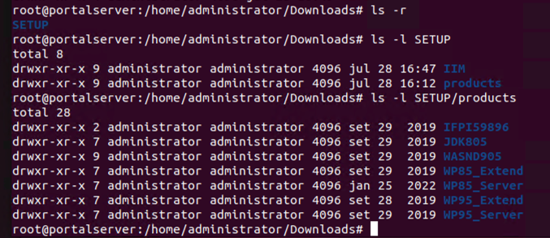

# How to install HCL DX 9.5 standalone on Linux

## Applies to

> HCL Digital Experience 9.5  

## Introduction

This article describes how to install a standalone HCL Digital Experience (DX) 9.5 environment on Linux using the IBM Installation Manager in console mode.

!!! note
    - You must have a working installation of IBM® WebSphere® Application Server that is not used by another HCL® DX instance.
    - Before installing HCL® DX, install the IBM® WebSphere SDK Java™ Technology Edition in the same directory as WebSphere Application Server.
    - The SDK Java version must be 8.0.3 or later.  

For a fresh full installation, follow this recommended installation path:

1. IBM® Installation Manager  
2. IBM® WebSphere Application Server and IBM® WebSphere SDK Java  
3. HCL® Portal 8.5  
4. Latest available HCL® DX CF  
5. HCL® DX 9.5  
6. Corresponding edition files according to your HCL® DX entitlements (HCL® Portal Enable, HCL® Portal Extend, HCL® Portal Server, and HCL® Portal Express)  

Available installation options:

- Graphical user interface (Installation Manager GUI)  
- Console mode  (Installation via command line prompt)  
- Response file (For silent and automated installations)  

For more information, refer to and [Installing HCL® Digital Experience in Linux using the console](../../../deployment/install/traditional/installing_dx/linux/running_install/inst_console-linux.md)[Running the HCL Digital Experience installer in Linux](../../../deployment/install/traditional/installing_dx/linux/running_install/index.md).

## Instructions

1. [Prepare the environment](#prepare-the-environment).
2. [Get the software](#get-the-software).
3. [Install IBM® WebSphere Application Server ND v9.0.5 and JDK v8.0.3 or later using the IBM® Installation Manager in console mode](#install-ibm-websphere-application-server-nd-v905-and-jdk-v803-or-later-using-the-ibm-installation-manager-in-console-mode).
4. [Install HCL® DX (WebSphere Portal) v8.5 binaries and the interim fix PI59896](#install-hcl-dx-websphere-portal-v85-binaries-and-the-interim-fix-pi59896).  
5. [Upgrade HCL® DX (WebSphere Portal) v8.5 to the latest Cumulative Fix (CF)](#upgrade-hcl-dx-websphere-portal-v85-to-the-latest-cumulative-fix-cf).
6. [Install HCL DX v9.5](#install-hcl-dx-v95).

### Prepare the environment

Before you install HCL® DX, review the [hardware and software requirements](../../../get_started/system_requirements/index.md) and prepare your operating system:

- [AIX: Prepare the operating system](../../../deployment/install/traditional/installing_dx/aix/prep_os-AIX.md)
- [Linux: Prepare the operating system](../../../deployment/install/traditional/installing_dx/linux/prep_os-linux.md)
- [Windows: Prepare the operating system](../../../deployment/install/traditional/installing_dx/windows/prep_os-windows.md)

### Get the software

You can download the product software from [My HCLSoftware](https://my.hcltechsw.com/){target="_blank"}. For more information, refer to [Locating and downloading DX products](../../../get_started/access-software/locating-downloads.md).

!!! note
    HCL DX 9.5 is available in multiple offerings. Your license determines which offerings are available for download.

Example package names for the HCL DX 9.5 offerings include:

- HCL® Portal Express v9.5 Multiplatform  
- HCL® Portal Server v9.5 Multiplatform  
- HCL® Portal Enable v9.5 Multiplatform  
- HCL® Portal Extend v9.5 Multiplatform  

!!! note
    These packages include Installation Manager, WebSphere Application Server, HCL® DX, and the Java SDK. You must also download the latest available CF from My HCLSoftware to complete the Portal 9.5 installation. For details, see [Fixes integrated in HCL® Digital Experience 8.5.0.0, 9.0, and 9.5 combined cumulative fixes](https://support.hcl-software.com/csm?id=kb_article&sysparm_article=KB0013939){target="_blank"}.

In My HCLSoftware, download the complete package for your selected offering.

#### Available offerings

**HCL® Portal Extend v9.5 Multiplatform**

- `HCL-Portal-95_Extend_SETUP-01-SL.zip` (Installation Manager; WP85 Extend; WP85 Server; WP95 Extend/Server)  
- `HCL-Portal-95_Extend_SETUP-02-SL.zip` (IFPI59896 – 8.5.0.0-WP-Server-IFPI59896.zip)  
- `HCL-Portal-95_Extend_SETUP-03.zip` (WASND905)  
- `HCL-Portal-95_Extend_SETUP-04.zip` (JDK805)  

**HCL® Portal Enable v9.5 Multiplatform**

- `HCL-Portal-95_Enable_SETUP-01-SL.zip` (Installation Manager; WP85 Enable/Server; WP95 Enable/Server)  
- `HCL-Portal-95_Enable_SETUP-02-SL.zip` (IFPI59896 – 8.5.0.0-WP-Server-IFPI59896.zip)  
- `HCL-Portal-95_Enable_SETUP-03.zip` (WASND905)  
- `HCL-Portal-95_Enable_SETUP-04.zip` (JDK805)  

**HCL® Portal Server v9.5 Multiplatform**

- `HCL-Portal-95_Server_SETUP-01.zip` (Installation Manager; WP85 Server; WP95 Server)  
- `HCL-Portal-95_Server_SETUP-02.zip` (IFPI59896 – 8.5.0.0-WP-Server-IFPI59896.zip)  
- `HCL-Portal-95_Server_SETUP-03.zip` (WASND905)  
- `HCL-Portal-95_Server_SETUP-04.zip` (JDK805)  

This guide uses **HCL® Portal Extend v9.5 Multiplatform** as the example offering.

#### Prepare the installation files

After you download the files, create a parent directory and extract all packages into it. In this guide, the directory is named `SETUP`.
The following example shows the extracted directory structure:



### Install IBM® WebSphere Application Server ND v9.0.5 and JDK v8.0.3 or later using the IBM® Installation Manager in console mode

#### Install IBM® Installation Manager

The IBM® Installation Manager (IIM) is a tool for installing and maintaining software packages. Wizards guide you through installing, modifying, updating, rolling back, or uninstalling IBM® or HCL® products. This guide uses Installation Manager **console mode**.

1. Open a terminal window and run:

    ```
    ping <hostname>
    ```

    `<hostname>` is your fully qualified hostname.

2. In the same terminal window, run:

    ```
    ping localhost
    ```

    This verifies that the localhost settings are properly configured on your server.

3. (Linux or UNIX environments only) Ensure `ulimit` is set to `10240` or higher by running the following command:  

    ```
    ulimit -n 10240
    ```  

4. Navigate to the `SETUP/IIM/<yourEnvironment>` folder and replace `<yourEnvironment>` with the folder that matches your operating system. For this guide, use: `SETUP/IIM/linux_x86_64`  

5. From the HCL® DX v9.5 SETUP directory (`SETUP/IIM/<yourEnvironment>`), run:

    ```
    ./installc -acceptLicense
    ```  

    For example:

    ```
    cd /home/administrator/Downloads/SETUP/IIM/linux_x86_64  
    ./installc -acceptLicense
    ```  

You have successfully installed IBM® Installation Manager 1.8.5.

In this guide the IBM® Installation Manager to v1.9.2.9 will be upgraded to use JRE v8.0.8 instead JRE v7.0.9. For more information, refer to [Installing packages silently by using the installer](https://www.ibm.com/docs/en/installation-manager/latest?topic=mode-installing-packages-silently-by-using-installer){target="_blank"}.

#### Install IBM® WebSphere® Application Server and IBM® WebSphere SDK Java Technology Edition

1. Start IBM® Installation Manager in console mode.

    1. Open a command line prompt.  

    2. Navigate to the tools directory of the Installation Manager binaries. (For example: `/opt/IBM/InstallationManager/eclipse/tools/`)  

    3. Run the command that is appropriate for the operating system:  

        - Windows: `imcl.exe -c`  
        - Linux®, UNIX, IBM® i, IBM z/OS®, and the OS X operating system: `./imcl -c`  

2. Add the repositories `WASND905` and `JDK805`.

    1. Select **P** to go to **Preferences**.  
    2. Select **1** to configure **Repositories**.

    <!-- update location and filename of image-->

3. Select **D** to add new repositories into the IBM® Installation Manager.  

4. Enter a new repository location. For example:  

    - `/home/administrator/Downloads/SETUP/products/WASND905`  
    - `/home/administrator/Downloads/SETUP/products/JDK805`  

5. Select **A. Apply Changes and Return to Preferences Menu**.

    <!--update image-->

6. Select **1. Install - Install software packages**.

    <!--update image-->

7. Select the following packages:

    - **IBM® WebSphere Application Server Network Deployment 9.0.5.0**  
    - **IBM® SDK, Java Technology Edition, Version 8 8.0.5.35**  

    <!--update image-->  

8. Select **N** to proceed, and then select **A** to accept the license agreement terms.

    <!--pdate image-->  

9. Select the translations you want to use.

    <!--update image-->

10. Review the packages to be installed. Then, select **N. Next > I. Install > F. Finish**.

    <!-- update image-->

You have successfully installed the IBM® WebSphere® Application Server and IBM® WebSphere SDK Java Technology Edition.  

### Install HCL® DX (WebSphere Portal) v8.5 binaries and the interim fix PI59896

1. In **Preferences > Repositories**, select **R. Restore Defaults** to remove the previous repositories.

2. Add the following repositories:  

     - **Portal 8.5**  
     - **8.5.0.0-WP-Server-IFPI59896.zip**
     - **IFPI59896**  

    For example:

    ```
    /home/administrator/Downloads/SETUP/products/WP85_Server  
    /home/administrator/Downloads/SETUP/products/WP85_Extend  
    /home/administrator/Downloads/SETUP/products/IFPI59896/8.5.0.0-WP-Server-IFPI59896.zip  
    ```

    <!--update image-->

3. Select **A. Apply Changes and Return to Preferences Menu**.

4. Select **1** to start the installation process.

5. Select the following packages:

    - **Portal 8.5**
    - **IFPI59896**

    <!--update image-->

6. Select **A** to accept the license terms, and then select **N** to continue.

    <!--update image-->

7. Enter the user ID and password for the ConfigWizard admin user. These are your credentials for accessing the configuration wizard for additional tasks after installation, such as performing a database transfer or creating a cluster.

    <!--update image-->

8. Enter the user ID and password for the Portal admin user. These are your credentials for logging into the Portal Administration page.

    <!--update image-->

9. Select **I. Install**.

    !!!note
        The installation will take 30-60 minutes.

    <!--update image-->

10. Once the installation is finished, select **F. Finish**.

11. Verify that you can access your Portal and Configuration Wizard in an internet browser by navigating to:

    ```
    http://myportal.hcl.com:10039/wps/portal
    http://myportal.hcl.com:10200/ibm/wizard
    ```

    <!--update image-->  

You have successfully installed HCL® Portal v8.5 with IBM® WebSphere Application Server v9.0.5.

### Upgrade HCL® DX (WebSphere Portal) v8.5 to the latest Cumulative Fix (CF)

HCL® Portal 8.5 needs to be upgraded to CF 17 or a later CF to support the installation of HCL® DX v9.5. You will need to stop the Portal server and Configuration Wizard to proceed with the upgrade.  

1. Open a terminal window and navigate to the `wp_profile/bin` folder. Then, run the following command:  

    ```
    ./stopServer.sh WebSphere_Portal -user <PortalAdminID> -password <PortalAdminPswd>
    ```  

2. Navigate to the `/opt/IBM/WebSphere/AppServer/cw_profile/bin` directory. Then, run the following command:  

    ```
    ./stopServer.sh server1 -user <ConfigWizardID> -password <ConfigWizardPswd>
    ```

3. Ensure all servers are stopped. Then, start the Installation Manager in console mode and add the CF repository.

    For example:

    ```
    /home/administrator/Downloads/HCL-DX-CF228_Server_Update/WP8500CF228_Server/8500CF228/repository
    ```

    <!--update image-->

4. Select **A. Apply Changes and Return to Preferences Menu**.

5. Select **2. Update - Find and install updates and fixes to installed software packages**.

    <!--update image-->

6. Select **IBM® WebSphere Portal Server V8.5**.

    <!--update image-->

7. Select the **CF** version.

    <!--update image-->

8. Select **A** to accept the license terms, and then select **N** to continue.

    <!--update image-->

9. Select **U. Update**.

    <!--update image-->

10. Once the update is finished, select **F. Finish**..

    !!!note
        At this point, only the Portal binaries have been updated to the latest CF. The console only manages the binaries. You also need to run a Portal script to upgrade the profile.

11. Open a terminal window and navigate to `wp_profile/PortalServer/bin`. Then, run the following command to update the profile:

    ```
    ./applyCF.sh -DWasPassword=<PortalAdminPswd> -DPortalAdminPwd=<PortalAdminPswd>
    ```

    <!--update image-->

12. Validate if the server has been updated to the latest CF.

    1. Navigate to `http://myportal.hcl.com:10039/wps/portal`.

    2. Log in and verify that the **About HCL® Digital Experience** page contains the latest CF level.

    <!--update image-->

You have successfully installed CF for HCL® Portal v8.5 on IBM® WebSphere Application Server v9.0.5.

<!---->

### Install HCL DX v9.5

!!!note
    Before you begin, ensure the server is stopped.

1. Add the appropriate HCL® DX v9.5 repositories to console.

    This guide uses the **Extend offering**, which requires adding the **Server** and **Extend** repositories.

    For example:

    - `/home/administrator/Downloads/SETUP/products/WP95_Server`  
    - `/home/administrator/Downloads/SETUP/products/WP95_Extend`  

    Other offerings require the following repositories:

    - Enable Offering: Server and Enable repositories  
    - Express Offering: Express repositories  
    - Extend Offering: Extend and Server repositories  
    - Server Offering: Server repositories  

    <!--update image-->

2. Return to **Preferences**, and then select **1. Install - Install software packages**.

    <!--update image-->

3. Select the **Portal 9.5** packages.

    <!--update image-->

4. Select **A** to accept the license terms, and then select **N** to continue.

    <!--update image-->

5. Enter your admin credentials for the Websphere Application Server, and then select **Y**.

    Wait a few minutes for validation to complete. Select Next.  

    <!--update image-->

6. Enter your admin credentials for the Portal Server, and then select **Y**.

7. Select **I. Install**.

    <!--update image-->

8. Once the installation is finished, select **F. Finish**.

9. Verify that the installation is successful:

    1. Go to `http://myportal.hcl.com:10039/wps/portal` and confirm that the version on the **About HCL® Digital Experience** page is **9.5**.

        <!--update image-->  

    2. In console mode, select **V. View Installed Packages** to view the installed packages.

        <!--pdate image-->

    3. List the installed features using `imcl` commands:

        1. Open a command-line utility.  

        2. Navigate to the the tools directory of the Installation Manager.  

        3. Run the command to list installed features:

            ```
            ./imcl listInstalledPackages -long
            ```  

            For example:

            ```
            cd /opt/IBM/InstallationManager/eclipse/tools/
            ./imcl listInstalledPackages -long
            ```

            <!--pdate image-->  

### Troubleshooting

If you encounter issues during the installation process, collect the following data and contact HCL® support:  
[Collecting Data: Installation of HCL® Portal 8.5 on Multiplatforms](https://support.hcl-software.com/csm?id=kb_article&sysparm_article=KB0013608){target="_blank"}.

???+ info "Related information"

    - [Can I add WCM functions to an existing install of the Portal Server 8.5 offering?](https://support.hcl-software.com/csm?id=kb_article&sysparm_article=KB0077941){target="_blank"}
    - [Can not apply HCL® DX Portal cumulative fixes with IIM (IBM® Installation Manager) version 1.10.0.](https://support.hcl-software.com/csm?id=kb_article&sysparm_article=KB0117388){target="_blank"}  
    - [ConfigEngine errors when updating WebSphere Application Server to Fixpack v9.0.5.19 & v8.5.5.25.](https://support.hcl-software.com/csm?id=kb_article&sysparm_article=KB0112396){target="_blank"}  
    - [HCL® Digital Experience - Perform CF Upgrade with Console in HCL® Portal.](https://youtu.be/hpmOpfkWNY8?si=W78UFLPYSMMC7wP8){target="_blank"}  
    - [How to determine if a Portal CF upgrade was successful?](https://support.hcl-software.com/csm?id=kb_article&sysparm_article=KB0077962){target="_blank"}  
    - [Unable to Install HCL® Portal V8.5/9/9.5 on WAS 9.x.x.x.](https://support.hcl-software.com/csm?id=kb_article&sysparm_article=KB0075918){target="_blank"}
