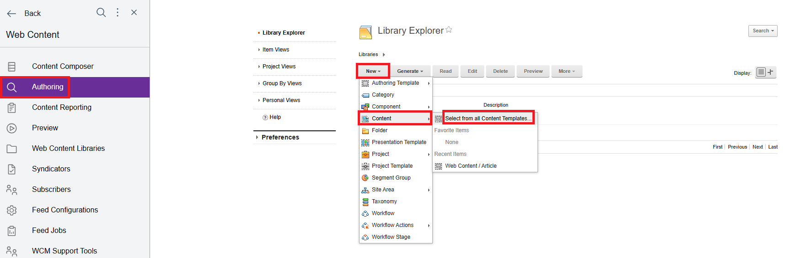
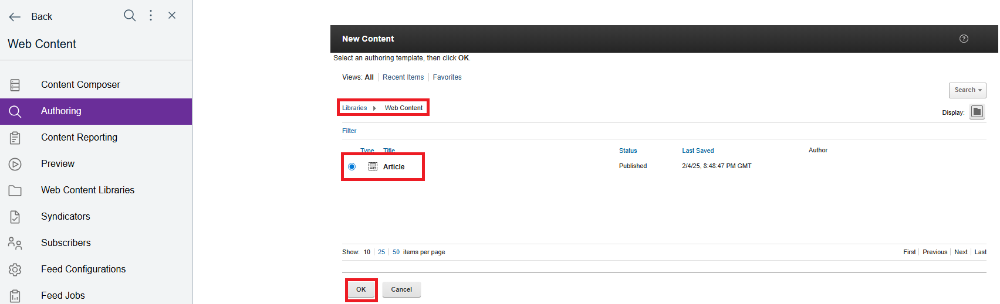
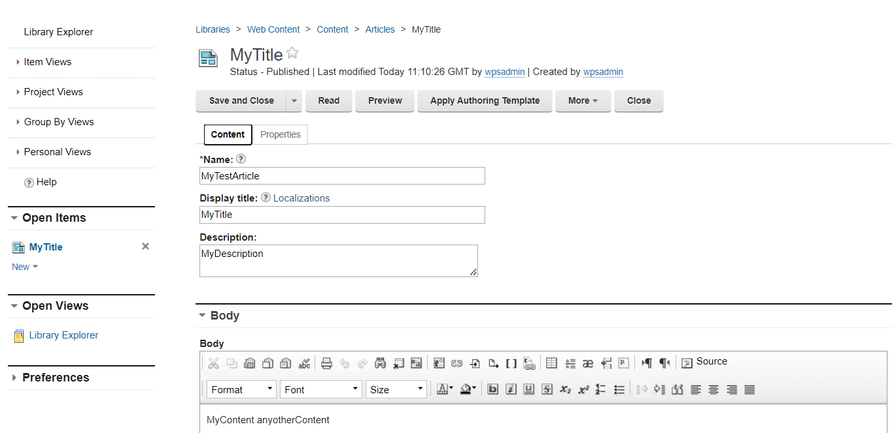
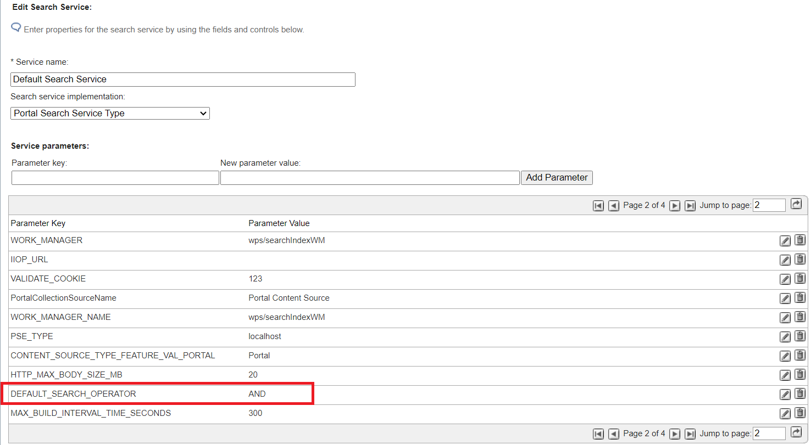
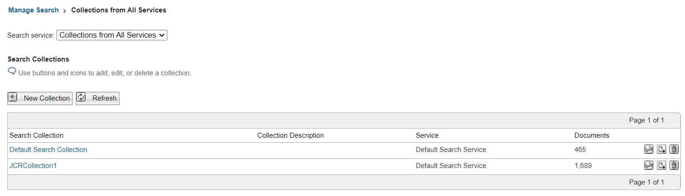
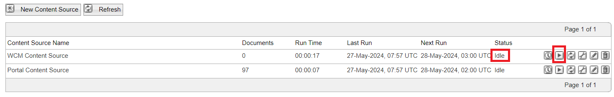
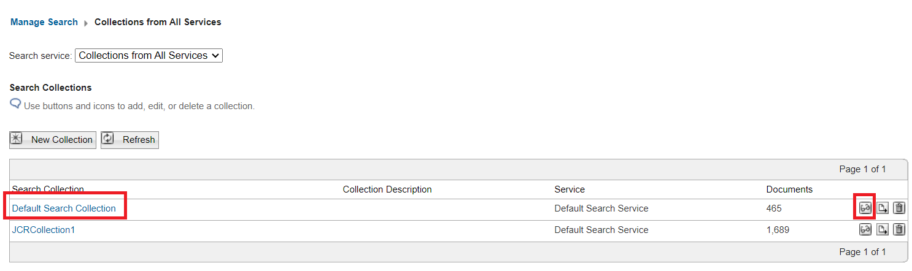

# How to use DX Search and the DX Search Center

## Applies to

> HCL Digital Experience v9.5 and higher

## Introduction

HCL Digital Experience (DX) includes different kinds of search features that can be used to find documents such as the Search Center. In this article, you will learn how to use DX Search and the DX Search Center to find documents used in HCL DX. You will also learn how to configure Web Content Management (WCM) documents to be more easily searched using the service by defining metadata.

## Instructions

This article is structured as a workflow sample that include different parts:

1. A sample user is created in HCL DX.
2. A WCM document is created with the author set as the sample user.
3. Additional metadata is such as keywords, name, and title added to that document.
4. The Search Center is used to find the created WCM document using different search-filters such as title or author.

### Step 1: Create a sample user in HCL DX

1. Log in to HCL DX as the Portal administrator (wpsadmin).

2. Navigate to **Security > Users and Groups**.  

3. Click **New User**.

4. Create a new user with the last name **Test User 1** then click **OK**.

### Step 2: Create a sample document that contains metadata

1. Go to **Applications Menu > Web Content > Authoring**.

2. Click **New > Content > Select from all Content Templates...**.  

      

3. On the **New Content** window, navigate to **Web Content**

4. Select the **Article** content template then click **OK**.

      

5. Enter the following details:  

    - **Name:** `MyTestArticle`  
    - **Display title:** `MyTitle`  
    - **Description:** `MyDescription`  

      

6. Under the **Properties** tab, click **Show Hidden Fields**.  

7. Click **Add Authors** and select **Test User 1**.

8. In the **Profile** dropdown, you can add specific **Keywords** that can be used as a filter to find the page. For this example, add `mykeyword`.

      

9. Click **Save and Close**.  

### Step 3: Check the configuration settings of the Classic Search feature

1. Go to **Applications Menu > Search**.

2. On the **Manage Search** page, there are three sections: Search Services, Search Collections and Search Scopes.

    - **Search Services:**  
        A search service is needed to create Collections. It can be a remote search service or a local one. The local one is already pre-configured, when the product is installed.

    - **Search Collections:**  
        The search service crawls and indexes documents and stores them in a collection. A search collection contains a number of content sources that the portal search service indexes. When creating a new collection, the content sources you specify will decide where the fetching starts and stops.

    - **Search Scopes:**  
        A search scope allows you to partition or organize your search collections. As a result, your site visitors can limit their search to specific areas. Defined scopes are visible to visitors from the search dialog. For more information, refer to:

        - [Configure Search Collections and Scopes](../../../build_sites/search/search_center/searchcenter/oob_search_scope.md)
        - [Creating a Search Scope](../../../build_sites/search/manage_search/searchscopes_customlinks/crt_nw_srch_scp.md)

    Click on **Search Service** and check the status of the service. You should see a green check mark icon. If you see a red X icon, it indicates that your search service is not working. You will need to review the configuration settings of your search service. For more information, refer to [Search service configuration parameters](../../../build_sites/search/cfg_dx_search/search_service_params/index.md)
  
    

### Step 4: (Optional) Optimize the Search Service to use AND operator for searches

When a user enters more than one search term, the HCL DX search engine applies a logical `OR` operator by default. For a document to qualify for the search result list, only one of those terms needs to be included. However, including two or more words leads to better search results.

1. In the **Select Search Service** section, click the **Pencil icon** to modify the search service.  

    

2. Ensure that the value of the `DEFAULT_SEARCH_OPERATOR` parameter is set to `AND`.

      

    If the parameter is not set:

    1. Enter the following details:
        - **Parameter key**: `DEFAULT_SEARCH_OPERATOR`
        - **New parameter value**: `AND`
    2. Click **Add Parameter**.
    3. Click **OK** to save your changes.  

    For more information, refer to [Changing the default query operator from 'OR' to 'AND'](../../../build_sites/search/improving_search_quality/Optionsavailabletoimprovesearchquality/ChangedefaultqueryoperatorfromORtoAND.md).

### Step 5: (Optional) Optimize your search by applying the boost factors to specific metadata fields

In the Search Service Configuration page, you can also tune some settings to further optimize searches. In this sample, the `boostingSettings` parameter is configured:

1. Enter the following details:
    - **Parameter key**: `boostingSettings`
    - **New parameter value**: `{"phraseBoost": {"Enabled":"true"}, "fieldBoost": [{"field":"title", "boost": 3.0} , {"field":"description", "boost":3.0}, {"field":"keywords", "boost":2.0}]}`
2. Click **Add Parameter**.
3. Click **OK** to save your changes.

This parameter increases the search weight of the `title` and `description` fields over `keywords`.

For more information, refer to [Applying boost factors to specific fields (metadata)](../../../build_sites/search/improving_search_quality/Optionsavailabletoimprovesearchquality/Applyingboostfactorstospecificfieldsmetadata.md).

### Step 6: (Optional) Configuring search by metadata for the Search Center portlet

By default, the meta elements `title`, `keywords`, and `description` of documents are provided as search filters. The actual set of available meta elements depends on the types of content sources that are indexed. It is possible to add your own custom metadata search filters.

For more information, refer to [Configuring search by metadata for the Search Center portlet](../../../build_sites/search/cfg_dx_search/cfg_searchcenter/srtcfg_sc_metadata.md).

### Step 7: Search for documents using the Search Center portlet

1. Log in to HCL DX as the Portal administrator (wpsadmin).

2. Go to **Applications Menu > Search**.

3. Click **Search Collections** and check if there are documents listed. In the following sample, the **Default Search Collection** has 465 documents and the **JCRCollection1** has 1689 documents indexed.

      

4. Click **Default Search Collection**. You will find two content sources: **WCM Content Source** and **Portal Content Source**.

5. Because you created a new WCM Document under the **WCM Content Source**, you need to update the index of that collection:

    1. Click the **Start Crawler WCM Content Source** icon and check the status. The status should changed from **Idle** to **Running**.
    2. Click **Refresh** to verify the current status. The crawler is finished when the status reverts to **Idle**.
    3. If metadata information of documents are changed, you may need to regather all documents. Click **Regather all content from Content Source** to re-index all documents of that specified content source.  

      

6. You can find the number of changed documents under the **Documents** column. It will still show 0 in the column since you have not run the crawler yet. Click **Start Crawler** to update the number of documents under **WCM Content Source** with the WCM document you created in [Step 2](#step-2-create-a-sample-document-that-contains-metadata).

### Step 8: Use the Search Center to search for the newly created document

1. Go to **Applications Menu > Search**.

2. Click **Search Collections**

3. Click **Search and Browse the Collection** for **Default Search Collections**.

      

4. Click **Advanced Search** and enter the following details:

    1. Under **Search in:**, select **Author**.
    2. Under **Search for:**, enter **Test User 1**.

        If you have created another user name or added any other user as Author in your newly created document, choose that user.

    3. Hit **Enter** to search for the document. The following result should be shown:

      

    Based on the defined metadata and the search filters that belong to them, the exact document can be found. Since the `DEFAULT_SEARCH_OPERATOR` value has been changed to `AND`, only results that match both metadata information will be shown.

5. Run some further tests and check the result of the different filters (for example, searching for the title, keyword, author, or mixing other metadata as a filters).

    You should be able find the document as soon as the metadata filter value matches the value of the metadata mentioned in the article.

    - If you cannot find a specific keyword when scanning the entire document, try searching for keywords that are part of the `BODY` tag in your documents.
    - You can specify your own metadata fields.

    For more information, refer to [Configuring search by metadata for the Search Center Portlet](../../../build_sites/search/cfg_dx_search/cfg_searchcenter/srtcfg_sc_metadata.md).

!!!note
    - You can also use DX Search through the [DX Search REST API](https://opensource.hcltechsw.com/experience-api-documentation/search-api/){target=”_blank”}  and [Search REST API specification](../../../build_sites/search/search-rest-api/index.md).
    - For troubleshooting tips, refer to [Troubleshooting Remote Search, Collection and search issues](https://support.hcltechsw.com/csm?id=kb_article&sysparm_article=KB0105738){target=”_blank”}.
