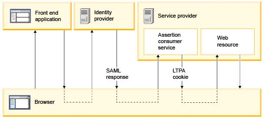
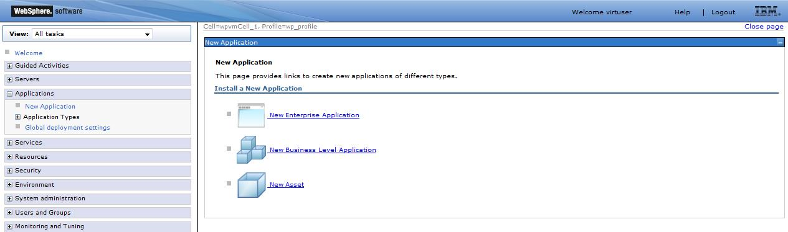
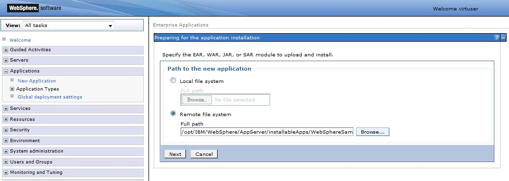
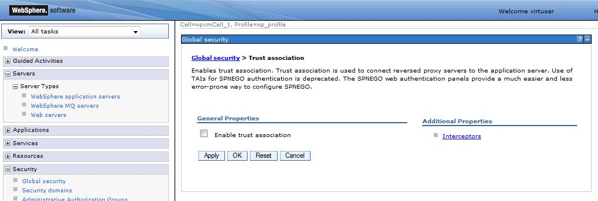
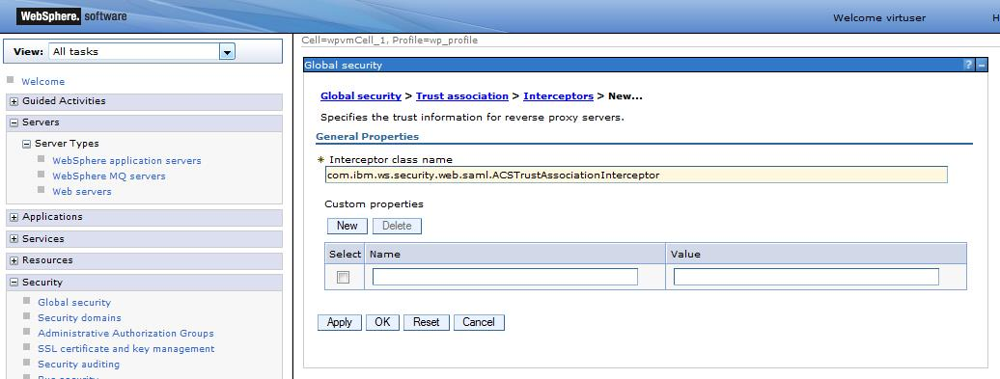
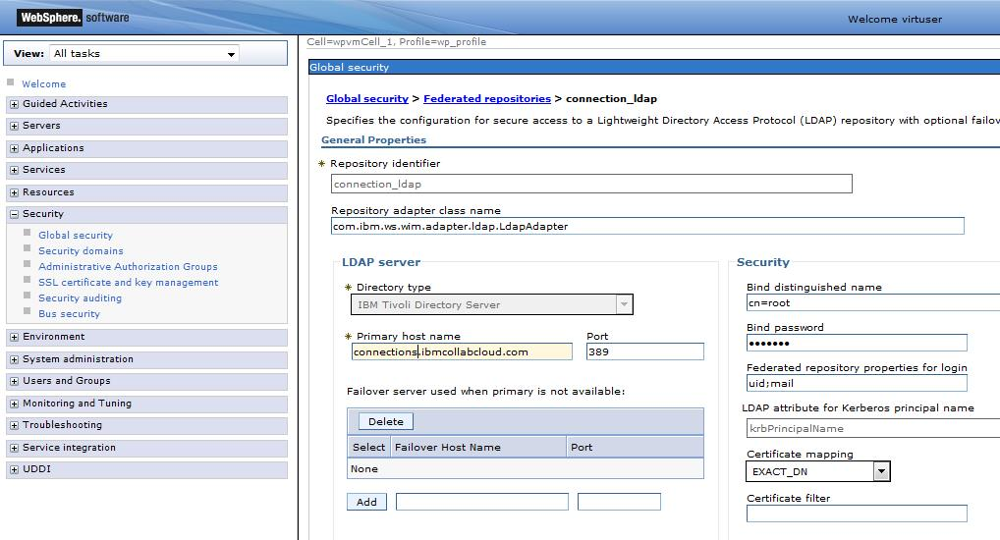

# How to implement SAML for Portal

## Applies to
> HCL Portal Server 8.5

## Introduction

Security Assertion Markup Language (SAML) is an OASIS standard for representing and exchanging user identity, authentication, and attribute information. SAML is widely used to enable cross-vendor single sign-on (SSO).

HCL Portal Server often runs in environments that include multiple integrated components. In these cases, SAML SSO is a common choice to provide a seamless user experience.

Because HCL Portal Server is based on WebSphere Application Server (WAS) middleware technology and uses the WAS security layer, SAML SSO is available in HCL Portal Server through WAS.

This article describes the SAML 2.0 standard, the SAML SSO capabilities available in WAS, and the steps to implement it for HCL Portal Server with a generic identity provider (IdP).

---

### SAML 2.0 standard

SAML 2.0 specifies a Web Browser SSO profile involving three actors:

- **Identity provider (IdP)**
- **Service provider (SP)**
- **Principal (user) with an HTTP user agent**

The SP supports four bindings, and the IdP supports three. This results in 12 possible deployment scenarios, which fall into two categories:

- **IdP-initiated SSO**
- **SP-initiated SSO**

---

### IdP-initiated SSO

To access a protected resource on the SP, the user must first authenticate with the IdP. The IdP then redirects the user to the SP, including a `SAMLResponse` with the user’s authentication information.

Because the SP trusts the IdP, it can validate the `SAMLResponse` and create an authenticated session without requiring additional credentials.

The IdP can also send the user directly to the SP without requiring a manual choice in these cases:

- The IdP manages a single SP, so the redirect target is clear.  
- The authentication request to the IdP includes a query string that specifies the SP. The IdP uses this parameter to define the redirect target.  

---

### SP-initiated SSO

In this scenario, the SP is the first component contacted by the user.

If the user is not authenticated, the SP redirects the user to the IdP. The redirect includes a `SAMLRequest` that provides the IdP with the information required to authenticate the user and redirect them back to the SP.

The key difference between IdP-initiated and SP-initiated SSO is the presence of the `SAMLRequest` when the IdP is contacted. The second part of the flow—from IdP to SP—is the same in both scenarios.

---
## Instructions

### Implementation details

#### WebSphere Application Server limitation

With the current version of WebSphere Application Server (8.5.5), WAS only supports IdP-initiated SSO. It cannot generate the required `SAMLRequest` defined by the SAML standard for SP-initiated SSO.

To avoid requiring users to select the correct link for redirection to WAS, use this approach:

1. The user requests a WAS-secured resource.  
2. A SAML TAI is in place. If the user is not already authenticated, it redirects the user to the IdP URL. This URL should include a keyword as a URL parameter that the IdP can use after login.  
3. The browser generates an additional cookie, `WasSamlSpReqURL`, which identifies the originally requested resource.  
4. The IdP authenticates the user and sends them back to WAS. The redirect goes to a SAML application deployed on WAS called the Assertion Consumer Service (ACS).  
5. The ACS validates and processes the `SAMLResponse` from the IdP. It creates the authenticated session on WAS and issues the LTPA cookie for the user.  
6. If the `WasSamlSpReqURL` cookie is available, the user is redirected to the originally requested resource as an authenticated user. Otherwise, the user is redirected to the URL configured in the TAI.



### IdP-initiated configuration for Portal

!!! note
    Most of the steps described in this document are included in WAS 8.5 Infocenter, but here they are collected together in a single document, specific to HCL Portal.

The sample configuration provided is from a real-world experience with an F5 as IdP and a single-server installation of HCL Portal Server.

### Install the SAML ACS application

A new enterprise application must be installed. In the WAS Admin Console, follow these steps:

1. Open **Applications > New Application > New Enterprise Application**.
   
2. Select **Remote file system** and choose the EAR file `/opt/IBM/WebSphere/AppServer/installableApps/WebSphereSamlSP.ear`.
   
3. Click **Next** three times.  
4. Click **Finish**.  
5. Save the configuration.

### Configure SAML TAI

Log on to the WebSphere Application Server administrative console.

1. Click **Security > Global security > Web and SIP security > Trust association**.  
2. Under the **General Properties** heading, make sure the **Enable trust association** check box is not selected.  
3. Click **Interceptors**.  
      
4. Click **New** and enter `com.ibm.ws.security.web.saml.ACSTrustAssociationInterceptor` in the *Interceptor class name* field.  
      
5. **Configure Custom Properties** — Under **Custom properties**, fill in the following information:  
    ```text
    sso_1.sp.acsUrl = https://<hostname>:<sslport>/samlsps/wps/
    sso_1.sp.filter = request-url%=/wps/myportal
    sso_1.sp.idMap = localRealm
    ```
6. Click **OK**.  
7. Go back to **Security > Global security** and click **Custom properties**.  
8. Look for `com.ibm.websphere.security.DeferTAItoSSO` and replace the existing value with `com.ibm.ws.security.web.saml.ACSTrustAssociationInterceptor`.  

    !!! note
        The property `com.ibm.websphere.security.DeferTAItoSSO` was previously used in the default configuration of all installed servers.  
        Now it is only used as part of the SAML configuration.

9. Click **OK**.  
10. Restart the WebSphere Application Server.

### Add IdP

To use the WebSphere Application Server SAML service provider for single sign-on with an identity provider, you need to add the identity provider as a partner. From the IdP, export the metadata in XML format, then follow this procedure:

1. Start the WebSphere Application Server.
2. Start the **wsadmin** command-line utility from the `<AppServer_root>/bin` directory by entering:
   ```bash
   /opt/IBM/WebSphere/AppServer/bin/wsadmin.sh -lang jython
   ```
3.	At the wsadmin prompt, enter:
    ```
    AdminTask.importSAMLIdpMetadata('-idpMetadataFileName <IdPMetaDataFile> -idpId 1 -ssoId 1 -signingCertAlias <idpAlias>')
    ```
    - <IdPMetaDataFile> is the full path name of the IdP metadata file.
	-<idpAlias> is any alias name you specify for the imported certificate.
4.	Save the configuration:
    ```
    AdminConfig.save()
    ```
5.	Exit the wsadmin command utility:
```
quit
```
6.	Restart the WebSphere Application Server.

### Add IdP realms as trusted realms

For each identity provider (IdP) used with your WebSphere Application Server service provider, you must grant inbound trust to all realms that the IdP uses.

1. Log on to the WebSphere Application Server administrative console.  
2. Click **Security > Global security**.  
3. Under **User account repository**, click **Configure**.  
4. Click **Trusted authentication realms – inbound**.  
5. Click **Add External Realm**.  
6. Enter the external realm name.  
7. Click **OK**, and then click **Save** to update the master configuration.

### Export data for IdP

Each identity provider (IdP) used with your WebSphere Application Server service provider must be configured to add the service provider as a single sign-on (SSO) partner.  
The procedure for adding a service provider partner to an IdP depends on the specific IdP. For instructions, see the documentation for your IdP.

If your IdP supports using a metadata file to add the service provider as a federation partner, you can use the **wsadmin** command-line utility to export the service provider metadata.

1. Start the WebSphere Application Server.  
2. Start the **wsadmin** command-line utility from the `<AppServer_root>/bin` directory by entering:  

   ```bash
   /opt/IBM/WebSphere/AppServer/bin/wsadmin.sh -lang jython
   ```
3.	At the wsadmin prompt, enter:
```
AdminTask.exportSAMLSpMetadata('-spMetadataFileName <SpMetaDataFile> -ssoId 1')
```
- <SpMetaDataFile> is the full path name of the SP metadata file generated by the script.
- This file must be imported into your IdP.

### Configure the WAS security context

1. Log on to the WebSphere Application Server administrative console.  
2. Click **Security > Global security > Web and SIP security > Trust association > com.ibm.ws.security.web.saml.ACSTrustAssociationInterceptor**.  

   

3. Add the required custom properties to have the following data in place (some of them might already be there).  

    #### Required custom properties

Add or verify the following custom properties:

| Name                          | Value                                                                 |
|-------------------------------|----------------------------------------------------------------------|
| `sso_1.sp.acsUrl`             | `https://<hostname>:<sslport>/samlsps/wps/`                          |
| `sso_1.sp.idMap`              | `localRealm`                                                         |
| `sso_1.idp_1.certAlias`       | `<idpAlias>`                                                         |
| `sso_1.idp_1.entityID`        | `https://<idphostname>/<idp required path>`                          |
| `sso_1.idp_1.singleSignOnUrl` | `https://<idphostname>/saml/idp/profile/redirectorpost/sso`           |
| `sso_1.sp.login.error.page`   | Use the same value as `sso_1.idp_1.entityID`                          |
| `sso_1.sp.filter`             | `request-url%=/wps/myportal`                                         |

### Check login attribute

The IdP passes the user ID to be authenticated in the SAML request. This ID must match one of the user ID values available for standard HCL Portal login.

1. Log on to the WebSphere Application Server administrative console.  
2. Click **Security > Global security**.  
3. Under **User account repository**, click **Configure**.  
4. Click the LDAP where users are stored.  
5. In **Federated repository properties for login**, check the attributes that are used for login. Add additional attributes if needed (separate multiple attributes with a semicolon).  
    - Example: If the IdP passes the email address as the user ID, set the following value:  
     ```
     Federated repository properties for login = uid;mail
     ```
6. Click **OK**.  
7. Save the configuration.  

### Enable TAI

The last step is to enable TAI. After this step, the only way to authenticate to HCL Portal is through the IdP, and it will work only for users who have a matching email in the HCL Portal User Registry.

1. Log in to the WebSphere Application Server administrative console.  
2. Click **Security > Global security > Web and SIP security > Trust association**.  
3. Under the **General Properties** heading, select the **Enable trust association** check box.  
4. Click **OK**.  
5. Save the configuration.  
6. Restart the WebSphere Application Server.  
