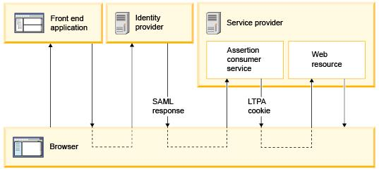
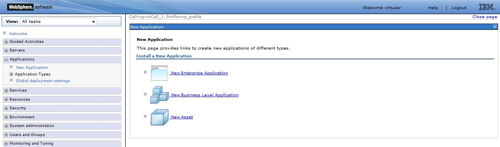
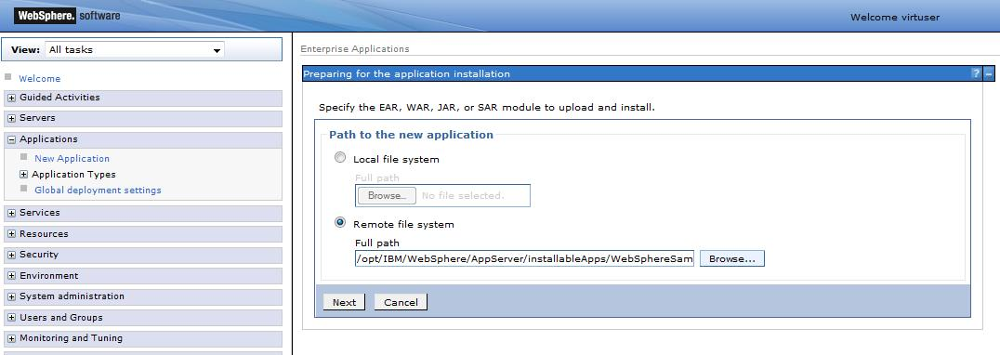
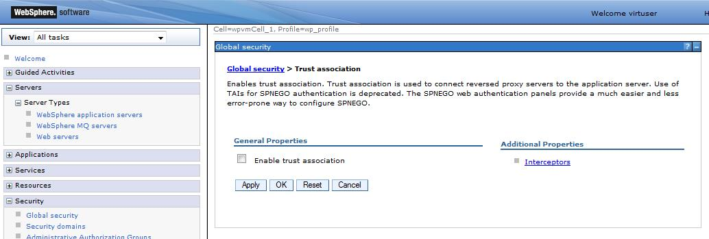
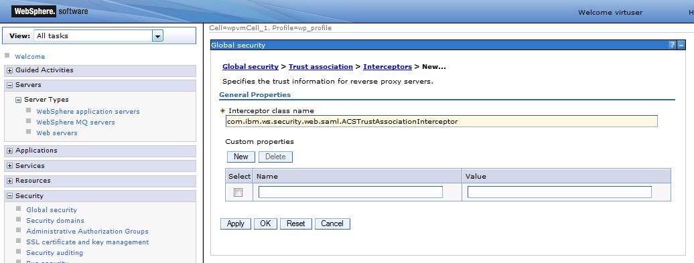
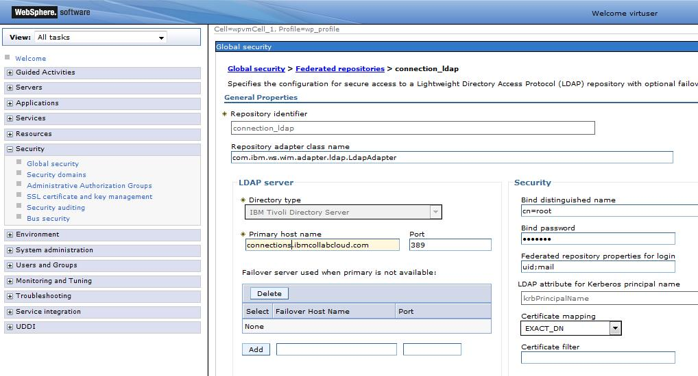

# How to implement SAML in HCL DX

## Applies to

> HCL Digital Experience v9.5 and higher

## Introduction

Security Assertion Markup Language (SAML) is an OASIS standard for representing and exchanging user identity, authentication, and attribute information. SAML is widely used to enable cross-vendor Single Sign-On (SSO).  

HCL Digital Experience (DX) often runs in environments that include multiple integrated components. In these cases, SAML SSO is a common choice to provide a seamless user experience. Because HCL DX is based on WebSphere Application Server (WAS) middleware technology and uses the WAS security layer, SAML SSO is available in HCL DX through WAS.

This article describes the SAML 2.0 standard, the SAML SSO capabilities available in WAS, and the steps to implement it for HCL DX with a generic identity provider.  

### SAML 2.0 standard

SAML 2.0 specifies a Web Browser SSO profile involving three actors:

- Identity provider (IdP)
- Service provider (SP)
- Principal (user) with an HTTP user agent

The SP supports four bindings, and the IdP supports three. This results in 12 possible deployment scenarios, which fall into two categories:

- IdP-initiated SSO
- SP-initiated SSO

### IdP-initiated SSO

To access a protected resource on the SP, the user must first authenticate with the IdP. The IdP then redirects the user to the SP, including a SAML Response with the user’s authentication information.

Because the SP trusts the IdP, it can validate the SAML Response and create an authenticated session without requiring additional credentials.

The IdP can also send the user directly to the SP without requiring a manual choice in these cases:

- The IdP manages a single SP, so the redirect target is clear.  
- The authentication request to the IdP includes a query string that specifies the SP. The IdP uses this parameter to define the redirect target.

### SP-initiated SSO

In this scenario, the SP is the first component contacted by the user.

If the user is not authenticated, the SP redirects the user to the IdP. The redirect includes a SAML Request that provides the IdP with the information required to authenticate the user and redirect them back to the SP.

The key difference between IdP-initiated and SP-initiated SSO is the presence of the SAML Request when the IdP is contacted. The second part of the flow—from IdP to SP—is the same in both scenarios.  

### WebSphere Application Server limitation

WAS v8.5.5.x only supports IdP-initiated SSO. It cannot generate the required SAML Request defined by the SAML standard for SP-initiated SSO.

To avoid requiring users to select the correct link for redirection to WAS, use this approach:

1. The user requests a WAS-secured resource.  
2. A SAML TAI is in place. If the user is not already authenticated, it redirects the user to the IdP URL. This URL should include a keyword as a URL parameter that the IdP can use after login.  
3. The browser generates an additional cookie, `WasSamlSpReqURL`, which identifies the originally requested resource.  
4. The IdP authenticates the user and sends them back to WAS. The redirect goes to a SAML application deployed on WAS called the Assertion Consumer Service (ACS).  
5. The ACS validates and processes the SAML Response from the IdP. It creates the authenticated session on WAS and issues the LTPA cookie for the user.  
6. If the `WasSamlSpReqURL` cookie is available, the user is redirected to the originally requested resource as an authenticated user. Otherwise, the user is redirected to the URL configured in the TAI.  

  

### IdP-initiated configuration

!!! note
    Most of the steps described in this document are included in WAS v8.5 InfoCenter, but here they are collected together in a single document, specific to HCL DX.

The sample configuration provided is from a real-world experience with an F5 as IdP and a single-server installation of HCL DX.

## Instructions

Use the following instructions to implement SAML in HCL DX.  

### Installing the SAML ACS application

A new enterprise application must be installed. In the WAS Admin Console, follow these steps:

1. Open **Applications > New Application > New Enterprise Application**.
   
2. Select **Remote file system** and choose the EAR file `/opt/IBM/WebSphere/AppServer/installableApps/WebSphereSamlSP.ear`.
   
3. Select **Next** three times.  
4. Select **Finish**.  
5. Save the configuration.

### Configuring SAML TAI

Log on to the WAS administrative console.  

1. Go to **Security > Global security > Web and SIP security > Trust association**.  
2. Under the **General Properties** heading, make sure the **Enable trust association** check box is not selected.  
3. Select **Interceptors**.  
      
4. Select **New** and enter `com.ibm.ws.security.web.saml.ACSTrustAssociationInterceptor` in the **Interceptor class name** field.  
      
5. Under **Custom properties**, enter the following information:  

    ```text
    sso_1.sp.acsUrl = https://<hostname>:<sslport>/samlsps/wps/
    sso_1.sp.filter = request-url%=/wps/myportal
    sso_1.sp.idMap = localRealm
    ```

6. Select **OK**.  
7. Go to **Security > Global security** and select **Custom properties**.  
8. Look for `com.ibm.websphere.security.DeferTAItoSSO` and replace the existing value with `com.ibm.ws.security.web.saml.ACSTrustAssociationInterceptor`.  

    !!! note
        The property `com.ibm.websphere.security.DeferTAItoSSO` was previously used in the default configuration of all installed servers.  
        Now it is only used as part of the SAML configuration.  

9. Select **OK**.  
10. Restart the WebSphere Application Server.  

### Adding IdP

To use the WebSphere Application Server SAML service provider for single sign-on with an identity provider, you need to add the identity provider as a partner. From the IdP, export the metadata in XML format, then follow this procedure:  

1. Start the WebSphere Application Server.  

2. Start the `wsadmin` command-line utility from the `<AppServer_root>/bin` directory by entering the following command:  

    ```bash
    /opt/IBM/WebSphere/AppServer/bin/wsadmin.sh -lang jython
    ```

3. At the `wsadmin` prompt, enter:  

    ```wsadmin
    AdminTask.importSAMLIdpMetadata('-idpMetadataFileName <IdPMetaDataFile> -idpId 1 -ssoId 1 -signingCertAlias <idpAlias>')
    ```

    - `<IdPMetaDataFile>` is the full path name of the IdP metadata file.  
    - `<idpAlias>` is any alias name you specify for the imported certificate.  

4. Save the configuration using the following command:  

    ```wsadmin
    AdminConfig.save()
    ```

5. Exit the `wsadmin` command utility using the following command:  

    ```wsadmin
    quit
    ```

6. Restart the WebSphere Application Server.  

### Adding IdP realms as trusted realms

For each IdP used with your WAS service provider, you must grant inbound trust to all realms that the IdP uses.  

1. Log on to the WAS administrative console.  
2. Go to **Security > Global security**.  
3. Under **User account repository**, click **Configure**.  
4. Select **Trusted authentication realms – inbound**.  
5. Select **Add External Realm**.  
6. Enter the external realm name.  
7. Select **OK > Save** to update the master configuration.  

### Exporting data for IdP

Each IdP used with your WebSphere Application Server service provider must be configured to add the service provider as an SSO partner. The procedure for adding a service provider partner to an IdP depends on the specific IdP. For instructions, see the documentation for your IdP.  

If your IdP supports using a metadata file to add the service provider as a federation partner, you can use the `wsadmin` command-line utility to export the service provider metadata.  

1. Start the WebSphere Application Server.  
2. Start the `wsadmin` command-line utility from the `<AppServer_root>/bin` directory by entering:  

    ```bash
    /opt/IBM/WebSphere/AppServer/bin/wsadmin.sh -lang jython
    ```

3. At the wsadmin prompt, enter:  

    ```wsadmin
    AdminTask.exportSAMLSpMetadata('-spMetadataFileName <SpMetaDataFile> -ssoId 1')
    ```

    - `<SpMetaDataFile>` is the full path name of the SP metadata file generated by the script.  
    - This file must be imported into your IdP.  

### Configuring the WAS security context

1. Log on to the WAS administrative console.  
2. Go to **Security > Global security > Web and SIP security > Trust association > com.ibm.ws.security.web.saml.ACSTrustAssociationInterceptor**.  

      

3. Add the required custom properties to have the following data in place (some of them might already be there).  

    | Name                        | Value                                                                                                 |
    |-----------------------------|-------------------------------------------------------------------------------------------------------|
    |`sso_1.sp.acsUrl`            | `https://<dx_hostname>:<sslport>/samlsps/wps/`                                                        |
    |`sso_1.sp.idMap`             | `localRealm`                                                                                          |
    |`sso_1.idp_1.certAlias`      | `<idpAlias>`                                                                                          |
    |`sso_1.idp_1.entityID`       | `https://<idphostname>/<idp required path>`                                                           |
    |`sso_1.idp_1.singleSignOnUrl`| `https://<idphostname>/saml/idp/profile/redirectorpost/sso`                                           |
    |`sso_1.sp.login.error.page`  | Indicate the URL of the IdP login page (for IdP-initiated flows).<BR>For more advanced use (like SP-initiated flows, which require custom code), check the [IBM documentation](https://www.ibm.com/docs/en/was/9.0.5?topic=swss-saml-web-single-sign-sso-trust-association-interceptor-tai-custom-properties){target="_blank"}.|
    |`sso_1.sp.filter`            | `request-url%=/wps/myportal`                                                                          |
    |`sso_1.sp.targetUrl`         | `https://<dx_hostname>:<sslport>/wps/myortal`                                                         |  

    Example configuration that might work when using Active Directory Federation Service (AD FS):  

    | Name                       | Value                                                                                                 |
    |----------------------------|-------------------------------------------------------------------------------------------------------|
    |`sso_1.sp.acsUrl`           | `https://<dx_hostname>/samlsps/wps/`                                                                  |
    |`sso_1.sp.filter`           | `request-url%=/wps/myportal`                                                                          |
    |`sso_1.sp.idMap`            | `localRealm`                                                                                          |
    |`sso_1.idp_1.entityID`      | `https://<idp_hostname>/adfs/services/trust`                                                          |
    |`sso_1.sp.login.error.page` | `https://<idp_hostname>/adfs/ls/IdpInitiatedSingOn.aspx?loginToRp=https://<dx_hostname>/samlsps/wps/` |
    |`sso_1.idp_1.certAlias`     | `<idpAlias>`                                                                                          |
    |`sso_1.sp.targetUrl`        | `https://<dx_hostname>/wps/myportal`                                                                  |  

### Verifying login attribute

The IdP passes the user ID to be authenticated in the SAML request. This ID must match one of the user ID values available for standard HCL DX login.  

1. Log on to the WAS administrative console.  

2. Go to **Security > Global security**.  

3. Under **User account repository**, click **Configure**.  

4. Select the LDAP where users are stored.  

5. In **Federated repository properties for login**, check the attributes that are used for login. Add additional attributes if needed (separate multiple attributes with a semicolon).  

    For example, if the IdP passes the email address as the user ID, set the following value:  

    ```properties
    Federated repository properties for login = uid;mail
    ```

6. Select **OK**.  

7. Save the configuration.  

### Enabling TAI

The last step is to enable TAI. After this step, the only way to authenticate to HCL DX is through the IdP, and it will work only for users who have a matching email in the HCL Portal User Registry.  

1. Log in to the WAS administrative console.  

2. Go to **Security > Global security > Web and SIP security > Trust association**.  

3. Under the **General Properties** heading, select the **Enable trust association** check box.  

4. Select **OK**.  

5. Save the configuration.  

6. Restart the WebSphere Application Server.  

### Setting the SAML rule for the NameID mapping

When using Active Directory Federation Services (AD FS), you must define a SAML rule on the identity provider (IdP) side to ensure that the SAML response includes the NameID attribute. The `ACSTrustAssociationInterceptor` class requires the NameID attribute to process the SAML response correctly.

Configure the relying party trust in AD FS to issue a claim with these configuration values:

| Setting | Value |
|---------|-------|
| Claim rule name | NameID Rule |
| Rule template | Transform an Incoming Claim |
| Incoming claim type | Common Name |
| Incoming Name ID format | Unspecified |
| Outgoing claim type | Name ID |
| Outgoing Name ID format | Unspecified |

### Troubleshooting SAML configurations

**CWSML7035E**  

```log-entry
CWSML7035E: The SAML Web Single Sign-on (SSO) Trust Association Interceptor (TAI) is unable to determine a redirect target URL. The redirect URL can come from the sso_<id>.sp.targetUrl SAML TAI custom property, the RelayState parameter in the SAMLResponse or the WasSamlSpReqUrl cookie. If you do not intend to have a value for the sso_<id>.sp.targetUrl SAML TAI custom property or have your IdP send a RelayState parameter in the SAMLResponse, then check earlier in the log to see if you have a CWSML7036W warning that indicates that the request URL host name is not the same as the ACS URL host name. If you see that warning, then that condition must be corrected to fix this error. The value for the relayState parameter on the SAMLResponse is [<null>].
```

Verify that the `sso_<id>.sp.targetUrl` custom property is defined and configured with the correct redirect URL. If the property is intentionally omitted, review the logs for host name mismatches between the request URL and the ACS URL.

**CWSML7010E**

```log-entry
CWSML7010E: The [NameID] sub-element of the [Subject] element in the SAML assertion element is missing or empty.  
```

Configure the identity provider to include the NameID attribute in the SAML assertion. For more information, refer to [Setting the SAML rule for the nameID mapping](#setting-the-saml-rule-for-the-nameid-mapping).

???+ info "Related information"
    - [SAML web single sign-on (SSO) trust association interceptor (TAI) custom properties](https://www.ibm.com/docs/en/was/9.0.5?topic=swss-saml-web-single-sign-sso-trust-association-interceptor-tai-custom-properties){target="_blank"}  
    - [AD FS troubleshooting: AD FS metadata endpoints](https://learn.microsoft.com/en-us/windows-server/identity/ad-fs/troubleshooting/ad-fs-tshoot-endpoints){target="_blank"}
