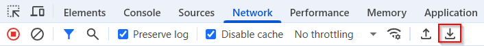

# How to collect a Fiddler trace (HAR-file)?

## Applies to

> HCL Digital Experience v9.5 and higher

## Introduction

There will be instances where HCL Support will request a Fiddler/HAR file to investigate a product issue. Please follow the instructions below.  

## Instructions

### Steps using Fiddler  

1. [Download Fiddler](https://www.telerik.com/download/fiddler){target="_blank"}

2. [Configure Fiddler](https://docs.telerik.com/fiddler/configure-fiddler/tasks/configurefiddler){target="_blank"}

    !!! Note  
        If the target site will be accessed over HTTPS, make sure to follow the steps discussed in the article linked below to decrypt the traffic. [Configure Fiddler Classic to Decrypt HTTPS Traffic](http://docs.telerik.com/fiddler/Configure-Fiddler/Tasks/DecryptHTTPS){target="_blank"}

3. Enable any tracing on the Portal Server requested by HCL Support (skip step if no tracing requested).  

4. Open browser and clear all browser cache (or open a private/incognito tab).  

5. Open Fiddler to start capturing traffic.  

6. If browser console output requested by HCL Support, open the browser console (usually F12).  

7. Reproduce the issue in your browser.  

8. Once issue is reproduced, save the Fiddler session (`File -> Save -> All Sessions`).  

9. This will produce a file with the extension `.SAZ`. Please upload file to your Case with HCL Support for review.  

10. If HCL Support requested additional logs, please upload the `<wp_profile_root>\logs\WebSphere_Portal` logs directory or a [wpcollector output](https://support.hcl-software.com/csm?id=kb_article&sysparm_article=KB0012545){target="_blank"}.  

11. If HCL Support requested the browser console text, please copy the text to a file (navigate to Console tab in Developer tools then do a right click and select copy console messages or save as option depending on the browser) and upload to Case for review.  

If Fiddler cannot be installed in your environment, you can provide similar data with your browser's built in tools.  

### Steps to create a HAR file in the web-browser

1. Enable any tracing on the Portal Server requested by HCL Support (skip step if no tracing requested).  

2. Open browser and clear all browser cache (or open a private/incognito tab).  

3. Open browser `Developer Tools -> Network` tab (menu option will vary depending on browser being used).  

4. Select the option to collect entire session. For example, in Chrome: 'Preserve log', in Firefox: 'Persist Logs'.  

5. Reproduce the issue in your browser.  

6. Once issue is reproduced, save the session as a HAR file.  
   Using Chrome and Microsoft Edge browser: Click on the `Export HAR (sanitized)...` button under the Network tab. See screenshot:  
     
   Using Firefox: Right-click and select `Save all as HAR`.  

7. This will produce a file with the extension .HAR. Please upload to your Case with HCL Support for review.  

8. If HCL Support requested additional logs, please upload the `<wp_profile_root>\logs\WebSphere_Portal` logs directory or a [wpcollector output](https://support.hcl-software.com/csm?id=kb_article&sysparm_article=KB0012545){target="_blank"}.  

9. If HCL Support requested the browser console text, please copy the text to a file (navigate to Console tab in Developer tools then do a right click and select copy console messages or save as option depending on the browser) and upload to Case for review.  

Also see HCL Digital Experience: [Getting an HAR Log](https://www.youtube.com/watch?v=9ct26dCrHqk){target="_blank"}
