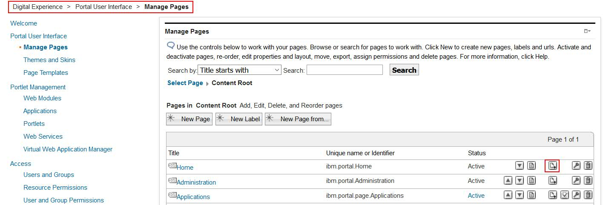
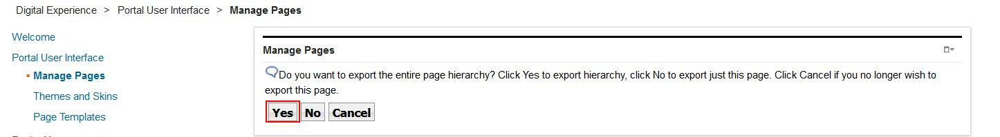
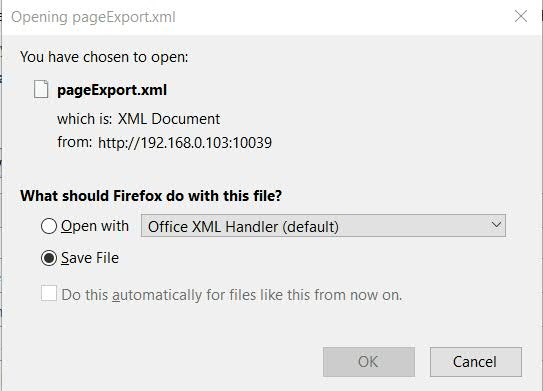
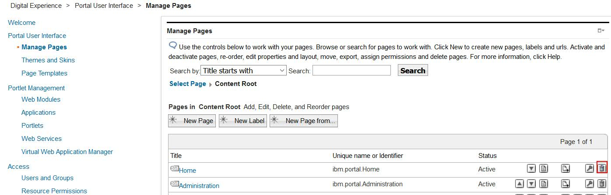
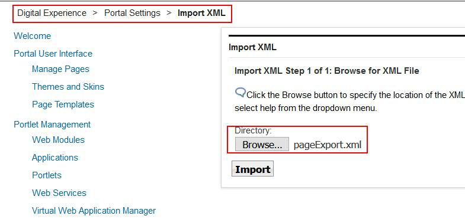
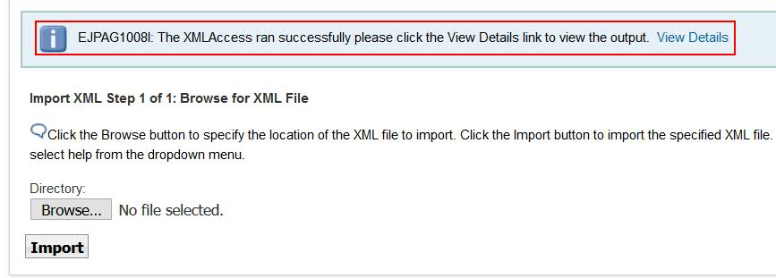

# How to use XML Access to export and import portal pages

## Applies to

> HCL Digital Experience version 9.5 and higher  

## Introduction

XML Access (XML Configuration Service) is a command-line batch-processing utility for exporting & importing various portal configuration. It can export specific pages, complete or partial configuration from one portal to another. By default, HCL DX provides a set of standard XML samples with the installation binaries. The samples can be found in the directory `<PortalServer_root>/doc/xml-samples`.  

**XML Access features and potential use-cases:**  

With XML Access it is possible to:  

* transfer all or part of a Portal configuration including user data from one system to another.
* backing up the configuration of certain Environments, before loading new configurations.
* updating existing portlets when a new WAR file is provided by development.
* overwrite objects referred to 'artifacts' or 'resources' that it finds on the target systems with the values specified in the XML file.
* close the gap of missing objects. Objects not present in the target system but defined in the XML will be created during an xml access import.  
* greatly eases the duplication of a portal environment from server A to server B.
* update pages & portlets without losing user customization. User customization to a page or a portlet is retained because the object IDs are retained.

## Instructions

XML Access (XML Configuration Service) is a command-line batch-processing utility for exporting & importing various portal configurations. In this article it will be described how to export and import portal pages using this utility. For that the article describes detailed steps in how to export the Home portal page. Then the Home portal page will be deleted and finally it will be imported / restored again using the XML Access utility.  

### Detailed steps

1. Login as administrator in HCL Portal Server Console.  

2. Navigate to **Administration -> Portal User Interface -> Content Root**.  

3. Click on the **Export Page** icon as shown below for the portal page Home.  

      

4. Below popup window will opened. Click **Yes** to Export the page Hierarchy of Home portal page.  

      

5. Click Save to store the exported file to your local file system.  

      

    !!!note
        The downloaded xml file (pageExport.xml) now should contain all required information to restore the entire Home portal page later again.  

6. Delete the Home page using the **delete** icon shown in the image below.  
### Delete the portal page
      

7. On the pop-up window with the question *"Are you sure you want to delete Home? All pages below Home will be deleted."* Click **Ok**.  

      

8. With that action the **Home** page is not showing on **Open Site Menu** anymore.

      

9. Now to recreate the same Portal Page again, import the XML which was exported earlier by navigating to **Administration > Portal Settings > Import XML > Browse > Import** as shown below.  

      

10. You will receive successful message as shown below once the import process is successfully completed.  

      

11. Finally check, if the **Home page** is restored correctly again by navigating to **Open Site Menu -> Home**.

      
