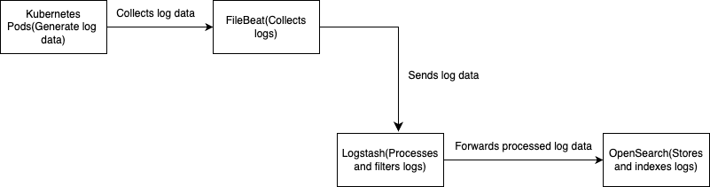

## Introduction

Kubernetes is a widely adopted platform for container orchestration in cloud-native environments. As applications scale, managing the logs they generate is important for monitoring, debugging, and compliance. Logstash is an open source data processing pipeline that collects, processes, and forwards logs from Kubernetes pods to OpenSearch, an open source search and analytics engine. This topic outlines the steps and best practices for configuring Logstash to push pod logs to OpenSearch.

## Overview of Logstash, Filebeat and OpenSearch

### Logstash

[Logstash](https://www.elastic.co/guide/en/logstash/current/introduction.html){target="_blank"} is an open-source tool for managing events and logs. It enables the collection, parsing, and transformation of logs before forwarding them to a specified destination (for example, OpenSearch). Logstash supports various input, filter, and output plugins, making it extensible and flexible.

### Filebeat

[Filebeat](https://www.elastic.co/guide/en/beats/filebeat/current/filebeat-overview.html){target="_blank"} is a lightweight, open source log shipper developed by Elastic. It is designed to collect and send data to Elasticsearch or Logstash for indexing and analysis. Filebeat focuses on reading log files and forwarding their contents to a specified destination.

### OpenSearch

OpenSearch is a community-driven, open source search and analytics suite derived from Elasticsearch. It provides powerful indexing, search, and visualization capabilities. OpenSearch is ideal for storing, searching, and analyzing large volumes of log data in near real-time.

## System Architecture

- Key Components
    1. Kubernetes Pods: Generate log data.
    2. Logstash: Collects and processes log data.
    3. FileBeat: Reads log files and forwards them to Logstash.
    4. OpenSearch: Stores and indexes log data.

- Data Flow Overview
    1. Kubernetes pods generate logs.
    2. Logstash collects logs from Kubernetes using FileBeat input plugin.
    3. Logs are processed and filtered by Logstash.
    4. Processed logs are forwarded to OpenSearch for indexing and storage.

          { width="600" }


## Prerequisites

Make sure that you have the following:

- A running Kubernetes cluster.

- An accessible OpenSearch cluster

## Installing and configuring Logstash
  
1. Install Logstash on a node within the Kubernetes cluster or on a dedicated log processing server. Refer to the official documentation [Installing Logstash](https://www.elastic.co/guide/en/logstash/current/getting-started-with-logstash.html){target="_blank"} for more information.

2. Configure Logstash for Kubernetes Logs.

Modify the provided pipeline.conf file according to your requirements. This file defines the input sources, filters, and output destinations for Logstash.

```
input {
    beats {
    port => 5044
    }
}


filter {

    mutate {
    update => { "[host][name]" => "${KUBE_HOSTNAME}" }
    }
}


output {
    opensearch {
        hosts => ["${OS_PROTOCOL}://${OS_HOSTNAME}:443"]
        index => "${OS_INDEX_NAME}"
        auth_type => {
            type => "basic"
            user => "${OS_USERNAME}"
            password => "${OPENSEARCH_PASSWORD}"
        }
        ssl => true
        ssl_certificate_verification => false
    }
}
```

`Input Configuration`: Defines the source of the data. Here, it's configured to receive data from Filebeat on TCP port 5044.

`Filter`: Processes the incoming data. The mutate filter is used here to modify events.

`Update`: Specifically, it updates the [host][name] field of the event to the value of the KUBE_HOSTNAME environment variable. This is useful for dynamically setting the hostname based on the environment where Logstash is running.

`Output Configuration`: The `opensearch` output plugin is configured to send logs to an OpenSearch server. The hosts parameter specifies the `server's protocol, hostname, and port. Additionally, the logs index, user, and password` parameters are provided for authentication. SSL encryption is enabled (ssl => true), with certificate verification disabled (ssl_certificate_verification => false).

### Installing and creating the Filebeat configuration file
  
1. Install FileBeat on a node within the Kubernetes cluster or on a dedicated log processing server. Refer to the official documentation [Filebeat quick start: installation and configuration](https://www.elastic.co/guide/en/beats/filebeat/current/filebeat-installation-configuration.html){target="_blank"} for more information.

2. Create the Filebeat configuration file.

Create the filebeat-conf.yml file according to your requirements. This file specify the log files to read and the output destination.

```
filebeat.autodiscover:
    providers:
    - type: kubernetes
        hints.enabled: true
        kube_config: /home/centos/.kube/config
        templates:
        - condition:
            equals:
                kubernetes.namespace: "dxns"
            config:
            - type: container
                paths:
                - /var/log/containers/*\${data.kubernetes.container.id}.log
                fields:
                pod_name: \${data.kubernetes.pod.name}

output.logstash:
    hosts: ["${KUBE_HOSTNAME}:5044"]
```

This configuration tells Filebeat to read all .log files in the /var/log/ directory and send the log data to a Logstash instance running on ${KUBE_HOSTNAME}:5044.


### Setting Up OpenSearch

Deploy an OpenSearch cluster using the official Helm chart or operator. Ensure the cluster is accessible from the Logstash instance.

## Integration Steps

### Configuring Logstash Output for OpenSearch

In the Logstash configuration file, specify the OpenSearch output plugin, as shown in the example above. This configuration ensures logs are sent to the correct OpenSearch endpoint.

### Managing indexes in OpenSearch

Modify indexes to handle the creation, rollover, and deletion of indices. This helps manage storage efficiently and maintain optimal performance. For more detailed information, you may refer to the official OpenSearch documentation:

- [Managing Indexes in OpenSearch](https://opensearch.org/docs/latest/im-plugin/)
- [OpenSearch Index Templates](https://opensearch.org/docs/latest/im-plugin/index-templates/)
- [OpenSearch Index Lifecycle Management (ILM)](https://opensearch.org/docs/latest/dashboards/im-dashboards/index/)

## Best Practices

### Performance Optimization

1. Scale the OpenSearch cluster based on log ingestion rates. Monitor various performance metrics (for example, CPU, memory, disk I/O) to understand current usage. To monitor these metrics, you can use tools such as OpenSearch Dashboards and Prometheus.
2. Distribute the load to enhance the cluster's ability to handle higher ingestion rates and search queries. To distribute the load, increase the number of data, master, and coordinating nodes.

### Monitoring and Alerting

- Use OpenSearch Dashboards to visualize log data. Use available filters to check specific deployment host names and pod in the log data. The following image shows the filters you can use.
        
        
    { width="600" }

- Set up alerts for specific log patterns or anomalies.
- Monitor Logstash performance using metrics and logs.


### Real-world Example

A DX deployment was enhanced with Logstash, Filebeat, and OpenSearch to manage logs from their Kubernetes-based microservices. By implementing the described [architecture](), there is improved log visibility, faster incident response times, and better overall system reliability.

### Results

- DX endgame results analysis in OpenSearch improved by 50%.
- Efforts for debugging the logs for root cause analysis were reduced. 

## Conclusion

Using Logstash to push Kubernetes pod logs to OpenSearch provides a robust and scalable solution for log management. Follow the setup and best practices outlined in this topic to enhance observability and improve operational efficiency of your log data.

- For more information, refer to the official documentation of Logstash, Filebeat, OpenSearch, and Kubernetes:

- [Logstash Documentation](https://www.elastic.co/guide/en/logstash/current/index.html){target="_blank"}
- [Filebeat Documentation](https://www.elastic.co/guide/en/beats/filebeat/current/filebeat-overview.html){target="_blank"}
- [OpenSearch Documentation](https://opensearch.org/docs/latest/){target="_blank"}
- [Kubernetes Documentation](https://kubernetes.io/docs/home/){target="_blank"}
