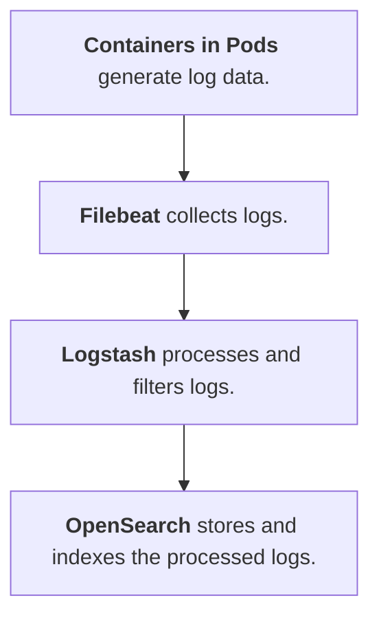
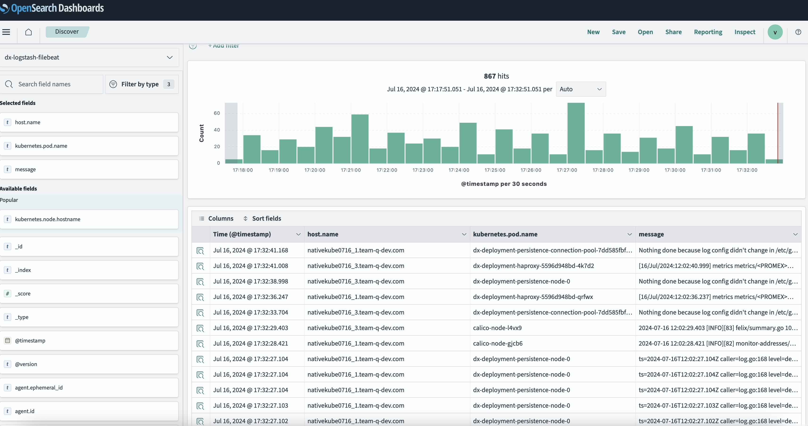

## Introduction

Kubernetes is a widely adopted platform for container orchestration in cloud-native environments. As applications scale, managing the logs they generate is important for monitoring, debugging, and compliance. Logstash is an open source data processing pipeline that collects, processes, and forwards logs from Kubernetes pods to OpenSearch, an open source search and analytics engine. This topic outlines the steps and best practices for configuring Logstash to push pod logs to OpenSearch.

## Overview of Logstash, Filebeat and OpenSearch

### Logstash

[Logstash](https://www.elastic.co/guide/en/logstash/current/introduction.html){target="_blank"} is an open-source tool for managing events and logs. It enables the collection, parsing, and transformation of logs before forwarding them to a specified destination (for example, OpenSearch). Logstash supports various input, filter, and output plugins, making it extensible and flexible.

### Filebeat

[Filebeat](https://www.elastic.co/guide/en/beats/filebeat/current/filebeat-overview.html){target="_blank"} is a lightweight, open source log shipper developed by Elastic. It is designed to collect and send data to Elasticsearch or Logstash for indexing and analysis. Filebeat focuses on reading log files and forwarding their contents to a specified destination.

### OpenSearch

[OpenSearch](https://opensearch.org/docs/latest/about/){target="_blank"} is a community-driven, open source search and analytics suite derived from Elasticsearch. It provides powerful indexing, search, and visualization capabilities. OpenSearch is ideal for storing, searching, and analyzing large volumes of log data in near real-time.

## System Architecture
          
The following flowchart shows how pod logs are processed from Kubernetes to OpenSearch:



## Prerequisites

Make sure that you have the following:

- A running Kubernetes cluster.

- An accessible OpenSearch cluster. Deploy an OpenSearch cluster using the official [OpenSearch Documentation](https://opensearch.org/docs/latest/install-and-configure/){target="_blank"}. Ensure the cluster is accessible from the Logstash instance.

## Installing and configuring Logstash
  
1. Install Logstash on a node within the Kubernetes cluster or on a dedicated log processing server. Refer to the official documentation [Installing Logstash](https://www.elastic.co/guide/en/logstash/current/getting-started-with-logstash.html){target="_blank"} for more information.

2. Configure Logstash for container logs.

    Modify the provided `pipeline.conf` file according to your requirements. This configuration file defines the input sources, filters, and output destinations for Logstash. Refer to the following sample of a `pipeline.conf` file.

    ```
    input {
        beats {
        port => 5044
        }
    }


    filter {

        mutate {
        update => { "[host][name]" => "${KUBE_HOSTNAME}" }
        }
    }


    output {
        opensearch {
            hosts => ["${OS_PROTOCOL}://${OS_HOSTNAME}:443"]
            index => "${OS_INDEX_NAME}"
            auth_type => {
                type => "basic"
                user => "${OS_USERNAME}"
                password => "${OPENSEARCH_PASSWORD}"
            }
            ssl => true
            ssl_certificate_verification => false
        }
    }
    ```
    
    Refer to the following list for more information about the parameters in the example:

    - `Input Configuration`: This defines the data source. The example is configured to receive data from Filebeat on TCP port 5044.

    - `Filter`: This processes the incoming data. The example uses the `mutate` filter to modify events.

        - `Update`: This updates the [host][name] field of the event to the value of the KUBE_HOSTNAME environment variable. This is useful for dynamically setting the hostname based on the environment where Logstash is running.

    - `Output Configuration`: The `opensearch` output plugin is configured to send logs to an OpenSearch server. The `hosts` parameter specifies the `server's protocol`, `hostname`, and `port`. Additionally, the `logs index`, `user`, and `password` parameters are provided for authentication. SSL encryption is enabled (`ssl => true`), with certificate verification disabled (`ssl_certificate_verification => false`). This configuration ensures logs are sent to the correct OpenSearch endpoint.

### Installing and creating the Filebeat configuration file
  
1. Install FileBeat on a node within the Kubernetes cluster or on a dedicated log processing server. Refer to the official documentation [Filebeat quick start: installation and configuration](https://www.elastic.co/guide/en/beats/filebeat/current/filebeat-installation-configuration.html){target="_blank"} for more information.

2. Create the Filebeat configuration file.

    Create the `filebeat-conf.yml` file according to your requirements. This file specifies the log files to read the input from Kubernetes and send them to the output destination. Refer to the following sample of a `filebeat-conf.yml` file.

    ```
    filebeat.autodiscover:
        providers:
        - type: kubernetes
            hints.enabled: true
            kube_config: /home/centos/.kube/config
            templates:
            - condition:
                equals:
                    kubernetes.namespace: "dxns"
                config:
                - type: container
                    paths:
                    - /var/log/containers/*\${data.kubernetes.container.id}.log
                    fields:
                    pod_name: \${data.kubernetes.pod.name}

    output.logstash:
        hosts: ["${KUBE_HOSTNAME}:5044"]
    ```

    This sample configuration tells Filebeat to read all `.log` files in the /var/log/containers directory and send the log data to a Logstash instance running on ${KUBE_HOSTNAME}:5044.
    The kube_config file is the default way to authenticate to a Kubernetes cluster. By default, the kube_config file is located in the ~/.kube directory.

### Managing indexes in OpenSearch

Modify indexes to handle the creation, rollover, and deletion of indexes. This helps manage storage efficiently and maintain optimal performance. For detailed information, refer to the official OpenSearch documentation:

- [Managing Indexes in OpenSearch](https://opensearch.org/docs/latest/im-plugin/){target="_blank"} 
- [OpenSearch Index Templates](https://opensearch.org/docs/latest/im-plugin/index-templates/){target="_blank"} 
- [OpenSearch Index Lifecycle Management (ILM)](https://opensearch.org/docs/latest/dashboards/im-dashboards/index/){target="_blank"} 

### Monitoring and debugging

- Use OpenSearch Dashboards to visualize log data. Use available filters to check specific deployment host names and pod in the log data. The following image shows the filters you can use.
        
        
    { width="1000" }

- Debug servers issues using metrics and logs.

## Case study

The recommended [architecture](#system-architecture) was implemented in a DX deployment. The deployment observed improved log visibility, faster incident response times, and better overall system reliability.

### Results

- With the OpenSearch Dashboard, you can view the data for longer durations in graphical format. Viewing data in this format is recommended over the tabular format.
- Efforts for debugging the logs for root cause analysis were reduced. 

## Conclusion

Using Logstash to push Kubernetes pod logs to OpenSearch provides a robust and scalable solution for log management. Follow the setup and best practices outlined in this topic to enhance observability and improve operational efficiency of your log data.

For more information, refer to the official documentation of Logstash, Filebeat, OpenSearch, and Kubernetes:

- [Logstash Documentation](https://www.elastic.co/guide/en/logstash/current/index.html){target="_blank"}
- [Filebeat Documentation](https://www.elastic.co/guide/en/beats/filebeat/current/filebeat-overview.html){target="_blank"}
- [OpenSearch Documentation](https://opensearch.org/docs/latest/){target="_blank"}
- [Kubernetes Documentation](https://kubernetes.io/docs/home/){target="_blank"}
