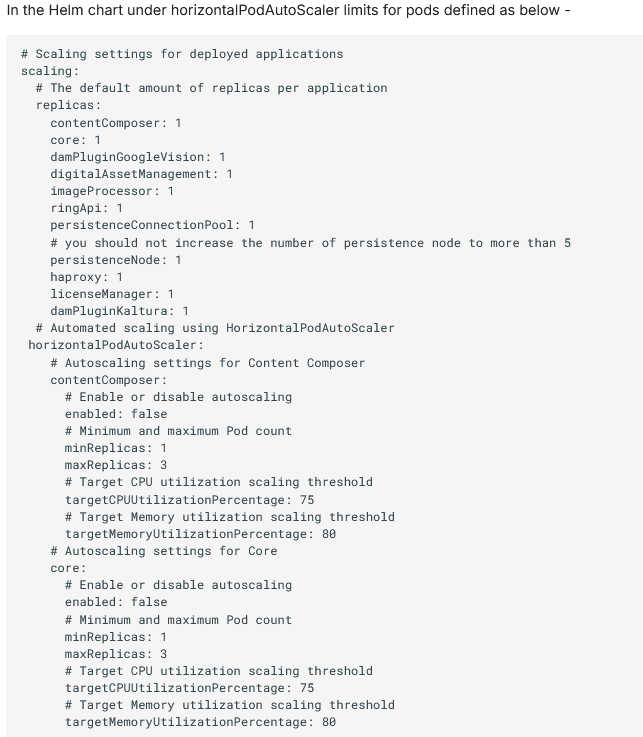
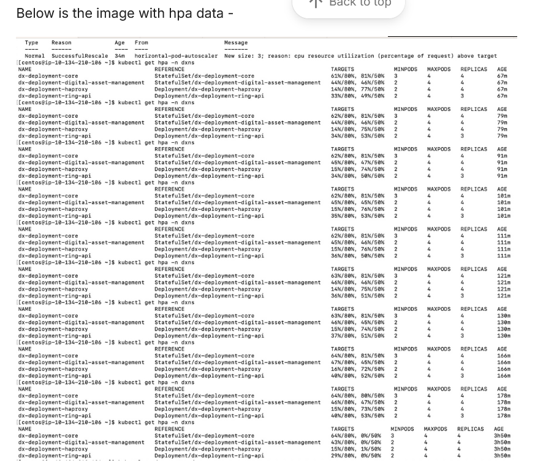
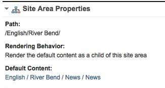
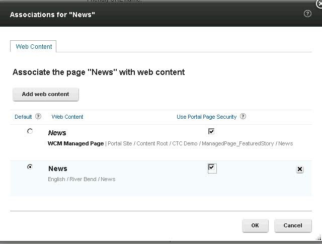
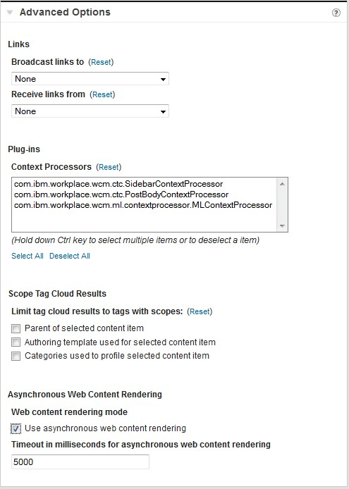
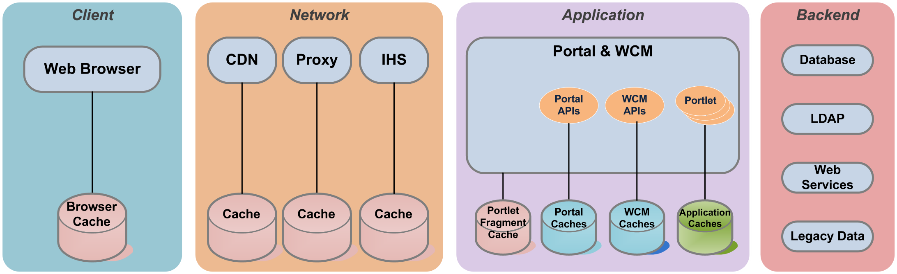
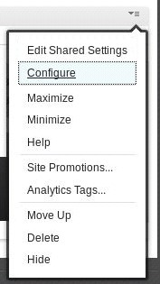
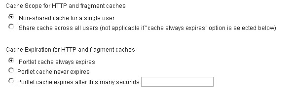
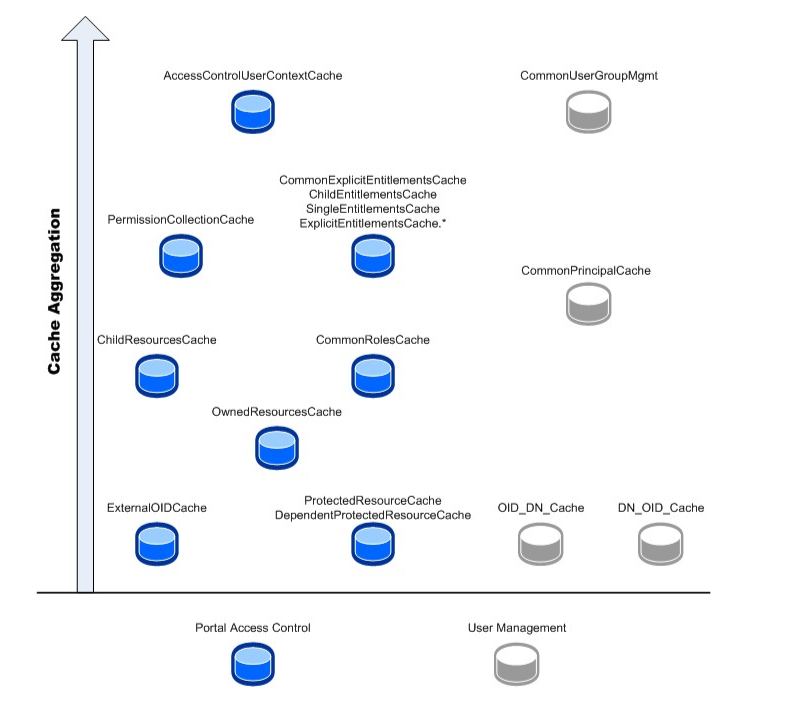
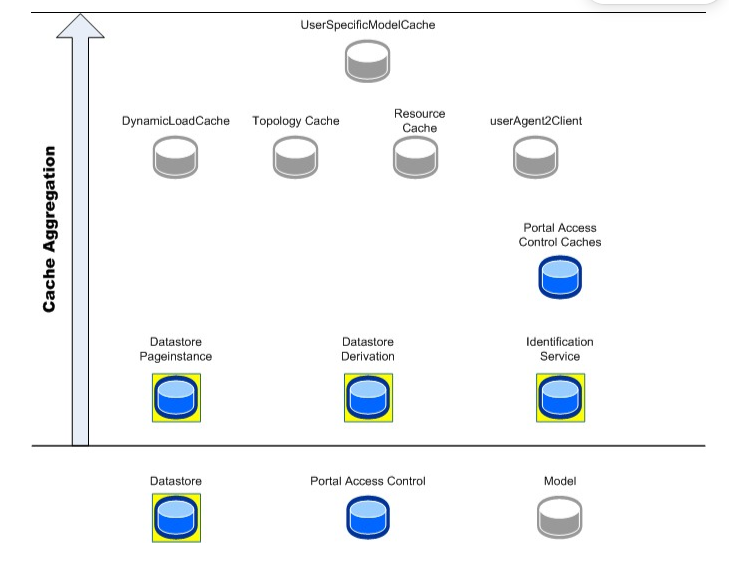

# Performance Tuning Guide for HCL DX on Kubernetes

## About This Document

This white paper serves as a foundational guide for parameter and application tuning specific to HCL Digital Experience 9.5 and higher releases (formerly known as IBM WebSphere Portal and IBM Web Content Manager) when deployed on Kubernetes.

Tuning and capacity considerations are influenced by a variety of factors, including the workload scenario and the performance measurement environment. The aim of this guide is not to prescribe exact parameter values but to familiarize readers with the parameters that were utilized in the Portal performance benchmarks.

Performance tuning is an iterative process, often requiring multiple adjustments to achieve the desired system performance. It is crucial to start with a baseline and continuously monitor performance metrics to identify which parameters may need modification. After making any changes, it is essential to conduct another measurement to evaluate the impact of that change. Ideally, only one parameter should be adjusted between each measurement to accurately assess the specific benefit of each tuning adjustment.

## Performance Tuning Overview

Tuning an HCL Digital Experience (DX) environment involves tuning and configuring the various systems and components of the environment. This chapter discusses some general concepts and details the specifics of the configuration used in our measurement environments. These specifics entail:

- Configuring the application server and the resources defined for that application server
- Tuning the database(s) and database server
- Tuning the directory server and its database
- Tuning the HA proxy server
- Optimizing Pod CPU Limits and Requests in Kubernetes
- Horizontal Pod Autoscaling
- Tuning the operating system and network stack
- Tuning the HCL DX services to ensure sufficient bandwidth to support the required user load
- Performance is acceptable even on slower, long-distance networks

When tuning specific systems, it is important to begin with a baseline and monitor performance metrics to determine if any parameters should be changed. When a change is made, another measurement should be made determine the effectiveness of the change.

This Performance Tuning Guide has been specifically tailored for HCL Digital Experience (DX) deployments on Kubernetes. It builds upon the existing performance tuning guidelines, with modifications and additions to address the unique challenges and opportunities presented by Kubernetes environments. The adjustments and recommendations provided in this guide are designed to optimize the performance, scalability, and reliability of DX applications within Kubernetes.

## Using This Document

A ConfigEngine tuning task was added in Portal 8.0.0.1 CF 6 and ships out of the box with HCL Portal 8.5 and above. This task automatically applies some, but not all the tuning changes discussed in this document. This includes basic tuning of the JVM Max heap & nursery sizes, JDBC & WebContainer ThreadPools and CacheManagerService properties.

The tuning task also configures Portal as a rendering server by setting deployment.subscriberOnly=true and turning off the toolbar. This can be changed for Authoring environments by editing the task’s properties files.

In Kubernetes this task is run automatically when deploying. Depending on the authoring value of true or false the tuning for the authoring or rendering environment is applied.

See [Portal server performance tuning tool](../../../deployment/manage/tune_servers/wp_tune_tool.md) for information on how to configure and run this task.

If additional tuning is necessary, start by applying the Base Portal Tuning then apply the tunings that are specific to the use case. For example, if you are using Web Content Management (WCM) also apply the WCM tunings.

## Environment Recommendations

Before beginning your install of HCL Portal and Web Content Manager, you should consider how the environment will be used to achieve ideal performance.

HCL DX 9.5 CF200 and later is designed to run on any [Certified Kubernetes platform](https://www.cncf.io/certification/software-conformance){target="_blank"} , provided that the following statements are true:

- The Kubernetes platform is hosted on x86-64 hardware.
- The Kubernetes platform is officially supported by [Helm](https://helm.sh/docs/topics/kubernetes_distros/){target="_blank"}.

For more information, see [System Requirements](../../../get_started/system_requirements/index.md).

To obtain the performance guidance deployments to support Kubernetes container platforms, refer to the following topics:

[Kubernetes Deployment](../../../get_started/plan_deployment/container_deployment/index.md)

[Containerization requirements and limitations](../../../get_started/plan_deployment/container_deployment/limitations_requirements.md)

### Prerequisites checker for DX deployment

HCL DX provides a tool called "Prereqs Checker" that runs several checks to confirm whether the prerequisites for various components are met.

You can get the result of these checks from the container logs of the prereqs-checker container in the pod where Prereqs Checker is installed. For more information, see [Configure Prereqs Checker For DX Deployment](../../../deployment/install/container/helm_deployment/preparation/optional_tasks/optional-core-prereqs-checker.md).

For these checks, one separate sidecar container is deployed with the main application container. This is a lightweight container, so the main application performance is not affected.

The primary objective of the Prereqs Checker is to learn whether the specified prerequisites are met and to inform users of the result in the logs. You can also use the checker to discover basic information about the file system of the mounted volumes, which helps track the issues related to the file systems.

### DX deployment options

HCL Digital Experience is a platform that helps you deliver the critical services of your organization. It is designed to be scalable and flexible, supports authentication for security and personalization, and aids in integration with varied applications. Strong encryption and cross-system authentication keep your business-critical functions safe. Your teams can create, manage, and deliver powerful and reliable digital experiences every day.

There are different options to deploy DX:

**Traditional deployments**: You can deploy HCL DX on-premises in the WebSphere Application Server infrastructure.

**Container-based deployments**: HCL supports container-based deployments. You can deploy HCL DX into Kubernetes infrastructures to manage and maintain multiple environments such as testing, development, staging, and production.

For more information, refer to the detailed system requirements for [traditional deployments](../../../get_started/system_requirements/traditional/index.md) or [container-based deployments](../../../get_started/system_requirements/kubernetes/kubernetes-runtime.md).

For information on container based deployments [Kubernetes Deployment](../../../get_started/plan_deployment/container_deployment/index.md)


One component, DX Core, is common to both deployment options. DX Core contains several functions, which were originally available for traditional deployments. These functions are applicable to both traditional and container-based deployments. 

In addition to the DX Core features, several container-specific features are available only for the container-based deployments.

Whether developing, testing, or running a full production environment, using container-based deployments provide the best results for the ease of deploying applications, including the latest version of HCL Digital Experience. You can deploy applications and DX in a fraction of the time that the traditional deployment model requires.

### Hardware Multithreading

Many modern processor architectures support hardware multithreading. For example, this is known as Hyper-Threading (HT) on Intel processors and Simultaneous Multithreading (SMT) on Power processors. Our experience is that using hardware multithreading provides an improvement in capacity in all of the scenarios and platforms we have measured, so we would recommend its use on platforms where this is an option.

### Virtualization

When running Portal in a virtualized environment, it is important to ensure that the virtual machines are allocated enough resources to perform optimally. To reach capacity on a virtual machine (VM) it may be necessary to ensure that the virtual resources map one-to-one with physical resources, especially CPU and memory. Running Portal on a VM whose host is overcommitted will not achieve optimal performance. Consider dedicating CPUs and memory to the Portal VMs.

In addition, ensure that the network bandwidth to the host is sufficient for all VMs. Depending on requirements, the Portal VM may require a dedicated network interface on the host.

## Base Portal Tuning

There are many aspects to configuring and tuning an application server in WebSphere Application Server. The aspects presented here are critical to an optimally performing Digital Experience in our benchmark environment.

The base Portal Scenario covers user login, page navigation and interaction with simple portlets. Users can see a set of pages which are visible to all authenticated users. Another set of pages, based on LDAP group membership, is also configured.

We have also benchmarked several other scenarios, which focus on different functions or use cases for WebSphere Portal. There are scenarios which make use of Web Content Management (WCM) and page management. In previous versions of Portal, a scenario where users have access to thousands of pages was also measured. While we have used different values to optimize performance for some of those scenarios, the tuning is all based on the tuning detailed in this section.

### Tuning via the Integrated Solutions Console

To get to WebSphere Integrated Solutions Console, start WebSphere Portal and then login to the WebSphere Integrated Solutions Console via https://{yourserver}/ibm/console with the administrator user ID created during Portal installation.

### JVM Tuning
#### Heap Size

When setting the heap size for an application server, keep the following in mind:

- Make sure that the system has enough physical memory for all the processes to fit into memory, plus enough for the operating system. When more memory is allocated than the physical memory in the system, paging will occur, and this can result in very poor performance.
- After doing any tuning of heap sizes, monitor the system to make sure that paging is not occurring.
- We set the minimum and maximum heap sizes to the same values since we’re using the generational, concurrent (or ‘gencon’) garbage collection which helps avoid heap fragmentation. Generational concurrent garbage collection has given the best throughput and response time results in our measurements.
- Note that running clustered WebSphere nodes may require larger heap sizes compared to standalone, non-clustered systems if session replication is being used. This is especially true if using memory-to-memory session replication since session information is also stored in the JVM. After doing any heap size tuning, monitor the verbose garbage collection output to determine if the selected size is appropriate. Ideally, the system should spend no more than 10% of its time in garbage collection.

In HCL Portal, the maximum heap size is highly dependent on cache tuning values. In general, the larger the caches, the better performance will be. Larger caches, however, use more JVM heap.

The values used in performance benchmarks, detailed below, are set primarily to allow larger cache sizes, not because the measured portlets use significant amounts of memory. These values are related to the hardware configuration and the total throughput each can support. They do not reflect the absolute limits of each architecture. Values will need to be tuned based on specific hardware and application configuration, especially the throughput and number of active users required.

By default, **Maximum JVM Heap Size is set to 3584**

**How to Set**

In the WebSphere Integrated Solutions Console

Servers → Server Types → WebSphere application servers → WebSphere_Portal → Server Infrastructure: Java and Process Management → Process Definition → Java Virtual Machine

**Initial Heap Size**

**Maximum Heap Size**

During our performance testing, we observed a 2% improvement by increasing the heap size to **4096MB** (4 GB). This adjustment was particularly beneficial when caching was enabled. We recommend using this configuration as a reference for your medium configuration tests to optimize performance.

This suggests that by adjusting the heap size in your environment, especially when caching mechanisms are in place, you may achieve similar performance gains.

#### Nursery Size

When using the generational garbage collector, the JVM will automatically split the heap between the nursery (where new objects are allocated) and the tenured region (where long-lived objects reside). However, we found that the JVM tended to under-size the nursery, and that we were able to increase overall throughput by overriding the automatic sizing of the nursery.

**How to Set**

In the WebSphere Integrated Solutions Console

Servers → Server Types → WebSphere application servers → WebSphere_Portal → Server Infrastructure:Java and Process Management→Process Definition → Java Virtual Machine

Add **-Xmnxxxm** to the Generic JVM Arguments, where **xxx** is the size in MB.

**JVM Nursery Size** is set to **1024**

#### Shared Class Cache Size

Class sharing in the IBM JVM offers a transparent and dynamic means of sharing all loaded classes, both application classes and system classes. From the point of performance, this can reduce the startup time for a JVM after the cache has been created. It can also reduce the virtual storage required when more than one JVM shares the cache.

WebSphere Application Server enables class data sharing by default and sets the size of this cache to 950MB. Many HCL Portal applications will have more than 90MB of shared-class data, so an additional benefit can be achieved by increasing this cache size. We found that about 75MB was in use after starting Portal, so we used a shared class cache size of 150MB to allow room for additional applications. We also saw that by increasing the size of the shared class cache, our performance results were more repeatable across multiple measurements.

The shared class cache persists until it is destroyed, thus you must destroy it first if you want to change its size.

Note that the shared class cache is shared for all WebSphere JVMs on the same server. This includes the WebSphere Deployment Manager (DMGR) and node agent JVMs. To properly change the cache size in cluster configurations, the node agent and the DMGR (if on the same server as Portal) need to be stopped before the cache is destroyed. The cache size setting should be also made on the node agent and DMGR in addition to Portal so that starting the DMGR and node agent do not override the Portal server setting.

**How to Set**

1. In the WebSphere Integrated Solutions Console
Servers → Server Types → WebSphere application servers → WebSphere_Portal → Server Infrastructure: Java and Process Management→Process Definition → Java Virtual Machine 
Add **-Xscmxnnnm** to the Generic JVM Arguments field, where **nnn** is the size in MB.
2. Stop Portal server
3. Under &lt;AppServer root&gt;/java/bin, run the following command.
Note that the name of the shareclasses changes depending upon platform and release. To determine the name you need to use, search the verbose GC log (native_stderr.log) and look for Xshareclasses:name=
    -  ./java -Xshareclasses:name=webspherev85_1.7_64%g,groupAccess,destroy
4. Look for the message
**JVMSHRC010I Shared cache "webspherev85_xxx" is destroyed. Could not create the Java virtual machine.**
5. Start Portal Server
6. Check cache size in use
    -  ./java -Xshareclasses:name= webspherev85_1.7_64%g,groupAccess,printStats

*JVM Shared Class Cache* Size is set to **150**

#### MaxDirectMemorySize

This JVM parameter sets an upper bound on the amount of native memory (not Java heap memory) that can be allocated through the DirectMemoryAllocation API, which is most commonly used for

DirectByteBuffers. These buffers are used in I/O operations, including network sends and receives. This parameter should be treated as "tunable". Any optimum value is going to be deployment, application and workload specific.

If this parameter is not specified, then there is no hard upper limit on the size of this memory. The native memory for these buffers is automatically adjusted upward by the JVM as needed by the application. Before growing the physical memory allocation, however, the JVM aggressively attempts to reclaim memory (to avoid new allocations) by performing one or more System garbage collections (GCs). These System GCs may cause undesirable latency behavior in the system since application threads are paused during any GC operation.

If this parameter is specified, two things change:

1. The specified value is treated as a 'hard limit' by the JVM. If the application requests DirectMemory which would exceed the limit, the JVM will attempt to free memory by performing System GC(s), in the same way if the limit was not specified. However, if the system is still unable to satisfy the memory allocation request, then because the specified limit is 'hard', the JVM throws an **OutOfMemoryError**, with a log message indicating the reason and suggesting adjustment of this parameter **(java.lang.OutOfMemoryError: Direct buffer memory::Please use appropriate '&lt;size&gt;' via -XX:MaxDirectMemorySize=&lt;size&gt;.)**
2. Our observations indicate that with this setting explicitly specified, the system avoids performing any system GC cleanup before growing the amount of physical memory allocated for these buffers (assuming that the allocation is still under the hard limit). Specifically, for the heavy load scenarios where these pause times were significant, this can be helpful.

If the application environment can tolerate intermittent high latency, then you may get acceptable throughput and response times by not specifying this parameter at all. But under heavy load, when Portal CPU utilization approached 80%, we have observed those delays to be higher than one minute. If you expect your system to be very heavily loaded and such GC events with the resulting delays would be undesirable, then we recommend setting this parameter to a 'large enough' value to accommodate the DirectMemory requirements of your environment. Determining what is 'large enough' requires testing with the closest possible approximation of the actual peak workload, with real-world data that would be used in a production deployment. Various tests with different workloads in WebSphere Portal yielded results that lead to the recommendations in this section. There is not necessarily one optimum setting for all cases.

The initial allocation of physical memory for these buffers is 64MB. This initial allocation size is currently not tunable.

**Monitoring**

Especially as the maximum allocation size is increased, the overall Java process size should be monitored to ensure that the server’s physical memory is not being overcommitted which would cause paging. The process size should also be monitored to make sure it is not growing over time; this could indicate a memory leak.

**Tested Values**

In the majority of our measurements with WebSphere Portal, the best results were obtained by explicitly specifying a maximum value. For most workloads, the use of **-XX:MaxDirectMemorySize=256000000** was sufficient. However, using 1G had no adverse effects as our systems had adequate memory for the Portal process. The one measurement in Portal testing where the above setting was inadequate was the Web Application Bridge scenario (WAB) when fetching 1MB pages. At very high transaction rates, this drove so much I/O throughput that we had to use a value of **1000000000** (1 GB) in order to allow the JDK to have enough direct memory to support the demands we were placing on it.

Again, it is best to try to determine a value for this parameter by simulating a very high transaction rate with "real world data" in a test environment.

As of Portal 9, MaxDirectMemorySize can be specified using a shorthand notation. For example **XX:MaxDirectMemorySize=1G** will set it to 1 gigabyte. If there is sufficient real memory on the server, there is no penalty for specifying **-XX:MaxDirectMemorySize=1G** and that value will avoid the out of direct memory condition for most workloads.

**How to Set**

In the WebSphere Integrated Solutions Console

Servers → Server Types → WebSphere application servers → WebSphere_Portal → Server Infrastructure: Java and Process Management→ Process Definition → Java Virtual Machine 
Add **-XX:MaxDirectMemorySize=1G** to the Generic JVM Arguments field.

**_com.ibm.websphere.alarmthreadmonitor.threshold.millis_**

The Portal log may contain the following warnings after a long period of heavy usage:

**000000f3 AlarmThreadMo W UTLS0008W: The return of alarm thread "Non-deferrable Alarm : 2" (0000003b) to the alarm thread pool has been delayed for 32480 milliseconds. This may be preventing normal alarm function within the application server.**

**How to Set**

Add the following to the Generic JVM arguments:

**\-Dcom.ibm.websphere.alarmthreadmonitor.threshold.millis=xxxxx** where xxxxx is greater than the number of milliseconds mentioned in the error message. We used as much as 40,000 in our runs.

#### Native Memory

Java uses native (non-heap) memory to store data about loaded classes, classloaders, threads, monitors and other metadata. All of this metadata must fit in the first 4GB of memory for the process. If there is insufficient space for additional metadata to be allocated, then a native OutOfMemoryError (NOOM) will be thrown. 

In general, this can happen for two reasons: 

1) there is a class, classloader, thread, or monitor leak, and 

2) the Java heap is sharing the 0 to 4GB address space.

The first cause can be investigated using the javacore.txt file that's produced with the NOOM by searching for large numbers of these objects.

The second cause is due to default performance optimizations that Java makes with compressed memory references. If metadata demands cannot be reduced, then the starting address of JVM heap memory can be changed. To have the JVM start addressing heap objects above 4GB, set the JVM parameter Xgc:preferredHeapBase=0x100000000. Note that this setting may cause slight performance regressions. Testing will be required to determine if this setting is optimum.

### Session Timeout

The default value for the session timeout is 30 minutes. Reducing this value to a lower number can help reduce memory consumption, which allows a higher user load to be sustained for longer periods of time. Reducing the value too low can interfere with the user experience as users will be forced to log in again if their session times out.

In the base Portal performance evaluation, we use an average think time of 12 seconds between mouse clicks. That is a shorter think time than humans use when interacting with a website. To compensate for the short think time, we used a short Session Timeout of 10 minutes. This is acceptable for a performance evaluation, but is not recommended for a production environment. The proper production setting depends on business needs. Load test should be run long enough to determine the system’s behavior when the maximum number of sessions is reached.

**How to Set**

In the WebSphere Integrated Solutions Console

Servers → Server Types → WebSphere application servers → WebSphere_Portal → Container Settings:Web Container Settings → Session Management → Session Timeout → Set Timeout

### Web Container Thread Pool Size

Set the servlet engine thread pool size and monitor the results. Increase this value if all the servlet threads are busy a significant percentage of the time.

The default minimum and maximum value of 50 was used for performance benchmarks. Fifty threads were enough to drive Portal to capacity with the portlets used in the measurement workload. Portlets which require access external systems, like databases, may require more threads.

If response times increase before CPU loads reach a high level, monitor the Web Container Thread Pool through the WebSphere PMI interface. If the thread pool is significantly utilized, the size should be increased.

**How to Set**

In the WebSphere Integrated Solutions Console

Servers → Server Types → WebSphere application servers → WebSphere_Portal → Additional Properties: Thread Pools→ Web Container → Thread Pool

- Minimum size threads
- Maximum size threads

We recommend setting the minimum and maximum thread pool size equal to each other. Memory leaks have been observed when these values differ. For additional discussion, see [IBM Support Article](http://www-01.ibm.com/support/docview.wss?uid=swg21368248).

### Data Source Tuning

Portal uses multiple database domains to store information. Each database domain has its own JDBC data source, so when tuning in the admin console remember to tune all the data sources.

#### Connection Pool Size

The default settings of 10 minimum and 50 maximum were used for the connection pool sizes for the base Portal Scenario. For WCM, higher maximum connection pool sizes are needed. Higher connection pool sizes may also be needed in other cases, such as using parallel portlet rendering or if larger web container thread pool is needed. In all cases, we recommend monitoring the database connection pools and increasing their maximum sizes if the pool is completely utilized.

**How to Set**

In the WebSphere Integrated Solutions Console: Resources → JDBC Providers → provider name → Data Sources → data source name → Connection pool properties

- Maximum connections
- Minimum connections

If deployed applications also use database connections, ensure that the connection pool is tuned for those data sources as well.

#### Prepared Statement Cache Size

All data sources are configured in a similar manner. The default setting of 10 was used for the prepared statement cache size on all data sources.

**How to Set**

In the WebSphere Integrated Solutions Console

Resources → JDBC Providers → provider name → Data Sources → data source name → WebSphere Application Server data source properties → Statement cache size.

The provider’s name and data source name are based on the names selected for that database during the database transfer step.

Be aware that specifying a larger prepared statement cache size can lead to OutOfMemory errors in situations where your application memory is already being highly utilized by your workload. The prepared statement cache size setting is the maximum allowed cache entries per database connection. So increasing the cache size on a data source that has a large number of connections can quickly increase the heap utilization for these cache objects. Any changes should be considered for each individual data source independently instead of across all data sources globally. Before increasing a data source's prepared statement cache size you should monitor your memory usage under a heavy workload to determine if there is enough JVM heap available to handle an additional increase.

Finally, in some workloads, increasing the prepared cache statement size will be of no benefit. For instance, on WCM workloads, due to the dynamic nature of the SQL statements generated against the JCR database the cache size would have to be very large to cover all of the different permutations. Even at significantly larger sizes, the cache hit rate would be very low.

## Security Related Fields

### Security Attribute Propagation

If the WebSphere Subject has not been customized, for example through Trust Association Interceptor (TAI) or a custom WAS login module, then there is no need to enable Security Attribute Propagation. Security Attribute Propagation (SAP) can add extra overhead due to the extra processing required. However, there are certain configurations where performance might be better with security propagation enabled due to reduction of remote registry calls. See [Security attribute propagation](https://www.ibm.com/docs/en/was/8.5.5?topic=users-security-attribute-propagation){target="_blank"} for more information.

If you want to enable SAP for functional reasons, you can reduce the overhead using a custom property **com.ibm.CSI.disablePropagationCallerList**. This will improve login performance. Adding this property and turning off SAP will give the best performance.

**How to Set When Propagation Is Not Required**

1. In the WebSphere Integrated Solutions Console

Security→Global security→Web and Sip security→Single sign-on(SSO) →uncheck 'Web inbound security attribute propagation'

2. In the WebSphere Integrated Solutions Console Security → Global security → Custom properties → New

**Name:** `com.ibm.CSI.disablePropagationCallerList`  
**Value:** `true`

### **_Avoid Refetching Static Content After Login_**

Many resources do not change before and after logging in. These resources include the **ra: collection** URLs that are part of the theme. The same URL can safely be used for authenticated and unauthenticated users.

How to Set

1. In the WebSphere Integrated Solutions Console: Security → Global security
2. Expand Web and SIP security
3. Click on General Settings
4. Check 'Use available authentication data when an unprotected URI is accessed'
5. Save

### Nested Group Cache

See the Nested Group Cache Section under Other Performance Tuning of this document for a discussion of disabling nested group cache.

### VMM Tuning

**VMM Context Pool**

Tune the VMM Context Pool to improve the performance of concurrent access to an LDAP server.

The settings specified here depend on the number of users that will be accessing Portal concurrently.

**How to Set in ISC**

1. In the WebSphere Integrated Solutions Console Security → Global security
2. Under **Available realm definitions** ensure Federated Repositories is selected
3. Click the **Configure** button
4. Click on the LDAP **Repository Identifier**
5. Click Performance under **Additional Properties**

**How to Set Manually**

Edit &lt;wp_profile_root&gt;/config/cells/&lt;cellname&gt;/wim/config/wimconfig.xml.

Change the contextPool settings to match the following:

&lt;config:contextPool enabled="true" initPoolSize="10" maxPoolSize="40" poolTimeOut="0" poolWaitTime="3000" prefPoolSize="40"/&gt;

**VMM Context Pool Settings**

| Context Pool Setting | Default Value | Value Used |
| --- | --- | --- |
| Initial Size | 1 | 10  |
| Preferred Size | 3<br><br>Number of open connections to maintain to an LDAP server | 40  |
| Maximum Size | 20<br><br>A value of 0 allows the pool to grow as large as needed.<br><br>If access to the LDAP server is shared by many systems, this setting may allow an excessive number of connections to the LDAP server; in such a case, set the maximum pool size to a value appropriate to your environment | 40 |

The number of active LDAP connections can be monitored by viewing the number of open connections on the LDAP server via the netstat command:
**netstat -an | grep 389 | wc -l**

Note: If your networking configuration requires your Portal server to access the LDAP server through a proxy (such as a firewall or a load balancer) that breaks TCP connections without notifying it’s endpoint, it may be necessary to modify the pool timeout to never reuse a connection past a certain age. View additional guidance on connection pooling options available from the [IBM WebSphere Application Server Knowledge Center documentation](https://www.ibm.com/docs/en/was/9.0.5?topic=settings-session-pool){target="_blank"}.

**VMM Caches**

Tune VMM search results and attributes cache to improve the performance of VMM search.

**How to Set in ISC**

1. In the WebSphere Integrated Solutions Console Security → Global security
2. Under **Available realm definitions?** ensure **Federated Repositories** is selected
3. Click the **Configure** button
4. Click on the **LDAP Repository Identifier**
5. Click ***Performance** under Additional Properties

**How to Set Manually**

Edit &lt;wp_profile_root&gt;/config/cells/&lt;cellname&gt;/wim/config/wimconfig.xml.

Change the **attributesCache** settings to match the following

&lt;config:attributesCache attributeSizeLimit="2000" cacheSize="8000" cacheTimeOut="1200" enabled="true"/&gt;

Change the **searchResultsCache** settings to match the following:

&lt;config:searchResultsCache cacheSize="8000" cacheTimeOut="600" enabled="true" searchResultSizeLimit="1000"/&gt;

**VMM Attribute Cache Settings:**

| Attribute Cache Property | Default Value | Value Used |
| --- | --- | --- |
| Cache size | 4000 | 8000 |
| Cache Timeout | 1200 | 1200 |

**VMM Search Results Cache Settings:**

| Search Results Cache Property | Default Value | Value Used |
| --- | --- | --- |
| Cache Size | 2000 | 8000 |
| Cache Timeout | 600 | 600 |

Note that with VMM caching content from the LDAP server, changes made to existing LDAP entries will not be visible to Portal until the cache entries expire.

In our performance testing for the medium configuration, we optimized the VMM (Virtual Memory Manager) settings by adjusting the Attribute Cache size and Cache Search Results to **10,000**. This tuning helped enhance performance by improving the efficiency of cache utilization.

We recommend applying similar VMM cache adjustments during your tests to achieve better performance, especially in scenarios with similar configurations. These settings can serve as a reference point for optimizing your system's performance.

**Advanced group configurations**

If your LDAP supports the group membership attribute, it is recommended to configure VMM to use it to gain a performance benefit. Details on the use of this attribute and steps to configure VMM to use it can be found in [Virtual Member Manager integration](../../../get_started/plan_deployment/traditional_deployment/user_registry_consideration/plan_vmm_int.md).

## Internationalization Service Tuning

An internationalized (i18n) application can be configured to interact with users from different regions in culturally appropriate ways. The internationalization service enables you to configure and manage an internationalization context for an application.

This feature is needed by the WebSphere i18n classes. If your application code is not using the following classes, it is safe to disable this service.

- com.ibm.websphere.i18n.context.UserInternationalization
- com.ibm.websphere.i18n.context.Internationalization
- com.ibm.websphere.i18n.context.InvocationInternationalization Note that Portal does not make use of these classes internally.

**How to Set**

In the WebSphere Integrated Solutions Console

Servers → Server Types → WebSphere application servers → WebSphere_Portal → Container Services:Internationalization service

Uncheck “Enable service at server startup”.

## Resource Environment Provider Properties

Note that all tunings in this section used the Integrated Solutions Console to edit Resource Environment

Provider properties. The same values can be changed by editing the appropriate properties file in the

PortalServer directory and running the ConfigEngine task update-properties to update the values in WebSphere. Regardless of how they are changed, the Portal server will need to be restarted for the new values to take effect.

**How to Set by Editing the Property File**

- Edit &lt;wp_profile_root&gt;/PortalServer/config/xxxService.properties.
- If the property is already listed, uncomment the existing line and set the desired value. If the property is not listed, add a new entry with the desired value.
- Run &lt;wp_profile_root&gt;/ConfigEngine/ConfigEngine.sh update-properties.

**How to Set Default Values**

To reset a property to the default value:

- In the WebSphere Integrated Solutions Console, go to the Custom Properties for the given Resource Environment Provider.
- Set the value for the property name to the default value listed in the following sections.

Note that there may be multiple Providers listed in the console. If this is the case, make sure that the properties are being updated at the _server level_ (Server=WebSphere_Portal), not the node level.


### Disable Tagging and Rating

If you are not using the Tagging and Rating services they can be disabled. In our results, disabling this improved capacity by 3%.

**How to Set**

In the WebSphere Integrated Solutions Console

Resources → Resource Environment → Resource Environment Providers → WP CPConfigurationService → Custom properties

Modify the following custom properties:

- **Name:** `com.ibm.wps.cp.tagging.isTaggingEnabled`  
  **Value:** `false`
- **Name:** `com.ibm.wps.cp.rating.isRatingEnabled`  
  **Value:** `false`

The module can also be removed from the theme profile. The module name is wp_tagging_rating; by default it is in the deferred section of profile_deferred.json. For performance benchmarks, this module was left enabled, but the deferred section of the profile was never loaded as part of the measured workload, so the performance impact of removing it is unknown.

### Mashup Multipart Tuning

The Portal 9.5 theme multipart downloading can be disabled to improve performance. Be aware that disabling this may cause performance issues on client side aggregation themes from earlier Portal releases.

**How to Set**

In the WebSphere Integrated Solutions Console

Resources → Resource Environment → Resource Environment Providers → WP CommonComponentConfigService → Custom properties

Modify the following custom properties:

- **Name:** `cc.multipart.enabled`  
  **Value:** `false` (the default)
- **Name:** `cc.multipart.correlatehosts`  
  **Value:** `false`

### Disable Friendly URLs

Friendly URLs enhance the end user’s experience by placing a meaningful name in the browser’s address field. However, there is a cost for using friendly URLs. In our results, disabling friendly URLs improved capacity by 2% or more depending on the theme.

If you are using Blogs, Wikis or WCM content pages, do not set friendly.enabled or friendly.pathinfo.enabled to false. For more information, see [Friendly URL for web content example](../../../manage_content/wcm_delivery/deliver_webcontent_on_dx/customizing_content/friendlyurl_wcmviewer/wcm_config_wcmviewer_friendlyexample.md)

To fully use friendly URLs, pages must be configured with friendly names.

**How to Set**

In the WebSphere Integrated Solutions Console

Resources → Resource Environment → Resource Environment Providers → WP ConfigService

Modify the following custom properties:

- **Name:** `friendly.enabled`  
  **Value:** `false`
- **Name:** `friendly.pathinfo.enabled`  
  **Value:** `false`

Setting friendly.enabled to false, turns off Portal’s use of friendly URLs. Setting friendly.pathinfo.enabled to false turns off WCM’s use of friendly URLs. If WCM is not used in an installation, and friendly names are used by Portal, it is still advantageous to disable friendly.pathinfo.enabled.

### Rendering Only Environments

**Subscriber Only**

For Portal systems where no WCM authoring or page management is taking place locally, syndication overhead can be eliminated by specifying ‘subscriber only’. Set deployment.subscriberOnly to true in WCM WCMConfigService. For more information, see [Syndication properties](../../../manage_content/wcm_delivery/syndication/wcm_config_prop_syndication.md).

**How to Set**

In the WebSphere Integrated Solutions Console

Resources → Resource Environment → Resource Environment Providers → WCM WCMConfigService → Custom properties

**Name:** `deployment.subscriberOnly`  
**Value:** `true`

**Site Toolbar**

For rendering only sites where page management is not taking place locally, the Site Toolbar can be disabled. Set global.toolbar.enabled to false and default.toolbar.enabled to false in WP

VirtualPortalConfigService. For more information, see [Removing the site toolbar on a production server](../../../build_sites/create_sites/site_prep_content_author/prep_site_toolbar/wcm_mngpages_disabletool.md).

**How to Set**

In the WebSphere Integrated Solutions Console

Resources → Resource Environment → Resource Environment Providers → WP VirtualPortalConfigService

Modify the following custom properties:

- **Name:** `global.toolbar.enabled`  
  **Value:** `false`
- **Name:** `default.toolbar.enabled`  
  **Value:** `false`

### Getting Rid of Cache Invalidations

To reduce unnecessary cache invalidations set cache.dynamic.content.spot to false in WP ConfigService.

**How to Set**

In the WebSphere Integrated Solutions Console

Resources → Resource Environment → Resource Environment Providers → WP ConfigService → Custom properties

**Name:** `cache.dynamic.content.spot`  
**Value:** `false`

This setting increased throughput when using the Portal 9.5 theme, but might have a performance impact with the Page Builder theme. If an installation is using the Page Builder theme as well as the Portal 9.5 theme, benchmarks should be run to determine if the net effect is positive before setting this value.

### Cache ra:collections

To allow caching of ra:collection URLs, set resourceaggregation.cache.markup to true in WP ConfigService.

**How to Set**

In the WebSphere Integrated Solutions Console

Resources → Resource Environment → Resource Environment Providers → WP ConfigService

**Name:** `resourceaggregation.cache.markup`  
**Value:** `true`

### Disable Portlet Capability Filter

The runtime portlet capabilities filter allows a Portal developer to get friendly error messages on pages if the theme profile that is in place for a page does not contain all the capabilities that the portlets on the page require. This is very useful for development purposes, but has an undesirable overhead in a production environment. In production this filter should be disabled as the pages should be properly debugged before going into production.

For more information, see [Configuration settings for capability filters](../../../build_sites/themes_skins/customizing_theme/cfg_portal_theme_and_modules/themeopt_mod_capfilter_settings.md).


To disable, set **resourceaggregation.enableRuntimePortletCapabilitiesFilter** to **false** in WP ConfigService.

**How to Set**

In the WebSphere Integrated Solutions Console

Resources → Resource Environment → Resource Environment Providers → WP ConfigService → Custom properties

**Name:** `resourceaggregation.enableRuntimePortletCapabilitiesFilter`  
**Value:** `false`

### Navigator Service

The navigator service manages the content model for unauthenticated users, which controls the pages those users are able to see. This content model is periodically reloaded by WebSphere Portal. New pages which are visible to unauthenticated users will not be available until the next reload occurs. Our environment assumes a low rate of change for pages, so we set this reload to only occur once per hour. In a production environment where new pages for unauthenticated users are rarely created, setting this reload time to an hour or more will give better performance. In a test or staging environment where updates to unauthenticated pages need to be seen more often, a lower reload time is more appropriate.

This service also controls the HTTP cache-control headers which will be sent on unauthenticated pages. While our environment did not exploit HTTP page caching, increasing these cache lifetimes in a production environment can reduce load on the Portal. For more information about the use of HTTP cache-control headers with WebSphere Portal, refer to [Caching](../../../deployment/manage/config_portal_behavior/caching/index.md).

**How to Set**

In the WebSphere Integrated Solutions Console

Resources → Resource Environment → Resource Environment Providers → WP NavigatorService → Custom properties

**Navigator Service Settings**

| Parameter | Default Value | Value Used | Definition |
| --- | --- | --- | --- |
| public.expires (seconds) | 60  | 3600 | Determines cache expiration time for<br><br>unauthenticated pages in browser caches and proxy caches. If the setting remote.cache.expiration is also set to a value greater than or equal to 0, the smaller one of the two values is used. |
| public.reload (seconds) | 60  | 3600 | WebSphere Portal maintains an internal cache of the list of pages visible to unauthenticated users, and the arrangement of portlets on those pages. This controls how frequently that internal cache is refreshed. Note, however, that this is not caching the content of those pages – simply their layout. |
| remote.cache. expiration (seconds) | 10800 | 28800 | Determine cache expiration for caches outside of the Portal server for authenticated as well as for unauthenticated pages |

### Registry Service

HCL Portal maintains information about many resource types in its databases. Some of these resources are replicated into memory for faster access; this is provided by the registry service. This replicated information will be periodically reloaded from the database, thus picking up any changes which may have been made on a peer node in a clustered environment.

The registry service allows configuring a reload time, in seconds, for each type of data which it is managing. In a production environment, we expect this type of information to change very infrequently, so we used very long reload times for the registry service. These values do not include a size parameter as they are a full replication of the database.

**How to Set**

In the WebSphere Integrated Solutions Console

Resources → Resource Environment → Resource Environment Providers → WP RegistryService → Custom properties

**Registry Service Settings**

| Parameter | Default Value | Definition | Value Used |
| --- | --- | --- | --- |
| default.interval | 1800 | 28800 | Reload frequency for any object types not explicitly specified in the file. |
| bucket.transformationapplication.interval | 600 | 28800 | Reload frequency for transformation application definitions |
| bucket.transformation.interval | 600 | 28800 | Reload frequency for transformation definitions |

### Cache Manager Service

The cache manager service in HCL Portal is used to cache a wide variety of types of information in memory. These caches are somewhat similar to the registries maintained by the registry service, as each type of information gets its own cache. The key differences are:

- The information stored in the cache manager service’s caches tends to be more dynamic than the information stored in the registry service’s registries.
- The caches used by the cache manager service are limited in size, and entries will be discarded when the caches become full. The registries used by the registry service are not size-limited; they contain all entries of the specific data type.
- Expiry times are managed individually for each entry in the cache, managed by the cache manager service. In contrast, when the reload time is reached for a registry, the entire contents of that registry are reloaded.

**How to Set**

In the WebSphere Integrated Solutions Console

Resources → Resource Environment → Resource Environment Providers → WP CacheManagerService → Custom properties

Each cache has several configurable options. A full discussion of these options, along with a list of the caches in HCL Portal 9.5, is given in the Internal Portal Caches section. The table that follows lists the changes which we made to the CacheManager service for performance benchmarks. Size values are specified in “number of objects” and lifetime values are specified in “seconds”.

**CacheManager Service Settings**

| Parameter | Default<br><br>Value | Default<br><br>Value<br><br>(CF04) | Value Used |
| --- | --- | --- | --- |
| cacheinstance.com.ibm.wps.ac.AccessControlUserContextCache.size | 4000 | 6000 | 6000 |
| cacheinstance.com.ibm.wps.ac.ChildResourcesCache.lifetime | 7200 | 28800 | 28800 |
| cacheinstance.com.ibm.wps.ac.CommonRolesCache.size | 30000 | 40000 | 33000 |
| cacheinstance.com.ibm.wps.ac.ExternalOIDCache.lifetime | 8640 | 28800 | \-1 |
| cacheinstance.com.ibm.wps.ac.OwnedResourcesCache.enabled | True | False | False |
| cacheinstance.com.ibm.wps.ac.PermissionCollectionCache.lifetime | 10240 | 14400 | \-1 |
| cacheinstance.com.ibm.wps.ac.ProtectedResourceCache.lifetime | 10143 | 14400 | 14400 |
| cacheinstance.com.ibm.wps.datastore.services.Identification.SerializedOidString.c ache.size | 2500 | 5000 | 5000 |
| cacheinstance.com.ibm.wps.model.factory.UserSpecificModelCache.size | 2000 | 6000 | 6000 |
| cacheinstance.com.ibm.wps.pe.portletentity.lifetime | 5800 | 28800 | 28800 |
| cacheinstance.com.ibm.wps.pe.portletentity.size | 10000 | 5003 | 5003 |
| cacheinstance.com.ibm.wps.policy.services.PolicyCacheManager.lifetime | 7780 | 43200 | 43200 |
| cacheinstance.com.ibm.wps.puma.CommonPrincipalCache.size | 10000 | 30000 | 30000 |
| cacheinstance.com.ibm.wps.puma.DN_OID_Cache.size<br><br>Higher values can get a better hit ratio but not increase throughput | 1500 | 30000 | 30000 |
| cacheinstance.com.ibm.wps.puma.OID_DN_Cache.size | 1500 | 5000 | 5000 |
| cacheinstance.com.ibm.wps.resolver.data.cache.DataSourceCache.size | 1000 | 10000 | 8000 |
| cacheinstance.com.ibm.wps.resolver.data.cache.FirstLevelDataSourceCache.size | 1009 | 5000 | 2003 |
| com.ibm.wps.resolver.cor.cache.uri | 2000 |     | 2000 |
| cacheinstance.com.ibm.wps.resourceaggregator.ContributionsCache.size | 20  | 1000 | 1000 |
| cacheinstance.com.ibm.wps.services.vpmapping.HostnameToVirtualPortalIDCache .lifetime | 3600 |     | \-1 |
| cacheinstance.com.ibm.wps.spa.parser.locale.FirstLevelLocalizationParserCache.si ze | 1000 | 1000 | 1009 |
| cacheinstance.com.ibm.wps.spa.parser.skin.FirstLevelSkinParserCache.size | 1000 | 1000 | 1009 |
| cacheinstance.com.ibm.wps.spa.parser.theme.FirstLevelThemeParserCache.size | 1000 | 2000 | 2003 |
| cacheinstance.com.lotus.cs.services.UserEnvironment.size Tune this if live names support is used | 2000 | 2000 | 4500 |
| cacheinstance.DigestCache.cache.size | 2000 | 50000 | 45000 |

**Unused Caches**

Even though unused caches use some memory, the amount is minimal so it is not recommended to lower them below their default size.

**Cache Sizes**

For some cache types, performance will be better if the cache size is a prime number due to a lower probability of cache collisions. For such cache types, the actual size is increased, at runtime, to the next prime number equal or greater than the size specified.

### People Service

When assigning user and group permissions for WCM resources through the People Picker portlet, the People Service is used. While we did not use this tuning for our own benchmarks, in some cases the selection of users and groups may be slow and can be improved by reducing the default search attributes used by the service. In an example, note that People Picker expects 4 attributes. To improve search performance it’s possible to configure the same attribute 4 times since only one is needed. Attribute: pickerPeopleSearchAttribute

Value: cn,cn,cn,cn

For more information about defining Search attributes in HCL DX, see [Search - Portlet repository](../../../deployment/manage/portal_admin_tools/portal_scripting_interface/command_ref_psi/portlet_repo/search_ptlt_rep.md).


## Tuning via HCL Portal Administration

### Disable Search

Search can be disabled to improve performance if the search feature is not needed.

**How to Set**

Navigate to Was Console-> Resource environment providers->JCR ConfigService PortalContent->Custom properties

**jcr.textsearch.enabled property to false**

In the HCL Portal Administration Page

Search Administration/Manage Search → Search Collections → Delete all collections.

WP 8.0.0.1 CF09 introduced (from PI05486) the new ConfigEngine Task 'Delete Search Service and Collections'. In Portal 9.5 it is included as well. To run this task:

**ConfigEngine.sh action-delete-search-services-and-collections-wp.search.service**

See [PI05486: SCRIPT FOR REMOVING THE DEFAULT SEARCH SERVICE (LOCAL) AND ITS SEARCH COLLECTIONS](http://www-01.ibm.com/support/docview.wss?uid=swg1PI05486){target="_blank"} for more information.

These collections include the JCR collection and the “Default Search Collection”.

Note that these search collections do not include the WCM Authoring search indexer. 

During our medium configuration testing, we encountered numerous SSL errors while attempting to access the local environment. To mitigate this, we disabled all search collections on all core pods. Specifically, we set the jcr.textsearch.enabled property to false and deleted the search collections.

Since our performance tests focused on rendering the search center portlet without using the actual search functionality, this adjustment helped us avoid unnecessary processing and potential errors. We recommend considering this approach in your tests if the search functionality is not required, as it can help streamline performance and reduce errors in similar scenarios.

## Other Portal Tuning

### Reducing Redirects

#### Enabling Base URLs in Themes

Enabling base URLs reduces redirects and URL generation computations. This benefit is seen on the default themes shipped with Portal 6.1.5 through 9.5, as well as themes derived from those.

When enabling base URLs, in many configurations the **host.name** property needs to be set in **WP ConfigService**. The host name should be set to the value that an end user knows Portal as. For example if a reverse proxy is used, or virtual portals are used, the host.name in **WP ConfigService** resource environment provider should be the name of the reverse proxy or virtual portal.

**How to Set** 

1. Create a file named `redirectoff.xml` with the following contents:

    ```xml
    <?xml version="1.0" encoding="UTF-8"?>
    <request build="wpnext_372_01" type="update" version="8.0.0.0"
    xmlns:xsi="http://www.w3.org/2001/XMLSchema-instance"
    xsi:noNamespaceSchemaLocation="PortalConfig_8.0.0.xsd">
        <portal action="locate">
            <theme action="update" uniquename="ibm.portal.85Theme">
                <parameter name="com.ibm.portal.theme.hasBaseURL"
                type="string" update="set">true</parameter>
            </theme>
        </portal>
    </request>
    ```

2. From the command prompt, use the XMLAccess tool to import the `redirectoff.xml` file:

    ```bash
    ./xmlaccess.sh -in redirectOff.xml -user <portal adminID> -password <portal admin password> -url http://<hostname>:10039/wps/config
    ```

#### Eliminate Redirect on the Login Form

To avoid redirect on the login form page it is necessary to modify a theme JSP file with a text editor.

If using authentication proxies or single sign on (SSO) solutions, the redirect should be left enabled. This will ensure that the login is redirected to the correct 3<sup>rd</sup> party URL for user transparent authentication.

**How to Set**

### Modifying the JSP File

1. Locate the JSP file at the following path:

    `<ServerRoot>/PortalServer/theme/wp.theme.themes/default85/installedApps/DefaultTheme85.ear/DefaultTheme85.war/themes/html/dynamicSpots/commonActions.jsp`

2. Modify the highlighted fields in this part of the file from this:

    ```jsp
    <portal-navigation:urlGeneration allowRelativeURL="true" keepNavigationalState="false"
    contentNode="wps.content.root" home="protected">
        <a href='<% wpsURL.write(escapeXmlWriter); %>' >
            <portal-fmt:text key="link.login" bundle="nls.engine"/>
        </a>
    </portal-navigation:urlGeneration>
    ```

    To this:

    ```jsp
    <portal-navigation:urlGeneration allowRelativeURL="true" keepNavigationalState="false"
    contentNode="wps.Login" home="public">
        <a href='<% wpsURL.write(escapeXmlWriter); %>' >
            <portal-fmt:text key="link.login" bundle="nls.engine"/>
        </a>
    </portal-navigation:urlGeneration>
    ```

If a custom login page is used, make sure the contentNode matches the unique name of your login page.

In the previous example it was wps.Login. You can find the unique name of your login page under Portal Administration → Manage Pages. The login page is typically found in ‘Content Root’ → ‘Hidden Pages’.

### Personalization (PZN)

Some personalization (PZN) features require processing on every page request. If these are not needed, they can be disabled for better performance. Note that even with the below features disabled, WCM will still process PZN rules since it calls the PZN API directly. If PZN is not being used for WCM content the APIs are not called and there is no additional overhead.

#### Disable PZN Visibility Rules

If a Portal installation is not using PZN rules on individual pages and portlets, a 25% performance gain can be achieved by disabling the processing of these rules. The toolbar _does_ use visibility rules. If the toolbar is enabled, as described in this document, do not apply this tuning.

**How to Disable Visibility Rules for Pages & Portlets when no virtual portals used** 

Run the ConfigEngine command:

ConfigEngine.sh action-disable-pzntrans -DPortalAdminPwd=&lt;portal admin password&gt;\-
DWaspassword=&lt;websphere admin password&gt;

**How to Disable Visibility Rules for Pages & Portlets when a virtual portal is created using a context path:**

Run the ConfigEngine command:

ConfigEngine.sh action-disable-pzntrans -DVirtualPortalContext=&lt;contextpath&gt;
\-DPortalAdminPwd=&lt;portal admin password&gt; -DWaspassword=&lt;websphere admin password&gt;

**How to Disable Visibility Rules for Pages & Portlets when a virtual portal is created using a hostname:**

Run the ConfigEngine command:

ConfigEngine.sh action-disable-pzntrans -DVirtualPortalHostName=&lt;virtual portal hostname&gt;
\-DPortalAdminPwd=&lt;portal admin password&gt; -DWaspassword=&lt;websphere admin password&gt;

**How to reenable PZN:**

Run the ConfigEngine command

ConfigEngine.sh action-enable-pzntrans.

#### Disable PZN Referrer Headers

PZN also has the ability to use referrer headers to make decisions. If that feature is not used by an installation, it can be disabled for a performance benefit.

**How to Disable Personalization Processing of Referrer Headers**

Edit &lt;wp_profile_root&gt;/PortalServer/config/services/PersonalizationService.properties.

Set rulesEngine.preprocessor.enabled=false 
Restart the Portal server.

### Portal Theme Profiles 

A new modularized theme design became available with WebSphere Portal version 8.0. This design was continued for the version 9.5 theme. These themes permit easier inclusion or exclusion of components. In general it is best to include components that are used, and exclude components that are not used. For more information, see [The module framework](../../../build_sites/themes_skins/the_module_framework/index.md).

In our evaluation, we used a theme profile based on profile_deferred.json that ships with Portal 9.5. To allow easier comparison to earlier releases, we removed the following theme modules: wp_toolbar_host, wp_toolbar_actionbar, wp_analytics_aggregator, wp_analytics, wp_analytics_tags, wcm_inplaceEdit, wp_sametime_proxy, getting_started_module, wp_toolbar_host_view, wp_tagging_rating_light, wp_toolbar_host_edit. In addition we added a custom module that allowed top navigation to work.

The theme profile is a WebDAV resource. WebDAV resources are stored in the database, not on the file system. A WebDAV client is needed to add or modify the contents of a theme profile. The topic [Working with WebDAV clients](../../..//manage_content/wcm_delivery/webdav/administer_webdav/webdav_client.md) discusses the settings needed to connect to Portal using a WebDAV client.

The theme profile is specified in JSON format. Changing it requires downloading the file using a WebDAV tool, editing and saving the file back to the Portal database. [Adding or removing a module from a profile](../../../build_sites/themes_skins/the_module_framework/add_remove_oob_modules/index.md) has instructions on how to change the theme profile.

Note that if removing the last item in a section be sure to remove the comma from the previous item.

#### Pages with Different Theme Profiles 

While it is a good idea to include only the theme profile elements that a page actually uses, there is a performance penalty for using different theme profiles on different pages if many pages include the same base profiles, especially if the base includes larger CSS or Javascript files. This is due to the fact that each profile bundles all modules into a single set of Javascript and CSS files. Each bundle has a separate URL. So, each bundle requires a separate download to the user’s browser.

For example, Dojo is a large theme module in terms of download size. So, if there are two pages that need Dojo but each needs different extensions, there are two options:

**Two Profiles**

Page 1 Profile with Dojo plus Page 1’s extensions.

Page 2 Profile with Dojo plus Page 2’s extensions.

**A single profile including Dojo and the extensions needed for both pages.**

Option 1 will require a user to download a large amount of content (Dojo) on both pages. Option 2 will only require a single Dojo download. Since the bundles are cacheable in the browser, Option 2 will perform better for users visiting the second page since there will only be one download.

#### Out of the Box Portal Themes

Portal 9.5 ships with some useful profiles. profile_lightweight performs even better than the custom profile we used in our test. If that profile contains all the function necessary for your site, we recommend you use profile_lightweight for your site. The profile_deferred theme profile also performs very well, but we found that for rendering sites, where the toolbar function is typically disabled, it still makes sense to remove wp_toolbar_host and wp_toolbar_actionbar from the theme profile. For rendering-only environments, where only ‘active content, not drafts’ are published, a further response time improvement can be achieved by removing wp_draft_page_ribbon from the theme profiles.

In addition it makes sense to make sure the login portlet uses the same theme profile as the other pages. By default, login uses profile_deferred.

#### Theme Analyzer Tool 

Portal 9.5 includes a Theme Analyzer tool that can be used to analyze theme profiles, modules and dependencies. This tool is useful for determining which modules will be loaded by each profile and can help diagnose performance issues with custom themes. This tool can also show the Cache-Control headers that will be applied for each theme module. This is useful in determining why theme resources (ra:collection URLs) are not being cached by web browsers. See [Theme Optimization Analyzer](../../../build_sites/themes_skins/the_module_framework/themeopt_analyzer/index.md) for more information.

## Federated LDAP

### Disabling Nested Group Searches

For environments where federated LDAP is used, throughput can be improved by disabling nested group caches. For more information about nested group caches, see [Disabling nested group searches](https://www.ibm.com/docs/en/was-zos/9.0.5?topic=limitations-disabling-nested-group-searches){target="_blank"}.

**How to Set**

**Running Commands** in `wsadmin`

1. Navigate to the `wsadmin` tool:

    ```bash
    <WASRoot>/bin/wsadmin.sh
    ```

2. Run the following commands:

    ```bash
    wsadmin>$AdminTask configureAdminWIMUserRegistry {-customProperties {"com.ibm.ws.wim.registry.grouplevel=1"} }
    wsadmin>$AdminConfig save
    wsadmin>exit
    ```

### Enabling WebSphere and VMM to share group info

In a federated ldap environment, WebSphere and VMM can share cached information about groups. Setting this up is described in [Reusing group information](../../../deployment/manage/security/people/authorization/users_and_groups/reuse_group_info.md).

**How to Set**

In the WebSphere Integrated Solutions Console

Resources → Resource Environment → Resource Environment Providers → WP PumaStoreService → Custom properties

Create a new custom property:

**Name**: store.puma_default.filter.assertionFilter.classname

**Value**: com.ibm.wps.um.AssertionFilter

## If not using UX Screen Flow Manager

If a deployment is not using screen flow manager, it can be removed. We saw about a 2% improvement in throughput with it removed. The process for disabling it is described in [Configuration options](../../../extend_dx/screenflow/cfg_opt.md).

## Database Tuning

Multiple database domains are used to hold information in HCL Portal and Web Content Manager 9.5. The databases and related domains supported by Portal are:

1. Release (release domain). This is the primary database domain used by the base Portal scenario.
2. Customization (customization domain). This database receives some light traffic in our scenarios.
3. Community (community domain). This database receives some light traffic in our scenarios.
4. JCR (JCR domain). JCR database is used heavily in WCM (Web Content Management) Scenario. This database receives light traffic in all other scenarios measured in our Benchmark report.
5. Likeminds database, used for Likeminds enabled systems. This database is not used in the scenarios measured for the performance benchmarks.
6. Feedback database, used by the feedback subsystem. This database is not used in the scenarios measured for the performance benchmarks.

For more information on creating databases, see [Database Management Systems](../../../deployment/manage/db_mgmt_sys/index.md).

For more information on supported databases, see [Databases](../../../get_started/system_requirements/kubernetes/databases.md).

For more information on database domains, see [Shared database domains](../../../get_started/plan_deployment/traditional_deployment/database_consideration/db_domains_shared.md).

For base Portal the Release domain is the primary database being exercised.

### DB2 Tuning

HCL Portal uses database servers for core functionality. In our measurement environment, we used a DB2 database server for the Portal application. The LDAP server, IBM Tivoli Directory Server also included a DB2 database as a repository, but that database is configured only indirectly through the LDAP administration utilities.

We recommend using a remote database server for high throughput workloads. For our measurements we used IBM DB2 Enterprise Edition 11.5 as our database server.

We built six separate databases within one database server to house the tables and data needed to support each domain. All databases were placed in a single server instance.

### Linux, Unix & Windows (LUW)

Two of the database attributes, which DB2 relies upon to perform optimally, are the database catalog statistics and the physical organization of the data in the tables. Catalog statistics should be recomputed periodically during the life of the database, particularly after periods of heavy data modifications (inserts, updates, and deletes) such as a population phase. Due to the heavy contention of computing these statistics, we recommend performing this maintenance during off hours, periods of low demand, or when the Portal is offline. The DB2 runstats command is used to count and record the statistical details about tables, indexes and columns. We have used two techniques in our environment to recompute these statistics.

**Running DB2 `RUNSTATS` Command**

```sql
db2 runstats on table tableschema.tablename on all columns with distribution on all columns and sampled detailed indexes all allow write access
```

These options allow the optimizer to determine optimal access plans for complex SQL. A simpler, more convenient technique for recomputing catalog statistics is: 

```sql
db2 reorgchk update statistics on table all
```

Not only does this command count and record some of the same catalog statistics, it also produces a report that can be reviewed to identify table organization issues. However, we have found instances where this produces insufficient information for the optimizer to select an efficient access plan for complex SQL, particularly for queries of the JCR database.

We have determined a technique that has the same convenience of the reorgchk command and provides the detailed statistics preferred by the optimizer.

**Generating and Running `RUNSTATS` Commands in DB2**

1. Generate the `runstats.db2` file with the following command:

    db2 -x -r "runstats.db2" "select rtrim(concat('runstats on table',concat(rtrim(tabSchema),concat('.',concat(rtrim(tabname),' on all columns with distribution on all columns and sampled detailed indexes all allow write access'))))) from syscat.tables where type='T'"

2. Execute the `runstats.db2` file:

    db2 -v -f "runstats.db2"
    

The first command is used to create a file, runstats.db2, which contains all of the runstats commands for all of the tables. The second command uses the DB2 command processor to run these commands. These commands can be run on each Portal database and are recommended to run on the JCR and release database data population after significant content population or changes.

To determine which tables might benefit from reorganization, we use the command:

db2 reorgchk current statistics on table all > "reorgchk.txt"

For those tables which require reorganization, we use the following command to reorganize the table based upon its primary key:

db2 reorg table tableschema.tablename

You should also ensure that your database servers have adequate numbers of hard disks. Multiple disks allow for better throughput by the database engine. Throughput may also be improved by separating the database logs onto separate physical devices from the database.

You should ensure that the database parameter MaxAppls is greater than the total number of connections for both the data sources and the session manager for all WebSphere Portal application server instances. If MaxAppls is not large enough, you will see error messages in the Portal logs. Remember that there are multiple data sources for Portal, so this setting needs to be large enough to accommodate the maximum JDBC pools size for all data sources on all cluster nodes.

You should use System Managed Storage (SMS) for temporary tablespaces to benefit complex SQL which require temporary tables to compute their result sets. This saves time in buffer writes and improves disk utilization.

The maintenance tasks and practices mentioned here were found to be critical to the performance and correct operation of HCL DX Portal and Web Content Manager in our lab environment. Additional database maintenance and tuning may be needed in your production environments.

### Oracle Tuning

WebSphere Portal uses database servers for core functionality. In this measurement environment, we used Oracle database server for the Portal application. The LDAP server, IBM Tivoli Directory Server included a DB2 database as a repository.

#### Planning for Oracle Enterprise Edition

On Oracle, we built a single database and created Oracle users to own the tables and data needed to support each domain.

We recommend that you refer to the Oracle Administrator’s Guide to help you make informed database design decisions. Here are the key settings in our Oracle database.

- For better management and performance of database storage, Oracle-Managed Files are used for database, redo logs, and control files.
- Database block size: 8k
- The following tablespace sizing was required to support a Portal with 100,000 authenticated users, approximately 1,000 pages and 50,000 WCM content items with a load generally consisting of database read operations.

- **SYSAUX:** 1908MB
- **SYSTEM:** 805MB
- **TEMP:** 1MB
- **UNDOTBS:** 10MB
- **USERS:** 561MB
- **ICMLFQ32:** 4711MB
- **ICMLNF32:** 1MB
- **ICMSFQ04:** 230MB
- **ICMVFQ04:** 1MB
- **Redo log groups:** 500MB each

#### AIX

We configure our Oracle database on AIX using the following setup,

- Set the filesystem for Portal databases to Enhanced Journal File System (JFS2).
- Turn on concurrent I/O (CIO) for database filesystem as this improves performance. Do not enable CIO for Oracle product filesystem, ie, /u01, as Oracle could fail to start. To enable CIO, use the following command to mount the database fileset.

mount -o cio /u02

- Increase AIX maximum number of processes per user to 4096.

The default 500 processes per user is too low for database server, we increased it to 4096 in our AIX environment. To increase it, 

chdev -l sys0 -a maxuproc=’4096’

- Enable AIX async I/O, and increase MinServer to 5. smitty aio → Change/Show Characteristics of Async I/O → MinServers = 5
- We also set in oracle user’s profile as Oracle Installation Guide for AIX recommends

AIXTHREAD_SCOPE=S

#### Linux

We configured our Oracle database on RHEL6 by doing the following:

Tuned the resources limit settings for our Oracle user by adding the following to the /etc/security/limits.conf configuration file:

oracle soft nproc 2047 

oracle hard nproc 16384 

oracle soft nofile 1024 

oracle hard nofile 65536

For Linux kernel parameters, we ran the fixup script generated during the install process. The script added the following parameters to our /etc/sysctl.conf configuration file:

############################

\# ORACLE PARMS

############################

kernel.shmall = 2097152 

kernel.shmmax = 2147483648 

kernel.shmmni = 4096 

kernel.sem = 250 32000 100 128 

net.core.rmem_default = 4194304 

net.core.rmem_max = 4194304 

net.core.wmem_default = 262144 

fs.file-max = 6815744 

net.core.wmem_max = 1048576 

fs.aio-max-nr = 1048576

net.ipv4.ip_local_port_range = 9000 65500

#### Oracle Enterprise Edition Parameter Tuning

Database performance is very important for obtaining good overall performance from WebSphere Portal.

The following table shows a list of tuning applied on our Oracle database server with the alter system command. Additional database tuning might be needed in your production environments. For further information on Oracle database tuning, refer to [Oracle Performance Tuning Guide](https://docs.oracle.com/en/database/oracle/oracle-database/23/tdppt/index.html){target="_blank"}.

**Command used:** alter system set &lt;parameter&gt; scope=spfile;

Oracle Database Tuning

| Parameter | Value |
| --- | --- |
| Sessions | 1148 |
| sga_target | 4800M |
| pga_aggregate_target | 1595M |
| Processes | 750 |
| open_cursors | 1500 |
| db_files | 1024 |

#### Oracle Database Maintenance

Optimizer statistics are a collection of data about the database and the objects in the database. These statistics are used by the query optimizer to choose the best execution plan for each SQL statement. Because the objects in a database can be constantly changing, statistics must be regularly updated so that they accurately describe these database objects, particularly after periods of heavy data modifications (inserts, updates, and deletes) such as a population phase. We have used the following commands in our environment to recompute these statistics:

execute dbms_stats.gather_database_stats(dbms_stats.auto_sample_size, method_opt=>'FOR ALL INDEXED COLUMNS SIZE AUTO',cascade=>TRUE);

execute dbms_stats.gather_schema_stats(ownname=> '&lt;JCRUSR&gt;', cascade=> TRUE); 

where &lt;JCRUSR&gt; is the schema owner of the JCR database objects.

### SQL Tuning

#### SQL Server Database Maintenance

Update the SQL Server statistics for Portal, and JCR databases by opening SQL Server Management Studio, selecting New Query, and running the following query:

use &lt;db_name&gt; exec sp_updatestats @resample='resample';

## Other Database Considerations

### Cold Start

On a cold start of Portal, when web pages are first accessed, there are some expensive JCR database calls. The results of those database calls are cached. After Portal is warmed up, there shouldn’t be any database calls that take a long time to process. It is a good practice for the Portal administrator to access a few of the common pages after a cold start, before Portal is made available for general access. After warmup, if slow database queries are encountered, the Portal Performance Troubleshooting Guide has a section that can assist with troubleshooting database performance issues.

### _First Time a User Logs In_

HCL Portal maintains some information about users in its database tables, which grow when a user first logs in. Because we were interested in the steady-state performance of HCL Portal, our performance benchmarks evaluate the system after all users have logged in at least once.

## Directory Server Tuning

ITDS uses a DB2 database for storing user information. This database is typically located on the same system as the directory server. If your workload involves creating, updating, or deleting users, then occasional database maintenance may be needed on this database.

On a modern server, it should be feasible to fit the majority of your user population in memory on the LDAP server. The directory servers in our base Portal Scenario measurements were tuned with this goal in mind. Note that in ITDS, both the LDAP server and its underlying DB need to be tuned to support this goal.

The easiest way to configure ITDS is to use the graphical idsxcfg tool located in the sbin directory of your LDAP install location (usually /opt/ibm/ldap/V6.3/sbin on UNIX systems). Under the ‘Database tasks’ item, select ‘Performance tuning’. This will open a wizard interface that sets the necessary values based on user input. The percentage of system memory used by the instance should be set to 90%. The DB2 buffer pool sizes should be left as AUTOMATIC, the default. Other values should be set based on the LDAP user population.

Alternatively, the following values can be set manually in ibmslapd.conf. This file is in the etc directory of the LDAP instance home which is set to /home/dsrdbm01/idsslapd-dsrdbm01 by default on UNIX systems. You must restart the LDAP server after changing these values.

These values are applicable for the base Portal data population of 100,000 users and 15,000 groups. Note that the entry cache size and group member cache size are set to the number of users and groups in LPA so that all users and groups should be cached by the server.

IBM Tivoli Directory Server Settings

| Parameter | Value |
| --- | --- |
| ibm-slapdACLCacheSize | 25000 |
| ibm-slapdEntryCacheSize | 100000 |
| ibm-slapdFilterCacheSize | 1000 |
| ibm-slapdFilterCacheBypassLimit | 100 |
| ibm-slapdDbConnections | 15  |
| ibm-slapdGroupMembersCacheSize | 15000 |
| ibm-slapdGroupMembersCacheBypassLimit | 100 |

 During Medium config tests, we utilized an OpenLDAP container. We recommend that you use your own LDAP directory for performance testing. The OpenLDAP container provided a lightweight and flexible solution that met our testing needs, and this approach can be used as a reference for your own performance tuning efforts.

## HA Proxy and routing

To access applications from the outside, DX deploys a reverse proxy in the form of an HAProxy. This reverse proxy routes the incoming requests to all application services, which then distributes the requests to the corresponding pods hosting the applications.

HAProxy uses its configuration to select which request is mapped to which application in the DX 9.5 deployment (back-end). When requests are initiated from outside the Kubernetes or OpenShift cluster, HAProxy tries to fulfill those requests by using the configured routing. If it finds a matching endpoint, it forwards the request to the corresponding service, which then forwards the same request to a Pod that is ready to fulfill the request.

## Optimizing Pod CPU Limits and Requests in Kubernetes

When tuning performance on Kubernetes, managing CPU limits and requests for pods is crucial. Pods are the smallest deployable units in Kubernetes and consist of one or more containers. CPU requests define the guaranteed CPU allocation for a pod, ensuring it has the necessary resources, while CPU limits cap the maximum CPU a pod can consume.

To optimize performance, adjust these settings based on the demands of the application. Increasing CPU requests ensures stability under load by providing more guaranteed resources, whereas raising CPU limits allows the pod to use additional CPU during peak times, improving performance. However, careful consideration is needed to balance resource utilization and avoid over-provisioning.

In our medium configuration tests(configuration using 10,000 Virtual Users), we applied the tuning strategies discussed, specifically adjusting the CPU limits and requests for critical components such as HAProxy and RingAPI.Alterations were made to the number of pods, CPU, and memory of each of the following containers: HAProxy, Core, RingAPI, digitalAssetManagement, persistenceNode, and persistenceConnectionPool. The alterations to these containers aimed to determine which factors were significantly beneficial.

For the HAProxy container, increasing the CPU dramatically increased throughput. When the number of HAProxy pods was increased, the throughput decreased.

For the Core pod, increasing the CPU limit gave a boost to performance but this effect eventually saturated at 5600 millicore. Increasing the number of Core pods at this point had additional benefits. These adjustments were made to optimize performance and ensure the system could handle the expected load with improved response times and minimal errors. The results from these tests have validated the effectiveness of these tuning parameters in our Kubernetes environment.

For detailed information on the specific changes we made, including adjustments to CPU limits and requests, please refer to the Medium Configuration Sizing document. This document outlines the exact modifications and their impact on performance, providing a clear view of how we optimized the environment.

For more information and results, see [Medium Config sizing](rendering_medium_config.md).

_Horizontal Pod Autoscaling_

HPA is a feature that automatically scales the number of pods in a deployment, replica set, or stateful set based on observed CPU utilization or other select metrics. HPA helps ensure that your application can handle varying loads efficiently by increasing or decreasing the number of pods as needed.

**How HPA Works:**

Metrics Collection: HPA regularly queries the metrics server for resource utilization (e.g., CPU, memory) of the pods.

Scaling Decision: Based on the specified target metrics (e.g., 70% CPU usage), HPA calculates whether the current number of pods is sufficient.

Adjustment: If the utilization exceeds or falls below the target, HPA adjusts the number of pods accordingly, either scaling out (adding more pods) or scaling in (reducing the number of pods).

We have leveraged Horizontal Pod Autoscaling (HPA) to determine the appropriate CPU limits for the Core, DAM, HAProxy, and Ring API pods. By observing how these components scaled under varying workloads, HPA provided valuable insights into the optimal CPU limits required for each pod. This approach allowed us to fine-tune the resource allocation, ensuring that the system can efficiently handle the specific workload while maintaining performance and stability.

To enable HPA for a deployment, you would typically define a YAML configuration that specifies the target CPU utilization and minimum/maximum pod counts. For example:





Horizontal Pod Autoscaling is an essential tool in Kubernetes for maintaining application performance and resource efficiency as demands change.

## Key Focus Areas for Effective Performance Tuning

**Resource Allocation and Management**

- **CPU Limits and Requests**: Ensure that your CPU limits and requests are appropriately configured. This helps in avoiding resource contention and ensuring your application has the necessary resources during peak loads. Refer sizing document for CPU limit and requests. 

Refer to [Medium Config sizing](rendering_medium_config.md) for more information.

- **Memory Management**: Review and adjust memory allocations to prevent out-of-memory errors and ensure smooth operation. 

Out of Memory (OOM) errors in Kubernetes pods occur when a container inside a pod tries to use more memory than it has been allocated, leading to the container being terminated by the Kubernetes runtime. While executing the performance runs, we observed an OOM error for the OpenLDAP pod. To address out of memory issues, increase the memory limits for the affected pods. Depending on the pod you would also need to increase the JVM heap size as well (like for Core container). 

**Horizontal Pod Autoscaling**

- Configure auto-scaling policies to automatically adjust resources based on demand. Refer Horizontal Pod Acutoscaling topic in this guide.

**WCM advanced Caching**

- Refer WCM advanced caching topic in this guide.

**Performance Monitoring and Integration**

- Refer Whitepaper-on-DX-K8s-Performance-Monitoring-Guidance document (this is internally published as of now)

## Web Content Management Tuning

In general, the same tuning that was used for the base Portal scenario was used for the WCM scenarios.

The main differences are in the cache tuning settings: WCM increases demands on the Portal access control (PAC) component which requires a different set of cache tunings. WCM has an internal set of tunable object caches as well.

On top of cache tunings, WCM can require more Web Container threads and JCR data source connections than the base Portal Scenario, especially for heavy authoring workloads. The differences in tuning are mentioned below.

**NOTE: These tunings are to be made in addition to the base Portal tunings unless otherwise specified. Apply the base Portal tunings first.**

### Tuning via the Integrated Solutions Console

#### JVM Heap Sizes

**JVM Heap Sizes for WCM**

| Parameter | WCM Rendering | WCM Authoring |
| --- | --- | --- |
| Initial and Maximum heap size (MB) | 4096 | 3584 |
| Nursery size (MB) | 1536 | 1024 |

**How to Set**

See the Heap Size tuning section for base Portal.

#### Web Container Thread Pool Size

Sixty (60) threads were used for both the minimum and maximum value

**How to Set**

See the Web Container Thread Pool Size tuning section for base Portal.

**JDBC Data Source Pool Sizes for WCM**

|     | Rendering Value (min/max) | Authoring Value (min/max) |
| --- | --- | --- |
| RELEASE | 10/100 | 10/50 (default) |
| COMMUNITY | 10/100 | 10/50 (default) |
| JCR | 10/150 | 10/150 |

See the Connection Pool Size tuning section for base Portal.

Note that the JCR data pool size should be set to 2.5 times the size of the Web Container Thread pool.

#### WCM Object Cache

**WCM Object Cache Settings**

| Cache Name | Default Value | WCM Rendering Value | WCM Authoring Value |
| --- | --- | --- | --- |
| abspath | 5000 | 32000 | 8000 |
| abspathreverse | 5000 | 32000 | 8000 |
| processing | 2000 | 10000 | 10000 |
| session | 2000 | 6000 | 6000 |
| strategy | 2000 | 32000 | 8000 |
| summary | 2000 | 4000 | 2000 |

**How To Set**

In the WebSphere Integrated Solutions Console

Resources → Cache instances → Object cache instances

Detailed descriptions of these caches can be found in the WCM Cache Instances section of this document.

#### Cache Manager Service

**How to Set**

In the WebSphere Integrated Solutions Console

Resources → Resource Environment → Resource Environment Providers → WP CacheManagerService → Custom properties

**Cache Manager Service Settings for WCM**
 
CacheManagerService.properties

| Parameter | Default Value | Value Used |
| --- | --- | --- |
| cacheinstance.com.ibm.wps.ac.CommonRolesCache.size | 40000 | 50000 |
| cacheinstance.com.ibm.wps.ac.ProtectedResourceCache.size | 5000 | 20000 |
| cacheinstance.com.ibm.wps.cp.models.ModelCache.CategoryModel.lifetime | 3600 | 28800 |
| cacheinstance.com.ibm.wps.cp.models.ModelCache.ResourceModel.lifetime | 3600 | 28800 |
| cacheinstance.com.ibm.wps.cp.models.ModelCache.ResourceModel.size | 10000 | 2000 |
| cacheinstance.com.ibm.wps.cp.models.ModelCache.TagModel.lifetime | 3600 | 28800 |
| cacheinstance.com.ibm.wps.cp.models.ModelCache.TagModel.size | 200 | 2000 |
| cacheinstance.com.ibm.wps.pe.portletentitycounter.size | 2000 | 5000 |
| cacheinstance.com.ibm.wps.resolver.resource.AbstractRequestDispatcherFactory.size | 20 | 100 |

we added a new property during performance testing:

**cacheinstance.com.ibm.wps.resolver.friendly.cache.size=5000**

This adjustment was made to optimize caching and improve performance during testing.

#### Access Control Data Management Service

By using the loadRolesParentBased algorithm in our authoring environment, an approximate 70% improvement in capacity was seen in performance benchmarks.

The loadRolesParentBased setting changes the loading algorithm fo(r the ROLE_INST and

LNK_USER_ROLE tables in the database. Instead of loading all assigned roles for a specific principal, only the currently requested access control data is loaded and cached. This is beneficial to a dynamic type of workload like authoring where there are many items being created and deleted that require cache updates. Be aware that this setting may increase database load since fewer items will be cached so be sure that your database server has spare capacity before setting.

**How to Set**

In the WebSphere Integrated Solutions Console

Resources → Resource Environment → Resource Environment Providers → WP AccessControlDataManagementService → Custom properties

Alternatively, the cache settings can be set in the AccessControlDataManagementService.properties file and updated via the ConfigEngine.

**Access Control Data Management Service Settings for WCM**

| Parameter | Default Value | Used Value |
| --- | --- | --- |
| accessControlDataManagement.acucIgnoreResourceTypes | n/a | null(value should be the string “null”, not blank) |
| accessControlDataManagement.loadRolesParentBased | false | true |

**Use the loadRolesParentBased setting in WCM authoring environments only.**

**Leave the default false value in rendering environments.**

**Setting accessControlDataManagement.acucIgnoreResourceTypes can interfere with strict access controls in environments where role assignments change based on workflow stage.**

#### WCM Configuration Service

**WCM Configuration Service Settings**

| Cache Name | Default Value | WCM Rendering Value | WCM Authoring Value |
| --- | --- | --- | --- |
| deployment.subscriberOnly | false | true | False |
| user.cache.enable | false | true | True |
| resourceserver.browserCacheMaxAge | 600 | 86400 | 600 |

##### subscriberOnly/User cache

Enable the user cache and subscriberOnly setting. The subscriberOnly setting should be enabled only for environments that will be subscribed to and not syndicated from. We recommend this be enabled in a production rendering environment.

**How to Set in the Integrated Solutions Console**

In the WebSphere Integrated Solutions Console

Resources → Resource Environment → Resource Environment Providers → WCM WCMConfigService →

Custom properties

**Name:** user.cache.enable

**Value:** true

**Name:** deployment.subscriberOnly

**Value**: true

##### WCM browserCacheMaxAge

Caching WCM resources in a browser or caching proxy.

Static files like images, CSS and Javascript can be stored in WCM and referenced, via a URL, from a Web Content Viewer portlet or the theme. A performance benefit can be obtained by setting the security on these static resources to allow anonymous users to access them so that they can be shared,cacheable amongst several users through a caching proxy and avoid being served directly from WCM on every request.

WCM will attach a cache-control header to these resources to ensure proper caching by browsers and caching proxies. If the security settings of the resource allows anonymous users to access it, WCM will attach a "public,max-age=600,post-check=300,pre-check=600" cache-control header to the response by default. If the security on the WCM resource only allows authenticated users to see it, you will see a "private, max-age=600" instead. If you wish to modify the timeout WCM uses for the cache-control header, update the following property in the WCMConfigService Resource Environment Provider (REP) using the instructions below.

**How to Set in the Integrated Solutions Console**

In the WebSphere Integrated Solutions Console

Resources → Resource Environment → Resource Environment Providers → WCM WCMConfigService → Custom properties

**Name:** resourceserver.browserCacheMaxAge

**Value:** &lt;timeout value in seconds&gt;

##### _Versions_

Typically versions are not necessary in rendering environments since there is no active authoring occurring in your rendering environment. There are however other actions that can cause versions to be created unexpectedly. One example would be modifying Managed Pages using xmlaccess. For this reason we recommend turning off versioning by setting it to manual in rendering only environments. The default setting is to always create a version.

**How to Set in the Integrated Solutions Console**

In the WebSphere Integrated Solutions Console

Resources → Resource Environment → Resource Environment Providers → WCM WCMConfigService → Custom properties

**Name:** versioningStrategy.Default

**Value:** manual

**Name:** versioningStrategy.AuthoringTemplate

**Value:** manual

**Name:** versioningStrategy.Component

**Value:** manual

**Name:** versioningStrategy.Content

**Value:** manual

**Name:** versioningStrategy.PresentationTemplate

**Value:** manual

**Name:** versioningStrategy.SiteArea

**Value:** manual

**Name:** versioningStrategy.PortalPage

**Value:** manual

**Name:** versioningStrategy.Taxonomy

**Value:** manual

**Name:** versioningStrategy.Workflow

**Value:** manual

##### WCM Advanced Caching

WCM implements a time based internal caching layer called the Advanced Cache that can be used to significantly increase capacity when using WCM rendering portlets. In our own internal testing of our WCM rendering scenario using a timeout of 24 hour (REL 1D), we were able to achieve a 32% increase in capacity with the SITE cache level setting and a 15% increase in capacity with the SECURED cache level setting. Use of WCM Advanced Caching is recommended if your business requirements allow it.

**How to Set**

Pick your desired Cache Level (see “When to Use Each Caching Level”)

Select the related entries from the table below

In the WebSphere Integrated Solutions Console

Resources → Resource Environment → Resource Environment Providers → WCM WCMConfigService → Custom properties

**Name:** connect.businesslogic.defaultcache

**Value**: _See defaultcache value in table below for your desired cache level_

**Name:** connect.moduleconfig.ajpe.contentcache.defaultcontentcache

**Value:** _See defaultcontentcache value in table below for your desired cache level_

**Name:** connect.moduleconfig.ajpe.contentcache.contentcacheexpires Value: _&lt;formatted_time&gt;_

**Caching Parameters for WCM**

| Cache Level | defaultcache value | defaultcontentcache value |
| --- | --- | --- |
| None | false | None |
| Basic (default) | true | N/A |
| Site | false | Site |
| Session | false | Session |
| User | false | User |
| Secured | false | Secured |
| Personalized | false | Personalized |

Note that Basic caching only works with the WCM servlet. Advanced caching is needed for WCM Rendering Portlets.

**When to Use Each Caching Level**

- Content is not personalized / only anonymous users accessing the system: **Site**

Every user can access the same cached items.Content is personalized

- Content is unique for different groups of users: **Secured**

Users that belong to the same groups will access the same cached items 

- Content is unique for different personalization profiles: **Personalized**

Users that share the same personalization profile will access the same cached items 

- Content is unique for every user: **User**

Every user gets its own cached items; items are stored in a cache 

- Content is unique for every session: **Session**

Every user gets its own cached items; items are stored in the session 

**Cache Expire Time Formats**

When setting the cache expire settings, you can specify either a relative time or absolute time: 

- `REL {integer-value}{units}`

-  `ABS {date-format-string}`

Where `{units}` is one of:

- `d|D` for days
- `m|M` for months 
- `s|S` for seconds 
- `h|H` for hours

Valid {date-format-string} values: 

- Mon, 06 Nov 2000 09:00:00 GMT
- Monday, 06-Nov-00 09:00:00 GMT
- Mon Nov 6 09:00:00 2000
- 6 Nov 2000 9:00 AM

**Note:** The last two formats assume GMT.

**Examples:**

- `contentcacheexpires="REL 300S"`
- `contentcacheexpires="ABS Mon, 06 Nov 2000 09:00:00 GMT"`

For more information, see [Web content cache types](../../../manage_content/wcm_configuration/cfg_webcontent_delivery_env/caching_options/wcm_config_delivery_caching_types.md).

**WCM Secured Advanced Cache group filter**

An additional performance benefit for Secured Advanced Caching can be realized by using the Advanced Cache group filtering feature. Since a group membership is used as the cache key for the Advanced Cache with the Secured setting, if there are a large number of groups that are not being used for access control on WCM items it can decrease the hitrate of the cache. A subset of groups that are only being used for WCM access control can be set to only be used for Advanced Cache key calculation by specifying the property below. In our own internal tests, we realized an additional 3% increase in capacity when using Secured Advanced Caching with this setting. By default, a semi-colon is used to separate the groups listed in the filter

**How to Set**

In the WebSphere Integrated Solutions Console

Resources → Resource Environment → Resource Environment Providers → WCM WCMConfigService → Custom properties

**Name:** connect.moduleconfig.ajpe.contentcache.secured.cache.group.subset

**Value:** _&lt;groups to be used in filter&gt;_

#### JCR Text Search

During our measurements, we have disabled text indexing. In a production environment, text indexing is done periodically, adding new content to the text index. However, the indexing interval is not synchronized with our load plateaus. As a result, if we let text indexing run during our performance measurements, it would likely reduce the reliability and repeatability of our measurements.

We do not recommend disabling text indexing in production authoring environments, as doing so would mean that new content will not be added to the text index, and therefore would not appear in search results.

**How to Set**

In the WebSphere Integrated Solutions Console

Resources → Resource Environment → Resource Environment Providers → JCR ConfigService PortalContent

**Name:** jcr.textsearch.enabled

**Value:** false

#### Public Page Invalidation

By default, on every page modification, Portal checks if the anonymous user has permissions on that page. If so the ContentModel for the anonymous user will be invalidated in addition to the model of the user who executed the modification. This behavior may have a performance impact if there are a large number of public pages. It can be disabled by changing the content.public.page.invalidation property.

In the benchmark environment, there was no improvement in our own internal scenario because public pages are not modified during the scenario.

**How to Set**

In the WebSphere Integrated Solutions Console

Resources → Resource Environment → Resource Environment Providers → WP ConfigService

Add the following new property:

**Name:** content.public.page.invalidation 

**Value:** false

## Other WCM Tuning

### Theme Profile

In a profile_ctc_deferred.json file we evaluated, our test data had more than 3 levels of content in the page hierarchy, and the primaryNav_overlay and secondaryNav_overlay modules were removed from the theme profile. Removing these two modules improved response time and throughput, but the ability to hover over a link and see all its children is not enabled. Without that functionality, it is necessary to click on the link to see the children. It may also be necessary to leave these modules enabled for mobile sites.

### Content Scalability

In our own internal rendering tests, we have scaled as high as 1 million total items across 10 libraries with 100,000 items per library in rendering. In Authoring, we have scaled as high as 500,000 items (10 libraries with 50,000 items per library)

When scaling, the primary issue appears to be the total number of children under any one node. We recommend having no more than 25,000 items.

### Personalization Service

In a rendering scenario that uses personalization, performance can be improved by setting the following tuning parameters:

**Personalization Service Setting for WCM Rendering**

PersonalizationService.properties

| Parameter | Default Value | Value Used |
| --- | --- | --- |
| rulesEngine.cache.timeout | 300 | 900 |

**Rule results updates can take up to the length of this timeout to show up so set it the timeout to an acceptable duration based on your business requirements.**

**How to Set**

Edit &lt;wp_profile_root&gt;/PortalServer/config/config/services/PersonalizationService.properties.

Set rulesEngine.cache.timeout = 900 

Restart the Portal server

### Default Content on Site Areas

There can be a performance impact when accessing site areas without default content set. The impact becomes larger as the number of content items under the site area grows. WCM has to parse all of the content items to see which should be the first by title. It is a best practice to set this on every site area even if site areas are not being referenced directly.



**How to Set**

In the Web Content Authoring Page

Navigate in the Library Explorer to the site area to be modified

Select the site area and click the Edit button

Click on Select Default Content and choose the content item to be used as the default Click Ok

Click Save and Close

### Size & Structure of Web Content Libraries

In our performance benchmarks, we have tested web content library sizes up to 100,000 content items in rendering and 50,000 content items in authoring with acceptable performance. These items were equally distributed between 10 libraries; every library was of equal size. Larger library sizes were not tested due to the time limitations of setting up and working with such large populations.

Library structure can play an important role in WCM performance. A flat library structure with many children items under one parent can have a negative impact on performance and should be avoided if possible. For the internal benchmarks, content was spread over 500 site areas in a 5-10-10 tree structure with no more than 200 content items under one site area.

For WCM items such as components, templates, workflows and categories, folders or multiple libraries should be used to minimize the number of children under a parent to avoid a flat library structure. In general libraries should be limited to about 20,000 items total.

### Page Level Access Control Delegation

A significant benefit can be achieved by enabling the Use Page Security option with pages that have web content associated with them. This setting bypasses the access control settings on the content items and instead defers to the access control settings of the page. By default this feature is disabled. Benchmarks are run with this setting disabled as well. However, in our WCM rendering scenario we measured a 7.5% increase in capacity when using this feature.

**How to Set**

In the WebSphere Portal Administration Page

Manage Pages → Content Root → &lt;Page(s) to be modified&gt; → Edit Page Properties

Open Advanced options → I want to edit associations

On the content item enable **Use Portal Page Security** 

Click OK 



### Asynchronous Web Content Rendering

Asynchronous web content rendering can selectively be enabled for Web Content Viewer portlets that take a long time to render. When we apply this feature to heavy-weight Web Content Viewer portlets or Web Content Viewer portlets with a slow back end, we measure significant performance enhancements. But we do not recommend applying this feature to all Web Content Viewer portlets.

How to Set

- Go to the page that contains the Web Content Viewer portlet for which you want to enable asynchronous web content rendering.
- Change to **Edit** mode.
- Open the display menu of the portlet.
- Select **Edit Shared Settings** to enter the configuration mode.
- Expand the Advanced Options section if it is not expanded yet.
- Scroll down to the Asynchronous Web Content Rendering section.
- To enable asynchronous web content rendering for this portlet, select the check box in the Asynchronous Web Content Rendering subsection.
- Click OK to save and leave the Edit Shared Settings mode.



There are other values that can be set. For more details, see [Improving page loading performance with asynchronous web content rendering](../../../manage_content/wcm_delivery/deliver_webcontent_on_dx/customizing_content/improving_asynch_render/index.md).

Use of WCM advanced caching with Asynchronous Web Content Rendering is recommended to improve response times of subsequent requests.

### Web Content Viewer Portlet Caching

The Web Content Viewer portlet (JSR 286 version) can be configured to use the Portlet Fragment Cache. Since the fragment cache stores the Content Viewer’s generated HTML. This cache can be used in addition to the WCM Object Caches.

This cache was not used in our benchmark testing because the purpose of our evaluation was to focus our analysis on WCM performance. However, you can achieve a significant performance increase by enabling this cache, especially if your Web Content Viewer portlet is displaying non-personalized content.

### Projects

WCM and Portal page management authoring environments involve constant database updates. Therefore, the best practice should be to delete unused published projects and update the database statistics on a regular basis (runstats).

**How to Delete Published Projects**

1. Log into Portal as a WCM Administrator
2. Navigate to the WCM Authoring Portlet

Applications → Content → Web Content Management

1. In the authoring portlet navigate to Project Views → Projects → Published
2. Delete any unused projects
3. Run runstats on the database as specified in the DB2 Tuning section.

## WCM Database Tuning

### Buffer Pools & DB2 Self Tuning Memory Manager

One of the most important database tuning factors is bufferpool sizing. It is important to evaluate the database's physical versus logical reads and size the bufferpools to achieve a 95% or better hit rate, if possible.

DB2 11.5 supports automatic tuning of bufferpool sizes; we enabled this setting on the JCR database and saw good results. We also gave DB2 an initial bufferpool size for each bufferpool to help the self-tuning memory manager (STMM) reach appropriate sizes more quickly after benchmark rampup. This was done as follows:

**Modifying DB2 Bufferpool Sizes**

1. Connect to the database:

    ```bash
    db2 connect to <jcrdb>
    ```

2. Alter the bufferpool sizes:

    ```bash
    db2 alter bufferpool icmlsfreqbp4 size 1000 automatic
    db2 alter bufferpool icmlsvolatilebp4 size 16000 automatic
    db2 alter bufferpool icmlsmainbp32 size 16000 automatic
    db2 alter bufferpool cmbmain4 size 1000 automatic
    ```

3. Terminate the session and reset the connection:

    ```bash
    db2 -v terminate
    db2 connect reset
    ```

Where &lt;jcrdb&gt; is the JCR database name. Note that the other Portal database domains used the default settings for DB2.

More information on DB2 STMM can be found in the DB2 11.5 Info Center.

Finally, we recommend that you use DB2 in 64-bit mode to allow sufficient memory for the necessary database objects. This is particularly important with authoring environments as this can be a very database intensive workload. During our testing, database memory became a limiting factor with this workload and we were able to achieve a significant increase in capacity by moving to 64-bit.

### Query Optimization

Several DB2 parameters related to how queries are parsed and executed may be beneficial for WCM performance. Improvement from the following sections may be highly dependent on data population. When making changes to these parameters, performance benchmarks should be run on realistic datasets to ensure any changes are actually beneficial.

**_DFT_QUERYOPT_**


DB2 database configuration parameter _DFT_QUERYOPT_ uses the default value of 5 in conjunction with the testing and changes made to the JCR and JCR schema. 

This setting is NOT updated automatically within your JCR Database Domain configuration .

**How to Set**

This can be done manually by customers by executing the following DB2 command against the JCR domain database:

db2 update db cfg for &lt;JCRDBNAME&gt; using DFT_QUERYOPT 5

OR

It can also be done by running the following Config Engine Task:

&lt;wp_profile_root&gt;/ConfigEngine/ConfigEngine.sh configure-jcr-db2-dft-queryopt

**_MAX_JOINS_IN_UNION_**

The DB2 registry variable MAX_JOINS_IN_UNION limits the number of joins that the Query Rewrite component of DB2 is allowed to push down into a UNION operator. Some JCR queries result in a large number of unions with the default settings. Changing this setting limits the number of unions DB2 we use in a query, potentially reducing processing time. This setting should be changed when query preparation times are high on queries with multiple joins.

In general, the more complex the SQL statement and the more complex the database, the more possible ways there are for Query Rewrite to rewrite the query and the more possible query plans there are for DB2 to evaluate. Setting MAX_JOINS_IN_UNION in this case limits the number of possible query plans that DB2 considers, and hence the amount of processing that is done to prepare the query while still generating a good query plan.

Note that setting this value has no effect at query optimization level 1 (see previous section for query optimization).

Performance benchmarks show the best performance with the default setting. No change was observed using a setting of 30. However, data population with deep content hierarchies may benefit from changing this parameter to a higher value.

**How to Set**

Run **db2set DB2_UNION_OPTIMIZATION="MAX_JOINS_IN_UNION=30"**

To return to the default setting, run **db2set DB2_UNION_OPTIMIZATION=**

**_Collation_**

By default, collation is disabled for JCR queries. This means that results will not be sorted.

If collation is required, the **jcr.query.collation.db2.enabled** parameter can be enabled. However, note that there will be a performance impact with this setting due to higher database CPU utilization.

**How to Set**

In the WebSphere Integrated Solutions Console

Resources → Resource Environment → Resource Environment Providers → JCR ConfigService PortalContent

**Name:** jcr.textsearch.enabled

**Value**: false

**Value**: false

Set the property **ux** to **true**.

Restart the Portal server.

**DB2 Auto Maintenance**

For performance benchmarks in our WCM authoring enviornments, automatic maintenance was also turned off using the command db2 update db cfg for &lt;jcrdb&gt; using auto_maint off. Maintenance was disabled to ensure that no database statistics or table reorganizations were performed during the measurement. This setting is not recommended for production. When using automatic maintenance, consider configuring the database to only run during periods of low load.

**Oracle**

The same Oracle tunings used for base Portal were also used for WCM. See the Oracle Tuning for details.

## Web Application Bridge (WAB) Tuning

Web application bridge (WAB) is a feature that allows a user to access a backend server via a portlet. To the end user, it appears that the backend service is part of Portal.

### Tuning via the Integrated Solutions Console

The base Portal High Volume Sites tunings were used to achieve optimal WAB performance.

#### JVM Tuning

**_MaxDirectMemorySize_**

In our measurements a 1MB page was accessed via WAB. This required us to set the max direct memory size in the JVM using -XX:MaxDirectMemorySize=1G. Also, to make sure there was enough physical memory for the Portal JVM heap plus the native memory used by direct memory, we increased the physical memory on the system to16GB from 8GB.

If large pages are fetched via Portal (not directly from the back end server) MaxDirectMemorySize can be set to avoid out of memory conditions.

In Portal 9.5, the base Portal scenarios set this value to 1G. The WAB configuration used the same value.

## Other WAB Tuning

### Selecting users to access the WAB page

Part of setting up a page with the WAB portlet on it involves granting authorization to the portlet. In WebSphere Portal v8001, the option to select ‘all authenticated users’ was added. If applicable, this option should be selected.

### profile_wab Theme Profile

The WAB setup documentation discusses using profile_wab on pages that include the WAB dock portlet. profile_wab contains one theme-profile module that supports WAB: wp_webdock. An alternative to specifying profile_wab on a page that has the Web Dock Portlet, is to add wp_webdock to the theme profile that is used on other pages. This will avoid having to download ra:collection URLs when accessing a WAB page because the ra:collections will already be downloaded and cached by the browser. The downside of this approach is that the ra:collections for other pages will be slightly larger. The increase in size is offset by being able to avoid downloading the ra:collections when accessing the WAB pages.

Refer to the Theme section of this document for more information about theme profiles.

## Java Server Faces (JSF)

The [Apache JSF document](https://www.oracle.com/java/technologies/javaserverfaces.html){target="_blank"} mentions three items that led to a minor improvement:

PROJECT_STAGE=production

COMPRESS_STATE_IN_SESSION=false

SERIALIZE_STATE_IN_SESSION=false

Those are set in the web.xml for the JSF portlet.

### Best Practices

A JSF portlet should follow some best practices. This is not a complete list of best practices. Rather it is a list of practices that allowed our evaluation to get improved throughput.

- If you're displaying large JSF dataTables, they should be paginated. Displaying a thousand rows at once via a JSF dataTable is expensive
- Do not fetch database records via a bean, which you are not going to use. Populating the beans is expensive. Avoid that overhead by fetching only records your application is going to use.
- Data access beans should not perform a 'context lookup' for every database access like this:

javax.naming.InitialContext ctx = new javax.naming.InitialContext(); datasource = (DataSource) ctx.lookup(properties.getProperty("DATASOURCE"));

This is an expensive call. It should be done once and the result should be stored and reused for all later invocations.

- Memory can be freed faster if the managed bean data are stored in the request scope instead of in the user session scope.

## Web Experience Factory (WEF)

### Tuning via the Integrated Solutions Console

The base Portal High Volume Sites tunings were used to achieve optimal WAB performance.

In addition, the web container threadpool minimum and maximum was set to 60.

## High Volume Sites

The tuning documented in the base Portal chapter can allow a single Portal server to handle several thousand logged in users serving a few hundred page views per second, depending on application processing requirements. For sites that require more logged in users or where a single, powerful server can handle more than 500 page views per second, it may be necessary to increase some tuning parameters to higher values. These values are detailed in this section.

### JVM Tuning

Increase the maximum heap size and the nursery size. See the Heap Size and Nursery Size sections in the base Portal tuning for instructions on how to set these values.

**JVM Heap Sizes for High Volume Sites**

| Minimum Heap Size (-Xms) | Maximum Heap (Xmx) | Nursery Size (Xmn) |
| --- | --- | --- |
| 5632 | 5632 | 2048 |

### VMM Caches

See the VMM Caches section in the base Portal tuning for instructions on how to set these values.

**VMM Attribute Cache Settings for High Volume Sites**

| Attribute Cache Property | Default Value | Value Used |
| --- | --- | --- |
| Cache size | 4000 | 15009 |
| Cache time out | 1200 | 18000 |

**For the performance benchmarks a timeout of 18,000 was used to avoid having caches timeout when thousands of users were simulated. In an actual customer deployment lower timeout value might work just as well, depending on the login rate and total number of logged in users.**

**VMM Search Results Cache Settings for High Volume Sites**

| Search Results Cache Property | Default Value | Value Used |
| --- | --- | --- |
| Cache size | 2000 | 15009 |
| Cache time out | 600 | 4800 |

### WebSphere Authentication Cache

Increasing the size of WebSphere’s internal LDAP authentication cache removed LDAP CPU utilization spikes seen during a performance run. Without this setting, the CPU spike on the LDAP server causes a throughput drop in Portal after running at high load for long periods of time.

**How to Set**

In the WebSphere Integrated Solutions Console

Security → Global Security

1. Click Authentication cache settings
2. Change the Maximum cache size to 50000 entries
3. Click OK
4. Save Changes
5. Restart the server

### Cache Manager Service

The following cache sizes were changed from the base Portal settings. See the Cache Manager Service section there for the sizes used for other caches as well as instructions on how to set these cache sizes.

**CacheManager Service Settings for High Volume Sites**

CacheManagerService.properties

| Parameter | Default Value | Value Used |
| --- | --- | --- |
| cacheinstance.com.ibm.wps.ac.AccessControlUserContextCache.size | 6000 | 8403 |
| cacheinstance.com.ibm.wps.model.factory.UserSpecificModelCache.size | 6000 | 8403 |

## Other Tuning Considerations

In addition to the scenarios discussed above, HCL Portal has some other tuning options which may be useful in some scenarios or when using specific features. These are documented here. Note that unless explicitly overriding a base Portal tuning setting, the tuning previously documented in this chapter still applies and will be required for optimal performance.

### Nested Group Cache

It’s important to understand how this cache is used so that it can be set appropriately for your environment.

In some environments – including the lab environment for our performance measurements – nested groups are not used for access permissions. In such cases, two settings can be used to improve performance: disable nested group support, and disable the nested group cache. This is done with the following two settings:

**How to Set**

In the WebSphere Integrated Solutions Console

Resources → Resource Environment → Resource Environment Providers → WP CacheManagerService → Custom properties → New

**Name**: cacheinstance.com.ibm.wps.ac.groupmanagement.NestedGroupCache.enabled

**Value**: false

In the WebSphere Integrated Solutions Console

Resources → Resource Environment → Resource Environment Providers → WP AccessControlDataManagementService → Custom properties → New

**Name**: accessControlDataManagement.enableNestedGroups

**Value**: false

If permissions are assigned to nested groups, it is not appropriate to disable nested group support, so the settings above should not be used. In particular, disabling the nested group cache while nested group support is enabled can cause significant performance problem, especially in environments that use thirdparty authentication software like IBM Tivoli Access Manager (TAM) and WebSEAL.

### PAC Warmup Service

In environments with either many pages or with a large amount of WCM content (especially with many explicit role mappings) there can be a large amount of Portal Access Control (PAC) data required to display pages to the user. When first started, Portal will not have any of this data cached and will have to retrieve it from the database instead. As a result, the first several users who o hit the system may see longer response times.

To improve initial response times, the PAC Warmup Service can be enabled to load data into caches at Portal startup. The service will load the specified users or groups asynchronously from the database before users access the site.

Note that syndication or authoring will potentially clear the caches so the warmup is typically useful only for the first hits on the system, before any changes are made to the content.

**How to Set**

In the WebSphere Integrated Solutions Console

Resources → Resource Environment → Resource Environment Providers → WP AccessControlWarmUpService

Add the following properties:

**Name**: enabled

**Value**: true

**Name**: numberOfMostRecentUsers

**Value**: 10

**Name**: numberOfGroups

**Value**: 1

**Name: group.1

**Value**: all authenticated portal users

**Name**: numberOfUsers

**Value**: 1

**Name**: user.1

**Value**: anonymous portal user

**Name**: fillResourceCachesDomains

**Value**: rel,jcr

**Name**: fillResourceCaches

**Value**: 0

Note that multiple users and groups can be added by incrementing the user or group number (e.x. group.2) and the numberOfUsers or numberOfGroups property. Ideally all groups or users that have many roles should be loaded.

See [Optimizing Portal Access Control](../../../deployment/manage/tune_servers/wp_pac_tool.md) for more information on this service.

### Warming Up Portal Before Opening for Business

The first time Portal is accessed JSPs get compiled. That can be a slow process. Therefore, after starting Portal, but before ‘going live’ it is a good idea to access a few pages to get common JSPs compiled.

Recording Last Login Time for UsersBy default, WebSphere Portal will record the time a user logs in. This is used for reporting the number of users who have logged in recently; it is also needed for session resumption support. If neither of these features is needed, then it is possible to disable recording the user’s last login time.

Disabling the last login time will eliminate an insert or update operation on the USER_DESC table for each user login. This will reduce IO on the database server but will probably not significantly reduce CPU utilization.

For more information about user session persistence, see [Configuring user session persistence](../../../deployment/manage/config_portal_behavior/user_session_persistence/index.md).

**How to Set**

In the Integrated Solutions Console

Resources → Resource Environment → Resource Environment Providers → WP ConfigService → Custom Properties → New

Add the following properties: 

**Name**: timeout.resume.session

**Value**: true

**Name**: persistent.session.level

**Value**: 0

**Name**: record.lastlogin

**Value**: false

### Optimizing Retrieval of Permissions in Access Control

In HCL Portal, permissions are granted by assigning a principal to a specific role. There are four types of principals:

Users

Groups

Virtual users (the anonymous "user")

Virtual groups (all authenticated users).

When determining a user’s permissions, HCL Portal will check for permission assignments in its access control database for all of these types of principals. However, in some Portal sites, one or more of these classes of principals has no roles assigned. For example, if groups are not used for access control, then there would presumably be no roles assigned to groups.

In this case, a performance optimization is possible. By telling HCL Portal that no roles are assigned to certain types of principals, these queries will never be run. This can save processing time on the Portal server and the database server.

Since roles are always on resources within a specific domain, this performance optimization is specified at the level of a resource domain. Thus the configuration will tell HCLPortal that "No role assignments exist for this type of principal in this domain". For example, "No role assignments exist for Groups in the Community domain".

To enable this performance optimization, first determine which types of principals won't have role assignments and in which domains. Then, for each principal type + domain pair which will not have role assignments, add an entry to AccessControlDataManagementService.properties. The format is: accessControlDataManagement.domain.domain-name.disableRolesFor.principal-type=true

Replace domain-name with the desired resource domain and principal-type with the desired type of principal. For example, to indicate that no role assignments exist for Groups in the Community domain, the setting would be accessControlDataManagement.domain.comm.disableRolesFor.groups=true.

**The principal types are specified as follows:**

Users: users

Groups: groups

Virtual users: v_users

Virtual groups: v_groups

The domain name can be any of the valid domains (i.e. rel, jcr, comm, or cust).

If requirements change and role assignments which have been disabled are again needed, this setting can be undone by setting the value to ‘false’. For example, to make use of role assignments for Groups in the Community domain, the setting would be changed to:

**accessControlDataManagement.domain.community.disableRolesFor.groups=true**

###  High Performance Extensible Logging (HPEL)

In some configurations, enabling HPEL may improve performance. However, benchmark tests have also shown a 2% throughput reduction in other configurations. Performance testing in your own environments is recommended to understand the impact of enabling this feature.

**How to Set**

In the Integrated Solutions Console

Troubleshooting → Logs and trace

1. Select the server(s) that you want to switch to HPEL
2. Save the changes
3. Restart the application server

## HCL Portal Light Mode

WebSphere Portal 8.0 and above provides a new Portal light mode which can improve Portal startup time
and reduce memory consumption in production environments.
For more information, see [Enabling and disabling portal light mode](../../../deployment/manage/config_portal_behavior/portal_lightmode/portal_light_nbl.md).

### Managing the Retrieval of User Attributes

A user directory doesn’t just contain a user’s ID and password; it also contains a number of other pieces of information - attributes - about the user. A directory server can contain a lot of attributes for each user, so if every reference to a user required retrieving all of these attributes, this would impose a performance penalty on both the Portal server node(s) and the directory server node(s).

Therefore, HCL Portal attempts to optimize the loading of these attributes. Two sets of user attributes are defined: the base set of attributes, and the minimum set of attributes. Depending on what action caused the user to be retrieved from the directory, either the base or the minimum set of attributes will be retrieved. Typically, the base set of attributes will be loaded when the user is retrieved; for example, this is what occurs when a user logs in. If the user was looked up when searching for users, then the minimum set of attributes will be loaded. For example, this can occur when searching for users to assign access to a page.

By default, HCL Portal defines the user attribute sets as follows:

- Base set: the following attributes are in the base set:
  - uid 
  - cn 
  - sn
  - preferredLanguage 
  - ibm-primaryEmail 
  - givenName 
  - displayName
- Minimum set:
  - uid
  - cn

What happens if additional attributes are needed? For example, consider a portlet which requires the user attribute countryName. Assume that the user in question was looked up on login, so the base set of attributes was retrieved. The attribute countryName isn’t in the base set, so the full user record - with all of its attributes - will be retrieved from the directory server at that point. This will require a second request to the directory server. Also, since all user attributes are retrieved on the second request, this can end up consuming more memory on the HCL Portal server.

This provides an important performance tuning point to both improve response times and reduce load on the directory server. If a user attribute will commonly be needed, then it should be included in the base set of attributes so that it’s retrieved on the initial lookup, eliminating the need for a second request. However, if an attribute is only needed infrequently, consider leaving it out of the base set of attributes, so that it’s not retrieved for all users.

#### Identifying a Full Fetch of User Attributes

How can you identify a second request is made to the directory server to retrieve the full set of user attributes? This is best done in a test or staging environment, rather than a live production environment, as it requires turning on tracing in the portal server, and this can impose a significant performance overhead. There are two traces to enable to look for this condition. The first one will show if all the needed user attributes have been retrieved. If this is false, then a full fetch of the user information will occur. The second trace shows which attributes are being requested, so you can tell which ones should be added to the base set.

The two trace strings are:

- com.ibm.wps.um.PrincipalImpl=all=enabled 
- com.ibm.wps.um.PumaProfileImpl=all=enabled

Enable those traces, and then execute the use case you wish to test. Then, look for this message in the trace.log:

**PrincipalImpl 3 com.ibm.wps.um.PrincipalImpl isCompletelyLoaded false**

This message may be output multiple times for the same user, so check all occurrences of it. If the value after isCompletelyLoaded is always true, then all the needed attributes have already been loaded, and no changes are needed. In this example, the value after isCompletelyLoaded is false, showing that the needed user attributes haven’t all been loaded. This will result in reloading all the user information from the user directory.

In that case, the trace will then typically show a call to reload the information for that user; this will tell the full distinguished name of the user whose information is being loaded from the user directory: PrincipalImpl > com.ibm.wps.um.PrincipalImpl reload ENTRY id: cn=Yin Yin_000_992, cn=users,l=SharedLDAP,c=US,ou=Lotus,o=Software Group,dc=ibm,dc=com

Next, search above that in the trace for the getAttributes call, which will show the attributes the user has requested. It will look like this:

**PumaProfileIm > com.ibm.wps.um.PumaProfileImpl getAttributes ENTRY id: cn=Yin Yin_000_992, cn=users,l=SharedLDAP,c=US,ou=Lotus,o=Software Group,dc=ibm,dc=com**

...more user details follow...

**isExternal: false**

\**[preferredLanguage, ibm-primaryEmail, countryName, displayName, givenName, cn, sn, uid\]**

The last line of the log entry shows the attributes being requested. In this case, the attributes being requested are

\**[preferredLanguage, ibm-primaryEmail, countryName, displayName, givenName, cn, sn, uid\]**.

Comparing this against the list of base user attributes, we can see that countryName is not in the base user attributes. Depending on whether the action being executed is a common one or not, consider adding this to the base set of attributes.

#### Minimum Attribute Set

Generally, the minimum set of attributes does not need to be modified from the default provided by HCL

Portal, as that attribute set is satisfactory for the user management applications provided with HCL Portal. However, if your site contains a custom application for managing users and groups, and it uses attributes other than those in the minimum set, then you should consider expanding the minimum attribute set.

### Fine Grained Access Control

By default, Portal applies access control for user and group lookups. For a user to retrieve this type of information, they would typically need access to a portlet, such as the out-of-the-box Users and Groups admin portlet, which makes PUMA API calls to look up user and group information. Second, they would require access rights, the User role or higher, on the users and groups they will retrieve. In other words, Portal Access Control (PAC) is doing filtering based on access control over the individual users and groups, in addition to the access for the portlet.

This fine-grained access control may not be necessary in every customer's case, and it has a performance cost associated with it. If your access-control use cases are such that you do not require this fine-grained access control over the users and groups, then you can turn off the fine-grained access control checks, and get a performance benefit. However, you need to be aware of the resulting exposure of user and group information if you turn off the fine-grained access control checks.

There are 2 access paths through Portal to the user and group information: Via the Users and Groups administration portlet, and via the PUMA REST remote API interface. (Technically there is also a 3rd and 4th, via custom code written and deployed on your Portal instance that uses the PUMA API or directly written to the VMM API. We will ignore those possibilities, which involve the development and deployment of custom code, for this discussion).

In the case of a portlet, the access to the portlet acts as a 'gatekeeper' from an access control perspective, for the user and group information. In order to access the portlet, the user has to have sufficient permissions. A portlet that uses the AdminPumaHome API can get a performance benefit from turning off the fine-grained access checks described here, and the security model is then that access to the portlet implies access to any and all user and group information.

In the case of JavaScript that accesses the PUMA REST service, there is no gatekeeper. In that case it is only safe to disable the fine-grained access checks if it is acceptable for the PUMA REST service to provide access to all users and groups to anyone able to make such a REST service call.

To turn off these fine-grained access control checks, the store.puma_default.disableACforRead property needs to be set to true.

**How to Set**

In the Integrated Solutions Console

Resources → Resource Environment → Resource Environment Providers → WP PumaStoreService → Custom Properties → New

**Name**: store.puma_default.disableACforRead 

**Value**: true

### Use of Dynamic Content Features

HCL Portal contains dynamic content support infrastructure which supports two dynamic content features: dynamic user interfaces and attribute-based administration. If neither of these features is being used, the dynamic content support can be disabled. Note that attribute-based administration is only one use of the Personalization capabilities in WebSphere Portal. Other uses of Personalization, such as placing content spots within a portlet, do not require the dynamic content features.

Disabling the dynamic content features will provide a modest performance benefit. It will provide a reduction in the memory needed for each user and also will reduce the processing time for generating pages in HCL Portal. For example, in one measurement with our base Portal scenario, capacity improved about 5% when disabling the dynamic content support.

**How to Set**

In the Integrated Solutions Console

Resources → Resource Environment → Resource Environment Providers → WP ConfigService → Custom Properties → New

**Name**: content.topology.dynamic

**Value**: false

### Personalization Best Practices

HCL Portal Personalization lets you choose content for users, based on information in their profiles and on business rules. More information about Personalization is available in the Portal Information Center, under the topic “Personalizing your content”.

If your site is using Personalization, you’ll want to make sure you’re getting the best possible performance as well. Performance information is presented in [Publishing considerations](../../../manage_content/pzn/publishing_pzn_rules/pzn_publish_considerations.md).

### Real-World Network Considerations

In our lab environment, our clients and servers were on the same LAN segment, so they could take advantage of a high-bandwidth, low-latency network connection. This is typically not the case for real deployments. Over a wide-area network, latencies can be significant, and bandwidth limited. In this case, the time to transfer the page content from the server to the client can become a significant contributor to overall page response time.

Social Rendering

Social rendering enables Portal page editors to feature social data that is hosted on a remote IBM Connections server in the context of Portal pages.

As social rendering is based on the WCM Rendering Portlet, the same performance tunings for WCM rendering should be applied.

On a pure rendering system, we enabled the ListRenderingCache in order to reduce CPU consumption and improve performance. In addition to enabling the cache you need to change your presentation template and appearance components to reference this cache. For more details, see [Administering social lists](../../../build_sites/social_rendering/administering_social_list/index.md).

The other caches used by social rendering include the BeanListCache and DocumentCache which are enabled by default. Additional tuning was not required.

### Secure Sockets Layer (SSL)

If possible, all traffic to the Portal server should be unencrypted. SSL should only be used between the client browser and front-end servers such as firewalls or web servers. Benchmarks show no regression when SSL is used between the client and IHS, even when SSL is used on unauthenticated pages. However, the same benchmark showed an 11% drop in throughput when SSL was enabled between the web server and Portal.

If SSL must be enabled on the Portal server, ensure that this server supports Intel’s Advanced Encryption Standard New Instructions (AES-NI). To make use of the instructions, the Java system property com.ibm.crypto.provider.doAESInHardware must be set to true. Without this setting, the throughput was more than 16% less with SSL enabled on Portal.

See [Setting up SSL](../../../deployment/manage/security/information/confidentiality/configuring_ssl/setup_ssl/index.md) for more information.

### Tagging & Rating

#### Database Fetch Size

For sites with a large number of tags, the performance of the Tag Cloud Portlet may become unacceptable. To fix this, change the number of database rows that are fetched by each call to the database. The optimal value depends on the number of tags and the usage patterns of the system. For 50,000 tags, the fetch size was increased to 500.

**How to Set**

In the WebSphere Integrated Solutions Console

Resources → Resource Environment → Resource Environment Providers → WP DataStoreService

**Name**: &lt;domain&gt;.datasource.fetchsize

**Value**: 500

Note &lt;domain&gt; is one of the Portal database domains. Public tags are stored in the comm domain; private tags are stored in the cust domain.

### WebSEAL

IBM Security Access Manager is a robust and secure centralized policy management solution for e-business and distributed applications. IBM Security Access Manager WebSEAL is a high performance, multi-threaded Web server that applies fine-grained security policy to the Security Access Manager protected Web object space. WebSEAL can provide single sign-on solutions and incorporate back-end Web application server resources into its security policy.

WebSEAL provides several security mechanisms for providing SSO services, however, our performance effort was specifically on LTPA.

#### LTPA

In the LTPA mechanism WepSphere shares its LTPA keys with the WebSEAL server. WebSEAL then negotiates with the client browser using LTPA cookies. This relieves the WebSphere server of all user authentication exchanges. The setup for this mechanism is discussed in Single signon to IBM WebSphere (LTPS).

During the medium configuration tests, we encountered an LTPA token timeout error in the Core logs. To address this issue, the LTPA token timeout was increased from 120 minutes to 480 minutes specifically for the rendering tests execution. This adjustment ensured that the tests could run smoothly without interruptions caused by token expiration.

For more information, refer to the HCL Support article [How can I avoid SESN0008E errors](https://support.hcltechsw.com/csm?id=kb_article&sysparm_article=KB0079521){target="_blank"}.

**How to Set**

In the WebSphere Integrated Solutions Console

Navigate to Security → Global Security → LTPA → LTPA Timeout

#### Tuning

##### _Redirecting Portal Login Link_

Our WebSEAL server was configured to pass all pages visited by unauthenticated users and to invoke SSO when users attempt to visit authenticated pages. All of the Authenticated pages have URLs prefixed with /wps/myportal/. On the first visit to any page with this URL structure, WebSEAL will load the SSO login page. To prevent the appearance of two logins (WebSEAL followed by Portal) it is recommended to redirect the Portal Login page to /wps/myportal.

**How to Set**

**Modify the content of the JSP file**

&lt;ServerRoot&gt;/PortalServer/theme/wp.theme.themes/default85/installedApps/DefaultTheme85.ear/De faultTheme85.war/themes/html/dynamicSpots/commonActions.jsp.

Find the &lt;%-- Login Link --%&gt; section and change the highlighted fields in this part of the file from this: &lt;a href='<% wpsURL.write(escapeXmlWriter); %&gt;'…

To this: <a href='/wps/myportal'…

Save the file and restart Portal.

##### _Worker Threads_

The worker-threads setting was changed to support more concurrent users during the benchmark measurements.

**How to Set**

1. Edit &lt;pdweb install&gt;/etc/webseald-default.conf
2. Change the property worker-threads to 1000 (default 100)
3. Save the configuration and restart WebSEAL

##### _RA Compression_

By default, the Portal server GZIPs the theme resources, then the WebSEAL server unzips them for internal use. It would be more efficient for Portal to leave them unzipped and allow WebSEAL GZIP them when it is ready.

**How to Set**

1. Configure Portal to not compress ra:collection URLs
    1. In the WAS admin console navigate to Resources → Resource Environment Providers → WP ConfigService → Custom properties Create a new property:

**Name:** com.ibm.wps.resolver.servlet.ContentHandlerGzip.mime-type.exclude

**Value:** ^.\*$

- 1. Save the configuration and restart Portal

1. Configure WebSEAL to compress ra:collection URLs
    1. Edit &lt;pdweb install&gt;/etc/webseald-default.conf
    2. In the \[compress-mime-type\] section add text/\* = 1000
    3. Save the configuration and restart WebSEAL

### Installing a Fixpack

Best practice is to create your own theme based on the theme that HCL Portal ships. If you use the shipped themes instead of creating your own, some tuning you applied will get overwritten when a cumulative fix is applied.

After installing a cumulative fix, the tuning to commonActions.jsp will need to be reapplied.

In addition, the default theme profile and the login portlet's theme profile is overwritten. If you are using customized theme profiles, those customizations will need to be reapplied after installing a cumulative fixpack.

### HCL Portal Caching

Caching, storing frequently accessed data rather than constantly generating or retrieving that data, is of critical concern for Portal performance. Caches in Portal are used to reduce response times for results that are expensive to calculate or avoid a slow network connection.

Rendering a Portal page requires loading the theme and one or more portlets to generate the resulting HTML. Portlets, and Portal itself, make calls to backend databases and LDAP. Rendered Portal pages are sent through one or more network connections, any of which could be slow. These network connections could include a content delivery network(CDN), one or more proxy servers, firewalls or other security appliances. Finally, the end user’s browser will display and render the page.

Each of these steps may require a substantial amount of processing time. The network could also be a bottleneck for users on slower connections. As a result, Portal performance will require many layers of caching for optimal performance.

**Portal Caching Layers**



In general, the closer the data is to an end user, the faster the response time and the more performant Portal will be. Caching requests at the front end will also reduce the number of requests that Portal itself actually has to serve. This will save CPU processing and allow higher overall throughput.

**Browser Caching**

Web browsers cache HTTP responses in internal memory or disk caches. Subsequent requests for the same URLs will be served from these caches. When served from cache, no network requests will be made. This is the best performing option since content is already on the user’s local computer.

In order for the browser to cache content, it must include Cache-Control headers. Portal will include these headers for static content it served from the theme (ra:collection URLs). Other static content that is not part of the theme (e.g. custom portlet images) will not have these headers applied. IHS can be configured to automatically apply these headers. 

#### Default Cache-Control Headers

By default, Portal adds Cache-Control headers to all resources served from the theme and WebDAV. Theme URLs will include ra:collection; WebDAV URLs will include /dav/fs-type1. By default these items will be publicly cacheable for 1 day. These settings can be changed in the WP ConfigService Resource Environment Provider. For the specific properties, see [Deploying themes with cacheable resources](../../../build_sites/themes_skins/manage_theme_capabilities/themeopt_mod_adminmod.md) for theme content and [Using WebDAV file store](../../../manage_content/wcm_delivery/webdav/administer_webdav/mash_webdav_store.md) for WebDAV.

### Adaptive Page Caching

Browsers will cache content with either Cache-control: public or Cache-Control: private headers. Private is usually used to indicate dynamic content that should be viewed only by a single user. While most content in Portal is dynamic, it does not, by default, add public or private cache headers to primary Portal responses since pages are assumed to be dynamic.

If Portal content can be cached for some period of time, it should be. Even caching for a few minutes can dramatically reduce the load in some cases. But, since HTTP servers do not have any application awareness and cannot cache private content, adding the correct Cache-Control headers needs to be done in Portal.

Portal can apply the appropriate Cache-Control headers through its Adaptive Page Caching mechanism. Adaptive Page Caching is done by specifying caching properties at the page and portlet level. If caching parameters are specified for multiple portlets, the most restrictive cache scope and timeout will be applied to the entire page. See [Caching](../../../deployment/manage/config_portal_behavior/caching/index.md) for more information.

### Portlet Fragment Cache

Depending on processing requirements, it may be beneficial to cache the HTML output of an individual portlet on a page. Portlets that make requests to slow backends or have high processing requirements are good candidates for fragment caching. Note that Performance measurements with and without fragment caching are recommended to see if this feature provides any benefit under real-world conditions.

Fragment caching is useful when only a single portlet on a page is dynamic. In this case, the entire page cannot have a Cache-Control header (set with Adaptive Page Caching) since that will prevent the dynamic content from being updated. But, there is no need to regenerate the content of the portlets that do not change. So, the static portlets’ content can be cached to improve performance of the page overall.

Portlet Fragment Caching leverages the underlying WebSphere Servlet Fragment Cache. So, this service must be enabled first. Then, the Portlet Fragment Cache can be enabled. Once enabled, individual portlets must be configured to enable caching for each portlet.

**How to Set**

- Enable servlet caching

In the WebSphere Integrated Solutions Console

Servers → Server Types → WebSphere application servers → WebSphere_Portal → Web Container Settings → Web container

Check Enable servlet caching

- Enable portlet fragment caching

In the WebSphere Integrated Solutions Console

Servers → Server Types → WebSphere application servers → WebSphere_Portal → Portlet Container Settings → Portlet container

Check Enable portlet fragment caching

- Restart the Portal Server
- Change the portlet cacheability settings
    a. For standard portlets, login to Portal as an administrator and navigate to Portal administration page. Select Portlet Management → Portlets. Find the portlet you want to configure and click the Configure portlet button to load the portlet settings.
    b. For WCM Rendering Portlets, go into edit mode and load the portlet menu. Select either Configure or Edit Shared Settings from the dropdown in the upper part of the portlet. With Configure, the settings apply to all instances of WCM Rendering Portlets. With Edit Shared Settings, the settings only apply to the one instance of the portlet.

**WCM Rendering Portlet Configuration**



- Select the appropriate Cache Scope and Cache Expiration for the portlet.

**Portlet Cache Options**



#### Cache Scope

_Shared Cache across users_

This type of cache provides the biggest performance improvement as it caches the output of the rendering portlet across users. This cache scope should be used only for rendering portlets that render Web content that is not personalized.

_Non-shared cache for a single user_

This type of cache provides a smaller performance improvement but allows caching of personalized Web content that is displayed by the rendering portlet.

#### Expiration

_Cache always expires_

The content will never be cached in either a shared or a private portlet cache (i.e. this setting disables the cache).

_Cache never expires_

The content can be stored indefinitely in either a shared or a private portlet cache.

Cache expires after this many seconds: The content will be stored for the number of seconds specified in either a shared or a private portlet cache

#### Monitoring

WebSphere Application Server comes with a Cache Monitor application that allows you to monitor your cache to make sure it is working properly. In addition, there's an extended cache monitor with more functionality and additional bug fixes.

**How to Set**

1. Install/Update the Cache Monitor. For more information, see [Detailed steps to download and install the WebSphere Extended Cache Monitor](https://support.hcltechsw.com/csm?id=kb_article&sysparm_article=KB0075565){target="_blank"}.

2. Before you can access the Cache Monitor application, you will need to give an administrator account access to this application.

In the WebSphere Integrated Solutions Console

Applications → Application Types → WebSphere enterprise applications → Dynamic Cache Monitor → Security role to user/group mapping → Select “administrator” 

Click on Map Users

Search for the right user account and add it to the “selected” box

Click OK

Click Save

3. Login to the Cache Monitor application. The URL should look like http://myserver.com:<port>/cachemonitor
4. Select the “baseCache” and click OK
5. At this point any WCM Web Content Viewer JSR 286 portlet with caching enabled should add entries to this cache.
6. To look at the contents of the cache, simply click on the “Cache Content” link on the left side menu.
7. In addition to viewing the contents of the cache, you can also use the Cache Monitor application to view cache statistics, invalidate individual cache entries, and compare cache content.

Note that the Cache Monitor application will also allow you to view Portal and WCM caches. However, the information displayed is not specific to Portal. The Portal Cache Viewer, mentioned below, should be used for monitoring Portal and WCM caches.

### Application Caching

WebSphere provides built in functionality for caching Java objects, DynaCache. Custom portlets can use DynaCache and its DistributedMap interface to programmatically store and retrieve custom Java objects. This is especially useful for caching data from backed sources like databases or legacy applications.

For more information, see [Using the DistributedMap and DistributedObjectCache interfaces for the dynamic cache](https://www.ibm.com/docs/en/was/8.5.5?topic=service-using-distributedmap-distributedobjectcache-interfaces-dynamic-cache){target="_blank"}.

### Portal Caching

Internally, Portal uses a number of DynaCache instances to cache data from the Portal user databases and LDAP. Tuning the sizes of these caches can improve performance. See the Cache Manager Service sections for the cache sizes used in base Portal performance measurements. For a description of the various Portal caches, see the Base Portal Cache Instances section.

### WCM Caching

For many functions, WCM utilizes the same caches as base Portal. In addition, there are also WCM specific caches. These are documented in the WCM Cache Instances section.

The WCM Rendering Portlet can also take advantage of Portlet Fragment Caching. See the Portlet Fragment Cache section above on how to enable this for a specific WCM Rendering Portlet.

### Internal Portal Caches

Previous chapters described the specific values we modified for the WebSphere Portal caches in our environments. This section describes the HCL Portal caches, the general parameters for those caches and which cache instances HCL Portal 9.5 provides.

#### General Information

With HCL Portal 9.5, Portal configuration properties, including cache configuration properties, are managed via the WebSphere Integrated Solutions Console. In previous WebSphere Portal releases these configuration properties were maintained in properties files. More information on how to modify Portal configuration properties can be found in the Overview of configuration services section of the HCL Digital Experience Portal Version 9.5 information centre.

#### Cache Configuration Properties

The cache configuration properties are organized in two groups: global configuration properties and cache instance specific properties. Global properties have the prefix cacheglobal and apply to all caches unless they are specifically overridden with a cache instance specific property. Cache instance specific properties have the prefix cacheinstance and then contain the name of the cache instance and the name of the property, for example: cacheinstance.com.ibm.wps.ac.PermissionCollectionCache.size

All entries of a cache are governed by a single set of properties. The cache configuration properties that are safe to modify are: enabled, lifetime, size, shared, replacement, and admit-threshold. The replacement and admit-threshold properties do not apply to all cache implementations. In general, only caches that are not shared will use these properties. There are other properties that should not be modified unless specifically instructed to do so by IBM WebSphere Portal support.

_Enabled_

The enabled property determines whether a cache is used or not. If a cache is not enabled, the property has a value of false, then no values are held by the cache and every cache lookup will return a null value. This property should be modified only for testing purposes, never in a production environment. The supported values are true and false and the global default value is true.

_Lifetime_

The lifetime property determines the number of seconds an entry will exist in a cache. A cache no longer returns an entry once the entry has existed longer than the lifetime property. Cache entries can also be invalidated prior to reaching their lifetime due to explicit invalidation of the entry or Least Recently Used (LRU) eviction from the cache.

A value of -1 indicates an infinite lifetime. This value should be used with caution since cache entries will only be invalidated programmatically. Infinite lifetimes are particularly discouraged with access control caches because:

In a cluster there can be rare occurrences when not all cache invalidation messages are processed on every node due to race conditions in the application server’s DynaCache code. While the probability of this occurring is very low, finite lifetimes allow these entries to be invalidated when there are application errors.

Finite lifetimes allow modifications made to roles, which have been externalized to an External Security Manager, to be reflected in role caches.

If updates to production environments are restricted to a well defined staging process using XML Access, it is usually safe to use infinite lifetimes.

_Size_

The maximum number of entries in a cache is limited by the size property. If this size limit is reached, entries are removed from the cache by an algorithm which usually includes 1) remove invalidated entries and entries which have exceeded their lifetime and 2) apply a LRU algorithm to the valid entries.

Any positive integer is allowed. Cache sizes have a direct impact on the memory requirements of your Portal, specifically the demands on the Java heap. You should monitor and record the Java heap metrics and any performance impact when modifying the size of a cache.

_Shared_

Cluster-aware caches are _shared_ across the nodes of a cluster. These caches propagate invalidations of cache entries by using the WebSphere Application Server DistributedMap interface provided by DynaCache.

Supported values are true and false. The default values shipped in HCL Portal 9.5 should apply to most configurations. If you do not have a cluster there may be a small performance benefit to setting this property to false since a different cache implementation is used. We did not modify the defaults in our single node measurement environments.

If this parameter is false in a cluster, it can ultimately lead to data inconsistencies between the cluster members.

_Replacement_

The cache replacement algorithm used by these caches works on the frequency of recent access to cache entries; entries that have been used frequently are less likely to be discarded than entries that have not been used frequently. This parameter controls how long the access history will be kept. A setting of aggressive means those only recently accessed entries will be considered, which causes stale entries to be discarded more quickly. The opposite setting, conservative, will consider a longer access history. The intermediate setting of moderate is appropriate for most caches.

_Admit Threshold_

Caches that have a very high insert rate may cause useful entries to be discarded prematurely. An admittance threshold restricts the rate at which entries are allowed into the cache by only allowing them to enter after an attempt has been made to insert the same entry into the cache multiple times. The default value of 0 means “no admittance threshold”, which will allow entries into the cache on the first insert attempt. This is appropriate for most caches. A higher value indicates that a cache entry will not be allowed into the cache until that many attempts have been made to insert the same key. For example, a value of 2 means that the first two attempts to insert a cache entry will be ignored, and the third attempt will insert the value into the cache. We did not modify the admit-threshold for any cache in our measurement environments.

#### Cache Usage Patterns

Most HCL Portal caches follow the simple paradigm: if an entry already exists use it, otherwise add the entry. However, there are caches that behave differently. Each cache follows one of the following five patterns:

_Regular_

The regular pattern is the most common cache pattern:

 ```java
value = cache.get(key);
if (value == null) {
    value = calculateNewValue();
    cache.put(key, value);
}

_Invalidation Checking_

Invalidating cache entries in a clustered environment is rather expensive. Therefore, Portal caches often check whether the entry to be invalidated actually exists in the local cache.

```java
value = cache.get(key);
if (value != null) {
    cache.invalidate(key);
}

Caches following this pattern follow the regular pattern for all but invalidation actions.

_Multiple Object Types_

Most caches hold only a single object type. When caches can hold multiple types, they follow the regular pattern for each of those types.

_Cache Combination_

Some caches are wrapped and combined into one single physical WebSphere Application Server DynaCache instance to reduce administrative overhead of monitoring and managing several similar cache instances that have similar configurations. The single cache instance is configured with a 'wrapped' setting that specifies the physical instance that shall be used for storage, for example, **cacheinstance.com.ibm.XYZCache.wrapped=com.ibm.CommonPhysicalCacheInstance**. Only **CommonPhysicalCacheInstance** will be managed and monitored.

_Cascading Object Types_

This pattern is a special case of the ‘multiple object types’ pattern in that two or more object types that are queried in a certain order are stored in a single cache. There may be one cache hit along with a cache miss on a regular basis.

```java
value = cache.get(keyA);
if (value == null) {
    value = cache.get(keyB);
    if (value == null) {
        value = calculateNewValue();
        cache.put(keyA || keyB, value); // either key could


#### First Level caches

In many hardware and software architectures, caches are often organized into hierarchies. For some Portal caches, typically WebSphere DynaCaches, “first level caches” are defined which can improve performance, especially if many cache retrievals for a limited set of values are performed.

In special, performance critical situations, performance may improve significantly when defining first level caches or increasing the sizes of first level caches and cache miss caches. You should do this with care and only if you have a test setup where you can measure the performance of your Portal system.

Two kinds of first level caches exist in the current version of Portal:

Implicitly defined first level caches.

Explicitly defined first level caches.

For a DynaCache used by Portal, an implicit first level cache or an explicit first level cache can be defined but not both. You can change the size of a first level cache or disable it but you should not replace an explicit first level cache by an implicit first level cache or vice versa.

In WebSphere Portal, DynaCaches are used as distributed caches, that means if on one node of a Portal cluster, a key-value pair is deleted in a DynaCache, then invalidation events are sent to the other nodes to remove obsolete key-value pairs from both, the DynaCaches and the first level caches of the other nodes.

_Implicitly Defined_

The definition of such a cache is fairly simple. For a base cache, the size of the first level cache is defined. Take the cache com.ibm.wps.pe.portletentity as an example. Here, with the configuration property cacheinstance.com.ibm.wps.pe.portletentity.firstLevelCacheSize=5003, a first level cache with size of 5003 is defined for the cache com.ibm.wps.pe.portletentity.

This first level cache essentially consists of an array which can hold up to 5003 key-value pairs. When storing a key-value pair in the first level cache, by use of a hashing algorithm, the array index is computed. That means when having two different key-value pairs with the same hashed index, only one of these pairs can be stored in the implicit first level cache. A consequence of this fact is that it is unlikely that this first level cache gets filled up with entries.

In the "Simple table format" displayed by the Portal Cache Viewer, for com.ibm.wps.pe.portletentity, the following two caches are listed:

- com.ibm.wps.pe.portletentity first level cache
- com.ibm.wps.pe.portletentity second level cache

That means the base cache has the attribute "second level cache" to distinguish it from the first level cache.

_Explicitly Defined_

With explicit caches, multiple caches are defined in the Portal configuration:

- A DynaCache

This is the base cache which is also responsible for propagating invalidations in the cluster in case a key-value pair is updated.

- A first level cache

As with implicitly defined first level caches, this cache helps to improve the performance in case many gets for a restricted set of key-value pairs is performed.

- An optional cache for cache misses

Sometimes, it is critical to efficiently check that no value exists for a key. A specially designed cache, the “cache misses cache” can improve the performance.

As example, consider the following three caches:

- com.ibm.wps.resolver.data.cache.DataSourceCache as the base DynaCache.
- com.ibm.wps.resolver.data.cache.FirstLevelDataSourceCache as first level cache.
- com.ibm.wps.resolver.data.cache.CacheMissDataSourceCache as cache misses cache.

Then, caches are referenced by setting additional configuration properties
 cacheinstance.com.ibm.wps.resolver.data.cache.DataSourceCache.firstLevelCache= com.ibm.wps.resolver.data.cache.FirstLevelDataSourceCache 
 
 and

cacheinstance.com.ibm.wps.resolver.data.cache.DataSourceCache.cacheMissCache= com.ibm.wps.resolver.data.cache.CacheMissDataSourceCache

This explicitly defines the first level cache and the cache misses cache.

The "Simple table format" of the Portal Cache Viewer does not show the relationships of explicitly defined first level caches. Instead you can use the "Table format with details". There is displayed the following information:

"com.ibm.wps.resolver.data.cache.DataSourceCache of type DistributedMapCache wrapped by:SecondLevelCache.

The SecondLevelCache uses com.ibm.wps.resolver.data.cache.FirstLevelDataSourceCache as first level cache

and com.ibm.wps.resolver.data.cache.CacheMissDataSourceCache as cache miss cache."

_Disable a Cache_

To save memory, first level caches can be disabled. Implicit first level caches are disabled by setting the size to 0. Explicit first level caches are disabled by setting the name of the first level cache to a null value.

For example, to switch off an implicit first level cache:

**cacheinstance.com.ibm.wps.pe.portletentity.firstLevelCacheSize=0**

However, to disable an explicit cache 

**cacheinstance.com.ibm.wps.resolver.data.cache.DataSourceCache.firstLevelCache=**

Where the value after the equals is blank, signifying a null string.

Note that if you disable an explicit first level cache, the cache miss cache is also disabled. To disable only the cache miss cache without disabling the explicit first level cache, you need to set the value of the cacheMissCache property to null. For example: cacheinstance.com.ibm.wps.resolver.data.cache.DataSourceCache.cacheMissCache=

In many scenarios, the performance may degrade only marginally when disabling all first level caches.

#### Combiner Caches

In WebSphere Portal 9, HCL DX 9.5 and higher releases, some PAC and model caches are consolidated into a single combiner cache. For reference, here are the sets of caches that were combined into new caches in WP8. The name in _blue_ is the new cache name. The names underneath the new cache, are the set of caches from WP7 that were combined and no longer exist in WP9.

_com.ibm.wps.ac.CommonApplicationRoleMgmt_ 

com.ibm.wps.ac.ApplicationRoleForApplicationUserCache

com.ibm.wps.ac.MappedRolesToUserCache 

com.ibm.wps.ac.ApplicationRoleOIDCache 

com.ibm.wps.ac.ApplicationRoleDescriptorCache 

com.ibm.wps.ac.ApplicationRolesForPrincipalCache 

com.ibm.wps.ac.ApplicationRoleChildrenCache 

com.ibm.wps.ac.ApplicationRoleMappingsCache 

com.ibm.wps.ac.ContainedRolesCache

_com.ibm.wps.ac.CommonRolesCache_ 

com.ibm.wps.ac.RolesCache

com.ibm.wps.ac.ParentResourceRoleMappingCache 

com.ibm.wps.ac.ResourceRoleMappingCache

_com.ibm.wps.ac.CommonExplicitEntitlementsCache_ 

com.ibm.wps.ac.ExplicitEntitlementsCache 

com.ibm.wps.ac.ExplicitEntitlementsCache.CONTENT_NODE

com.ibm.wps.ac.ExplicitEntitlementsCache.PORTLET_APPLICATION_DEFINITION 

com.ibm.wps.ac.ExplicitEntitlementsCache.PORTLET_DEFINITION 

com.ibm.wps.ac.ExplicitEntitlementsCache.USER_GROUP 

com.ibm.wps.ac.ExplicitEntitlementsCache.VIRTUAL 

com.ibm.wps.ac.ExplicitEntitlementsCache.WEB_MODULE 

com.ibm.wps.ac.ExplicitEntitlementsCache.WSRP_PRODUCER

_com.ibm.wps.ac.groupmanagement.CommonUserGroupMgmt_ 

com.ibm.wps.ac.groupmanagement.NestedGroupCache 

com.ibm.wps.ac.groupmanagement.GroupCache 

com.ibm.wps.ac.groupmanagement.PeerGroupCache

For HCL DX 9.5, this cache was split back into com.ibm.wps.ac.groupmanagement.GroupCache and com.ibm.wps.ac.groupmanagement.NestedGroupCache for performance reasons.

_com.ibm.wps.puma.CommonPrincipalCache_ 

com.ibm.wps.puma.OID_User_Cache 

com.ibm.wps.puma.OID_Group_Cache 

com.ibm.wps.puma.DN_Group_Cache 

com.ibm.wps.puma.DN_User_Cache

_com.ibm.wps.model.factory.UserSpecificModelCache_ 

com.ibm.wps.model.factory.ContentModelCache.live 

com.ibm.wps.model.factory.ContentModelCache.isolated 

com.ibm.wps.model.factory.NavigationSelectionModelCache.live 

com.ibm.wps.model.factory.NavigationSelectionModelCache.isolated 

com.ibm.wps.model.factory.NavigationModelCache.live 

com.ibm.wps.model.factory.NavigationModelCache.isolated

#### Base Portal Cache Instances

This section describes the caches in HCL Portal 9.5 along with hints to best configure those caches. As seen in previous sections, which detail the modifications made for performance benchmarks, the size and lifetime properties are the most commonly modified properties when tuning Portal caches. You may wish to increase the size of a cache if many values are used on a regular basis and there is sufficient space available in the Java heap. You may wish to increase the lifetime of the entries of a cache if the cached data rarely changes and it is not critical to your business to reflect changes immediately in your Portal. The changes mentioned in this section are either set in the Resource Environment Provider section of the WebSphere Integrated Solutions Console or are set in the file CacheManagersService.properties. For instructions on configuration caches, see the Cache Manager Service section in base Portal tuning.

Each cache description includes the following attributes:

Default size, default lifetime and cache usage pattern

Cache content and scaling factor(s) (i.e. what causes the cache to grow)

Information on the read and write access to the cache

Approximate costs for re-creating cache entries and relative size of cached objects. Small objects range from 16 to 300 bytes and the largest cache entries are not larger than a few thousand bytes. One exception is the access control caches in systems with many resources per user. These caches can hold entries that are 50KB or more since they contain information on all the resources which a user can access.

Some cache descriptions include a sample scenario with suggested property values.

_Access Control_

This section describes each of the access control caches. It is critical for proper operation of a Portal that the access control information be current. Hence it is vital that these caches be shared within a cluster so that the information is propagated to all members of the cluster. Different lifetime values should be chosen to avoid concurrent reload of information from multiple caches. This pattern of rather random lifetime and invalidation intervals could also be applied to other caches.

Below figure of Portal Access Control Cache Hierarchy shows the relationships among the various caches.

The cylinders represent cache instances. The gray caches are caches of the Portal user management

(PUMA) component that are closely related to the caches of the Portal access control component. The PUMA caches contain information originating from the user registry. Portal access control uses these caches for user identification and group membership retrieval.

The vertical axis represents the cache aggregation direction. The cache instances in higher layers leverage cache instances of lower layers to compute their values. For example, when computing effective permissions (entitlements) for a user (cached in the ExplicitEntitlementsCache), the Portal access control component leverages cache values from the ChildResourcesCache and RoleMappingCache.



**com.ibm.wps.ac.AccessControlUserContextCache**

Default size: 6000, default lifetime: 1200, usage pattern: regular.

This cache contains the access control user context objects, a local cache for permissions assigned to a specific user. If possible, all requests against access control are answered using this information so that access control methods can return very quickly. This cache scales with the number of active users. For fast Portal operation, you should make sure that the entries for all actively working users fit into the cache, especially if a user has access to many Portal resources. Entries are invalidated from the cache upon any Portal administrative action. Creating a cache entry typically is rather cheap because most information is in memory, but can take a while if the required information cannot be found in other caches. An entry in the cache can be become very large, depending on the number of resources the user can access. 

**com.ibm.wps.ac.ChildResourcesCache**

Default size: 10000, default lifetime: 28800, usage pattern: regular.

This cache contains the resource hierarchy within Portal access control. The size of this cache scales with the number of protected resources accessed by the active users in the system, like the protected resources cache. This cache does not contain leaf objects in the access control tree, so the number of entries typically is smaller. The cache is accessed during most Portal access control requests. Entries are invalidated from this cache during resource deletion, parent change of the resource, modification of the resource owner, externalization, internalization, and role block change. Creating a cache entry includes a multi-row query against the Portal database. An entry in the cache is fairly small.

**com.ibm.wps.ac.CommonApplicationRoleMgmt**

Default size: 30000, default lifetime: 8450, usage pattern: physical cache instance for the following caches:

com.ibm.wps.ac.ApplicationRoleForApplicationUserCache

com.ibm.wps.ac.MappedRolesToUserCache, com.ibm.wps.ac.ApplicationRoleOIDCache 

com.ibm.wps.ac.ApplicationRoleDescriptorCache 

com.ibm.wps.ac.ApplicationRolesForPrincipalCache 

com.ibm.wps.ac.ApplicationRoleChildrenCache 

com.ibm.wps.ac.ApplicationRoleMappingsCache 

com.ibm.wps.ac.ContainedRolesCache

This physical cache instance holds all entries from application role specific cache wrapper instances.

**com.ibm.wps.ac.CommonExplicitEntitlementsCache**

Default size: 33000, default lifetime: 28800, usage pattern: physical cache instance for the following caches:

com.ibm.wps.ac.ExplicitEntitlementsCache

com.ibm.wps.ac.ExplicitEntitlementsCache.CONTENT_NODE

com.ibm.wps.ac.ExplicitEntitlementsCache.PORTLET_APPLICATION_DEFINITION 

com.ibm.wps.ac.ExplicitEntitlementsCache.PORTLET_DEFINITION 

com.ibm.wps.ac.ExplicitEntitlementsCache.USER_GROUP 

com.ibm.wps.ac.ExplicitEntitlementsCache.VIRTUAL 

com.ibm.wps.ac.ExplicitEntitlementsCache.WEB_MODULE 

com.ibm.wps.ac.ExplicitEntitlementsCache.WSRP_PRODUCER

This physical cache instance holds all entries from selected entitlements specific cache wrapper instances. More specifically, these caches contain the permissions of a user or group on a number of resources of the same ResourceType. There are dedicated caches for the different ResourceTypes. For example, the cache for pages is called com.ibm.wps.ac. ExplicitEntitlementsCache.CONTENT_NODE. All ResourceTypes that are not specified explicitly will be cached in the default cache. The size of this cache scales with the number of active users/groups multiplied by the different ResourceTypes valid for this cache and accessed by the users and groups, either by ‘using’ the resource during navigating the Portal or by Portal administration.

There is one entry per set of permissions per WebSphere Portal domain. Entries are read during ‘regular’ access control requests, during page rendering and, especially, during Portal administration. If a certain resource type is not used, you will see only misses and no other activity on the corresponding cache. Entries are invalidated from this cache during all access control modifications and logins. Creating an entry in one of these caches typically can be done from in-memory information in the lower-level caches. If the required information is not available multiple database requests might be required to create a cache entry. An entry into the cache is rather small, but built of multiple objects typically stored in other caches.

**com.ibm.wps.ac.CommonRolesCache**

Default size: 40000, default lifetime: 28800, usage pattern: physical cache instance for the following caches:

com.ibm.wps.ac.RolesCache

com.ibm.wps.ac.ParentResourceRoleMappingCache 

com.ibm.wps.ac.ResourceRoleMappingCache

This physical cache instance holds all entries from roles specific cache wrapper instances. Specifically, those caches contain the access control role instances. The size of an individual cache scales with the number of active users/groups multiplied by the different ResourceTypes they access. There is one entry per role instance per principal per resource type per HCL Portal domain. Data is read from the cache during many Portal access control requests, if the corresponding entitlements are not already cached. Entries are invalidated from this cache during role mapping creation, role mapping deletion, resource deletion, externalization, and internalization. Creating a cache entry means executing at least one, but potentially multiple database queries. An entry in the cache is relatively small.

**com.ibm.wps.ac.ProjectDeletedResourcesCache**

Default size: 1000, default lifetime: infinite (-1), usage pattern: regular

This cache stores authorization information about pages which are defined outside the project and have been deleted as part of a project. This cache contains the project identification and the database domain identification. Since there are two possible domains, release or jcr, the maximum number of cache entries is twice the number of projects.

Note that in Portal 8, this cache was combined into the com.ibm.wps.ac.CommonProjectResourcesCache.

**com.ibm.wps.ac.ProjectDraftResourcesCache**

Default size: 1000, default lifetime: infinite (-1), usage pattern: regular

This cache stores authorization information about draft pages created in a project. This cache contains the project identification and the database domain identification. Since there are two possible domains, release or jcr, the maximum number of cache entries is twice the number of projects.

Note that in Portal 8, this cache was combined into the com.ibm.wps.ac.CommonProjectResourcesCache. com.ibm.wps.ac.DataEventPropagationCache

This is a special purpose cache that is used especially for Portal access control cache invalidation communication. Do not change its configuration!

**com.ibm.wps.ac.DependentProtectedResourceCache**

Default size: 10000, default lifetime: 14400, usage pattern: regular.

The protected resource caches contain the resources protected by Portal access control. The size of these caches scale with the number of protected resources accessed by the active users in the system. The

DependentProtectedResourcesCache is used by WCM content item resources only, while the

ProtectedResourcesCache does hold resources for various Portal resource types. Entries are read from the cache during every permission call or entitlements call against access control. Entries are invalidated from this cache during resource deletion, resource relocation, and modification of the resource state (private/shared), modification of the resource owner, externalization, internalization, and role block change. Creating a cache entry requires a single-row lookup in the Portal database. An entry in the cache is relatively small.

**com.ibm.wps.ac.ExplicitEntitlementsCache**

Default size: 10000, default lifetime: varying (around 10000), usage pattern: invalidation checking.

Includes com.ibm.wps.ac.ExplicitEntitlementsCache.ICM_CONTENT.dyn com.ibm.wps.ac.ChildEntitlementsCache com.ibm.wps.ac.SingleEntitlementsCache

These caches contain additional access control data that is not directly cached in the com.ibm.wps.ac.CommonExplicitEntitlementsCache. These caches are dedicated to specialized resource types and uncommon use cases. Typically, only some or none of those caches are filled during a typical scenario as the majority of data is already cached in the CommonExplicitEntitlementsCache.

**com.ibm.wps.ac.ExternalOIDCache**

Default size: 28800, default lifetime: 8640, usage pattern: regular.

This cache contains the mapping between the external ObjectIDs of individual protected resources, for example page or portlet IDs, and the Portal access control specific ObjectIDs stored in the database table PROT_RES. Entries are read from the cache during many Portal access control requests. The size of this cache scales with the number of protected resources accessed by the active users in the system. Since this mapping is immutable, this cache is never explicitly invalidated. Creating a cache entry requires a single row database query. An entry in the cache is fairly small. 

**com.ibm.wps.ac.groupmanagement.CommonUserGroupMgmt**

Default size: 5000, default lifetime: 3600, usage pattern: physical cache instance for the following caches:

com.ibm.wps.ac.groupmanagement.NestedGroupCache 

com.ibm.wps.ac.groupmanagement.GroupCache 

com.ibm.wps.ac.groupmanagement.PeerGroupCache

For WP9.5, this cache was split back into com.ibm.wps.ac.groupmanagement.GroupCache and com.ibm.wps.ac.groupmanagement.NestedGroupCache for performance reasons. com.ibm.wps.ac.groupmanagement.PeerGroupCache was used for Application Infrastructure, which is no longer supported.

**com.ibm.wps.ac.groupmanagement.GroupCache**

Default size: 5000, default lifetime: 3600, usage pattern: regular

GroupCache is used in an HCL Portal when nested groups are disabled. This cache contains the direct groups to which a user belongs. The size of this cache scales with the number of active users and the number of virtual Portals they access. The cache is accessed during login into Portal, but typically not during regular Portal navigation. Its main use case is during administration of users and user groups. Entries are invalidated from this cache after user and group administrative changes. Creating a new cache entry requires queries against the VMM component and then typically against the user repository. An entry in the cache is medium-sized.

**com.ibm.wps.ac.groupmanagement.NestedGroupCache**

Default size: 5000, default lifetime: 3600, usage pattern: regular

NestedGroupCache is used in a WebSphere Portal when nested groups are enabled. This cache contains the nested groups to which a user belongs. The size of this cache scales with the number of active users and the number of virtual Portals they access. The cache is accessed during login into Portal, but typically not during regular Portal navigation. Its main use case is during administration of users and user groups. Entries are invalidated from this cache after user and group administrative changes. Creating a new cache entry requires queries against the VMM component and then typically against the user repository. An entry in the cache is medium-sized.

**com.ibm.wps.ac.OwnedResourcesCache**

Default size: 5000, default lifetime: 28800, usage pattern: invalidation checking.

This cache maps resource owners (user groups or individual users) to the resources they own. This cache scales with the number of active users/groups multiplied with the different ResourceTypes they access. There is one entry in the cache per principal per resource type per HCL Portal domain. Data is read from this cache during many Portal access control requests, if the corresponding entitlements are not already cached in an entitlements cache. Entries are invalidated from this cache during resource deletion, modification of the resource owner, and externalization. Creating a cache entry means executing a multirow query against the Portal database. An entry in the cache is relatively small.

In many scenarios, there is no benefit from this cache and it can be disabled. In other scenarios, it may be beneficial but only with cache sizes near the default. Larger cache sizes can make performance worse. _Performance testing is required to determine the benefit of this cache for a specific use case and data population._

**com.ibm.wps.ac.PermissionCollectionCache**

Default size: 2000, default lifetime: 14400, usage pattern: regular; admit-threshold:2

This cache contains permission collections that can be used for permission checks. It scales with the number of permissions in the system, i.e. the number of Portal resources and permissions assigned on those. Entries in the cache typically are requested very frequently during permission checks. An admitthreshold is used to avoid caching rarely used permissions. You may wish to try different admit-threshold settings to tune this cache. Entries are never invalidated from the cache. Creating a cache entry is very fast since all required information is in-memory. A cache entry is small.

**com.ibm.wps.ac.ProtectedResourceCache**

Default size: 5000, default lifetime: 14400, usage pattern: regular.

This cache contains the resources protected by Portal access control. The size of this cache scales with the number of protected resources accessed by the active users in the system. Entries are read from the cache during every permission call or entitlements call against access control. Entries are invalidated from this cache during resource deletion, resource relocation and modification of the resource state

(private/shared), modification of the resource owner, externalization, internalization, and role block change. Creating a cache entry requires a single-row lookup in the Portal database. An entry in the cache is relatively small.

_Datastore_

The datastore caches contain data read from the Portal database. The goal of these caches is not to be a complete image of the DB content, but to have frequently-accessed but raw information available for all other Portal components to use.

**com.ibm.wps.datastore.pageinstance.DerivationCache**

Default size: 3000, default lifetime: infinite (-1), usage pattern: regular.

This cache stores the mappings between pages and their derivation children, or empty mappings if no such children exist. Like the pageinstance.OIDCache cache this one also is accessed very frequently during page rendering and administration. Creating a cache entry involves one multi-row database query. This cache also scales with the number of pages in the system. Hence, you can use the same sizes for

com.ibm.wps.datastore.pageinstance.OIDCache and this one. In most Portal usage scenarios the actual size of this cache will be somewhat lower than the page instance cache. An average entry in the cache is rather small. Only if all your pages have long lists of derivation children will the entries become larger. To achieve best performance, in terms of cache hit rate, the size should be set to a value so that all pages defined in the system fit into the cache. This corresponds to the combined row count of the PAGE_INST database tables in the release, community and customization databases.

**com.ibm.wps.datastore.pageinstance.DynamicNodeCache**

Default size: 5, default lifetime: infinite (-1), usage pattern: regular.

This cache stores one list per virtual Portal. These lists contain all pages in the corresponding domain that are flagged as dynamic nodes, i.e. dynamic assembly content nodes can be added below these pages. Since the number of domains does not grow, the size scales with the number of virtual portals. The cache size should be #Virtual Portals \* 3+ 3. The size of one entry into the cache ranges from small in a Portal with very few dynamic nodes up to medium with many dynamic nodes in the system.

**com.ibm.wps.datastore.pageinstance.MetaDataCache**

Default size: 499, default lifetime: 3600, usage pattern: regular

This cache stores information relevant for retrieving pages based on page parameters. The primary use case that benefits from this cache is retrieving the individual target pages from friendly URLs.

The size of the cache scales with the number of friendly URLs defined and used in Portal. The entries in this cache are rather small.

**com.ibm.wps.datastore.pageinstance.OIDCache**

Default size: 3000, default lifetime: infinite (-1), usage pattern: regular.

This cache stores information on Portal pages for fast retrieval during login or page navigation. It scales with the number of page instances in the system. It is one of the most frequently used caches and should be large enough to hold all pages that are frequently accessed by users. Pages are loaded and put into the cache by direct navigation, creating a link to another page or by working with the page during Portal administration (always including all higher derivation levels). Creating a cache entry includes four multi-row database lookups. An entry to the cache is medium sized. To achieve best performance, in terms of cache hit rate, the size should be set to a value so that all pages defined in the system fit into the cache. This corresponds to the combined row count of the PAGE_INST database tables in the release, community and customization databases.

**com.ibm.wps.datastore.pageinstance.OIDDraftCache**

Default size: 500, default lifetime: infinite (-1), usage pattern: regular.

This cache stores information on Portal draft pages for fast retrieval during login or page navigation. It scales with the number of draft page instances in the system. It should be large enough to hold all draft pages that are frequently accessed by users. Draft pages are loaded and put into the cache by direct navigation, creating a link to another page or by working with the page during Portal administration (always including all higher derivation levels). Creating a cache entry includes four multi-row database lookups. An entry to the cache is medium sized. To achieve best performance, in terms of cache hit rate, the size should be set to a value so that all draft pages defined in the system fit into the cache. This corresponds to the row count of the PAGE_INST_DRAFT database table in the release database.

**com.ibm.wps.datastore.portaliddescriptor.VPIDCache**

Default size: 200, default lifetime: infinite (-1), usage pattern: regular.

This cache maps long virtual portal object IDs to the corresponding Portal internal short ID and vice versa. It scales with two times the number of virtual portals in the system, plus two additional entries. Data is read from the cache during every rendering request.

For optimal caching the size should be set to twice the number of Virtual Portals defined in the system plus two entries. Creating a cache entry involves one single-row database lookup. An entry object into the cache is fairly small.

**com.ibm.wps.datastore.services.Identification.OidAndUniqueName.cache** 

Default size: 5000, default lifetime: infinite (-1), usage pattern: regular.

This cache stores unique names. It is used quite frequently during page rendering and especially administration of unique names. Page and portlet unique names make up the biggest part of the cache content. The cache should be large enough to hold entries for the most frequently used pages and portlets having a unique name associated with them. Note that not all resources have a unique name associated with them. To eliminate database lookups the cache size could correspond to the database table

UNIQUE_NAME multiplied by two, to allow for mapping in two directions. Creating a cache entry involves reading one entry from the Portal database. An entry object into the cache is fairly small.

**com.ibm.wps.datastore.services.Identification.SerializedOidString.cache**

Default size: 5000, default lifetime: infinite (-1), usage pattern: cascading object types.

This cache stores serialized ObjectIDs used in request parameters or XML Access files. It contains a subset of all the loaded ObjectIDs in memory. It scales with the number of ObjectIDs in the system, but the serialized version of all of these IDs are not requested, hence the actual size is impossible to predict. The cache is used during every request. Creating a cache entry is rather cheap. Typically all information can be retrieved in memory, database lookups are scarcely necessary. A cache entry is fairly small.

_Dynamic Assembly / Process Integration_

The following caches are used when dynamic UI functionality, often together with WebSphere Process Server integration are used.

**processintegration.PendingTasksCache**

Default size: 2500, default lifetime: infinite (-1), usage pattern: regular.

This cache contains the pending process tasks in the scope of a user. The size of this cache scales with the number of users concurrently using process integration functionality. Each cache entry consists of a complete set of pending process tasks for a given user and therefore can be fairly large in memory. Reloading a cache entry involves accessing the Human Task Manager via an EJB call. The cache is always accessed when the PendingTasksTag is used in a portlet JSP.

You should also configure the setting processintegration.pendingtasks.lifetime in ConfigServices.properties which defaults to a value of 30 seconds. This setting describes the interval at which a process engine is queried for pending tasks of a user and the cache entries are updated.

**wp.te.transformationAssociationCache**

Default size: 500, default lifetime: infinite (-1), usage pattern: regular.

This cache contains transformation extension nodes. So typically there are only a few entries in the cache. There is typically one access to the cache per request. Building an entry to the cache involves one database query. One entry is fairly small. Typically there is no need to modify the settings for this cache.

_Model_

The model caches can be categorized into two groups. One group is for caching assembled models as a whole (for example, com.ibm.wps.model.factory.UserSpecificModelCache). The other group is for caching information within a model, for example, caching a ContentPage.

Portal Model Cache Hierarchy describes the hierarchy of caches in the model component and depending Portal components. The structure of the picture is identical to Figure Figure 9 Portal Access Control Cache Hierarchy. The vertical axis shows caches with increasing aggregation of data.

The model component only caches data at a rather high aggregation level. As a result, all data cached here hence is rather valuable and reloads can be expensive if the corresponding data is not available in the lower-level caches. Model caches are dependent upon the datastore and Portal access control caches. The figure only features the most important caches.

**Portal Model Cache Hierarchy**



**com.ibm.wps.model.admin.ListModelCache**

Default size: 25, default lifetime: 86400, usage pattern: regular.

This cache stores a very limited amount of items and is properly invalidated, so changing its size or lifetime will probably not provide a performance benefit.

**com.ibm.wps.model.admin.skin.SkinListCache.themestoskin** 

Default size: 1000, default lifetime: 86400, usage pattern: regular

This cache stores the association of skins to themes. The optimal size correlates with the number of themes in use by Portal.

com.ibm.wps.model.admin.skin.ThemeScopedSkinListCache Default size: 200, default lifetime: 86400, usage pattern: regular Do not change the configuration of this cache. It caches a single item and is properly invalidated, so changing size or lifetime will not improve performance.

**com.ibm.wps.model.content.impl.DynamicLoadCache**

Default size: 10, default lifetime: 86400, usage pattern: regular.

This cache contains all content nodes which represent extension nodes for dynamic assembly. In an unmodified installation, this is the only node, the “Content Root”, which has the PZN dynamic assembly associated with it. Other nodes are root nodes for SAP integration or Dynamic UI.

**com.ibm.wps.model.content.impl.ExplicitOidCache**

Default size: 5000, default lifetime: 86400, usage pattern: regular

This cache is used to store the explicit derivations of a content node (Portal Page). The optimal size correlates with the number of pages defined in the Portal.

**com.ibm.wps.model.content.impl.InternalUrlBacklinkCache** 

Default size: 5000, default lifetime: 10000, usage pattern: regular

This is a legacy cache that is only active for Mashups.

**com.ibm.wps.model.content.impl.ResourceCache**

Default size: 5000, default lifetime: 5600, usage pattern: regular.

This cache contains aggregated pages. In contrast to the data store page instance cache this cache contains the complete models of pages and their content, i.e. the portlets and containers on them. In contrast, the page instance cache holds the raw page data. This cache scales with the number of pages defined in your Portal and the different sets of access control rights on these pages. This cache contains very ‘valuable’ information; it uses several other caches, for example, page instance and access control caches, to build its data. Hence creating a cache entry usually only requires in-memory information, but can also lead to many database queries. The size of an entry in the cache depends on the complexity of the pages, but typically the objects are medium-sized, since they are usually made of references to other cached data. The cache should be large enough to hold the most frequently accessed pages multiplied with the number of different access control settings on these pages. Increasing the cache lifetime can be useful if page definitions do not change often in your environment.

Example: A portal has 500 pages and all users have the same permissions on these. In addition, there are another 50 pages; two groups of users have different access rights on these pages. In this case a maximum of 600 entries would be in the cache.

**com.ibm.wps.model.content.impl.UnknownTopologiesCache** 

Default size: 50, default lifetime: 15000, usage pattern: regular.

This cache stores a very limited amount of items and is properly invalidated, so changing its size or lifetime will probably not provide a performance benefit.

**com.ibm.wps.model.content.impl.TopologyCache**

Default size: 10000, default lifetime: 5700, usage pattern: regular.

This cache contains Portal topology information, i.e. Portal navigation elements being composed of navigation nodes and their sorted, access-control-filtered children. Topology elements undergo several processing steps. First they are loaded from the database. Eventually they get added to the cache. This cache contains only the completely processed topology entities. This cache is explicitly used during login and whenever a user navigates to a part of the Portal where he has not been before during the same session. If a cache entry is not found, a private copy is created that is then further processed. Once the private copy is completely processed – that does not happen for all navigation nodes – it is added to the cache. If a user finds an entry in the cache a reference is copied into his private topology model and additional cache accesses are no longer necessary. Hence there is only one cache hit (or miss) per user and navigation node. The cache scales with the number of navigation nodes and the number of different sets of permissions on these and, possibly, the derivation chain (children and parents) a page belongs to. Entries in this cache are expensive to create; they rely on other cached information, like the access control caches and the page instance cache. The entries in the cache are medium sized, being mainly some lists of references to other cached data. The cache should be sized in such a way that the most important pages multiplied with all the different sets of permissions that exist on these pages can be stored.

**com.ibm.wps.model.factory.public.pages.update**

Default size: 100, default lifetime: infinite (-1), usage pattern: regular.

Do not change the configuration of this cache. It caches a single item and is properly invalidated, so changing size or lifetime will not improve performance.

**com.ibm.wps.model.factory.SingletonModelCache**

Default size: 100, default lifetime: infinite (-1), usage pattern: regular.

This cache stores a very limited amount of items and is properly invalidated, so changing its size or lifetime will probably not provide a performance benefit.

**com.ibm.wps.model.factory.UserSpecificModelCache**

Default size: 6000, default lifetime: 19000, usage pattern: regular.

In this cache all models for all users are cached. Besides models that are user dependent, there are models such as the Content Model, which are session, markup and device class dependent. Thus, the number of entries in this cache scales with the number of concurrently logged in users on one cluster node, multiplied by the number of markups and device classes. Additional entries are created if a user logs in more than once. A user logged in more than once has more than one session. The additional sessions cause more entries to be added to the cache. In addition, if many users are interacting with the Portal administrative pages the number of entries will be doubled.

Typically users have 4 models at maximum on a system where only rendering is taking place.

**com.ibm.wps.model.impl.RuntimeClientMap.patternCache**

Default size: 100, default lifetime: 86400, usage pattern: regular.

This cache stores the regular expression pattern for each client pattern. The optimal size correlates with number of configured clients (See Portal Administration > Portal Settings > Supported clients).

**com.ibm.wps.model.impl.RuntimeClientMap.userAgent2client**

Default size: 250, default lifetime: infinite (-1), usage pattern: regular.

This cache maps user agent strings, i.e. the identification strings sent by browsers in the HTTP header, to client profiles. These profiles basically correspond to Composite Capability/Preference Profiles (CC/PP) profiles. Hence the cache scales with the number of browser identification strings. Data from this cache is accessed during every request. Creating a cache entry is very cheap since the profile information is in memory already. An entry in the cache hence is fairly small since already existing data is referenced.

**com.ibm.wps.model.portlet.PortletPoolCache**

This cache is for future use and can be disabled. It will be disabled by default in a future Cumulative Fix (CF).

_Policy_

The HCL Portal policy manager uses the following caches.

**com.ibm.wps.mpages.ActiveProjectOIDCache**

Default size: 50, default lifetime: uses globally configured default lifetime, usage pattern: regular.

This cache contains all ObjectIDs of active projects. Its semantic is more like a set than a map as it is used to check if the ObjectID of a project maps to an active project. If that information is not obtained through the cache, i.e., a cache miss, then some expensive WCM calls possibly including JCR calls, have to be executed. The cache size scales with the number of active projects. Cache entries are very small. If no projects are used at all, e.g., in a rendering-only system then this cache can be deactivated. 

**com.ibm.wps.mpages.ProjectNameUUIDCache**

Default size: 100, default lifetime: uses globally configured default lifetime, usage pattern: regular.

This cache allows mapping from a project name to its UUID. If that information is not obtained through the cache, i.e., a cache miss, then some expensive WCM calls possibly including JCR calls, have to be executed. The cache size scales with the number of active projects. Cache entries are very small. If no projects are used at all, e.g., in a rendering-only system then this cache can be deactivated.

**com.ibm.wps.mpages.ProjectUUIDNameCache**

Default size: 50, default lifetime: uses globally configured default lifetime, usage pattern: regular.

This cache allows mapping from a project's UUID to its name. If that information is not obtained through the cache, i.e., a cache miss, then some expensive WCM calls, possibly including JCR calls, have to be executed. The cache size scales with the number of active projects. Cache entries are very small. If no projects are used at all, e.g., in a rendering-only system, then this cache can be deactivated.

**com.ibm.wps.policy.services.PolicyCacheManager**

Default size: 1000, default lifetime: 43200, usage pattern: regular.

This cache stores the policies. Out of the box, Portal comes with twelve theme policies and one mail policy, each of them being one entry into the cache. Hence the maximum number of cache entries depends on your system and the number of custom policies. This cache is accessed fairly often, if you use policies at all. The HCL Portal 8.5 default theme uses policies and query this cache during every request, but it is possible to create themes that do not use policies at all. Furthermore, when opening mails the cache is accessed. Creating a cache entry involves reading data from a database. An entry into the cache is fairly small.

**com.ibm.wps.policy.services.UserPolicyNodeCacheManager**

Default size: 2500, default lifetime: 600, usage pattern: regular.

This cache stores connections between a policy and a policy target, for example a user distinguished name. Theme policies do not use targets, hence there is no cache entry based on these policies. The out-of-the-box mail policy uses the user as target. Hence there is at least one entry for every user accessing the CPP mail portlet. The size of a cache entry depends on the size of the target object. For a distinguished name a cache entry is fairly small. Project Caches

_Portal User Management_

The following caches are used by the Portal user management component (PUMA). They are closely related to the access control caches and caching within the WebSphere WIM and VMM functionality. 

**com.ibm.wps.puma.CommonPrincipalCache**

Default size: 30000, default lifetime: 3600, usage pattern: physical cache instance for the combined caches com.ibm.wps.puma.\* instances.

This physical cache instance holds entries from PUMA OID_User_Cache, OID_Group_Cache,

DN_User_Cache and DN_Group_Cache. Those caches contain the mapping between the distinguished name / internal ObjectID of users and groups and their internal data object. The size of these caches scales with the number of active users and groups or user and groups that are used for delegation multiplied with factor 4 (as each entry is stored with different keys to enhance lookup). Entries are invalidated from this cache during deletion of a user or group. Creating an entry requires database and WIM/VMM access that may trigger further LDAP requests. An entry in the cache is fairly large.

**com.ibm.wps.puma.DN_OID_Cache & com.ibm.wps.puma.OID_DN_Cache**

Default size: 30000 & 5000, respectively, default lifetime: infinite (-1), usage pattern: regular.

These two caches contain the mapping between the distinguished name of users and groups and their internal ObjectID identifier. The size of these caches scale with the number of active users and groups or users and groups that are used for delegation. Entries are invalidated from this cache during deletion of a user or group. Creating an entry requires one database lookup. An entry into the caches is fairly small.

**com.lotus.cs.services.domino.DominoService**

Default size: 2000, default lifetime: 11080, usage pattern: regular.

This cache stores user-specific Domino information. It is used for HCL Sametime awareness functions. It scales with the number of users working with the corresponding function. The cache is accessed whenever awareness functions are requested during page rendering. Creating a cache entry is cheap and simply involves creating a new Domino session. An entry to the cache is medium-sized.

**com.lotus.cs.services.UserEnvironment**

Default size: 2000, default lifetime: 10880, usage pattern: regular.

This cache stores user-specific information. Entries represent a compilation of credential information for one user to different LDAP directories and details which data on the given user can be found in which directory. For example, the general info may be stored in one directory, but the mail server and file may be in another. The cache scales with the number of users working with Collaboration portlets. The cache is accessed whenever a Collaboration portlet such as for use with HCL Sametime is accessed. Creating a cache entry can be fairly expensive since multiple resources might be queried. An entry to the cache is medium-sized.

_Digital Data Connector (DDC)_

Portal uses the Digital Data Connector caches for Social Rendering. See [Performance tuning for lists of social objects](../../../build_sites/social_rendering/administering_social_list/soc_rendr_perf_tune_cach.md) for more information on the following caches.

**com.ibm.workplace.wcm.pzn.plr.BeanListCache**

Default size: 307, default lifetime: 900, usage pattern: regular

The bean list cache caches the bean list Java objects that the Digital Data Connector plug-ins return. The DDC plug-ins control the cache key generation for the individual entries and whether the bean lists are automatically removed from the cache during user login. By default, this cache is enabled.

Note: Single entries of this cache can have a size of several MB. Therefore, the default number of cache entries for this cache is much lower than the default of other portal caches. When you use the bean list cache, closely monitor the cache and tune it as required. You might also consider the size of individual cache entries and how to influence it. For more information, see [Performance tuning for lists of social objects](../../../build_sites/social_rendering/administering_social_list/soc_rendr_perf_tune_cach.md).

**com.ibm.workplace.wcm.pzn.plr.xml.DocumentCache**

Default size: 3007, default lifetime: 900, usage pattern: regular

The document cache is used by the generic XML DDC plug-in for caching the Document Object Model (DOM) objects for individual source URIs. This cache specifically the DOMs for associated item attributes. If an individual associated item attribute is flagged as shared in the list-rendering profile, the cache entries are shared between different users. Such shared documents do not get invalidated on user login.

Documents that are loaded through non-shared associated item attributes are cached separately per user. These cache entries are automatically invalidated during login. By default, this cache is enabled.

**com.ibm.workplace.wcm.pzn.plr.ListRenderingCache**

Default size: 3007, default lifetime: 900, usage pattern: regular

The list-rendering cache caches the markup that a specific appearance component generates for a specific bean list instance. If you enable this cache, updates in the appearance component might not become visible immediately, as updates to the corresponding IBM Web Content Manager design components do not invalidate this cache. In general, the entries in this cache are invalidated together with the corresponding bean list objects in the bean list cache listed earlier in this topic. As a result, it is good practise to disable this cache on authoring systems and enable it on delivery systems.

To use this cache, you must use the ListRenderingCache rendering plug-in to instrument the Web Content Manager design components that are involved in the markup generation for this cache. For more information see [Administering social lists](../../../build_sites/social_rendering/administering_social_list/index.md).

_Mobile_

**com.ibm.wps.devicesupport.client2deviceclass**

Default size: 25, default lifetime: infinite (-1), usage pattern: regular

This cache stores the list of device classes associated with a client as a list of ObjectIds. The recommended size is equal to the number of defined (and regularly) used clients in WebSphere Portal.

**com.ibm.wps.devicesupport.profile2deviceclass**

Default size: 25, default lifetime: infinite (-1), usage pattern: regular

This cache stores the list of device classes associated with a CCPP client profile as a list of ObjectIds. The recommended size is equal to the number of defined (and regularly) used clients in WebSphere Portal.

_Outbound HTTP Connection Service_

**com.ibm.wps.outbound.datastore.ProxyConfigCache.values**

 Default size: 100, default lifetime: infinite, usage pattern: regular.

This cache stores the configuration settings for the Outbound HTTP Connection Service. The cache is used whenever a component that uses outbound HTTP Connection Service, such as the AJAX proxy is invoked. Cache entries are invalidated whenever changes to the outbound HTTP connections configuration are applied. To achieve best performance, the size of this cache should be bigger than the total number of configuration settings for outbound HTTP connections, which include:

All outbound connection profiles

All policy mappings, including one default mapping for each outbound connection profile All policy rules

All cookie rules

In clustered environments, this cache must be shared, unless changes that are applied on the configuration settings of outbound HTTP connections are not required on all cluster nodes.

**com.ibm.wps.outbound.datastore.ProxyConfigCache.topologies**

Default size: 100, default lifetime: infinite, usage pattern: regular.

This cache stores the parent-child relations of configuration settings for Outbound HTTP Connection Service. The cache is used whenever a component that uses Outbound HTTP Connection Service, such as the AJAX proxy is invoked. Cache entries are invalidated whenever changes to the outbound HTTP connections configuration are applied. To achieve best performance, the size of this cache should be bigger than the total number of configuration settings for outbound HTTP connections.

In clustered environments, this cache must be shared, unless changes that are applied on the configuration settings of outbound HTTP connections are not required on all cluster nodes.

_Personalization_

Personalization has several different types of data that is stored in the JCR. Each one of these caches is used to store the corresponding nodetype:

services/cache/pzn/applicationObjects services/cache/pzn/campaigns services/cache/pzn/general services/cache/pzn/jcrNodeTypes services/cache/pzn/resourceCollections services/cache/pzn/ruleMappings services/cache/pzn/uuidPathConversions

The pzn/general is used for nodes such as those involved in select action result sets, the result sets themselves, etc; the other caches store individual types. These caches can be enabled/disabled, have their expirations, etc set in

&lt;wp_profile_root&gt;/PortalServer/config/config/services/PersonalizationService.properties.

_Page Management_

The following caches are used primarily in page management scenarios.

**com.ibm.wps.contentmapping.AuthoringCache**

Default size: 1000, default lifetime: infinite (-1), usage pattern: regular

Caches the mapping between Portal pages and WCM Portal Page artifacts as used by the managed pages feature. This cache is primarily relevant on authoring systems with managed pages enabled.

**com.ibm.wps.contentmapping.ContentMappingsCache**

Default size: 1000, default lifetime: infinite (-1), usage pattern: regular

Caches web content page resolution results. Web content page resolution means dynamically retrieving the right portal page for rendering a given WCM content item or a IBM Connections resource. This resolution is typically performed when clicking on a link to a WCM content item (in the Web Content Viewer portlet, a Search result, or the Tag Center portlet) or a link to a IBM Connections resource in an IBM Connections portlet.

**com.ibm.wps.contentmapping.ContentMappingInfoCache**

Default size: 1000, default lifetime: infinite (-1), usage pattern: regular.

Caches the content mapping configuration (aka. page association configuration) for portal pages. This information is leveraged by the page associations dialog and other Portal administrative UIs. 

**com.ibm.wps.datastore.project.DraftedVersionExistsCache**

Default size: 1000, default lifetime: uses globally configured default lifetime, usage pattern: regular.

This cache contains all ObjectIDs of pages for which a draft exists per project. It scales with the number of active projects. Creating a cache entry requires a database call that typically has to count all entries within an index. A cache value could be relatively big as it represents a list of ObjectIDs for all pages that are drafted in a project..

If no projects are used at all, e. g. in a rendering-only system then this cache can be deactivated.

_Portlet Environment_

The following caches are used to store various portlet definitions, configuration settings and attributes.

**com.ibm.wps.pe.applicationregistry**

Default size: 1000, default lifetime: 1800, usage pattern: regular.

This cache contains the portlet applications and the portlet definitions. This cache scales with the number of portlet applications, portlet definitions and portlet clones that are in active use in the system.

Increasing the default lifetime can improve performance if portlet applications as well as portlet definitions and portlet clones change infrequently. Rebuilding the cache entries is rather expensive since it requires multiple database queries.

**com.ibm.wps.pe.contenttypes.nocharset**

Default size: 1000, default lifetime: infinite (-1), usage pattern: regular.

This cache contains content types in a specific format that is required by the portlet container. This cache is used to avoid the calculation and formatting of response content types that are set by a portlet during a portlet invocation. The cache scales with the number of different response content types.

By default cache entries do not expire, this setting should not be changed. Rebuilding cache entries does not include database access but is computation intensive.

**com.ibm.wps.pe.contenttypes.result**

Default size: 1000, default lifetime: infinite (-1), usage pattern: regular.

This cache contains content types in specific format that is required by the portlet container. The objects that are held in this cache have another format and are processed differently than the objects in cache com.ibm.wps.pe.contenttypes.nocharset. This cache is used to avoid the calculation and formatting of response content types that are set by a portlet during a portlet invocation. The cache scales with the number of different response content types.

By default cache entries do not expire, this setting should not be changed. Rebuilding cache entries does not include database access but is computation intensive.

**com.ibm.wps.pe.deployedresources**

Default size: 500, default lifetime: 15000, usage pattern: regular.

This cache contains web module information and servlet information which are associated with portlets. The cache scales with the number of deployed portlet web applications and portlets that are in active use in the system.

Increasing the default lifetime can improve performance if web applications as well as portlet definitions and portlet clones change infrequently. Rebuilding the cache entries is rather expensive since it requires multiple database queries.

**com.ibm.wps.pe.portletentity**

Default size: 10000, default lifetime: 28800, usage pattern: regular.

This cache contains configuration for portlets on pages (portlet instances, shared and per-user). It scales with the number of pages defined in your Portal, the number of portlets on the pages and the number of portlet instances that have been personalized by users. The cache is accessed many times during Portal page rendering. It is important that the most relevant portlet entities are cached. Creating a cache entry involves a single database lookup. An entry into the cache is fairly small.

Example: In a Portal with 500 pages and on average three portlets per page, the optimal cache size would be 1500 to store all possible portlet entity data in the cache, if users are not allowed to personalize the portlets. If the Portal has 100 users that are logged in concurrently and these users have personalized 50 portlets on average, the required cache size to cache all data would be 6500. These numbers give the maximum number of entries to the cache. Typically for this cache it is not required to have all portlet entities in memory, because most users will not view all pages so that not all personalized data must be loaded. The most frequently accessed un-personalized portlet entities should fit into the cache, though.

**com.ibm.wps.pe.portletentitycounter**

Default size: 2000, default lifetime: 1800, usage pattern: regular.

This cache contains an approximate number of personalized entities per shared portlet instance. It is used for heuristics to avoid database access when determining the portlet instance that is associated with a portlet window. The cache scales with the number of shared portlet instances that are in active use in the system.

Increasing the default lifetime can improve performance if portlet instances change infrequently. Rebuilding the cache entries is rather expensive since it requires multiple database queries.

**com.ibm.wps.pe.portletmodel.portletdefinition**

Default size: 1000, default lifetime: 1800, usage pattern: regular.

This cache contains portlet definitions. These definitions could be considered meta information about the deployed portlets. The cache scales with the number of portlet definitions that are in active use in the system.

Increasing the default lifetime can improve performance if portlet definitions change infrequently. Rebuilding the cache entries is rather expensive since it requires multiple database queries.

**com.ibm.wps.pe.portletregistry**

Default size: 1000, default lifetime: 1800, usage pattern: regular.

This cache contains portlet definitions. This cache holds objects of a different class compared with cache com.ibm.wps.pe.portletmodel.portletdefinition. The cache scales with the number of portlet definitions that are in active use in the system.

Increasing the default lifetime can improve performance if portlet definitions change infrequently.

Rebuilding cache entries is rather expensive. It includes loading data from the database with several calls.

_Resolver & Static Pages_

**com.ibm.wps.resolver.cor.cache.uri**

Default size: 2000, default lifetime: infinite, usage pattern: regular

The cache caches java.net.URI objects based on their string representation. The cache values are small. The cache does not depend on the user, the virtual portal or the project.

**com.ibm.wps.resolver.data.cache.CacheMissDataSourceCache**

Default size: 10000, default lifetime: infinite, usage pattern: regular

This cache is used as a first level cache for caching data sources. Data is cached based on a combination of the URI of the data source and dependencies on request headers, so the same URI can appear multiple times in the cache. For every cache lookup, the system has to check for all possible variations of the URI in the cache. The CacheMissDataSourceCache speeds up this variation processing by caching the information that a particular variation is not part of the cache.

The cache only stores the cache keys, not cache values (the existence of the key in the cache implies a cache miss).

The size should be approximately twice as large as the size of the data source cache.

**com.ibm.wps.resolver.data.cache.DataSourceCache**

Default size: 10000, default lifetime: infinite, usage pattern: regular

This cache caches data sources on the server. The cache key is the URI of the data source and information about dependencies on request headers. Entries depend, in general, on the user, the project and the virtual portal. Primarily the cache is used to cache aggregated resources via the resource aggregator framework, but it might be used by applications as well, so general purpose predictions on the cache size are not possible.

You can view the content of the cache via `http://portalserver/wps/mycontenthandler/distmap/ws/com.ibm.wps.resolver.data.cache.DataSourceCache`.

The key into the cache is the URI of a data source. The value is the content of the data source, which can be anything from text files to binary data.

**com.ibm.wps.resolver.friendly.cache**

Default size: 1000, default lifetime: infinite, usage pattern: regular

The cache caches intermediate results during friendly URL processing. If friendly names are configured to be user specific, the size scales with the number of pages that have friendly names by the number of concurrent users. If friendly names are user independent, the cache scales only with the number of pages. The cache values are small.

Friendly names are not user specific if they are used only for pages that are public or pages that are shared by all users. If no user specific friendly names are used this cache can be made public by setting friendly.force.public to true in the WP ConfigService resource environment provider.

The content of the cache can be viewed via

<http://portalserver/wps/mycontenthandler/distmap/ws/com.ibm.wps.resolver.friendly.cache> 

**com.ibm.wps.resolver.resource.AbstractRequestDispatcherFactory** 

Default size: 20, default lifetime: infinite, usage pattern: regular

In the cache, Java objects of type javax.servlet.RequestDispatcher are stored. The cache keys are pairs of javax.servlet.ServletContext and a String object representing the resource path.

The request dispatcher is a J2EE tool to dispatch a request from one application to another application on the server. With caching, the request dispatchers obtained can be reused.

**com.ibm.wps.spa.parser.locale.LocalizationParserCache**

Default size: 1000, default lifetime: infinite, usage pattern: regular

The cache caches the processing of the locales in HTML files that represent the themes and skins. The size of the cache scales with the number of used themes and skins.

The cache values are medium sized.

The content of the cache can be viewed via

<http://portalserver/wps/mycontenthandler/distmap/ws/com.ibm.wps.spa.parser.locale.LocalizationParser> 

**Cache.com.ibm.wps.spa.parser.skin.SkinParserCache**

Default size: 1000, default lifetime: infinite, usage pattern: regular

The cache caches the parsing of skins for dynamic spots. The size of the cache scales with the number of skins.

The cache values are medium sized.

The content of the cache can be viewed via <http://portalserver/wps/mycontenthandler/distmap/ws/com.ibm.wps.spa.parser.skin.SkinParserCache>.

**com.ibm.wps.spa.parser.skin.ThemeParserCache**

Default size: 1000, default lifetime: infinite, usage pattern: regular

The cache caches the parsing of themes for dynamic spots. The size of the cache scales with the number of themes.

The cache values are medium sized.

The content of the cache can be viewed via <http://portalserver/wps/mycontenthandler/distmap/ws/com.ibm.wps.spa.parser.skin.ThemeParserCache>.

_Search_

The following two caches are for internal usage and customers should not modify them. They are expected to be very small.

**com.ibm.lotus.search.cache.dynacache.CacheServiceImp**

- General purpose cache for search configuration objects, like search services. 

**com.ibm.lotus.search.siapi.search.imp.propertiesScope**

- Cache for resolved scopes.

_Social Rendering_

Social data that is rendered on your Portal pages by using the social rendering feature is retrieved from a remote HCL Connections server. To reduce network traffic and improve performance, the data is cached on HCL Portal

Social rendering uses the Digital Data Connector (DDC) caches.

_URL Mappings_

The following caches contain data on Portal URL mappings. Be sure to size the caches in a way that these are large enough to hold all defined URL mappings in your system.

**wps.mappingurl.ContextsCache**

Default size: 500, default lifetime: infinite (-1), usage pattern: regular.

This cache contains URL mapping contexts. It scales with the number of mapping contexts defined in the system. This cache is used if a URL mapping cannot be resolved using the lookup cache. Creating an entry involves reading a mapping entry from the database. An entry in the cache is medium-sized.

**wps.mappingurl.LookupCache**

Default size: 600, default lifetime: infinite (-1), usage pattern: regular.

This cache is used as a final lookup cache for the computed mappings between (a hierarchy of) URL mappings and a WebSphere Portal resource. It is accessed during every request when analyzing the incoming URL for being a URL mapping. The size of this cache should be the number of all mappings. Creating a cache entry typically is cheap because the information often is in memory. An entry in the cache is rather small.

_Tagging & Rating_

**com.ibm.wps.cp.tagging.TagCache**

Default size: 10000, default lifetime: 3600, usage pattern: regular.

This cache stores information about tag instances. A tag instance is a single tag associated to a single resource. For example, if a single resource R1 has been tagged (by different users) with the tags T1, T1, and T3, three tag instances are being created, one that holds the information that R1 has been tagged with T1, one that holds the information that R1 has been tagged with T1 again, and one that holds the information that R1 has been tagged with T3. If another resource R2 has been tagged the same way (i.e. with the same tag names) three additional tag instances are being created that hold the information about how R2 has been tagged.

The cache scales with the number of tag instances in the system. The cache is accessed and a new entry is added whenever tag instances (not to be mixed up with tag spaces; see the TagSpace cache) for a particular resource are being queried. Thus, a reasonable size for this cache depends on the amount of tags being assigned and queried.

Depending on the usage intensity of HCL Portal's tagging capabilities a large number of tag instances can be quickly created. For instance, if a user invokes a custom tagging widget able to display all tag instances that have been assigned to a particular resource the cache might fill up quickly. One should at least try to allow for a quick reloading of such a widget when invoking it for a resource for which it has been invoked prior. Thus, to achieve best performance in terms of cache hit rate, the size should be set to a value so that all tag instances of a typical number of resources for which tags are being queried in the defined cache lifetime fit into the cache.

It might also be worth noting that the TagCache is usually less important and thus used less often than the TagSpaceCache because one is often, for the same tag (name), interested in its count only. The space cache is exactly what a tag space does – provides information about how many times a particular tag (name) has been assigned to a particular resource. For example, for a particular resource Rx it is usually only of interest how many times a tag (name) T1, T2, or Tx has been assigned; it is usually not that interesting to retrieve each single tag instance.

**com.ibm.wps.cp.tagging.TagSpaceCache**

Default size: 10000, default lifetime: 3600, usage pattern: regular.

This cache stores information about tag spaces. A tag space is the aggregation of tags with the same name that have been associated to a single resource. For example, if a single resource R1 has been tagged (by different users) with the tags T1, T1, and T3 two (not three as with tag instances) tag spaces are being created, one that holds the information that R1 has been tagged with T1 two times, and one that holds the information that R1 has been tagged with T3 once. If another resource R2 has been tagged the same way (i.e. with the same tag names) two additional tag spaces are being created that hold the information about how R2 has been tagged.

The cache scales with the number of tags in the system. The cache is accessed and a new entry is added whenever tags for a particular resource are being queried - in a way that tags with the same tag name can be aggregated as only their count is of interest. Thus, a reasonable size for this cache depends on the amount of tags being assigned and queried. The standard tag widgets for example access this cache frequently.

Depending on the usage intensity of HCL Portal's tagging capabilities a lot of tags can be quickly created. For instance, if a user invokes the standard tag widget (in order to query tags for a particular resource) in a short period of time and for a huge amount of different resources that all have been tagged a lot, the cache might fill up quickly. Again, one should at least try to allow for a quick reloading of the standard tag widget when invoking it for a resource for which it has been invoked prior. Thus, to achieve best performance in terms of cache hit rate, the size should be set to a value so that all tag spaces of a typical number of resources for which tags are being queried in the defined cache lifetime fit into the cache.

**com.ibm.wps.cp.rating.RatingSpaceCache**

Default size: 10000, default lifetime: 3600, usage pattern: regular.

This cache stores information about rating spaces. A rating space is the aggregation of ratings of the same value that have been associated to a single resource. For example, if a single resource R1 has been rated (by different users) with the values 5, 5, and 3, two (not three as with rating instances) rating spaces are being created, one that holds the information that R1 has been rated two times with 5, and one that holds the information that R1 has been rated with 3 once. If another resource R2 has been rated the same way (i.e. with the same values) two additional rating spaces are being created that hold the information about how R2 has been rated.

The cache scales with the number of ratings in the system. The cache is accessed and a new entry is added whenever ratings for a particular resource are being queried - in a way that ratings with the same value can be aggregated as only their count is of interest. Thus, a reasonable size for this cache depends on the amount of ratings being assigned and queried. The standard rating widgets for example access this cache frequently.

Depending on the usage intensity of HCL Portal's rating capabilities a lot of ratings can be quickly created. For instance, if a user invokes the standard rating widget (in order to query ratings for a particular resource) in a short period of time and for a huge amount of different resources that all have been rated a lot, the cache might fill up quickly. Again, one should at least try to allow for a quick reloading of the standard rating widget when invoking it for a resource for which it has been invoked prior. Thus, to achieve best performance, in terms of cache hit rate, the size should be set to a value so that all rating spaces of a typical number of resources for which ratings are being queried in the defined cache lifetime fit into the cache.

**com.ibm.wps.cp.tagging.ResourceModelCache**

Default size: 10000, default lifetime: 3600, usage pattern: regular.

This cache stores information about resources (pages, portlets, WCM content, etc.) registered with the tagging and rating engine. We refer to these registered resources as collaborative resources. A resource is being registered with the T&R engine once it is tagged or rated. This means that, at this point in time, the information which tags and/or ratings have been assigned to which resource by which user is being stored.

The cache scales with the number of collaborative resources in the system. The cache is accessed and a new entry is added whenever a resource is tagged or rated, or when particular resources are being queried,

e.g. by tag names or rating values. Typical queries include queries like "Find all resources tagged with the tag T1" or "Find all resources rated with a value greater than 3". Thus, a reasonable size for this cache depends on the amount of collaborative resources being worked with. Thus, to achieve best performance, in terms of cache hit rate, the size should be set to a value so that a typical amount of collaborative resources being worked with – within the defined cache lifetime – fit into the cache.

**com.ibm.wps.cp.tagging.TagNameMissCache**

Default size: 10000, default lifetime: infinite, usage pattern: regular.

This cache stores information about all the tag names that have been searched for without success. It avoids costly queries for certain tag names to be carried out over and over again. This means that, in case a query for a particular tag T1 returns no results, the next query for this particular tag T1 is not being carried out again (as long as no new tags have been added as adding new tags can invalidate this cache); rather than that the result is directly served from the cache.

The cache scales with the number of distinct tags (actually tag names) that users have been searched for without success before. The cache is accessed and a new entry is added whenever a new tag is being searched for without success. Thus, a reasonable size for this cache depends on the amount of distinct tag names users have been searched for. To achieve best performance in terms of cache hit rate, the size should be set to a value so that a typical amount of tag names being searched for fit into the cache.

**com.ibm.wps.cp.tagging.TypeAheadCache**

Default size: 10000, default lifetime: 3600, usage pattern: regular.

This cache stores information about all the tag names that have already been used to tag resources. The set of tags being maintained as part of this cache is independent from any resource information.

The cache is primarily being used by WebSphere Portal's tagging and rating type-ahead feature. As the user starts typing a tag name, one or more possible matches for the entered text fragment are being searched for and immediately shown to the user. This immediate feedback allows users to select one of the listed options rather than having to type the entire word or phrase they were looking for. A user can also choose a closely related option from the presented list. Thus, the type-ahead feature allows users to explore the tag space as they type. This can make it easier to find the correct term they want to use as the tag.

Another advantage of the type-ahead feature is that it reduces tag space littering (refer to the knowledge center for more detailed information). The cache scales with the number of distinct tags (actually tag names) in the system. The cache is accessed and a new entry is added whenever a new tag is brought into the system, or when available tags are being queried (by text fragments). Thus, a reasonable size for this cache depends on the amount of distinct tag names available. To achieve best performance in terms of cache hit rate, the size should be set to a value so that all distinct tag names fit into the cache. com.ibm.wps.cp.models.ModelCache.\* (TagModel, RatingModel, ResourceModel, CategoryModel) Default size: 200, default lifetime: 3600, usage pattern: regular.

These caches store information about the models HCL Portal's tagging and rating capabilities provide you with. There is one distinct cache for each model being provided (refer to the Knowledge Center for more information on these models):

The cache for the TagModel which is primarily used for querying tags, e.g. tags by tag names. The cache for the RatingModel which is primarily used for querying ratings, e.g. ratings by rating values. The cache for the ResourceModel which is primarily used for querying collaborative resources, e.g. resources by tag names or by rating values. The cache for the CategoryModel which is primarily used for querying categories, for example category names.

These caches scale with the number of models usually being requested. Requestors are usually components exploiting these models to implement specific functionalities. The cache is accessed, and a new entry is added whenever a new model object is being requested. Thus, a reasonable size for this cache depends on the amount of components usually exploiting these models. To achieve best performance, in terms of cache hit rate, the size should be set to a value so that a typical amount of models required by exploiting components fit into the cache.

_Virtual Portals_

The following group of caches is only relevant if you have defined additional virtual portals in your system. In all other situations it is safe to set the size of these caches to one and the lifetime to infinite.

_In HCL DX CF04, these caches were removed except_

_com.ibm.wps.services.vpmapping.VirtualPortalIDToRealmCache. A new cache,_

_com.ibm.wps.services.vpmapping.VirtualPortalIDAndHostnameCache, was added to support VP to hostname mapping._

**com.ibm.wps.services.vpmapping.CheckForHostnameCache**

Default size: 20, default lifetime: 3600, usage pattern: regular.

This cache keeps track of the hostnames used by virtual portals. If this cache is used, it could contain one entry per virtual portal, so the cache size should be larger than the number of virtual portals of your installation.

**com.ibm.wps.services.vpmapping.URLToVirtualPortalIDCache**

Default size: 120, default lifetime: 3600, usage pattern: regular.

This cache maps LPID values to virtual portal IDs. LPIDs are encoded in a URL that points to a certain virtual portal. Therefore, the number of LPIDs is equal to the number of virtual portal IDs. Accordingly, the optimum size of this cache is the number of virtual portals defined in your environment. You may increase the lifetime for better performance if your setup of virtual portals changes infrequently. If you only use the default portal and no additional virtual portal, you will see one entry in the cache and little traffic on the cache.

**com.ibm.wps.services.vpmapping.HostnameToVirtualPortalIDCache**

Default size: 20, default lifetime: 3600, usage pattern: regular.

This cache ensures an efficient mapping between virtual portal ids and hostnames. If this cache is used, it could contain one entry per virtual portal, so the cache size should be larger than the number of virtual portals of your installation.

**com.ibm.wps.services.vpmapping.VirtualPortalIDCacheToHostname**

Default size: 20, default lifetime: 3600, usage pattern: regular.

This cache ensures an efficient mapping between hostnames and virtual portal ids. If this cache is used, it could contain one entry per virtual portal, so the cache size should be larger than the number of virtual portals of your installation.

**com.ibm.wps.services.vpmapping.VirtualPortalIDToRealmCache**

Default size: 120, default lifetime: 3600, usage pattern: regular.

This cache stores the realm information for virtual portals. One realm can contain several virtual portals, but one virtual portal can only be part of a single realm. As a consequence, the optimum size of this cache is the number of virtual portals defined in your environment. You may increase the lifetime for better performance if your setup of virtual portals changes infrequently. If you only use the default portal and no additional virtual portal, you will see one entry in the cache and little traffic on the cache. Creating a new cache entry requires one database query. An entry into the cache is fairly small. 

**com.ibm.wps.services.vpmapping.VirtualPortalIDToURLCache**

Default size: 120, default lifetime: 3600, usage pattern: regular.

This cache maps virtual portal IDs to their respective LPID. The LPID usually is used to create URLs for a specific virtual portal. Since the number of LPIDs is equal to the number of virtual portal IDs, the optimum size of this cache is the number of Virtual Portals defined in your environment. You may increase the life time for better performance if your setup of virtual portals changes infrequently. If you only use the default portal and no additional virtual portal, you will see one entry in the cache and little traffic on the cache.

_WebDav_

**com.ibm.wps.FileCache_Syncer**

This is a special purpose cache that is used for the WebDAV file store. Do not change its configuration!

**com.ibm.wps.filestore.JCRItemsCache**

Default size: 5000, default lifetime: infinite, usage pattern: regular

This cache is closely related to the WebDAV file store. The content of themes and skins is stored in the WebDAV file store if this information is not contained in WAR-files.

For each file stored in the WebDAV file store, meta information, for example its administrative ID and access information is stored in the JCRItemsCache. For further information about the WebDAV file store, see the WebSphere Portal Knowledge Center.

_WSRP Consumer_

All WSRP caches are only accessed if the Portal is used as either a WSRP consumer or producer. Each of the caches is used on either side of the WSRP communication, but not on both sides. Most of the WSRP caches are used and read during every WSRP request, either displaying a page with a provided portlet on it, or administering WSRP properties. Exceptions to this general rule are noted below.

**wsrp.cache.deleted.portlets**

Default size: 500, default lifetime: 3600, usage pattern: regular.

This cache contains the handles of remote portlets that were destroyed by invoking the destroyPortlets operation. It is used on the consumer side. It scales with the number of portlet instances of remote portlets that are deleted on the consumer. The cache is used to avoid duplicate destroyPortlets requests, thus recreating the cache entry is expensive. It involves performing a WSRP request.

**wsrp.cache.markup**

Default size: 5000, default lifetime: 3600, usage pattern: regular.

The WSRP Consumer uses this cache to cache getMarkup responses: If Markup Caching is enabled for the Consumer or for a remote portlet, the Consumer checks this cache

before sending a WSRP getMarkup request to the producer, and sends the request only if a corresponding markup response is not found in the cache. The cache is thus

used to avoid sending WSRP getMarkup requests. The cache scales with the number of cacheable getMarkup responses received from the producer. You may adapt the cache

size. The WSRP Consumer will always override the default lifetime according to the cache expiration that is provided by the remote portlet.

**wsrp.cache.portlet.descriptions**

Default size: 2000, default lifetime: 10800, usage pattern: regular.

This cache contains the portlet descriptions of remote portlets. These descriptions could be considered meta information on the provided portlets, like languages and descriptions. The cache scales with the number of remote portlets consumed by the consumer. Increasing the default lifetime can improve performance if portlet descriptions of the provided portlets change infrequently. Rebuilding cache entries is rather expensive. It includes parsing the cached service description. The cached entries are rather expensive in terms of memory usage.

**wsrp.cache.producer.objects**

Default size: 500, default lifetime: 10800, usage pattern: regular.

This cache contains the descriptor of the producer. It is used on the consumer side. It scales with the number of producers that the consumer interacts with. Recreating cache entries is fairly expensive. It involves some DB queries and in-memory operations.

**wsrp.cache.producer.user**

Default size: 5000, default lifetime: 3600, usage pattern: multiple object types.

This cache contains the descriptor of the producer and context information between users and producers. It is used on the consumer side. It scales with the total number of active users accessing remote portlets of these producers, i.e the maximum the number of producers multiplied with the number of active users accessing them plus the number of producers. Recreating cache entry is fairly expensive. It involves some DB queries and in-memory operations. Therefore the session timeout should not be higher than the lifetime of entries in the cache. Cache entries are explicitly invalidated during user session destruction. 

**wsrp.cache.servicedescription**

Default size: 150, default lifetime: infinite (-1) usage pattern: regular

This cache contains service descriptions of WSRP producers. It is used on the consumer side. It scales with the number of WSRP producers integrated into the consuming Portals; there is exactly one description per producer. The service description is generated using all the portlet descriptions from the producer Portal plus some additional data. Hence a service description can be large in terms of memory requirements. Rebuilding the description requires several roundtrips and is an expensive operation. Cache entries are rebuilt if a user clicks the ‘Browse’ button in the WSRP administration portlets. This leads to a refresh of all service descriptions of all producers. This cache is only used during WSRP administration.

**wsrp.cache.wsrp.portlet**

Default size: 2000, default lifetime: 10800, usage pattern: regular.

This cache contains the proxy portlet instances on the WSRP consumer side and is only used there. It scales with the number of integrated remote portlets multiplied with the number of users having their own customizations of portlet preferences for these remote portlets (portlet settings for legacy portlets respectively). Creating an entry for the cache involves one multi-line database query. The size of a cached entry depends on the number of parameters associated with the portlet. Hence the size ranges from small to fairly large.

_WSRP Producer_

**wsrp.cache.event.description**

Default size: 2000, default lifetime: 10800, usage pattern: regular.

This cache contains the event descriptions. These are the descriptions of events that are supported by the provided portlets. It is used on the producer. It scales with the number of events the provided portlets support. Recreating cache entries is fairly expensive. It involves some DB queries and in-memory operations.

**wsrp.cache.portlet.windows**

Default size: 10000, default lifetime: infinite (-1), usage pattern: regular.

This cache contains a WSRP specific wrapper on a WebSphere Portal portlet entity object. It is used on the producer side. It scales with the number of provided portlets and the number of occurrences of these portlets on consumer pages. Recreating cache entries is rather cheap and typically only includes in-memory operations. An entry into this cache is fairly small. This cache is accessed very often during a request. 

**wsrp.cache.portletdescription**

Default size: 500, default lifetime: 3600, usage pattern: regular.

This cache contains the portlet descriptions of provided portlets. These descriptions could be considered meta information on the provided portlets, like languages and descriptions. It is used on the producer side. The cache scales with the number of portlets provided by the producer. Increasing the default lifetime can improve performance if portlet descriptions of the provided portlets change infrequently. Rebuilding cache entries is rather expensive. It includes loading data from the database with several calls. The cached entries are rather expensive in terms of memory usage.

**wsrp.producer.portletpool.portlets**

Default size: 5000, default lifetime: infinite (-1), usage pattern: cascading object types.

This cache stores the Producer Offered Portlets and Consumer Configured Portlets and hence scales with their number. It scales with the number of provided portlets and the number of remote users having personalized those (Consumer Configured Portlets); hence the maximum would be the number of provided portlets multiplied by the number of remote users accessing the producer. Reloading cache entries involves one query against the database. Cached entries are rather small.

_WebSphere_

**com.ibm.workplace/ExtensionRegistryCache**

**com.ibm.ws.wssecurity.sctClientCacheMap**

**com.ibm.ws.wssecurity.sctServiceCacheMap**

These caches are WAS internal caches whose size is not expected to be modified by customers. When viewing these caches with the Portal Cache Viewer, the following text is displayed:

This cache is not an HCL Portal cache. No recommendations are given.

**LDAP/AttributesCache**

Default size: 4000, default lifetime: 1200, usage pattern: regular.

VMM attributes cache to improve the performance of VMM.

**LDAP/SearchResultsCache**

Default size: 2000, default lifetime: 600, usage pattern: regular.

VMM search results cache to improve the performance of VMM search.

**WSSecureMap**

Default size: 2000, default lifetime: (Same as ltpaToken timeout. Cache entries also go away when the user is logged out), usage pattern: regular.

The WSSecureMap cache stores security attributes used to recreate the user credential. It scales with the number of users who log in.

**How to Set**

In the WebSphere Integrated Solutions Console

Security --> Global Security --> Custom properties --> New Create both of these security custom properties:

**Name:** com.ibm.ws.security.WSSecureMapInitAtStartup

**Value**: true

**Name**: com.ibm.ws.security.WSSecureMapSize

**Value:** &lt;integer 100 or greater&gt;

_Miscellaneous_

This group of caches does not fit in any of the other categories.

**com.ibm.wps.multiviews.uri2uri**

Default size: 10, default lifetime: infinite (-1), usage pattern: regular

This cache holds URIs that are expensive to parse. Its size should be equal to the number of mvc: URIs used in the theme on the main rendering path.

**com.ibm.wps.services.cache.cachedstate.CachedStateServiceSessionBound.cache**

Default size: 5000, default lifetime: 7200, usage pattern: typically regular.

This cache stores session-scoped data in the Portal context and is used by various Portal components. This cache scales linearly with the number of active sessions in the system and the number of Portal components using this cache for data retrieval. The usage pattern, access times, entry creation costs and entry memory sizes depend on the Portal component using this cache and cannot be stated in general.

**com.ibm.wps.services.registry.ReloadableBucketCache**

Default size: 32, default lifetime: infinite (-1), usage pattern: regular.

This cache is used in a cluster for Portals to notify the other cluster members when one of the registries needs to be reloaded due to administrative action. It should never be disabled or set to shared=false.

**wp.xml.configitems**

Default size: 100, default lifetime: infinite (-1), usage pattern: regular.

This cache stores XML Access configuration items. It is used only during XML Access processing. The entries resemble references between nodes in the XML Access document. Especially when working with complex XML files, usually used for imports or Release Builder processes, it can be beneficial to increase the cache size. The cache will be cleared after XML processing is completed. Reloading a cache entry involves one database query. Entries in the cache are medium-sized.

#### WCM Cache Instances

_WCM Item Caching_ 

services/cache/iwk/strategy

Default size: 2000, default lifetime: infinite (-1), usage pattern: regular.

This cache stores internal WCM items. Any WCM item read from the database will first check this cache.

WCM items cover Content, Workflow, Workflow Stages, Workflow actions, Taxonomies, Categories, Authoring Templates, Presentation Templates, Sites, Siteareas, and all Library Components. The cache entry will be updated or cleared when its corresponding WCM Item is updated or deleted.

_WCM Summary_

services/cache/iwk/summary – WCM summaries

Default size: 2000, default lifetime: infinite (-1), usage pattern: regular.

This cache stores summaries of WCM Items. The summaries are used to display in lists in the authoring portlet or used internally in the WCM API to calculate WCM Item Document IDs used for Iterators. The cache entry will be cleared when a WCM Item is updated that will affect this summary.

_WCM Basic Caching_ 

services/cache/iwk/module

Default size: 2000, default lifetime: infinite (-1), usage pattern: regular.

This cache is used for WCM Basic caching. See the InfoCenter on setting up Basic caching. The Basic cache stores the entire response. The key is based on the URL only, so all users will see the same response.

_Advanced & Resources_ 

services/cache/iwk/processing

Default size: 2000, default lifetime: 1 month (configurable), usage pattern: regular.

This cache stores the binary MIME for file and image resources in WCM. The maximum size of resources to store is set in the WCMConfigService.properties file as the property resourceserver.maxCacheObjectSize (in kb). Resources over this size are not cached and are streamed directly to the response. The expiry is set in the same file as: resourceserver.cacheExpiryDate. The cache entry will be cleared when that resource is updated.

This cache also stores page data if WCM Advanced caching is enabled. See the HCL Digital Experience Help Center for enabling WCM Advanced caching. The processing cache stores advanced caches for the following types:

- Site: Similar to “Basic” Caching except that “Connect Tags” are processed each time
- User: Stores a copy of an item in the cache for each user
- Secured: Users that belong to the same groups will access the same cached items
- Personalized: Users who have selected the same personalization categories and keywords, and who belong to the same Group, will access the same cached items

Note that the ‘session’ option for Advanced caching is not stored in the processing cache, but the ‘session’ cache.

_Session Cache_

services/cache/iwk/session

Default size: 2000, default lifetime: infinite (-1), usage pattern: regular.

This cache stores the page data for when session advanced caching is enabled. See the InfoCenter for enabling WCM Advanced caching.

_Menu_

services/cache/iwk/menu

Default size: 2000, default lifetime: infinite (-1), usage pattern: regular.

This cache stores WCM Menu entries. An entry comprises the Content IDs associated with a particular menu. The entries are retrieved and cached without applying security. Whenever a user needs that menu’s results, their specific security will then be applied to the cached results. A dynamic menu, which is one that is affected by the current user’s context (e.g. based on categories in a user’s profile) will store a separate cache entry for each different context. The cache entry will be cleared when a WCM Item is updated that will affect this menu.

_Navigator_

services/cache/iwk/nav

Default size: 2000, default lifetime: infinite (-1), usage pattern: regular.

This cache stores parent to child relationships that comprise a WCM navigator. A complex navigator might have multiple parent to child relationships (e.g. if siblings are included). The navigator entry is made up of the IDs of the parent and children. This cache will be cleared upon any WCM Item update in the system.

_Absolute Path_

services/cache/iwk/abspath See description below.

services/cache/iwk/abspathreverse

Default size: 5000, default lifetime: infinite (-1), usage pattern: regular.

These two caches store JCR path to WCM item ID relationships (one cache is used for Path-to-ID relationships and the other for ID-to-Path relationships). The cache entry will be cleared when a WCM Item is updated that will affect it. Typically these two caches should be configured to have the same size.

_Missed Items_

services/cache/iwk/missed

Default size: 5000, default lifetime: infinite (-1), usage pattern: regular.

This cache stores JCR paths that do not exist. This is used primarily for multi-locale solutions to determine if items of other locales exist or not. The cache entry will be cleared when a WCM Item is updated that will affect it.

_Project Render Information Cache_ 

services/cache/iwk/projectrenderinfo

Default size: 100, default lifetime: infinite (-1), usage pattern: regular.

This cache stores the computed project item state information that is used to perform project rendering previews. Each project will have a single entry in the cache. The information in the cache includes the calculated relationships of draft to published items and vise- versa. This cache is used to dynamically overlay project changes over the published site. The cache entry will be cleared when WCM items are removed from projects or purged.

_Legacy Cache_

services/cache/iwk/site

This is an internal cache to support some old legacy capabilities of WCM. It is not used in Portal scenarios in version 9.5.

_Library_

services/cache/iwk/global

Default size: 2000, default lifetime: infinite (-1), usage pattern: regular.

This cache contains a lookup for library id, name and path to the library object. This is pre-populated up to the cache size at Portal startup.xmlformat

services/cache/iwk/libparent – Library Parent

Default size: 2000, default lifetime: infinite (-1), usage pattern: regular.

This cache stores a list of all children library ids to a given parent id. This was introduced for Quickr to group libraries within a teamspace.

_WCI Object IDs_ 

wci/wcmobjectids

Default size: 2000, default lifetime: infinite (-1), usage pattern: regular.

The WCI object ids cache does not have a significant effect on performance. It is used internally by the WCI consumer to ensure that concurrent distributed feed consumers do not cause inconsistencies.

_User Cache_

Size is fixed to 2,000. By default, this is disabled.

This cache operates using a Least Recently Used algorithm. It is not shared across nodes in the cluster and it does not use DynaCache. It does not update when LDAP changes. It is disabled by default but can be enabled through setting: user.cache.enabled=true

**How to Set**

This is set in WCMConfigService.properties. To enable you need to run a module called MemberCacheManager or restart the server.

To enable the module, add the following to WCMConfigService.properties:

- connect.businesslogic.module.template.class=com.presence.connect.wmmcomms
- connect.businesslogic.module.template.remoteaccess=true
- connect.businesslogic.module.template.autoload=false

#### Example Scenarios

This section describes some example usage scenarios along with descriptions of possible cache settings and suggested cache sizes. This discussion may be useful as a starting point for the caches in your environment.

_General Comments_

Most Portal caches fall into one of four groups:

1. Caches where the number of entries scales with the number of active users. For example, the access control user context cache com.ibm.wps.ac.AccessControlUserContextCache.
2. Caches where the number of entries scales with the number of users using a specific function.For example, the cache com.lotus.cs.services.directory.ldap.BasicLDAPDirectoryService.user.
3. Caches which scale with the number of pages being visited. For example, the resource cache com.ibm.wps.model.content.impl.ResourceCache.
4. Caches which scale based on the growth of some other resource, such as clients or user agents, which are stored in the cache. For example, com.ibm.wps.model.impl.RuntimeClientMap.userAgent2client.

Those that scale based on Portal resources should have lifetimes and sizes based on the number of resources in the system and how frequently users access these resources. The other caches depend upon usage scenarios such as those described in this section.

Most caches have a lifetime associated with them because the cached content might change over time. For example, access control information could be changed via user administration in the administrative portlets, XML Access or the HCL Portal scripting interface.

All code that uses caches within HCL Portal is implemented in a way such that cache entries that are no longer valid are removed from the cache if the corresponding information has been changed or deleted. So, lifetimes are not strictly needed for proper Portal functionality. However, the lifetime should still be set for the following reasons:

Expired cache entries can be removed to free up memory.

There are rare race conditions in cluster setups so that invalidation events are processed correctly but the cache still reflects wrong data.

Updates within external systems, like an external access control system, will never become visible. If there is no or very little administration on your system and you have free memory in the Java heap available, it is safe to increase the lifetime of cache content to save the additional workload for reloading cached data.

_Small Number of Pages and Small Number of Users_

In this scenario a Portal has a limited number of pages and users accessing them. For example, there might be 200 pages in the system and up to a few hundred users working with the Portal simultaneously. You will find Portals of this kind often during development and testing or in smaller Portal production systems.

For Portals of this size and usage, the default cache values typically are good. So, only small modifications to the defaults should be required. Nevertheless, you should be careful not to translate those cache settings directly into production with larger user populations and more pages.

_Small Number of Pages and Large Number of Users_

In this scenario a Portal only offers a rather small number of pages to the user. Overall there might be only a few hundred pages, maybe with different access rights on them, so users might only see subsets of the pages. But in this scenario there are thousands of users accessing the system at the same time. In other words, thousands of users have active sessions.

Properties of caches that store information on pages typically do not need to be modified in this scenario. But all caches that store user-dependent information might be performance bottlenecks.

Assume you have 2000 active users in your system. Per-user caches being sized to only 1000 entries will operate at their upper limit nearly all of the time and constant re-calculating or re-loading of data from the Portal database will occur. You should size the user-dependent caches in a way such that enough entries for the number of currently active users can remain in memory. The number of ‘currently active users’ in this case are the users who have a session and still issue requests against HCL Portal. By contrast there are passive users who still have a session, but no longer issue requests and have forgotten to log out or simply went away from the screen and let the session time out.

We increased the sizes of the following five caches in our measurement environments in such a way that the data of all concurrent users fits into the caches.

- `com.ibm.wps.ac.CommonExplicitEntitlementsCache`
- `com.ibm.wps.datastore.services.Identification.SerializedOidString.cache`
- `com.ibm.wps.model.factory.UserSpecificModelCache`
- `com.ibm.wps.puma.CommonPrincipalCache`
- `com.ibm.wps.puma.OID_DN_Cache`

We increased the lifetimes of all caches to at least one hour.

_Portals with Long Session Timeouts_

If the session timeout has a high value, it is likely that there will be a large number of users who still have sessions with the Portal, but who have not interacted with the site for a significant period of time. These users are known as passive users, and they can cause some special performance challenges.

In this situation the number of sessions can be very large. However, many of these sessions are ‘passive’. It is typically not necessary to have all information in memory for all these users when they leave their desk but not the Portal, for example during lunch. To find proper sizes for the Portal caches you need a good understanding of the behavior of your users. Users who have not worked with the Portal for more than an hour typically will accept response times of two or three seconds for their first request after such a long break, whereas users who work with the Portal frequently do not want to see their data being evicted from caches.

For this scenario it is hard to give precise cache size recommendations. The values simply depend too much on your Portal usage scenario. You have to monitor your system and users closely to determine good values.

_Portals with Many Pages_

Portals in this group have several thousand pages that are available for larger groups of users. Therefore, many pages are potentially accessed quite frequently. We do not count installations with many customized pages (sometimes known as ‘implicit derivations’) to this group because these are private resources and are loaded for the current user only. Private data is not added to the shared Portal caches.

For example, your Portal could have 5,000 pages in total. Half of those pages are available to all users; for the other half, there are several user groups who have view rights. Some users have management rights on those pages. In this case, you typically do not want to have all pages and all corresponding information in memory at all times. But you want to make sure that all frequently accessed data is in memory. Typically, not all Portal pages are accessed with equal frequency.

We increased the sizes of the following caches in our measurement environments so that all frequently accessed pages, can be cached.

- `com.ibm.wps.ac.CommonExplicitEntitlementsCache`
- `com.ibm.wps.ac.PermissionCollectionCache`
- `com.ibm.wps.ac.ProtectedResourceCache`
- `com.ibm.wps.datastore.pageinstance.DerivationCache`
- `com.ibm.wps.datastore.pageinstance.OIDCache`
- `com.ibm.wps.datastore.services.Identification.SerializedOidString`
- `com.ibm.wps.model.factory.UserSpecificModelCache`

The lifetimes of all caches can be increased to at least one hour. 

The sizes `com.ibm.wps.datastore.pageinstance.OIDCache` and  `com.ibm.wps.datastore.pageinstance.DerivationCache` should be large enough to hold all the pages that would be accessed in a typical day. For a production site, estimate the number of pages likely to be accessed and set these cache sizes accordingly. Remember, after adjusting any cache settings, monitor verbose garbage collection output and evaluate whether the JVM heap needs to be increased.

Listed below are the cache sizes for a site with 10,000 pages.

**Cache Manager Service Settings for a Portal with Many Pages**

| Parameter | Setting Used |
| --- | --- |
| com.ibm.wps.datastore.pageinstance.OIDCache.size | 10000 |
| com.ibm.wps.datastore.pageinstance.OIDCache.lifetime | 28800 |
| com.ibm.wps.datastore.pageinstance.DerivationCache.size | 10000 |
| com.ibm.wps.datastore.pageinstance.DerivationCache.lifetime | 28800 |

## Appendix A: Where Cache-control headers are set

This table summarizes the different places to set cache control headers on the various portal resources.

| Cache | Where set |
| --- | --- |
| Theme Resources from the Resource Aggregator | [Deploying themes with cacheable resources](../../../build_sites/themes_skins/manage_theme_capabilities/themeopt_mod_adminmod.md) |
| Adaptive page caching – puts cache headers on the primary portal html response | See Adaptive Page Caching |
| WCM Servlet Content (not through portlet, like images, or any other direct files)<br><br>/wps/wcm/connect or<br><br>/wps/wcm/myconnect | See WCM browserCacheMaxAge<br><br>[Web content cache types](../../../manage_content/wcm_configuration/cfg_webcontent_delivery_env/caching_options/wcm_config_delivery_caching_types.md) |

## Appendix B – References & Additional Reading

### Documentation and Resources

### HCL Digital Experience, Portal and Web Content Manager
- [Help Center documentation](https://opensource.hcltechsw.com/digital-experience/latest/index.html)

### DB2 Information Center
- [DB2 Information Center](https://www.ibm.com/docs/en/db2/11.5)

