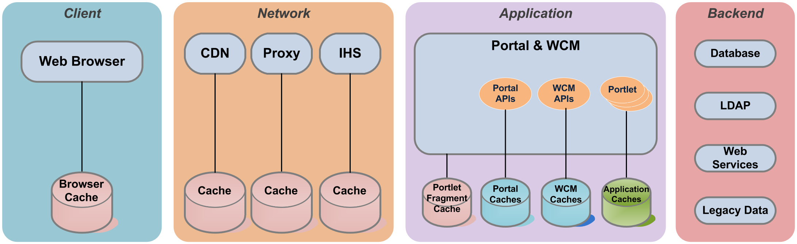

# HCL DX Caching

Caching, storing frequently accessed data rather than constantly generating or retrieving that data, is of critical concern for Portal performance. Caches in Portal are used to reduce response times for results that are expensive to calculate or avoid a slow network connection.

Rendering a Portal page requires loading the theme and one or more portlets to generate the resulting HTML. Portlets, and Portal itself, make calls to backend databases and LDAP. Rendered Portal pages are sent through one or more network connections, any of which could be slow. These network connections could include a content delivery network(CDN), one or more proxy servers, firewalls or other security appliances. Finally, the end user’s browser will display and render the page.

Each of these steps may require a substantial amount of processing time. The network could also be a bottleneck for users on slower connections. As a result, Portal performance will require many layers of caching for optimal performance.

## Portal Caching Layers

In general, the closer the data is to an end user, the faster the response time and the more performant Portal will be. Caching requests at the front end will also reduce the number of requests that Portal itself actually has to serve. This will save CPU processing and allow higher overall throughput.

## Browser Caching

Web browsers cache HTTP responses in internal memory or disk caches. Subsequent requests for the same URLs will be served from these caches. When served from cache, no network requests will be made. This is the best performing option, as content is already on the user's local computer.

In order for the browser to cache content, it must include `Cache-Control` headers. Portal will include these headers for static content it serves from the theme (e.g., `ra:collection` URLs). Other static content that is not part of the theme (e.g., custom portlet images) will not have these headers applied.

IHS can be configured to automatically apply these headers.

### Default Cache-Control Headers

By default, Portal adds `Cache-Control` headers to all resources served from the theme and WebDAV. Theme URLs will include `ra:collection`; WebDAV URLs will include `/dav/fs-type1`. By default, these items will be publicly cacheable for 1 day. These settings can be changed in the `WP ConfigService` Resource Environment Provider.

FFor specific configuration properties, refer to:

- [Deploying Themes with Cacheable Resources](../../../../../build_sites/themes_skins/manage_theme_capabilities/themeopt_mod_adminmod.md) — for theme-related content.
- [Using the WebDAV File Store](../../../../../manage_content/wcm_delivery/webdav/administer_webdav/mash_webdav_store.md) — for managing WebDAV content.

