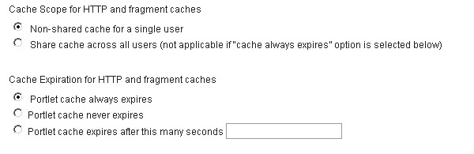

# Portlet Fragment Cache

Depending on processing requirements, it may be beneficial to cache the HTML output of an individual portlet on a page. Portlets that make requests to slow backends or have high processing requirements are good candidates for fragment caching. Note that Performance measurements with and without fragment caching are recommended to see if this feature provides any benefit under real-world conditions.

Fragment caching is useful when only a single portlet on a page is dynamic. In this case, the entire page cannot have a Cache-Control header (set with Adaptive Page Caching) since that will prevent the dynamic content from being updated. But, there is no need to regenerate the content of the portlets that do not change. So, the static portlets’ content can be cached to improve performance of the page overall.

Portlet Fragment Caching leverages the underlying WebSphere Servlet Fragment Cache. So, this service must be enabled first. Then, the Portlet Fragment Cache can be enabled. Once enabled, individual portlets must be configured to enable caching for each portlet.

**How to Set**

1. **Enable servlet caching**

     - In the WebSphere Integrated Solutions Console, go to: **Servers > Server Types > WebSphere application servers > WebSphere_Portal → Web Container Settings > Web container**

     - Check **Enable servlet caching**

2. **Enable portlet fragment caching**

     - In the WebSphere Integrated Solutions Console, go to: **Servers > Server Types > WebSphere application servers > WebSphere_Portal > Portlet Container Settings > Portlet container**

     - Check **Enable portlet fragment caching**

3. Restart the Portal Server.

4. Change the portlet cacheability settings.

**For Standard Portlets**

1.  Log in to Portal as an administrator.
2.  Navigate to the Portal administration page.
3.  Select **Portlet Management > Portlets**.
4.  Find the portlet you want to configure and click its **Configure portlet** button to load the settings.

**For WCM Rendering Portlets:**

1.  Enter **edit mode** and load the portlet menu.
2.  From the dropdown in the upper part of the portlet, select either **Configure** or **Edit Shared Settings**.
    - **Configure**: Settings apply to all instances of WCM Rendering Portlets.
    - **Edit Shared Settings**: Settings apply only to the current instance of the portlet.

**WCM Rendering Portlet Configuration**

3. Select the appropriate Cache Scope and Cache Expiration for the portlet.

**Portlet Cache Options**

## Cache Scope

### Shared Cache across users

This type of cache provides the biggest performance improvement as it caches the output of the rendering portlet across users. This cache scope should be used only for rendering portlets that render Web content that is not personalized.

#### Non-shared cache for a single user

This type of cache provides a smaller performance improvement but allows caching of personalized Web content that is displayed by the rendering portlet.

## Expiration

### Cache always expires

The content will never be cached in either a shared or a private portlet cache (i.e. this setting disables the cache).

### Cache never expires

The content can be stored indefinitely in either a shared or a private portlet cache.

Cache expires after this many seconds: The content will be stored for the number of seconds specified in either a shared or a private portlet cache

## Monitoring

WebSphere Application Server comes with a Cache Monitor application that allows you to monitor your cache to make sure it is working properly. In addition, there's an extended cache monitor with more functionality and additional bug fixes.

**How to Set**

1.  For more information, see [Detailed steps to download and install the WebSphere Extended Cache Monitor](https://support.hcltechsw.com/csm?id=kb_article&sysparm_article=KB0075565){target="_blank"}.<!--!record not found-->

2.  Before you can access the Cache Monitor application, you will need to **grant an administrator account access** to this application.
    1.  In the WebSphere Integrated Solutions Console, navigate to **Applications > Application Types > WebSphere enterprise applications > Dynamic Cache Monitor > Security role to user/group mapping**.
    2.  Select the "**administrator**" role.
    3.  Click **Map Users**.
    4.  Search for the right user account and add it to the “**selected**” box.
    5.  Click **OK**.
    6.  Click **Save**.