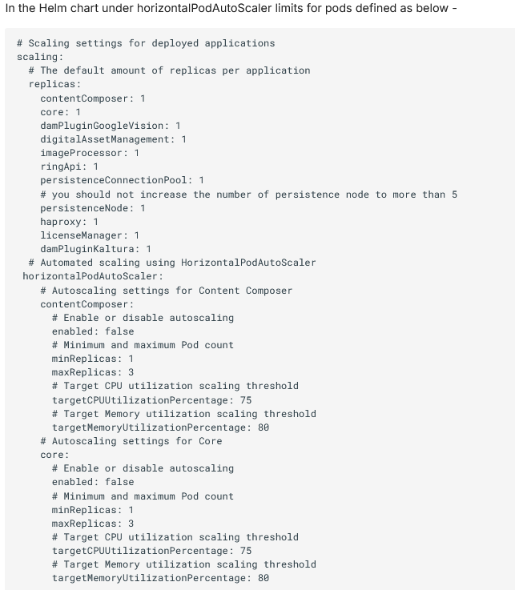

# Optimizing Pod CPU Limits and Requests in Kubernetes

When tuning performance on Kubernetes, managing CPU limits and requests for pods is crucial. Pods are the smallest deployable units in Kubernetes and consist of one or more containers. CPU requests define the guaranteed CPU allocation for a pod, ensuring it has the necessary resources, while CPU limits cap the maximum CPU a pod can consume.

To optimize performance, adjust these settings based on the demands of the application. Increasing CPU requests ensures stability under load by providing more guaranteed resources, whereas raising CPU limits allows the pod to use additional CPU during peak times, improving performance. However, careful consideration is needed to balance resource utilization and avoid over-provisioning.

In our medium configuration tests(configuration using 10,000 Virtual Users), we applied the tuning strategies discussed, specifically adjusting the CPU limits and requests for critical components such as HAProxy and RingAPI.Alterations were made to the number of pods, CPU, and memory of each of the following containers: HAProxy, Core, RingAPI, digitalAssetManagement, persistenceNode, and persistenceConnectionPool. The alterations to these containers aimed to determine which factors were significantly beneficial.

For the HAProxy container, increasing the CPU dramatically increased throughput. When the number of HAProxy pods was increased, the throughput decreased.

To access applications from the outside, DX deploys a reverse proxy in the form of an HAProxy. This reverse proxy routes the incoming requests to all application services, while honoring session affinity if required, which then distributes the requests to the corresponding pods hosting the applications.

HAProxy uses its configuration to select which request is mapped to which application in the DX 9.5 deployment (back-end). When requests are initiated from outside the Kubernetes or OpenShift cluster, HAProxy tries to fulfill those requests by using the configured routing. If it finds a matching endpoint, it forwards the request to the corresponding service, which then forwards the same request to a Pod that is ready to fulfill the request.

For the Core pod, increasing the CPU limit gave a boost to performance but this effect eventually saturated at 5600 millicore. Increasing the number of Core pods at this point had additional benefits. These adjustments were made to optimize performance and ensure the system could handle the expected load with improved response times and minimal errors. The results from these tests have validated the effectiveness of these tuning parameters in our Kubernetes environment.

For detailed information on the specific changes we made, including adjustments to CPU limits and requests, please refer to the Medium Configuration Sizing document. This document outlines the exact modifications and their impact on performance, providing a clear view of how we optimized the environment.

For more information and results, see [Medium Config sizing](../rendering_medium_config.md).

_Horizontal Pod Autoscaling_

HPA is a feature that automatically scales the number of pods in a deployment, replica set, or stateful set based on observed CPU utilization or other select metrics. HPA helps ensure that your application can handle varying loads efficiently by increasing or decreasing the number of pods as needed.

**How HPA Works:**

Metrics Collection: HPA regularly queries the metrics server for resource utilization (e.g., CPU, memory) of the pods.

Scaling Decision: Based on the specified target metrics (e.g., 70% CPU usage), HPA calculates whether the current number of pods is sufficient.

Adjustment: If the utilization exceeds or falls below the target, HPA adjusts the number of pods accordingly, either scaling out (adding more pods) or scaling in (reducing the number of pods).

We have leveraged Horizontal Pod Autoscaling (HPA) to determine the appropriate CPU limits for the Core, DAM, HAProxy, and Ring API pods. By observing how these components scaled under varying workloads, HPA provided valuable insights into the optimal CPU limits required for each pod. This approach allowed us to fine-tune the resource allocation, ensuring that the system can efficiently handle the specific workload while maintaining performance and stability.

To enable HPA for a deployment, you would typically define a YAML configuration that specifies the target CPU utilization and minimum/maximum pod counts. For example:

Horizontal Pod Autoscaling is an essential tool in Kubernetes for maintaining application performance and resource efficiency as demands change.