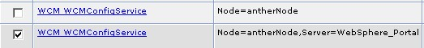

# Resource Environment Provider

Note that all tunings in this section used the Integrated Solutions Console to edit Resource Environment Provider properties. The same values can be changed by editing the appropriate properties file in the PortalServer directory and running the ConfigEngine task update-properties to update the values in WebSphere. Regardless of how they are changed, the Portal server will need to be restarted for the new values to take effect.

**How to Set by Editing the Property File**

- Edit &lt;wp_profile_root&gt;/PortalServer/config/xxxService.properties.
- If the property is already listed, uncomment the existing line and set the desired value. If the property is not listed, add a new entry with the desired value.
- Run &lt;wp_profile_root&gt;/ConfigEngine/ConfigEngine.sh update-properties.

**How to Set Default Values**

To reset a property to the default value:

- In the WebSphere Integrated Solutions Console, go to the Custom Properties for the given Resource Environment Provider.
- Set the value for the property name to the default value listed in the following sections.

Note that there may be multiple Providers listed in the console. If this is the case, make sure that the properties are being updated at the _server level_ (Server=WebSphere_Portal), not the node level.

