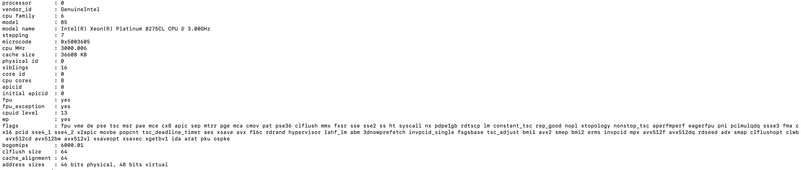
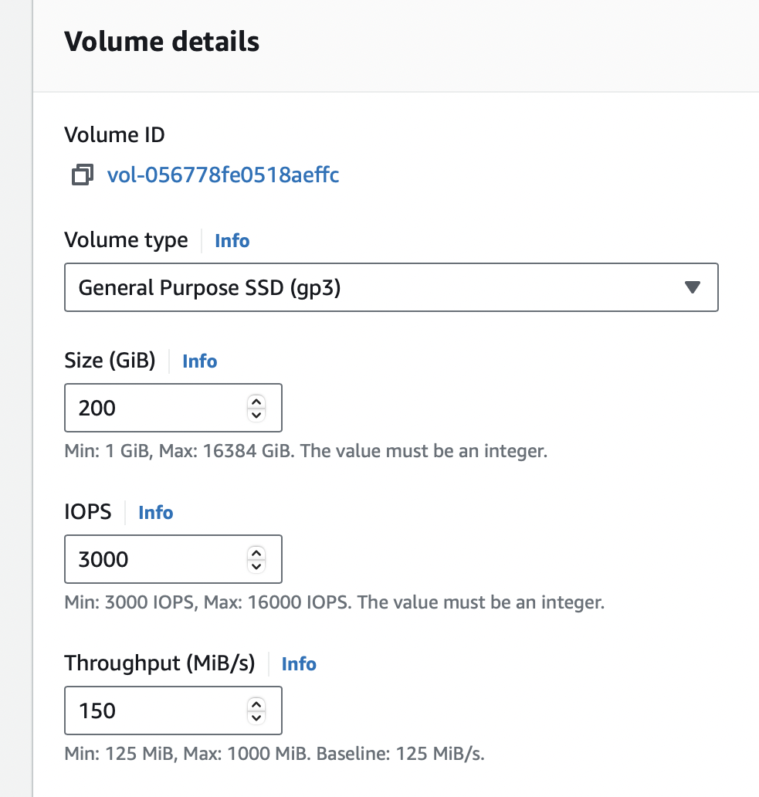
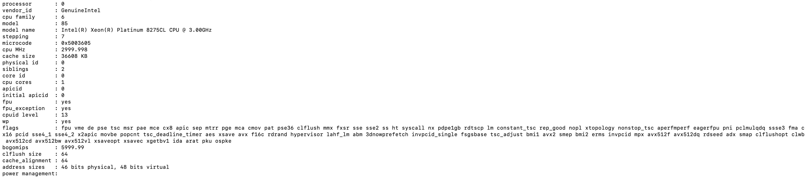
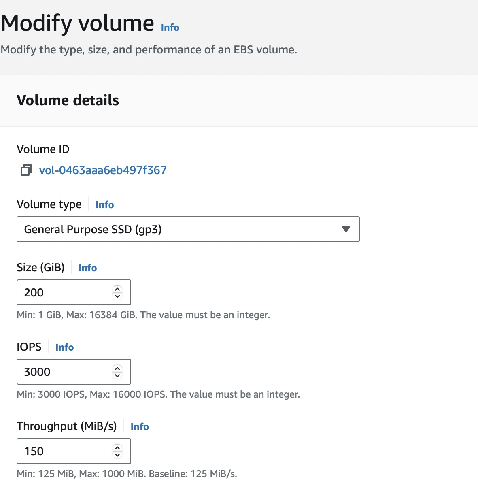
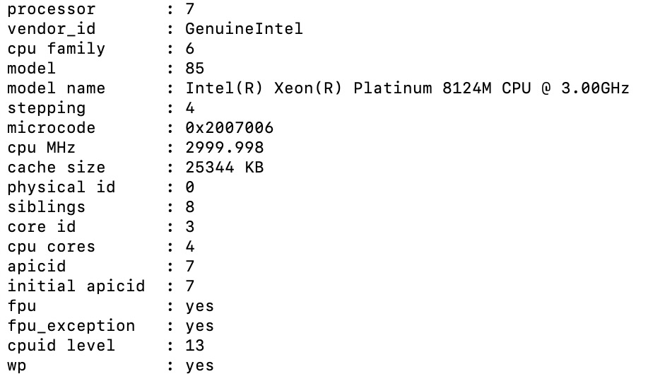

# Sizing guidance for rendering in a large-sized Kubernetes configuration

This topic provides the details of the environments used for rendering in a large-sized Kubernetes configuration. You can also find the test results and recommendations for large configurations on this page.

## Methodology

### Overview of DX rendering sizing-performance tests

This sizing activity rendered scenarios for the Web Content Manager (WCM), Digital Asset Management (DAM), and HCL Digital Experience (DX) pages & portlets. This activity used a rendering setup enabled in AWS/Native-Kubernetes, where Kubernetes is installed directly in Amazon Elastic Cloud Compute (EC2) instances. A combination run was performed that rendered WCM content, DAM assets, and DX pages and portlets. The load distribution was WCM content (40%), DAM assets (30%), and DX pages and portlets (30%). All systems were pre-populated before performing the rendering tests.

To achieve the 30,000 concurrent users mark, an initial set of runs was done with a lower number of users on a multiple node setup with varying numbers of worker nodes. The tests started with eight worker nodes. The number of worker nodes and pods were increased as needed to achieve the desired load with an acceptable error rate (< 0.01%). After establishing the number of nodes, further steps were taken to optimize the limits on the available resources for each pod, as well as the ratios of key pods to each other.

The following table contains the rendering scenario details for a large configuration. 

| Concurrent users     |  WCM pages         |  DAM content         |  Pages and portlets content   |
| -------------------- | ------------------ | -------------------- | ----------------------------- |
| 30,000 users         | 200                | 25,000               |    80                         |

For more information about the setup of test data, refer to the following test data:

- [WCM default test data](./index.md#wcm-default-test-data)
- [DAM default test data](./index.md#dam-default-test-data)
- [Pages and portlets default test data](./index.md#pages-and-portlets-default-test-data)

## Environment

This section provides details for the Kubernetes cluster, JMeter, LDAP, and database.

### AWS/Native Kubernetes

- A Kubernetes platform is running on an AWS EC2 instance with the DX images installed and configured.

- In AWS/Native Kubernetes, the tests are executed in EC2 instances with 1 master (c5.2xlarge) and 12 worker nodes (c5.4xlarge).

- The tests used a remote DB2 instance for the core database (c5.2xlarge).

- c5.4xlarge

      - Node details
      
      { width="1000" }
      
      { width="1000" }

      - Processor details

      { width="1000" }

      - Volume details

      { width="600" }

- c5.2xlarge

      - Node details

      { width="1000" }

      { width="1000" }

      - Processor details

      { width="1000" }

      - Volume details

      { width="600" }

### DB2 instance

- Remote DB2 details (c5.2xlarge)

      { width="1000" }

      { width="1000" }

- Processor details

      { width="600" }

- Volume details

      { width="600" }

### Load Balancer Set-up

We used AWS Elastic Load Balancing (ELB) to automatically distribute incoming application traffic across multiple targets. In our DX Kubernetes deployment, we updated the HAProxy service type from "LoadBalancer" to "NodePort" with a specific serviceNodePort. We then added the EC2 worker node instances containing HAProxy pods as a target group in the AWS ELB listeners.

### JMeter agents

- JMeter instance details (c5.2xlarge)

      { width="1000" }

      { width="1000" }

      To run the tests, a distributed AWS/JMeter agents setup consisting of 1 primary and 20 subordinates was used.

- Processor details

      { width="600" }

- Volume details

      { width="600" }

- Processor details

      { width="600" }

- Volume details

      { width="600" }

!!!note
      Ramp-up time is 5 virtual users every 2 seconds. Test duration is the total of ramp-up time and one hour with peak load of concurrent users.

### DX core tuning for concurrent user run

- This activity followed the same tunings used in the sizing activity for a [medium-sized configuration](./rendering_medium_config.md#dx-core-tuning-for-concurrent-user-run).

- LTPA token timeout was increased from 120 minutes to 600 minutes for the rendering tests.

!!!note
     - Neither fragment caching nor static resource caching were enabled to trigger actual stress and processing. In a customer scenario, it is recommended to enable both fragment caching and static resource caching. 

     - For DAM, no tuning details are mentioned in this topic except for the pod resources like CPU and memory limits for all pods related to DAM, such as ring-api, persistence-node, persistence-connection-pool, and core. Since DAM uses `Node.js`, you can monitor CPU and memory usage using Prometheus and Grafana. Based on your observations, you can modify memory requests and limits in Kubernetes accordingly.

## Results

The initial test runs were conducted on an AWS-distributed Kubernetes setup with one master and eight worker nodes. The system successfully handled concurrent user loads of 10,000 and 15,000 with a low error rate (< 0.0001%). At 20,000 users, error rates increased dramatically and response times went up. For a response time to be considered optimal, it should be under 1 second.

Subsequent tests were conducted on a setup with twelve worker nodes, evaluating various user loads up to 30,000 concurrent users. The error rates remained low (<0.0001%) and response times were satisfactory. Adjustments were made to the number of pods, CPU, and memory for the following containers: HAProxy, Core, RingAPI, digitalAssetManagement, persistenceNode, and persistenceConnectionPool. These changes aimed to identify the most beneficial factors.

For the Core pod, increasing the CPU limit gave a boost to performance, but this effect eventually saturated at 5600 millicore. Increasing the number of Core pods at this point had additional benefits.

## Conclusion

There are several factors that can affect the performance of DX in Kubernetes. Changes in the number of running nodes, number of pods, and the capacity of individual pods can improve its performance. Any changes should be closely monitored to ensure precise tracking of resource utilization.

!!!note
     Performance tuning for a Kubernetes DX cluster must be conducted for the particular workloads involving the number of concurrent users. Refer to the [DX Core tuning guide](../traditional_deployments.md) for further enhancements.

### Recommendations

- For a large-sized workload in AWS, start the Kubernetes cluster with 1 master and 12 worker nodes.

- Follow the same recommendations in the sizing activity for a [medium-sized configuration](./rendering_medium_config.md/#recommendations).

- For a load of 10,000 concurrent users, we used 7 core pods. To maintain good response times for 30,000 concurrent users, we proportionally increased the number of core pods to 23.

- Increase the memory allocation for the DAM and haproxy pods by approximately 1024Mi for every 10,000 concurrent users to prevent Out of Memory (OOM) issues.

- Increase the CPU allocation for the haproxy pod by approximately 1 CPU for every 10,000 concurrent users.

!!!note
     Do not size your JVM Heap size larger than the allotted memory for the pod.

Alterations were made to the initial Helm chart configuration during the tests. The following table contains the number and limits for each pod. Using these values significantly improves the responsiveness of the setup and enables the system to handle 30,000 concurrent users with a vastly improved average response time and a minimal error rate.

|  |  | Request | Request | Limit | Limit |
|---|---|---:|---|---|---|
| **Component** | **No. of pods** | **cpu (m) ** | **memory (Mi) ** | **cpu (m) ** | **memory (Mi) ** |
| contentComposer | 1 | 100 | 128 | 100 | 128 |
| **core** | **23** | **5600** | **8192** | **5600** | **8192** |
| **digitalAssetManagement** | **4** | **1000** | **4096** | **1000** | **4096** |
| imageProcessor | 1 | 200 | 2048 | 200 | 2048 |
| **openLdap** | **1** | **500** | **2048** | **500** | **2048** |
| **persistenceNode** | **2** | **1200** | **2048** | **1200** | **2048** |
| **persistenceConnectionPool** | **2** | **700** | **1024** | **700** | **1024** |
| **ringApi** | **2** | **2000** | **2048** | **2000** | **2048** |
| runtimeController | 1 | 100 | 256 | 100 | 256 |
| **haproxy** | **2** | **3000** | **2048** | **3000** | **2048** |
| licenseManager | 1 | 100 | 300 | 100 | 300 |
| **Total** | | **1476000** | **223916** | **1476000** | **223916** |

!!!note
     Values in bold are tuned Helm values while the rest are default minimal values.

For convenience, these values were added to the `large-config-values.yaml` file in the `hcl-dx-deployment` Helm chart. To use these values, complete the following steps:

1. Download the `hcl-dx-deployment` Helm chart from FlexNet or Harbor.

2. Extract the `hcl-dx-deployment-XXX.tgz` file.

3. In the extracted folder, navigate to `hcl-dx-deployment/value-samples/large-config-values.yaml` and copy the `large-config-values.yaml` file.  

### Roadmap

- Update the large configuration setups to include 10 times the content (pages, pages and portlets, and DAM assets) and test with 30,000 concurrent user load. we will provide the detailed guidance in this document with results.

???+ info "Related information"
    - [DX Performance Tuning Guide](../traditional_deployments.md)
