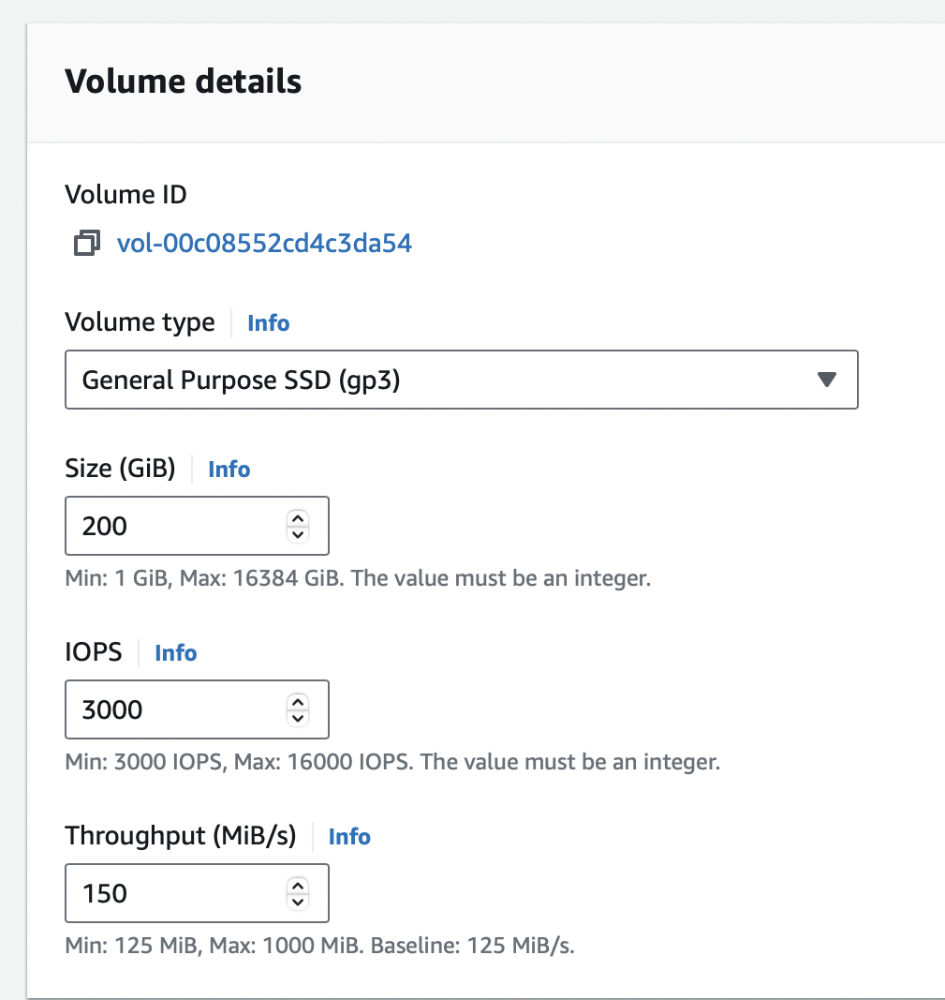

# Sizing guidance for rendering in a medium-sized Kubernetes configuration

This topic provides the details of the environments used for rendering in a medium-sized Kubernetes configuration. You can also find the test results and recommendations for medium configurations on this page.

## Methodology

This sizing activity rendered scenarios for the Web Content Manager (WCM), Digital Asset Management (DAM), and HCL Digital Experience (DX) pages and portlets. This activity used a rendering setup enabled in AWS/Native-Kubernetes, where Kubernetes is installed directly in AWS Elastic Cloud Compute (EC2) instances. A combination run was performed that rendered WCM content, DAM assets, and DX pages and portlets. The load distribution was WCM content (40%), DAM assets (30%), and DX pages and portlets (30%). All systems were pre-populated before performing the rendering tests.

To achieve the 10,000 concurrent users mark, an initial set of runs was done with a lower number of users on a multiple node setup with varying numbers of worker nodes. The tests started with three worker nodes. The number of worker nodes and pods were increased as needed to achieve the desired load with an acceptable error rate (< 0.01%). After establishing the number of nodes, further steps were taken to optimize the limits on the available resources for each pod, as well as the ratios of key pods to each other.

The following table contains the rendering scenario details for a medium configuration. 

| Concurrent users     |  WCM pages         |  DAM content         |  Pages and portlets content   |
| -------------------- | ------------------ | -------------------- | ----------------------------- |
| 10,000 users         | 200                | 25,000               |    80                         |

For more information about the setup of test data, refer to the following sections:

- [WCM default test data](./index.md#wcm-default-test-data)
- [DAM default test data](./index.md#dam-default-test-data)
- [Pages and portlets default test data](./index.md#pages-and-portlets-default-test-data)

## Environment

This section provides details for the Kubernetes cluster, JMeter agents, LDAP, and tuning setups used for this activity.

### AWS/Native Kubernetes

The Kubernetes platform ran on an AWS EC2 instance with the DX images installed and configured. In AWS/Native Kubernetes, the tests were executed in EC2 instances with one c5.xlarge master node and four c5.4xlarge worker nodes. The test started with c5.2xlarge worker nodes and moved to c5.4xlarge worker nodes after analyzing test results. Details about the node setups are listed below.

- **c5.large master node**

      - Node details

      { width="1000" }

      { width="1000" }

      - Processor details

      { width="1000" }

      - Volume details

      { width="600" }

- **c5.4xlarge worker nodes**

      - Information
      
      { width="1000" }
      
      { width="1000" }

      - Processor details

      { width="1000" }

      - Volume details

      { width="600" }

### DB2 instance

The tests used a c5.2xlarge remote DB2 instance for the core database. Details about the DB2 setup are listed below.

**c5.2xlarge remote DB2 instance**

- DB2 details

      { width="1000" }

      { width="1000" }

- Processor details

      { width="600" }

- Volume details

      { width="600" }

### JMeter agents

To run the tests, a distributed AWS/JMeter agents setup consisting of one primary and eight subordinate c5.2xlarge JMeter instances was used. Details about the JMeter setup are listed below.

**c5.2xlarge JMeter instance**

- Instance details

      { width="1000" }

      { width="1000" }

- Processor details

      { width="600" }

- Volume details

      { width="600" }

!!!note
      Ramp-up time is 1.5 seconds per user. The test duration includes the ramp-up time plus one hour at the peak load of concurrent users.

### DX Core tuning

The following list contains details about the tuning and enhancements done to the DX Core during testing:

- Defined the initial deployment as a rendering environment to trigger the tuning task for initial tuning. For more information, see [Portal server performance tuning tool](../../../deployment/manage/tune_servers/wp_tune_tool.md).

- Increased the LTPA token timeout from 120 minutes to 480 minutes for the rendering tests.

      { width="1000" }

- Updated the WCM object cache for rendering. Refer to the [DX Core tuning guide](../traditional_deployments.md) for more information.

      { width="1000" }

      { width="1000" }

- Updated abspath, abspathreverse, processing, session, strategy, summary values, and WCM rendering values as per [DX Core tuning guide](../traditional_deployments.md).

- Added a new custom property under **Resource environment providers > WP CacheManagerService > Custom properties > cacheinstance.com.ibm.wps.resolver.friendly.cache.size**.

      { width="1000" }

- Adjusted JVM Heap size from 3584 to 4096 under **Application servers > WebSphere_Portal > Process_definition > Java Virtual Machine**.

      { width="1000" }

- Set the LDAP user cache attributes and search to 10,000.

      { width="1000" }

- Disabled jcr.text.search under **Resource environment providers > JCR ConfigService Portal Content > Custom properties** because there is currently no authoring search functionality in these tests.

      

- Deleted JCRCollection1 and Default Search Collection in **Portal > Administration > Search > Search collections**.

      

- Logged level changes from info to severe in WAS for both configuration and run time.

      { width="1000" }

- Tuned DB2 by executing DB2 Reorg and Runstats.

!!!note
     - Neither fragment caching nor static resource caching were enabled to trigger actual stress and processing. In a customer scenario, it is recommended to enable both fragment caching and static resource caching. 

     - For DAM, no tuning details are mentioned in this topic except the pod resources like CPU and memory limits for all pods related to DAM (for example, ring-api, persistence-node, persistence-connection-pool, and core). Because DAM uses Node.js, you can monitor CPU and memory usage using Prometheus and Grafana. Based on your observations, you can modify memory requests and limits in Kubernetes accordingly.

## Results

The initial test runs were conducted on an AWS-distributed Kubernetes setup with one master and three worker nodes. The system successfully handled concurrent user loads of 1,000, 2,500, 4,000, and 5,000 users, with a low error rate (< 0.0001%). At 8,000 users, error rates increased dramatically and the response times went up. For a response time to be considered optimal, it should be under one second.

Subsequent tests were conducted on a setup with four worker nodes and 10,000 concurrent users. The error rates were low (<0.0001%) and response times were satisfactory. Adjustments were made to the number of pods, CPU, and memory of each of the following containers: HAProxy, Core, RingAPI, digitalAssetManagement, persistenceNode, and persistenceConnectionPool. These changes aimed to identify the most beneficial factors for the activity.

For the HAProxy container, increasing the CPU allocation dramatically increased throughput. When the number of HAProxy pods was increased, the throughput decreased.

For the Core pod, increasing the CPU limit gave a boost to performance, but this effect eventually saturated at 5600 millicore. This result indicated that increasing the number of Core pods at this point provided additional benefits.

## Conclusion

There are several factors that can affect the performance of DX in Kubernetes. Changes in the number of running nodes, number of pods, and the capacity of individual pods can improve its performance. 

!!!note
     Performance tuning for a Kubernetes DX cluster must be conducted for the particular workloads involving the number of concurrent users. Refer to the [DX Core tuning guide](../traditional_deployments.md) for further enhancements.

### Recommendations

- For a medium-sized workload in AWS, start the Kubernetes cluster with one master and four worker nodes. 

- To increase the throughput for the HAProxy and RingAPI containers, increase their CPU allocations. Note that increasing the number of pods does not increase throughput.

- To boost performance for the DAM and persistence-node pods, increase the CPU limits first, then increase the number of pod replicas. Increasing the number of pods also increases throughput for DAM.

- To hold more authenticated users for testing purposes, increase the OpenLDAP pod values. Note that the OpenLDAP pod is not for production use.

- To optimize the Core container, increase the CPU allocation until the container saturates. After the optimal CPU level is determined, increase the number of pods to boost performance.

!!!note
     Do not size your JVM Heap size larger than the allotted memory for the pod.

Modifications were made to the initial Helm chart configuration during the tests. The following table outlines the pod count and limits for each pod. After applying these values, the setup showed significantly improved responsiveness. These changes allowed the system to handle 10,000 concurrent users with a substantial reduction in average response time and a minimal error rate.

|  |  | Request | Request | Limit | Limit |
|---|---|---:|---|---|---|
| **Component** | **No. of pods** | **cpu (m) ** | **memory (Mi) ** | **cpu (m) ** | **memory (Mi) ** |
| contentComposer | 1 | 100 | 128 | 100 | 128 |
| **core** | **7** | **5600** | **8192** | **5600** | **8192** |
| **digitalAssetManagement** | **4** | **1000** | **2048** | **1000** | **2048** |
| imageProcessor | 1 | 200 | 2048 | 200 | 2048 |
| **openLdap** | **1** | **500** | **2048** | **500** | **2048** |
| **persistenceNode** | **2** | **1200** | **2048** | **1200** | **2048** |
| **persistenceConnectionPool** | **2** | **700** | **1024** | **700** | **1024** |
| **ringApi** | **2** | **2000** | **512** | **2000** | **512** |
| runtimeController | 1 | 100 | 256 | 100 | 256 |
| **haproxy** | **2** | **2000** | **1024** | **2000** | **1024** |
| licenseManager | 1 | 100 | 300 | 100 | 300 |
| **Total** | | **56000** | **79532** | **56000** | **79532** |

!!!note
     Values in bold are tuned Helm values while the rest are default minimal values.

For convenience, these values were added to the `medium-config-values.yaml` file in the hcl-dx-deployment Helm chart. To use these values, complete the following steps:

1. Download the `hcl-dx-deployment` Helm chart from FlexNet or Harbor.

2. Extract the `hcl-dx-deployment-XXX.tgz` file.

3. In the extracted folder, navigate to `hcl-dx-deployment/value-samples/medium-config-values.yaml` and copy the `medium-config-values.yaml` file.

???+ info "Related information"
    - [DX Performance Tuning Guide](../traditional_deployments.md)