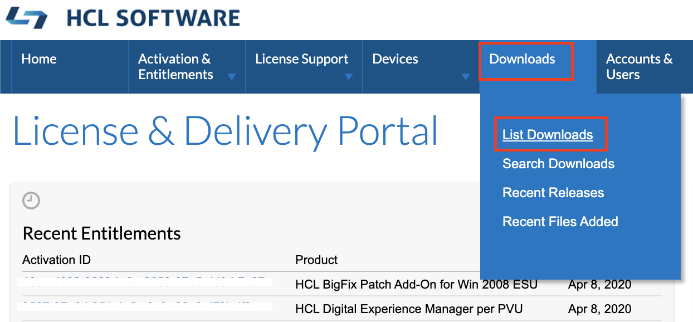
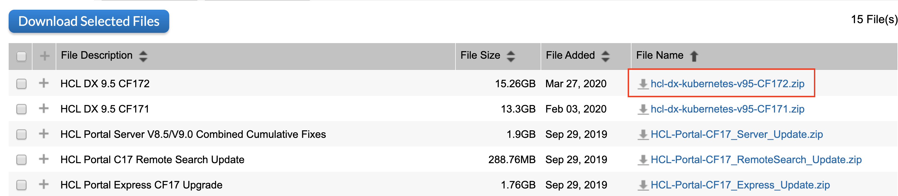

# How to Locate and Download DX Products

At this point, you should have been able to register an account and secure access to the License & Delivery Portal site.

## For HCL Customers

There are two ways to browse for the DX software installers or patches entitled to your organization.

From the Homepage view, you can see a couple of widget windows here but our focus is the **Your Downloads** window.
Under **Your Downloads** window, select **HCL DXPN** option. DX is under this product line.

Another way is to hover on the **Downloads** tab and then click on **List Downloads**.

The portal will list down the Product line of the products you have entitlement for. Again, click on **HCL DXPN** to locate DX products.

The latest version of the software and previous versions will be available to you.

DX Download Packages -
There are other products that are under the HCL DXPN product line aside from DX. To easily track down DXs’ Download Packages Name, please refer to the below list:

### Package name according to DX Offering
* HCL Portal Enable v8.5
* HCL Portal Enable v9.0 Multiplatform
* HCL Portal Enable v9.5 Multiplatform
* HCL Portal Express v8.5
* HCL Portal Express v9.0 Multiplatform
* HCL Portal Express v9.5 Multiplatform
* HCL Portal Extend v8.5
* HCL Portal Extend v9.0 MP
* HCL Portal Extend v9.5MP
* HCL Portal Server v8.5
* HCL Portal Server v9.0 MP
* HCL Portal Server v9.5 MP
* HCL Customer Experience Suite v8.5
* HCL Customer Experience Suite v9.0
* HCL Customer Experience Suite v9.5
* HCL Digital Experience Manager v8.5
* HCL Digital Experience Manager v9.0
* HCL Digital Experience Manager v9.5
* HCL Employee Experience Suite v8.5
* HCL Employee Experience Suite v9.0
* HCL Employee Experience Suite v9.5
* HCL Web Content Manager v8.5
* HCL Web Content Manager v9.0
* HCL Web Content Manager v9.5
* HCL Web Content Manager Standard Edition v8.5

### Package name for DX Cumulative Fixes and Docker Monthly Releases
Fixes and Container updates are bundled up in a distinct package. To locate the latest fixes and container updates, please look for it in the below package name.

* HCL_Portal_8.5_9.0_9.5_CFs

### Package name for DX Tech Preview
We also have Tech Preview releases of HCL DX Content Composer, Digital Asset Management, and the Experience API. These can be deployed for evaluation only on the OpenShift or Amazon EKS environments, and downloaded from the below package:

* HCL DX 9.5 Tech Previews

### Package name for DXClient Tool
DXClient Tooling (dxclient_vx_xxxxxxxx-xxxx.zip) that are used to support CI/CD release process can be downloaded from the below package:

* HCL_Portal_8.5_9.0_9.5_CFs

Click on the download package to select the download file(s).

If you only need to download a single file, you can click on the File Name hyperlink to start HTTPS download.

You may chose to download multiple files at the same time by selecting the files you want to download and clicking on **Download Selected Files**. If you are doing this for the first time, you will be prompted to download and install Download Manager.

!!!warning "We don't recommend Download Manager
    There are issues encountered with Download Manager and we recommend NOT to use it by downloading files individually instead.

If you encounter any issue with finding a software or downloading a files, please refer to [Customer Support FAQ](support-faqs.md) section to know how to get support.

## For HCL Business Partners

From the Homepage View, you will noticed that there are no **Downloads** tab or **Your Downloads** widget in it.

Where you can find the product is under the **List of Entitlements** which can be accessed from the **Quick Links** widget. 

Alternatively, look under **Activation & Entitlements** tab then click on **List Entitlements**.

If you are looking for a particular products that were sold to a particular company, the easiest way to do it is to change the Search scope to choose **Sold-to ID** if you know your customer’s HCL ID. If you do not know your customer’s HCL ID, you may switch to **Sold-to Display name** and type in a keyword from your customer’s company name.

You can also search the view by **Product** name as shown in the image below.

To be able to tell what’s Download Packages are associated with the Product or the Entitlement, you need to click on the **Download Now** button.

Here’s a sample list of Download Packages associated with the selected entitlement after clicking the **Download Now** button.

From here, select the desired Download Package to look for the individual files and proceed with the Download.

Again, feel free to refer to this section to know more about [DX Download Packages](#package-name-according-to-dx-offering).

If you only need to download a single file, you can click on the File Name hyperlink to start HTTPS download.

You may chose to download multiple files at the same time by selecting the files you want to download and clicking on **Download Selected Files**. If you are doing this for the first time, you will be prompted to download and install Download Manager.

!!!warning 
    We do not recommend Download Manager. There are issues encountered with Download Manager and we recommend NOT to use it by downloading files individually instead.

If you encounter any issue with finding a software or downloading a files, please refer to [Customer Support FAQ](support-faqs.md) section to know how to get support.
