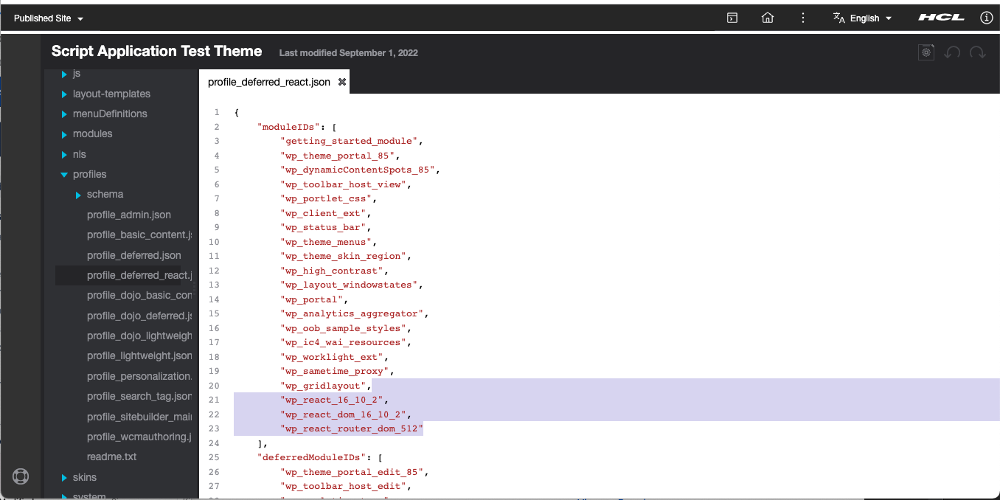
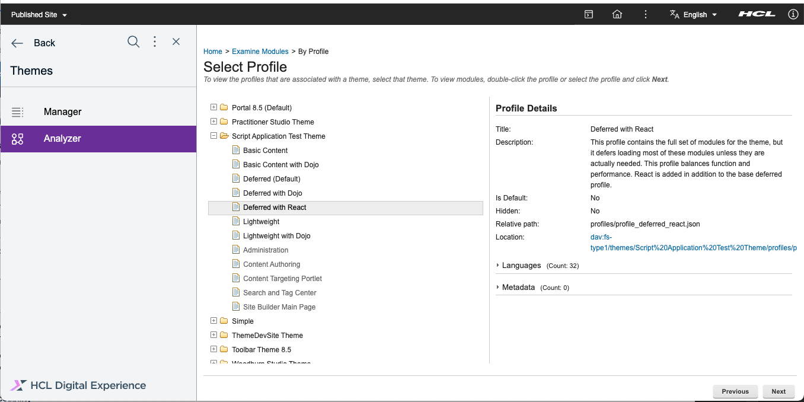

# Verify A Successful Deployment and Link a DX Module to a DX Theme

## Verify in WebSphere Application Server

To verify, log in to the WebSphere console. Under the *Applications* tab, then the *Application Types*, and then lastly in the *Business-level applications*, you can search for your application name in the table in the right-hand side.
   

## Verify In HCL DX and Link to Theme

To verify inside HCL Digital Experience:

   Click **Themes** in the Practitioner Studio Home Page.
   
   Click the **Menu** button at the upper left most part of the screen.
   
   Click the **Manager** menu icon in the top-left corner.
   
   Click pencil icon on the right side of the theme to be used (i.e., Script Applications Test Theme).
   
   Go to profiles->profile_deferred_react.json then remove the 3 highlighted moduleIDs (for release builds prior to CF205, the following modules will not exist).
   
   Add the new module (i.e. Reactv18r2). Click on the Save button (disc icon) in the upper right area.
   
   Click the **Analyzer** menu then click the **Examine modules by profile**.
   
   Navigate to **Examine modules by profile** and click the module used then click **Next**.
   
   Expand Modules and the module uploaded must be there (i.e., Reactv18r2). 

!!!note
      There must be no warning icon in the uploaded module.

   

???+ info "Related information"
   - [WebSphere® Integrated Solutions Console](../../../../../deployment/manage/portal_admin_tools/WebSphere_Integrated_Solutions_Console.md)
