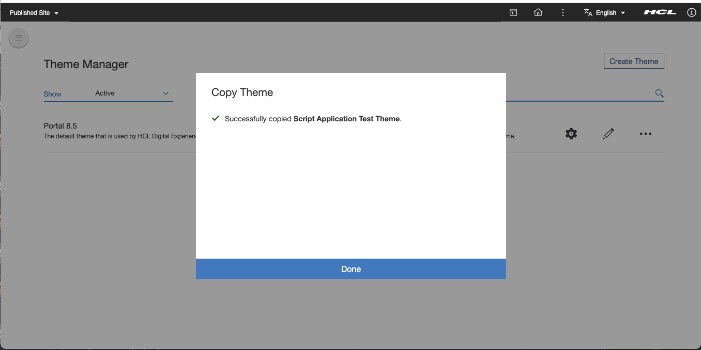

# Pre-Requisites

## HCL DXClient

HCL DXClient is required for deployments. Follow the online guide on how to install [HCL DXClient](../../../extend_dx/development_tools/dxclient/index.md). Please note that the DX and/or DXClient link provided here may be superseded, you may use a newer version if available. 

!!! note "The DXClient Docker image in the DX release CF206 and older versions do not have the full functionality to support the sample codes in these tutorials. Please use the Node.js-based DXClient for release builds CF206 and older."

If you have replaced the default context root of your DX installation, you should update the [config.json](../../../extend_dx/development_tools/dxclient/index.md#dxclient-installation-configuration) file of your DXClient accordingly.

   ```json
       "dxContextRoot": "/wps",
       "contenthandlerPath": "/wps/mycontenthandler",
       "xmlConfigPath": "/wps/config",
   ```
## Node JS and NPM
Install a Long Term Support (LTS) version of [Node.js](https://nodejs.org/en/download/).


## Java Runtime Engine

Java Runtime Engine with a Long Term Support (LTS) version is needed to be able to run the Gradle wrapper in the DX Module projects. Java version 17 is recommended.


## Script Application Placeholder

Add the 'Script Application Library' to the list of visible libraries in your DX Library Explorer. Follow the series of links via the Web Content menu: Preferences -> Edit Shared Settings. Don't forget to click on the OK button.  
  
  
  

## Clone The Portal 8.5 Theme to form a Test Theme 
!!! note "The Portal 8.5 Theme is part of the HCL DX releases starting CF205. This theme has some out-of-the-box DX Modules to support ReactJS ScriptApps and will help out in [basic deployments](how_to/01_basic_deployments.md). There's no assurance that the steps detailed in this tutorial will work with versions prior to CF205, but you may try cloning an existing theme and then build and deploy your own DX Modules following these [steps](how_to/02_dependencies_as_module.md). "

Copy the Portal 8.5 theme.
  
Assign a name for the theme.
  
  
Click the Done button.
  

## For Quick Build and Deploy, Use Out-Of-the-Box React Modules In your DX Theme 

!!! note "Skip this part if you're bundling and deploying your own shared libraries as a [DX Module](common-setup/optimized-scriptapps/dependencies_as_module.md)."

!!! note "Out-of-the-box React modules is only available in HCL DX for release build starting CF205. You will not be able to do [basic deployments](how_to/01_basic_deployments.md) for release builds prior to CF205, you will have to build your own [DX Modules](common-setup/optimized-scriptapps/dependencies_as_module.md) as part of the [optimized builds](how_to/04_apps_sharing_dependencies.md) procedure."

For standalone ScriptApps, make sure that the React modules that are delivered with DX images are included in the site's DX Theme profile. They are pre-configured only in the profile_deferred_react.json of the Portal 8.5 Theme. You will need to copy the module IDs over if you'll be using another DX Theme and profile combination. 

- "wp_react_16_10_2",
- "wp_react_dom_16_10_2",
- "wp_react_router_dom_512"


Select "Theme" from the Practitioner Studio Menu


Click "Edit Theme"


