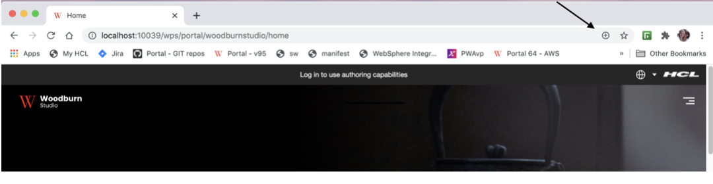

# Progressive Web Applications

Develop support that adds native mobile application experience and performance to your web site using browser-based functionality.

Progressive Web Applications \(PWAs\) offer a delivery pattern that can transform a web site into an experience that feels like a native application using browser-based functionality. Progressive Web Applications use web browser APIs and features along with progressive enhancement strategy. Using PWA artifacts such as a service worker, caching provisions, and a manifest file can deliver faster load times, easier navigation, and responsive behavior. PWAs allow offline capability and access to native device capabilities without writing any native code.

For additional information please consult [Introduction to Progressive Web Applications](https://developer.mozilla.org/en-US/docs/Web/Progressive_web_apps/Introduction) at the developer.mozilla.org site.

**Video**: [Progressive Web Applications with HCL Digital Experience 9.5](https://www.youtube.com/watch?v=JP1cWlM1s2k)

## Progressive Web Application requirements

To make a Progressive Web Application installable \(as noted in the [Introduction to Progressive Web Applications](https://developer.mozilla.org/en-US/docs/Web/Progressive_web_apps/Introduction) topic\), the following items and configurations are required:

1.  Must be served over HTTPS with a valid certificate \(or using localhost for development\).
2.  Include a Web App manifest file that includes the following information:
    -   `short_name` or `name`
    -   icons \(must include a 192px and a 512px icon\)
    -   `start_url`
    -   display \(must be either `fullscreen`, `standalone`, or `minimal-ui`\)

        **Note:** `prefer_related_applications` must not be present, or be false.

3.  Register a service worker with a functional fetch handler.

Once an application meets the above criteria, the browser will display a button that will allow the application to be installed. See the PWA install option example shown below using the [Woodburn Studio Demo Site](../woodburn_studio/woodburn_studio.md).



When the install button is clicked, a dialog will appear that prompts the user to install the application.


Once the application is installed, the application icon will display \(in the following example as a Google Chrome application\) and the application will be launched.


For a Progressive Web Application to function correctly, the scope of both the manifest and the service-worker needs to be set correctly. The web application manifest file provides information about a web application in JSON format.

The combination of modules, files and metadata allows HCL DX 9.5 to serve files required by the \(PWA\) application, and restrict which web pages should be viewed while the manifest is applied, while still maintaining the appropriate scope settings. If the user navigates outside the scope, it reverts to a normal web page inside a browser tab or window.

HCL Digital Experience 9.5 CF19 and Container Update CF192 add new platform and component support to add these capabilities to HCL DX 9.5 and higher sites. These include:

1.  **Updated System module** delivered in HCL DX 9.5 CF19. This module serves the manifest and service worker files.
2.  **New Theme scope module** that is defined in the theme.json file. This loads the pwa.js.
3.  **New page metadata** is created that can be used on the root page of the site \(or other pages in some cases\).
4.  An updated [Woodburn Studio Demo Site](../woodburn_studio/woodburn_studio.md), which will present a Progressive Web Application enabled for installation and display to supported mobile platforms. PWA installation and display of the updated Woodburn Studio site experience is tested and verified on the following mobile browser platforms:

    -   Apple Safari must be used for Apple Mobile devices. \(Not supported for desktop access\). Apple iOS v13 and v14 are tested and verified.
    -   Google Chrome 85 on Mac and Windows
    -   Microsoft Edge 85 on Mac and Windows 10
    -   Tablet running Android v7 and Google Pixel 3 running on v11 \(Google Chrome 85\)
    -   Google Chrome 86 on Linux
    **Note:** Progressive Web Application functionality is not supported on all web browser platforms, for example, [Microsoft Internet Explorer 11.](https://www.microsoft.com/en-us/download/details.aspx?id=41628) Developers are encouraged to verify if Progressive Web Application support is available for web browser platforms intended for use.


Many of these files \(theme.json, pwa.js, service-worker.js, etc.\) can be included and re-used in other HCL DX 9.5 CF19 and higher themes. See details below:

Manifest Scope: Defines the navigation scope of the application. It restricts which web pages can be viewed while the manifest is applied. If the user navigates outside the scope, the application will signal that the page is out of scope and native operations included on the page may not work. The scope can be set directly in the manifest files or using the `com.hcl.dx.pwa.manifest.scope` page metadata parameter on the Progressive Web Application configuration node. The scope can be set to a hardcoded value of auto which will result in the friendly name of the page being used.

Service worker: The scope of the service worker determines which files the service worker controls. In other words, scope determines from which path the service worker will intercept requests. The default scope is generally the location of the service worker file and extends to all directories below.

**Note:** When registering a service worker, you can specify a scope with a more restrictive path, but that path should be a child of the path where the service worker was loaded. In this situation, this pattern poses a problem in HCL DX since the path of the theme \(where the service worker resides\) and the path of the site pages are not in the same path hierarchy. For this reason, HCL DX 9.5 will default the scope to the friendly URL of the root label or page of the PWA site. If a less restrictive scope is set, a `Service-Worker-Allowed` header must be included on the response for the service worker.

The PWA theme module will use the friendly URL of the root page of the PWA site for the value of the `Service-Worker-Allowed` header. This value will also need to be set as the scope when registering the service worker in the theme.

## Authenticated versus Unauthenticated

HCL DX generates URLs differently based on whether or not a user is logged into the site. For anonymous sites \(unauthenticated\), the URL for a given page would be of the form /wps/portal/ whereas authenticated pages would be of the form /wps/myportal/. These differences in URL generation have a large effect on PWA processing. For this reason, a site scoped metadata parameter for protected versus non-protected is needed \(`com.hcl.dx.pwa.app.protected`\). The protected parameter impacts the generation of scope and start URL settings in the manifest file and the service worker scope \(i.e. should they be /portal or /myportal\) when `auto` is used. In addition, the PWA configuration cache key \(`pwaConfigCacheKey` in the service-worker.js file\) is generated differently if the protected parameter is set to true.

The protected parameter defaults to false, which means that the **+** sign to install the application, visible in the browser address bar, will display when the home page of the site is accessed by an unauthenticated user. At this point, the PWA application could be installed. If the user logs into the site before the PWA application is installed, the **+** will no longer be visible in the browser address bar.

If the protected parameter is set to true, the **+** sign to install the application will not be visible in the browser address bar until the user logs into the site. 

## Localization

By default, the manifest.json file does not provide any localization information. There is a single name and description field that sets the name of the PWA application. To handle localization for DX PWA applications, the following manifest.json fields are extended to include an array of localized values:

-   descriptions
-   names
-   short\_names
-   shortcuts:
    -   names
    -   descriptions

```
        "name": "Woodburn",
        "names": [
            {
                "value": "Woodburn application",
                "lang": "en"
            },
            {
                "value": "Woodburn Anwendung",
                "lang": "de"
            }
        ],
```

In this example, if the user accesses the DX Progressive Web Application using German language preferences, the name of the application displayed will be **Woodburn Anwendung**. However, if the user were to access the application in a language that is not defined in the manifest, the value from the name field would be used as a fallback.

## Hiding pages in PWA application mode

It is important to be able to exclude pages when the site is in PWA application mode. Applications on smaller devices may not appropriately display the entire site as it would be shown on a desktop. For this reason, page metadata has been added to hide pages in application mode. If the `pwa.Hidden` metadata is set to true on a page in the site, that page will not be displayed in the PWA application.

Hidden pages are implemented via CSS included in the theme. There are two places where the theme must be changed:

-   Add the following CSS to the default.css file located in the css/default directory in the root of the static files.

    **Example : Setting display mode to `hidden` for DX pages using PWA application mode**

    ```
            @media all and (display-mode: standalone){
            .pwaHidden {
            display: none
            }
    ```

-   Update the navigation JSP for the theme; usually located in the themes/html/dynamicSpots directory in the root of the dynamic files. The `pwa.Hidden` page metadata parameter is checked and if it is true the `pwa.Hidden` CSS class will be applied to the `li` element to hide the page. In the example below, the hidden parameter is added to the mainNav.jsp in the Woodburn Studio theme.

    **Example : Adding a hidden page metadata parameter to the Woodburn Studio theme**

    ```
        <c:set var="pwaHidden" value="${node.metadata['pwa.Hidden']}"></c:set>
        <li class="list-item <c:if test='${pwaHidden == true}'>pwaHIdden</c:if>">
            <a href="$
        {fn:escapeXml(node.urlGeneration.autoNavigationalState.clearScreenTemplate)}">
            <c:out value="${node.title}" />
            </a>
        </li>
    ```


## Steps required to enable Progressive Web Application capabilities in a Digital Experience site

1.  **Apply Stateless URLs**. In order for a PWA application to function properly in HCL DX 9.5 CF19 and higher, the site is required to use stateless, or friendly URLs. See [Defining friendly URLs without state information for pages in your site](../admin-system/mp_friendly_short_url.html?hl=stateless,urls) to learn how to configure stateless or friendly URLs.

    The use of friendly URLs can also be configured by doing the following steps:

    -   Set the following `WP_ConfigService` resource environment variables as follows:
        -   stateless.urls.enabled=true
        -   generate.stateless.urls=true
        -   generate.stateless.redirect.urls=true
    -   Update the theme parameters to include the following parameters:

        ```
            <parameter name="com.ibm.portal.theme.hasBaseURL" type="string"
            update="set"><![CDATA[true]]></parameter>
        ```

    -   Restart the HCL DX 9.5 server.
    Note the display of the PWA install option will vary depending on the device you are using \(e.g. Chrome on MacOS and Safari on iOS\) as noted above in the Updated [Woodburn Studio Demo Site](../woodburn_studio/woodburn_studio.md) detail.

    All further steps apply to custom themes and/or to custom sites.

2.  **Create a pwas directory in the root of the theme static files**. This directory will contain all of the PWA configurations. Each sub-directory under pwas represents a single configuration. For example, in the updated Woodburn Studio theme \( in CF19 and higher releases\), these directories/files exist:
    -   pwas \(folder\)
        -   woodburn \(folder\)
            -   images \(folder\)
            -   manifest.json
            -   service-worker.js
3.  **Create a new folder under the pwas directory** to represent the site configuration.
4.  **Create a manifest.json file in the PWA configuration folder**. The manifest file should include the following information:

    -   `short_name` or name
    -   icons \(must include a 192px and a 512px icon\)
    -   scope, which defines the navigation scope of the application. It restricts which web pages can be viewed while the manifest is applied. If the user navigates outside the scope, the application will signal that the page is out of scope and native operations included on the page may not work. The scope can be set directly in the manifest file, or using the `com.hcl.dx.pwa.manifest.scope` page metadata parameter on the PWA configuration node \(usually the root label or page of the site\). The scope can be set to a value of auto which will result in the friendly name of the page/label being used.

        **Note:** The scope is not a required field in the manifest.

    -   `start_url` or the preferred URL that should be loaded when the user launches the web application. The scope can be set directly in the manifest file or using the `com.hcl.dx.pwa.manifest.start_url` page metadata parameter on the PWA configuration node \(usually the root label or page of the site\). The scope can be set to a value of auto which will result in the friendly name of the root page being used \(if the root is a label, the `start_url` will default to the path of the first child under the label\). 
    -   display \(must be either fullscreen, standalone, or minimal-ui\)
    -   `prefer_related_applications` must not be present, or be false
    See the Woodburn Studio theme installed to HCL DX 9.5 CF19 and higher releases for an example of this file, and the implementation examples below.

5.  **Create a service-worker.js file in the PWA configuration folder.** It is possible to use the same service worker file across multiple PWA configurations. HCL DX will first look for the service-worker.js file in the PWA configuration directory. If a service-worker.js file cannot be found there, it will next look in the root pwas directory. See the Woodburn Studio theme for an example of this file.
6.  **Create a theme scoped module in the theme.json file** located in the contributions directory in the root of the static files. This module will be used to load the pwa.js file that is responsible for registering the PWA service worker. An example of this module could be presented as follows:

    **Example : Registering the PWA service worker**

    ```
                {
                    "id":"wp_theme+pwa",
                    "prereqs": [
                        {
                            "id":"wp_pwa"
                        }
                    ],
                    "contributions": [
                        {
                            "type":"config",
                            "sub-contributions": [
                                {
                                    "type":"js",
                                    "uris": [
                                        {
                                            "value":"/js/pwa.js"
                                        }
                                    ]
                                }
                            ]
                        }
                    ],
                    "titles": [
                        {
                            "value":"PWA support",
                            "lang":"en"
                        }
                    ],
                    "descriptions": [
                        {
                            "value":"PWA support",
                            "lang":"en"
                        }
                    ]
                },
    ```

7.  **Add the pwa.js file referenced in the theme scoped module to the js directory** in the root of the static files. The pwa.js file is responsible for registering the service worker with the browser. See the Woodburn Studio theme for an example of this file.
8.  **Add the new theme scoped module** \(`wp_theme_pwa` from the theme.json file\) to the theme profile\(s\). For example, the deferred\_profile.json might be updated to: 

    ```
                "wp_one_ui",
                "wp_one_ui_dijit",
                "wp_theme_pwa"
            ],
    ```

9.  **Depending on how the theme is deployed, the theme caches may need to be cleared** using the Theme Analyzer. See the [Theme Analyzer](../dev-theme/themeopt_an_analyzer.md) Help Center topic for instructions to analyze and clear theme caches.
10. **Add any necessary metadata values** to the pages:
    -   **Required: `com.hcl.dx.pwa.configuration`** - Set on the root label or page of the site to identify the PWA configuration located in the theme pwas directory that will apply. For example, this page metadata parameter is set to `woodburn` on the Woodburn Studio theme root label \(`Woodburn Studio`\).
    -   **Optional: `com.hcl.dx.pwa.app.protected`** - Set on the root label or page of the site to identify whether or not the application will apply to authenticated \(true\) or anonymous \(false\) parts of the site. The value of this parameter will default to false.
    -   **Optional: `com.hcl.dx.pwa.serviceworker.scope`** - Set on the root label or page of the site to override the service worker scope that will be used to register the service worker with the browser \(typically the URL for the root page of the site, for example, /wps/myportal/site1\). The service worker scope can also be set to auto which will cause the service worker scope to be set to the friendly path of the PWA configuration node. See the *Authenticated versus Unauthenticated* section for further explanation of how this parameter is affected by the `com.hcl.dx.pwa.app.protected` metadata parameter. The value of this parameter will default to auto.
    -   **Optional: `com.hcl.dx.pwa.preload_urls`** - Set on the root label or page of the site to define a list of URLs that can be preloaded by the service-worker. This list is comma-separated and will be dynamically added to the service-worker using the variable preloadURLs.
    -   **Optional: `com.hcl.dx.pwa.manifest.scope`** - Set on a label or page in the site to override the `scope` specified in the PWA manifest \(typically the URL for the root page of the site, for example, /wps/myportal/site1\). The scope can also be set to auto which will cause the scope to be set to the friendly path of the PWA configuration node. See the *Authenticated versus Unauthenticated* section for further explanation of how this parameter is affected by the `com.hcl.dx.pwa.app.protected` metadata parameter.
    -   **Optional: `com.hcl.dx.pwa.manifest.start_url`** - See the *Authenticated versus Unauthenticated* section for further explanation of how this parameter is affected by the `com.hcl.dx.pwa.app.protected` metadata parameter.
    -   **Optional: `pwa.Hidden`** - Set on a label or page in the site to exclude a page from the PWA application navigation \(true or false\).
11. **Optionally, update the theme files for hiding pages in PWA application mode**. See the *Hiding pages in PWA application mode* guidance above in this section for explanations and guidance to apply these changes.

PWA support in Virtual Portals: Typically, PWAs are designed to serve a single site. Because HCL Digital Experience is capable of serving multiple sites through [Virtual Portal](../admin-system/advppln_scope.html?hl=virtual%2Cportal) support, HCL DX administrators should be able to configure multiple sites to implement PWA capabilities.

## Creating a custom PWA install button

It is possible to create a custom PWA install button within the site itself by changing the theme. There is a custom button in the Woodburn Studio theme that can be used as a sample.


The button also appears when the site is in responsive mode.


The following changes were made to the Woodburn Studio theme to implement the button:

1.  The pwa.js file was updated to include handling PWA specific events such as `beforeinstallprompt` and `appinstalled`. These events handle displaying the install button when the install criteria is met, not displaying the button when in PWA application mode and other processing.
2.  The theme custom CSS was updated to style the button \(the main.css file in Woodburn Studio\).

    For example:

    ```
    .wb-hide-pwa-button {
      display:none;
    }
    :
    .wb-navigation-list
        ul.nav-list
        li.pwa-install-button
        {
      color: white;
      background-color: #ef1212;
      line-height: 2.25em;
      width: 60px;
      text-align: center;
    }
    ```

3.  The theme custom navigation JSP was updated to include the button in the navigation \(the mainNav.jsp in Woodburn Studio\).

    For example:

    ```
    <li class="list-item pwa-install-button wb-hide-pwa-button">
        <a href="#" onclick="pwaInstall(event)"><c:out value="GET APP"/></a>
    </li>
    ```


For additional information on PWA custom install options, see the following link from the Web.dev site: [How to provide your own in-app install experience](https://web.dev/customize-install/)

**Parent topic:**[Mobile](../overview/mobile.md)

