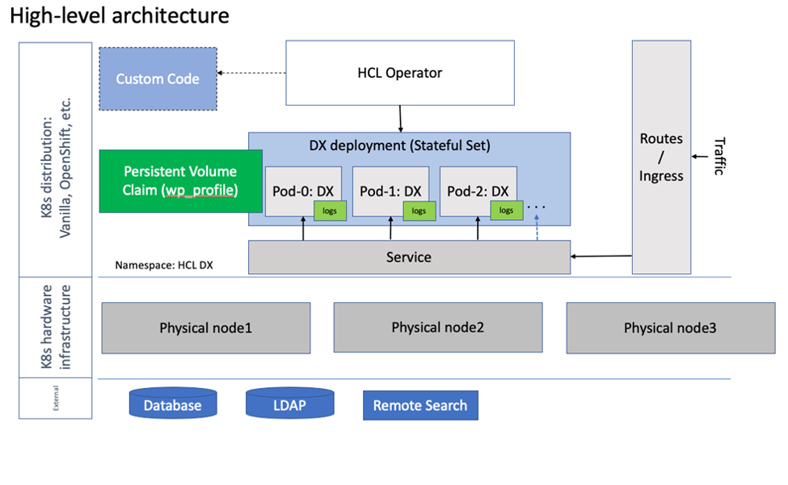

# HCL Digital Experience 9.5 Roadmap: Container deployment

This roadmap outlines the HCL Digital Experience deployment on Docker and supported Kubernetes platforms such as, Red Hat OpenShift, Amazon Elastic Kubernetes Service \(EKS\), and Microsoft Azure Kubernetes Service \(AKS\).

# Who should use this roadmap

HCL Digital Experience can be deployed to run on the Docker platform or as a fully container-based functioning deployment on Red Hat OpenShift and Amazon Elastic Kubernetes Service \(EKS\), and, as of 9.5 CF182, Microsoft Azure Kubernetes Service \(AKS\). Users can take advantage of these deployment models and can have an HCL Digital Experience 9.5 deployment operational in Docker or supported Kubernetes environment in minutes.

Use this approach if you are an organization with the following requirements:

-   An organization interested to deploy on Docker or supported Kubernetes platforms
-   An organization that needs to make fault-tolerant systems
-   An organization that needs to use services such as orchestration and auto-scaling to scale applications

# Topology diagram

# HCL Digital Experience 9.5 package contents

The HCL Digital Experience 9.5 image files, available through the HCL DX 9.5 Container Update releases, can be downloaded from the [HCL Software License Portal](https://www.hcltech.com/software/support/release).

Refer to the [HCL Digital Experience 9.5 Container Deployment](../containerization/deployment.md) topic for additional guidance, including the latest HCL DX 9.5 image file listings, deployment, staging, maintenance, and customization guides.

