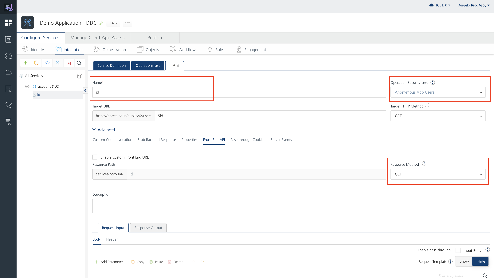
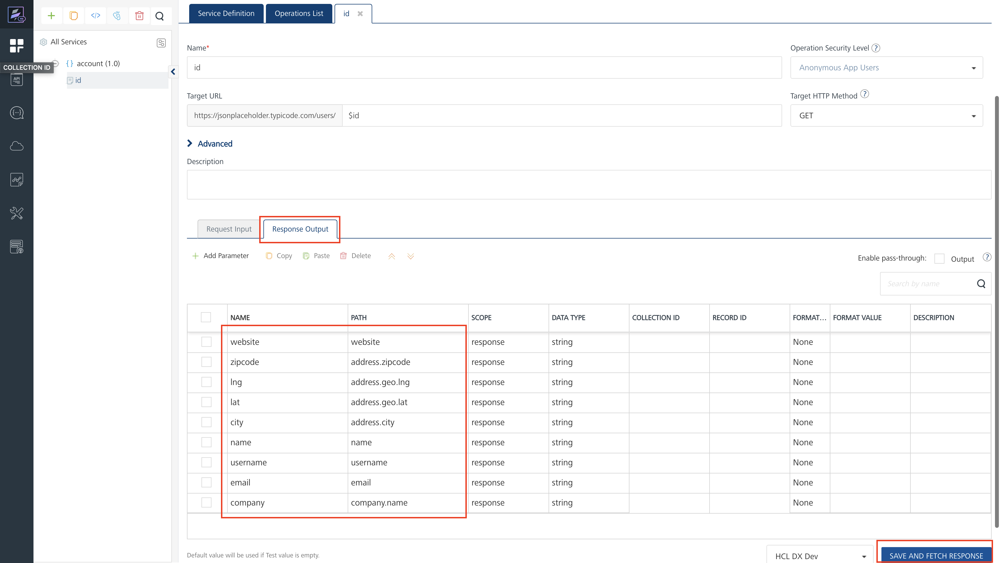
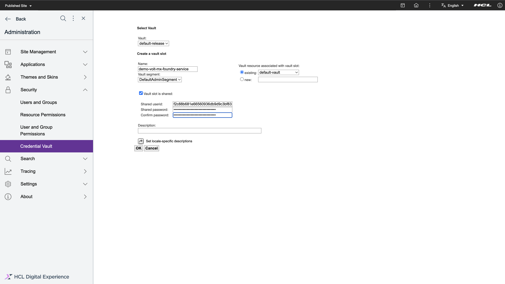

# Configuring Volt MX Foundry to connect to Digital Experience DDC

This section provides the steps on how to configure Volt MX Foundry to be able to connect via DX DDC.

## Prerequisite

You must have access to the Volt MX Foundry Console via Volt MX Cloud or On-Premise instance. You may consult this link for the [cloud service](https://opensource.hcltechsw.com/volt-mx-docs/docs/documentation/Foundry/voltmx_foundry_user_guide/Content/Accessing_VoltMX_MBaaS_Portal.html) and [on-premise service](https://opensource.hcltechsw.com/volt-mx-docs/docs/documentation/Foundry/voltmx_foundry_user_guide/Content/How_to_access_VoltMX_Foundry_Portal_on-Prem.html). In this sample, we will use the cloud service that Volt MX offers.

## Create new integration service with Volt MX Foundry

Follow the steps below to use the new integration service with Volt MX Foundry cloud service:

1.  Go to [https://manage.hclvoltmx.com](https://manage.hclvoltmx.com) to access paid cloud resources, or  [https://manage.demo-hclvoltmx.com](https://manage.demo-hclvoltmx.com) to access your trial environment.

    

2.  Select **Apps** sidenav. Then, click **Add New**.

    

3.  Create a new API endpoint via the **Integration Service**. Then, click **Integration**, then **Configure New**.

    

4.  Configure the service definition. Add a **Name**, then select **Service Type** and Add **Base URL**. Then click **Save & Add Operation**

    


4.  Add an **Operation** for the service that we created. Add **Name**, then under **Operation Security Level**, select **Anonymous App Users** or **Public** since it's the only option right now that is supported in DDC and last, you can modiy the **target URL** if the URL needs modification (see sample below).  Then in the **Advance** section, click **Front End API**. Under **Resource Method** select the **GET** since it's the only method supported in DDC. 

    

5. Adding **Response Output**. Click the **Response Output** tab, then click **Add Parameter**. After clicking, a row will appear on the table. Add the **Name**, then the **Path** or the JSON Path. The path is based on the response of the target URL you define in Service Definition. Let's try the service by clicking **Save And Fetch Response** and if everything is okay, then click **Save Operation**.

    

## Publish and Test integration service with Volt MX Foundry

1. Under the **Publish** tab, click the **Publish** button.

    

2. Once the App is published, we can now test the API endpoint by using **Developer Portals**. Click **Developer Portals** the sidenav then click the on link where your environment is located. This will open a new tab in your browser.

    

3. View the endpoint we created. On the Developer Portals, click **API**, then under the App you created, there is a dropdown button. Click the **View** link on the integration service you have created. This will redirect you to the Swagger UI Page where you can try your Endpoint.

    

4. Test the endpoint we created. Before we test the endpoint we created, we must Authorize the call since we chose **Anonymous App Users** during the creation of the operation. Click the **Authorize** button and put in the username field the **App Key** and in the password field the **App Secret**. Both values can be swagger page. On the swagger page, we will see the service that we created and click the dropdown beside it, then click the **Try Out** button. Once all the fields are filled up, you can now excute the API. There should be a response when everything is set up properly.

    

Note: If you created your Operation **Public** in Operation Security Level you dont need any authorization.

## Creating Credential Vault Slot for the Volt MX Foundry Endpoint

If we chose **Anonymous App Users** for Operation Security Level we need to somehow store the **App Key** and **App Secret** in Digital Experience. We can achieve this by using the Credential Vault. Below are the steps we need to take.

1. We first need to get the values for **App Key** and **App Secret**. We can get those values in Volt MX Foundry by going to **Apps**, then App that we have created, then clicking the **Publish** tab, and then clicking the **App Key** icon. A dialog box should appear.

    

2. After the dialog appears we can now see the App Key and App Secret of our created App. We can copy its value by hovering over the App Key and App Secret Value, and after hovering, we should see a **Copy** button. Click the Copy button.

    

3. After getting the values of **App Key** and **App Secret**, we can now store them in Digital Experience. Go to **Practitioner Studio**, then **Administration**

    

4. On the administration, click **Security** then **Crendential Vault**. The Credential Vault management portlet is shown. 

    


5. Select **Add a Vault slot**. The window for creating a vault slot is shown. Add a **Vault slot name**. This will be the slot ID thus this must be unique  and select the slot and **Vault Segment** to where it belongs. And then set the Vault slot as **Shared**, and set the user ID as the **App Key** and password as the  **App Secret**. Then the click **OK** button to save the changes. There should be a message that the vault slot was created successfully.

    

## Creating Outbound Connection Policy

Since we already have the Credential Vault Slot, we can now configure an outbound connection policy.

1. Create an xml file on your local machine and modify it according to your needs. For more information, please visit this link [Adding an outbound connection policy](../../../portlets_development/usage/web2_ui/outbound_http_connection/cfg_outbound_http_connections/sample_admin_tasks/outbhttp_cfgsmptsk_add_ob_conn_plcy.md)

You can use this sample outbound policy as a base:
``` xml
<?xml version="1.0" encoding="UTF-8"?>
<proxy-rules xmlns:xsi="http://www.w3.org/2001/XMLSchema-instance"
   xsi:noNamespaceSchemaLocation="http://www.ibm.com/xmlns/prod/sw/http/outbound/proxy-config/2.0">  

   <variables>
      <dynamic-policy name="demo-volt-mx-foundry-service.url">
        <!-- Step 1. Add the URL pattern. Use the base URL of your service. You can view it in the Developer Portal > API > your App > View. You should see a Swagger UI Page -->
        <value>https://hcl-dx-dev.hclvoltmx.net/services/account/*</value>
      </dynamic-policy>
   </variables>  
     
   <policy name="demo_volt_mx_foundry_service" url="{$demo_volt_mx_foundry_service.url}" basic-auth-support="true">
      <actions>
        <!-- Step 2. Add the HTTP Method.  We will use GET since this is what we defined when we created the operation of our service.-->
         <method>GET</method>
      </actions>    
        
      <!-- Step 3. Add the credential vault slot that we have created. The vault slot name is also the vault slot id hpaa.id you will need to put in the policy. -->
      
      <meta-data>
         <name>hpaa.authtype</name>
         <value>http-basic</value>
      </meta-data>
      <meta-data>
         <name>hpaa.slotid</name>
         <value>demo-volt-mx-foundry-service</value>
      </meta-data>
      <meta-data>
         <name>forward-credentials-from-vault</name>
         <value>true</value>
      </meta-data>
   </policy>                
</proxy-rules>
```

2. Then you must copy the file into your Digital Experience container. 
`docker cp {path to your policy}/demo_volt_mx_foundry_service_policy.xml {core container}:/tmp/demo_volt_mx_foundry_service_policy.xml`

3. And deploy the policy using the **Config Engine**: `./ConfigEngine.sh update-outbound-http-connection-config -DWasPassword=wpsadmin -DPortalAdminPwd=wpsadmin -DConfigFileName=/tmp/demo_volt_mx_foundry_service_policy.xml`