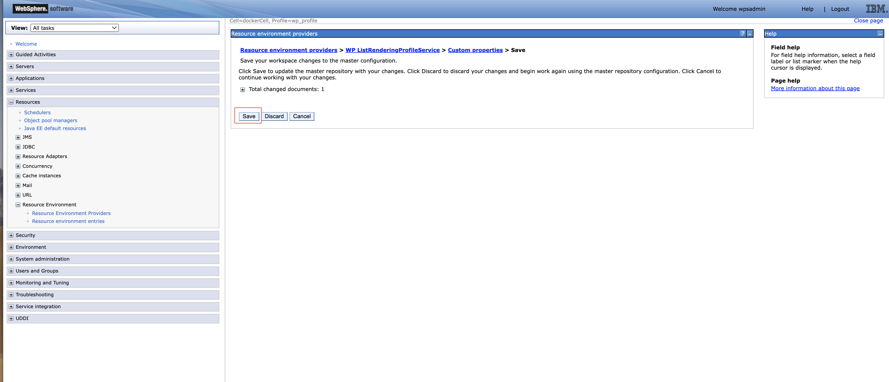

# Connecting to HCL VoltMX Foundry through Digital Data Connector (DDC)

This section provides the steps on using DDC for HCL Portal framework to integrate data from HCL VoltMX Foundry (integrated external data sources) on your portal pages by using HCL Web Content Manager presentation components.

**Note:** Refer to [Configuring Volt MX Foundry to connect to DDC](..configuring_voltmx_foundry_to_connect_to_ddc.md) for information about configure VoltMX Foundry through DDC.

## Prerequisite

You must have access to the Volt MX Foundry Console via Volt MX Cloud or On-Premise instance. You may consult this link for the [cloud service](https://opensource.hcltechsw.com/volt-mx-docs/docs/documentation/Foundry/voltmx_foundry_user_guide/Content/Accessing_VoltMX_MBaaS_Portal.html) and [on-premise service](https://opensource.hcltechsw.com/volt-mx-docs/docs/documentation/Foundry/voltmx_foundry_user_guide/Content/How_to_access_VoltMX_Foundry_Portal_on-Prem.html). In this sample, we will use the cloud service that Volt MX offers.

## Defines the set of attributes available in the beans that are contained in bean lists that a DDC plug-in generates in List-rendering profile
Refer to [Technical concepts | HCL Digital Experience](https://help.hcltechsw.com/digital-experience/9.5/social/plrf_tech_concepts.html)

Following API and response are used to create this sample document.
    
    

Steps to create the profile are as follows:

1. Login to the WAS console.
 
    

2. Click **Resources** from side navigation. Then, click **Resource Environment**, then **Resource environment providers
**.

    

3. From the list of resources, find **WP ListRenderingProfileService** and click.

    

4. Click **Custom properties** From the **Additional Properties** on right side.

     

5. Click on **New** and add your unique profile (say - ddcDemo) and it's properties by entering name-value pairs like in the sample below. Click **Apply** then **OK**

    

    | Name                                   | Value                                       | Type              |
    | ---------------------------------------| ------------------------------------------- | ------------------|
    | ddcDemo.Name                           | ddcDemo.profile.json                        | String            |
    | ddcDemo.BeanListProviderID             | ibm.portal.ddc.json                         | String            |
    | ddcDemo.ItemAttribute.id               | id                                          | Integer           |
    | ddcDemo.ItemAttribute.firstname        | name                                        | String            |
    | ddcDemo.ItemAttribute.email            | email                                       | String            |
    | ddcDemo.ItemAttribute.username         | username                                    | String            |
    | ddcDemo.ListProperty.page              | current_page                                | String            |
    | ddcDemo.Type                           | BasicJSONSelection                          | String            |

In the sample above,
- {profile}.Name would indicate the unique name of the list-rendering profile
- {profile}.BeanListProviderID refers to the plugin plovider and this could be generic `ibm.portal.ddc.json` or `ibm.portal.ddc.xml` or the id of a custom plugin created by a business user
- {profile}.ItemAttribute.id is always required but it could point to any attribute from the external data. In the sample above, the hclvoltmx account API used having an id for every account so we're using the id attribute in the id. In real-world use though, being an id in a list might need to be unique so this is where using {profile}.ComputedItemAttribute.{any} can be used. However, the generic DDC plugins don't support this out of the box and you can create and deploy your own DDC plugin best suited for business needs (https://help.hcltechsw.com/digital-experience/9.5/social/plrf_crt_dply_cust_beanlst_prvdr.html)
- {profile}.ItemAttribute.{any} refers to the available attributes in the bean list returned by the plugin from external data. For example, in the external JSON response data: the attribute key is `name` but in the bean list you want it mapped to the key `firstname` therefore your custom property name-value pair is: `caddcDemots.ItemAttribute.firstname` => `name`.
- {profile}.ListItemSelection is the user-defined root of where you want to get the item attributes in the external data response especially in cases where it is nested
- {profile}.ListProperty.{any} refers to any attribute available at the actual root level of the external data response. This is optional but can be useful in lists where pagination information can be found not necessarily within the data object you are trying to render as a list.
- {profile}.Type basically tells how the plugin is going to access the data. In this sample, BasicJSONSelection just tells it to use dot notation with name, index, and attribute filtering.

6. Review and save the changes in master configuration.

    

## HTTP Outbound Proxy and Signer Certificate

This allows WCM to trust the external data source and send HTTP requests to it.

Steps to setup the outbound proxy are as follows:

1. Login to the WAS console.
 
    

2. Click **Resources** from side navigation. Then, click **Resource Environment**, then **Resource environment providers
**.

    

3. From the resources, find and go inside `WP ConfigService` and click on `Custom Properties`. Add **New** .

    

4. Add your unique policy by entering name-value pair like in the sample below.

  | Name                                                                | Value                                                         | Type              |
  | --------------------------------------------------------------------| --------------------------------------------------------------| ------------------|
  | wp.proxy.config.urlreplacement.digital_data_connector_policy.ddcDemo| https://hcl-dx-dev.hclvoltmx.net/services/account/*           | String            |

    

5. Review and save the changes in master configuration.

    

**if the external data source URI uses https, proceed below:**

6. Go back to the sidenav, click on `Security` Then, click `SSL certificate and key management` then `Key stores and certificates`

    

7. Click on `NodeDefaultTrustStore`.

    

8. Click on `Signer certificates` and add your external URI's certificate by clicking on `Retrieve from port`.

    

9. Enter the host, alias and port 443 and click on `Retrieve signer information`.

     port and retrieves the signer from the server during the handshake.")

10. Review and save the changes in master configuration.

    